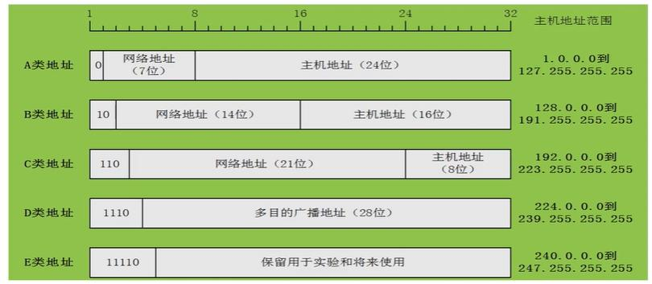

## 十进制转二进制

方法：**除2取余，直到商为0，然后将余数倒序排列，如果不足8位时前面补0**

下面以十进制数`201`为例，将其转换为二进制

```bash
201 / 2 = 100 余 1
100 / 2 = 50 余 0
50 / 2 = 25 余 0
25 / 2 = 12 余 1
12 / 2 = 6 余 0
6 / 2 = 3 余 0
3 / 2 = 1 余 1
1 / 2 = 0 余 1

最后将余数倒序排列，得到二进制数 => 11001001
```

再来一个十进制数`50`为例，将其转换为二进制

```bash
50 / 2 = 25 余 0
25 / 2 = 12 余 1
12 / 2 = 6 余 0
6 / 2 = 3 余 0
3 / 2 = 1 余 1
1 / 2 = 0 余 1

最后将余数倒序排列，得到二进制数 => 110010
但此时得到的二进制数不足8位，所以需要在前面补0 => 00110010
```

## 二进制转十进制

|      | $2^0$ | $2^1$ | $2^2$ | $2^3$ | $2^4$ | $2^5$ | $2^6$ | $2^7$ |
| ---- | ----- | ----- | ----- | ----- | ----- | ----- | ----- | ----- |
| 结果 | 1     | 2     | 4     | 8     | 16    | 32    | 64    | 128   |

方法：**从右往左依次用二进制位上的数字m乘以2的n次幂进行求和，n从0开始，每向左一位，n加1。即 $\sum{m\ast2^n}$**

下面以二进制数`01110010`为例，将其转换为十进制

$0\ast2^0=0$

$1\ast2^1=2$

$0\ast2^2=0$

$0\ast2^3=0$

$1\ast2^4=16$

$1\ast2^5=32$

$1\ast2^6=64$

最左边的二进制位数字`m`因为是`0`所以没有计算的意义，可以省略

最后对每一位大于`0`的计算结果进行求和 $2+16+32+64=114$

所得结果就是十进制数`114`

## IP地址

IP地址可以分为`IPv4`和`IPv6`两种，目前被使用最多的仍然是`IPv4`地址

`IPv4`地址实际上是一个**4个字节的二进制串**，每个字节8位，总共32位。但为了提高可读性，通常用`点进十分制(W.X.Y.Z)`的表现形式来表达`IPv4`地址。即每个字节之间使用`.`符号分隔开，并且每个字节都用取值范围在`0~255`之间的十进制整数来表示。例如我们日常生活所见到的`192.168.1.1`，它的二进制表示为`11000000.10101000.00000001.00000001`

### 二级IP地址

我在网上搜了很多资料和视频，全都是一上来就给你套用子网掩码概念来讲IP地址的计算，完全不提早期的IP地址划分，导致我看了半天还是云里雾里，所以这里我先简单介绍一下早期IP地址的划分，然后再来讲解套用子网掩码概念的ip地址计算方式

:::tip ⚡ IP地址=网络号+主机号
在早期没有子网划分技术的时候，A、B、C类IP地址是由 **网络号** 和 **主机号** 两部分组成。这个时期可以根据IP地址中的第一个字节大小来判断它属于哪一类IP地址，从而确定它的网络号和主机号分别是多少位。

在IP地址的32位中，前面一些连续位称为网络号，用于表示该设备属于哪个网络(_类似身份证的前6位地区号_)，后面的其余位称为主机号(_类似身份证的后12位_)，用于在该网络中唯一标识一台主机
:::



| 类别 | 第一字节范围 | 网络号 | 最大网络地址数     | 主机号 | 最大主机地址数      | 私有地址范围                | 网络规模 |
| ---- | ------------ | ------ | ------------------ | ------ | ------------------- | --------------------------- | -------- |
| A类  | 1~126        | 7位    | $2^7-2=126$        | 24位   | $2^{24}-2=16777214$ | 10.0.0.0~10.255.255.255     | 大型网络 |
| B类  | 128~191      | 14位   | $2^{14}-2=16382$   | 16位   | $2^{16}-2=65534$    | 172.16.0.0~172.31.255.255   | 中型网络 |
| C类  | 192~223      | 21位   | $2^{21}-2=2097150$ | 8位    | $2^8-2=254$         | 192.168.0.0~192.168.255.255 | 小型网络 |

### 主机地址

除开网络地址和广播地址后，能够分配给网络设备使用的IP地址，称为主机地址

### 网络地址

主机号全部为`0`的IP地址，称为网络地址

看下面三个例子

- `10.1.1.2`，首先看第一个字节`10`得知它是一个A类地址，那么便可知道它的主机号是后三个字节，则它的网络地址是`10.0.0.0` => `00001010.00000000.00000000.00000000`
- `172.16.10.2`，首先看第一个字节`172`得知它是一个B类地址，那么便可知道它的主机号是后两个字节，则它的网络地址是`172.16.0.0` => `10101100.00010000.00000000.00000000`
- `192.168.100.10`，首先看第一个字节`192`得知它是一个C类地址，那么便可知道它的主机号是最后一个字节，则它的网络地址是`192.168.100.0` => `11000000.10101000.01100100.00000000`

### 广播地址

主机号全部为`1`的IP地址，称为广播地址

看下面三个例子

- `10.1.1.2`，首先看第一个字节`10`得知它是一个A类地址，那么便可知道它的主机号是后三个字节，则它的广播地址是`10.255.255.255` => `00001010.11111111.11111111.11111111`
- `172.16.10.2`，首先看第一个字节`172`得知它是一个B类地址，那么便可知道它的主机号是后两个字节，则它的广播地址是`172.16.255.255` => `10101100.00010000.11111111.11111111`
- `192.168.100.10`，首先看第一个字节`192`得知它是一个C类地址，那么便可知道它的主机号是最后一个字节，则它的广播地址是`192.168.100.255` => `11000000.10101000.01100100.11111111`

## 子网掩码

子网掩码是用来进一步划分网络号和主机号的，子网掩码不能单独存在，他必须结合IP地址一起使用。子网掩码属于三级IP地址

:::tip ⚡ IP地址=网络号+子网号+主机号
在子网划分技术出现后，IP地址变成了由 **网络号**、**子网号**和**主机号** 三部分组成。其中子网号和主机号是由二级IP地址中的主机号划分得来

子网划分可以在原有主机号中借出一些位数作为子网号，并将这些子网号加入到原有的网络号中以扩展网络号，从而将每类的IP网络进一步分成更小的网络
:::

对于A、B、C类地址来说，因为主机号位数是确定的，所以也就有确定的默认掩码。默认掩码是一个32位的二进制数，左边`n`位全是`1`代表网络号，右边`n~32`位全是`0`代表主机号


**在进行子网划分之后，子网掩码不再是默认的，此时可以根据IP地址和子网掩码进行以下计算**

以`195.169.20.50/27`为例，这里的`/27`表示该IP地址的前`27`位为网络号，那么剩余的后`5`位便是主机号。这种表示法基于CIDR（**无类别域间路由选择**），用于标识网络地址和主机地址的划分

### 计算子网掩码

:::danger ⚡ 子网掩码

①根据CIDR表示法，将子网掩码转换为二进制数

- `11111111.11111111.11111111.11100000`

②将得到的二进制数转为十进制即为子网掩码

- `255.255.255.224`

:::

### 计算子网号

:::danger ⚡ 子网号

①通过观察此IP地址的第一字节可知，此IP是一个C类地址，那么它的主机号便在第四个字节

②将此IP地址转换为二进制数`11000011.10101001.00010100.00110010`

③根据CIDR表示法可知，此IP地址有`5`位主机号，也就是说它从原先的`8`位主机号中借走了前`3`位作为子网号，即第四字节中的前三位`001`

④那么在这段子网中，`00100000`便是子网地址，即子网号为`0.0.0.32`

:::

### 计算主机号

:::danger ⚡ 主机号

①通过观察此IP地址的第一字节可知，此IP是一个C类地址，那么它的主机号便在第四个字节

②将此IP地址转换为二进制数`11000011.10101001.00010100.00110010`

③根据CIDR表示法可知，此IP地址有`5`位主机号，即第四字节中的后五位`10010`

④那么在这段子网中，`00010010`便是主机地址，即主机号为`0.0.0.18`

:::

### 计算网络地址

:::danger ⚡ 网络地址=IP地址 & 子网掩码

①将IP地址和子网掩码转换为二进制数

- `255.255.255.224` => `11111111.11111111.11111111.11100000`
- `195.169.20.50` => `11000011.10101001.00010100.00110010`

②将二者的二进制数进行按位与运算，即两边同位为`1`才是`1`，否则为`0`

- `11111111.11111111.11111111.11100000` & `11000011.10101001.00010100.00110010`
- 得到`11000011.10101001.00010100.00100000`

③将第二步计算所得的二进制结果转为十进制即为网络地址

- `11000011.10101001.00010100.00100000` => `195.169.20.32`

:::

### 计算广播地址

:::danger ⚡ 广播地址

- 方法一：**广播地址=IP地址 | (~子网掩码)**

  ①将IP地址和子网掩码转换为二进制数

  - `255.255.255.224` => `11111111.11111111.11111111.11100000`
  - `195.169.20.50` => `11000011.10101001.00010100.00110010`

  ②将子网掩码的二进制数按位取反，即`1`变`0`，`0`变`1`

  - 得到`0000000.00000000.00000000.00011111`

  ③将取反后的子网掩码和IP地址进行按位或运算，即两边同位遇`1`变`1`，否则为`0`

  - `0000000.00000000.00000000.00011111` | `11000011.10101001.00010100.00110010`
  - 得到`11000011.10101001.00010100.00111111`

  ④将第三步计算所得的二进制结果转为十进制即为广播地址

  - `11000011.10101001.00010100.00111111` => `195.169.20.63`

- 方法二：**广播地址=将网络地址的主机号部分全部变为`1`**

  ①通过上面的[计算网络地址](#计算网络地址)可以知道，我们所需的网络地址的二进制为`11000011.10101001.00010100.00100000`

  ②将二进制网络地址的主机号部分全部变为`1`

  - `11000011.10101001.00010100.00100000` => `11000011.10101001.00010100.00111111`

  ③将第二步计算所得的二进制结果转为十进制即为广播地址

  - `11000011.10101001.00010100.00111111` => `195.169.20.63`

:::

### 计算可用IP地址范围

:::danger ⚡ 可用IP地址范围=网络地址+1 ~ 广播地址-1
①通过上面的[计算网络地址](#计算网络地址)可以知道，我们所需的网络地址为`195.169.20.32`

②通过上面的[计算广播地址](#计算广播地址)可以知道，我们所需的广播地址为`195.169.20.63`

③掐头去尾即可得到可用的IP地址范围为`195.169.20.33 ~ 195.169.20.62`

- `195.169.20.32` + 1 => `195.169.20.33`
- `195.169.20.63` - 1 => `195.169.20.62`

:::

### 计算主机数量

:::danger ⚡ 主机数量

- 方法一：**主机数量=$2^{主机号位数}-2$**

  ①根据CIDR表示法可知，当前IP地址有5位主机号

  ②套用公式可得：$2^5-2=30$ 即共有30个主机地址(_减2是因为主机不包括网络地址和广播地址_)

- 方法二：**主机数量=256 - 掩码值 - 2**

  ①通过上面的[计算子网掩码](#计算子网掩码)可以知道，此IP地址的子网掩码为`255.255.255.224`

  ②套用公式可得：$256-224-2=30$ 即共有30个主机地址(_减2是因为主机不包括网络地址和广播地址_)

:::
