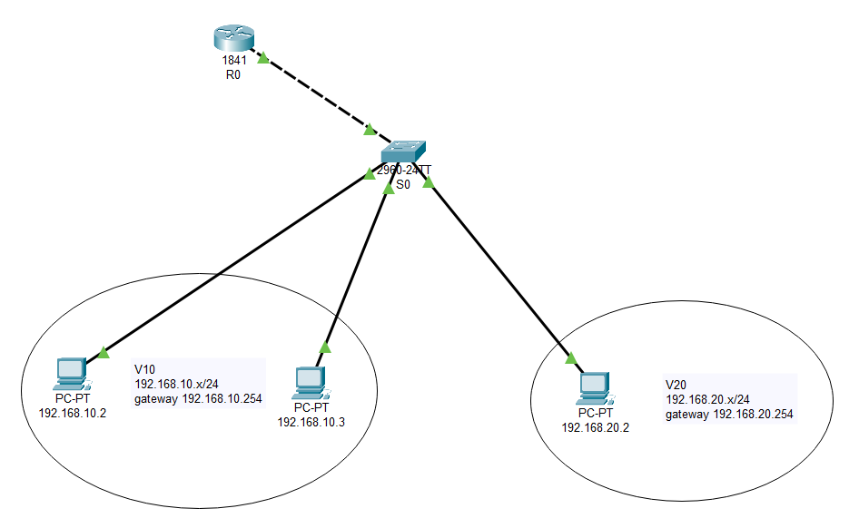
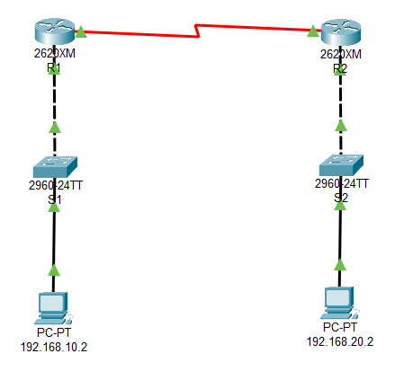

## 开启telnet

```shell
Router>
Router>enable
Router#configure terminal
Enter configuration commands, one per line.  End with CNTL/Z.
Router(config)#interface fastEthernet 0/0                        // 进入端口0的配置模式
Router(config-if)#ip address 192.168.0.254 255.255.255.0         // 设置telnet地址,用来远程登录
Router(config-if)#no shutdown                // 让配置立即生效
Router(config-if)#
%LINK-5-CHANGED: Interface FastEthernet0/0, changed state to up
Router(config-if)#exit
Router(config)#
Router(config)#line vty 0 4                  // 设置远程虚拟终端VTY线路数量
Router(config-line)#password 123456          // 设置远程登录的密码
Router(config-line)#login                    // 开启登录时需要输入密码
Router(config-line)#end
Router#
%SYS-5-CONFIG_I: Configured from console by console
Router#write                                 // 保存配置
Building configuration...
[OK]
```

然后让需要进行远程登录的设备的IP地址和子网掩码与交换机的IP地址在同一网段，打开终端

```shell
telnet 192.168.0.254 // 输入登录密码即可进入路由器
```

## 单臂路由



- **①在二层交换机上划分VLAN**

```shell
Switch>
Switch>enable
Switch#configure terminal
Enter configuration commands, one per line.  End with CNTL/Z.
Switch(config)#vlan 10                                // 创建vlan 10并进入配置界面
Switch(config-vlan)#name V10                          // 设置vlan名称
Switch(config-vlan)#exit
Switch(config)#vlan 20
Switch(config-vlan)#name V20
Switch(config-vlan)#exit
Switch(config)#
Switch(config)#interface fastEthernet 0/1             // 进入端口1的配置模式
Switch(config-if)#switchport access vlan 10           // 把端口1划分给vlan 10
Switch(config-if)#exit
Switch(config)#interface fastEthernet 0/2             // 进入端口2的配置模式
Switch(config-if)#switchport access vlan 10           // 把端口1划分给vlan 10
Switch(config-if)#exit
Switch(config)#interface fastEthernet 0/3             // 进入端口3的配置模式
Switch(config-if)#switchport access vlan 20           // 把端口1划分给vlan 20
Switch(config-if)#exit
Switch(config)#
Switch(config)#interface fastEthernet 0/24            // 进入端口24的配置模式,此端口用于连接路由器
Switch(config-if)#switchport mode trunk               // 把端口24强制改为trunk模式
Switch(config-if)#
%LINEPROTO-5-UPDOWN: Line protocol on Interface FastEthernet0/24, changed state to down
%LINEPROTO-5-UPDOWN: Line protocol on Interface FastEthernet0/24, changed state to up
Switch(config-if)#no shutdown                         // 让配置立即生效
Switch(config-if)#end
Switch#
Switch#write                                          // 保存配置
Building configuration...
[OK]
```

- **②配置路由器子接口**

```shell
Router>
Router>enable
Router#erase startup-config                            // 擦除原有配置
Erasing the nvram filesystem will remove all configuration files! Continue? [confirm]
[OK]
Erase of nvram: complete
%SYS-7-NV_BLOCK_INIT: Initialized the geometry of nvram
Router#
Router#configure terminal
Enter configuration commands, one per line.  End with CNTL/Z.
Router(config)#interface fastEthernet 0/0              // 进入端口0的配置模式
Router(config-if)#no ip address                        // 清除原有的地址
Router(config-if)#no shutdown                          // 让配置立即生效
Router(config-if)#
%LINK-5-CHANGED: Interface FastEthernet0/0, changed state to up
%LINEPROTO-5-UPDOWN: Line protocol on Interface FastEthernet0/0, changed state to up
Router(config-if)#exit
Router(config)#
Router(config)#interface fastEthernet 0/0.1            // 开启一个端口0的子接口0.1
Router(config-subif)#
%LINK-5-CHANGED: Interface FastEthernet0/0.1, changed state to up
%LINEPROTO-5-UPDOWN: Line protocol on Interface FastEthernet0/0.1, changed state to up
Router(config-subif)#encapsulation dot1Q 10            // 在路由器上配置trunk中继线路封装协议802.1q, dot1Q后面的数字是vlan
Router(config-subif)#ip address 192.168.10.1 255.255.255.0       // 给子接口0.1设置IP地址
Router(config-subif)#exit
Router(config)#
Router(config)#interface fastEthernet 0/0.2            // 开启一个端口0的子接口0.2
Router(config-subif)#
%LINK-5-CHANGED: Interface FastEthernet0/0.2, changed state to up
%LINEPROTO-5-UPDOWN: Line protocol on Interface FastEthernet0/0.2, changed state to up
Router(config-subif)#encapsulation dot1Q 20
Router(config-subif)#ip address 192.168.20.1 255.255.255.0       // 给子接口0.2设置IP地址
Router(config-subif)#end
Router#
%SYS-5-CONFIG_I: Configured from console by console
Router#
Router#write                                           // 保存配置
Building configuration...
[OK]
Router#
Router#show ip route                                   // 查看路由表
Codes: C - connected, S - static, I - IGRP, R - RIP, M - mobile, B - BGP
       D - EIGRP, EX - EIGRP external, O - OSPF, IA - OSPF inter area
       N1 - OSPF NSSA external type 1, N2 - OSPF NSSA external type 2
       E1 - OSPF external type 1, E2 - OSPF external type 2, E - EGP
       i - IS-IS, L1 - IS-IS level-1, L2 - IS-IS level-2, ia - IS-IS inter area
       * - candidate default, U - per-user static route, o - ODR
       P - periodic downloaded static route

Gateway of last resort is not set

C    192.168.10.0/24 is directly connected, FastEthernet0/0.1
C    192.168.20.0/24 is directly connected, FastEthernet0/0.2
```

- **③为终端设备分配IP地址和配置网关**

## 静态路由



- **①配置路由器的端口地址和串口地址**

```shell
Router>
Router>enable
Router#conf t
Enter configuration commands, one per line.  End with CNTL/Z.
Router(config)#hostname R1                       // 设置路由器名称
R1(config)#
R1(config)#interface fastEthernet 0/0            // 进入端口0的配置模式
R1(config-if)#no shutdown                        // 启动端口0
R1(config-if)#
%LINK-5-CHANGED: Interface FastEthernet0/0, changed state to up
%LINEPROTO-5-UPDOWN: Line protocol on Interface FastEthernet0/0, changed state to up
R1(config-if)#
R1(config-if)#ip address 192.168.10.254 255.255.255.0            // 给端口0设置IP地址
R1(config-if)#exit
R1(config)#
R1(config)#interface serial 0/0                  // 进入串口0的配置模式
R1(config-if)#no shutdown                        // 启动串口0
%LINK-5-CHANGED: Interface Serial0/0, changed state to up
%LINEPROTO-5-UPDOWN: Line protocol on Interface Serial0/0, changed state to up
R1(config-if)#
R1(config-if)#ip address 192.168.0.1 255.255.255.0               // 给串口0设置IP地址
R1(config-if)#clock rate 9600                    // 设置DCE设备的时钟频率
R1(config-if)#end
R1#
%SYS-5-CONFIG_I: Configured from console by console
R1#
R1#show ip route                                 // 查看路由表
Codes: C - connected, S - static, I - IGRP, R - RIP, M - mobile, B - BGP
       D - EIGRP, EX - EIGRP external, O - OSPF, IA - OSPF inter area
       N1 - OSPF NSSA external type 1, N2 - OSPF NSSA external type 2
       E1 - OSPF external type 1, E2 - OSPF external type 2, E - EGP
       i - IS-IS, L1 - IS-IS level-1, L2 - IS-IS level-2, ia - IS-IS inter area
       * - candidate default, U - per-user static route, o - ODR
       P - periodic downloaded static route

Gateway of last resort is not set

C    192.168.0.0/24 is directly connected, Serial0/0
C    192.168.10.0/24 is directly connected, FastEthernet0/0
```

路由器R2的配置类似，其中以太网端口0的地址为`192.168.20.254/24`，串口0的地址为`192.168.0.2/24`，时钟频率也是9600

- **②添加静态路由**

对R1而言，他的目标网络是R2，所以填入R2的网络地址`192.168.20.0`，下一跳地址则是R2的串口地址`192.168.0.2`

```shell
R1(config)#ip route 192.168.20.0 255.255.255.0 192.168.0.2          // 给R1添加静态路由
R1(config)#exit
R1#
%SYS-5-CONFIG_I: Configured from console by console
R1#show ip route                       // 查看路由表,可以看到多了一条S标记的静态路由
Codes: C - connected, S - static, I - IGRP, R - RIP, M - mobile, B - BGP
       D - EIGRP, EX - EIGRP external, O - OSPF, IA - OSPF inter area
       N1 - OSPF NSSA external type 1, N2 - OSPF NSSA external type 2
       E1 - OSPF external type 1, E2 - OSPF external type 2, E - EGP
       i - IS-IS, L1 - IS-IS level-1, L2 - IS-IS level-2, ia - IS-IS inter area
       * - candidate default, U - per-user static route, o - ODR
       P - periodic downloaded static route

Gateway of last resort is not set

C    192.168.0.0/24 is directly connected, Serial0/0
C    192.168.10.0/24 is directly connected, FastEthernet0/0
S    192.168.20.0/24 [1/0] via 192.168.0.2
```

对R2而言，他的目标网络是R1，所以填入R1的网络地址`192.168.10.0`，下一跳地址则是R1的串口地址`192.168.0.1`

```shell
R2(config)#ip route 192.168.10.0 255.255.255.0 192.168.0.1          // 给R2添加静态路由
```

- **③测试终端设备之间的连通性**
