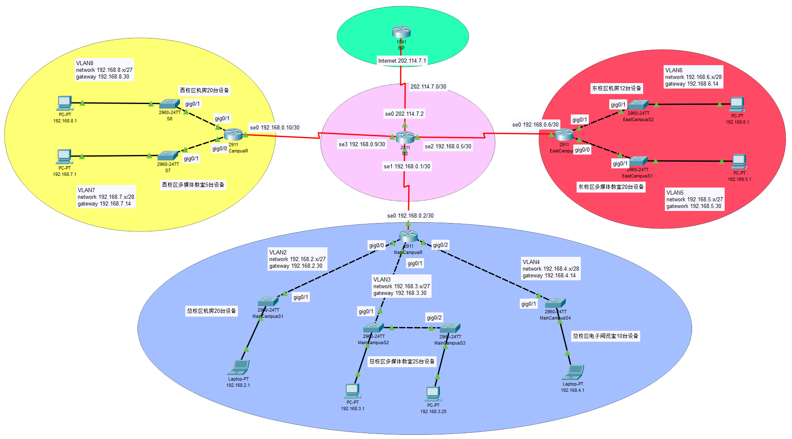
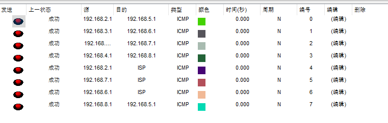

## 开启telnet

```shell
Router>
Router>enable
Router#configure terminal
Enter configuration commands, one per line.  End with CNTL/Z.
Router(config)#interface fastEthernet 0/0                        // 进入端口0的配置模式
Router(config-if)#ip address 192.168.0.254 255.255.255.0         // 设置telnet地址,用来远程登录
Router(config-if)#no shutdown                // 让配置立即生效
Router(config-if)#
%LINK-5-CHANGED: Interface FastEthernet0/0, changed state to up
Router(config-if)#exit
Router(config)#
Router(config)#line vty 0 4                  // 设置远程虚拟终端VTY线路数量
Router(config-line)#password 123456          // 设置远程登录的密码
Router(config-line)#login                    // 开启登录时需要输入密码
Router(config-line)#end
Router#
%SYS-5-CONFIG_I: Configured from console by console
Router#write                                 // 保存配置
Building configuration...
[OK]
```

然后让需要进行远程登录的设备的IP地址和子网掩码与交换机的IP地址在同一网段，打开终端

```shell
telnet 192.168.0.254 // 输入登录密码即可进入路由器
```

## 单臂路由


- **①在二层交换机上划分VLAN**

```shell
Switch>
Switch>enable
Switch#configure terminal
Enter configuration commands, one per line.  End with CNTL/Z.
Switch(config)#vlan 10                                // 创建vlan 10并进入配置界面
Switch(config-vlan)#name V10                          // 设置vlan名称
Switch(config-vlan)#exit
Switch(config)#vlan 20
Switch(config-vlan)#name V20
Switch(config-vlan)#exit
Switch(config)#
Switch(config)#interface fastEthernet 0/1             // 进入端口1的配置模式
Switch(config-if)#switchport access vlan 10           // 把端口1划分给vlan 10
Switch(config-if)#exit
Switch(config)#interface fastEthernet 0/2             // 进入端口2的配置模式
Switch(config-if)#switchport access vlan 10           // 把端口1划分给vlan 10
Switch(config-if)#exit
Switch(config)#interface fastEthernet 0/3             // 进入端口3的配置模式
Switch(config-if)#switchport access vlan 20           // 把端口1划分给vlan 20
Switch(config-if)#exit
Switch(config)#
Switch(config)#interface fastEthernet 0/24            // 进入端口24的配置模式,此端口用于连接路由器
Switch(config-if)#switchport mode trunk               // 把端口24强制改为trunk模式
Switch(config-if)#
%LINEPROTO-5-UPDOWN: Line protocol on Interface FastEthernet0/24, changed state to down
%LINEPROTO-5-UPDOWN: Line protocol on Interface FastEthernet0/24, changed state to up
Switch(config-if)#no shutdown                         // 让配置立即生效
Switch(config-if)#end
Switch#
Switch#write                                          // 保存配置
Building configuration...
[OK]
```

- **②配置路由器子接口**

```shell
Router>
Router>enable
Router#erase startup-config                            // 擦除原有配置
Erasing the nvram filesystem will remove all configuration files! Continue? [confirm]
[OK]
Erase of nvram: complete
%SYS-7-NV_BLOCK_INIT: Initialized the geometry of nvram
Router#
Router#configure terminal
Enter configuration commands, one per line.  End with CNTL/Z.
Router(config)#interface fastEthernet 0/0              // 进入端口0的配置模式
Router(config-if)#no ip address                        // 清除原有的地址
Router(config-if)#no shutdown                          // 让配置立即生效
Router(config-if)#
%LINK-5-CHANGED: Interface FastEthernet0/0, changed state to up
%LINEPROTO-5-UPDOWN: Line protocol on Interface FastEthernet0/0, changed state to up
Router(config-if)#exit
Router(config)#
Router(config)#interface fastEthernet 0/0.1            // 开启一个端口0的子接口0.1
Router(config-subif)#
%LINK-5-CHANGED: Interface FastEthernet0/0.1, changed state to up
%LINEPROTO-5-UPDOWN: Line protocol on Interface FastEthernet0/0.1, changed state to up
Router(config-subif)#encapsulation dot1Q 10            // 在路由器上配置trunk中继线路封装协议802.1q, dot1Q后面的数字是vlan
Router(config-subif)#ip address 192.168.10.1 255.255.255.0       // 给子接口0.1设置IP地址
Router(config-subif)#exit
Router(config)#
Router(config)#interface fastEthernet 0/0.2            // 开启一个端口0的子接口0.2
Router(config-subif)#
%LINK-5-CHANGED: Interface FastEthernet0/0.2, changed state to up
%LINEPROTO-5-UPDOWN: Line protocol on Interface FastEthernet0/0.2, changed state to up
Router(config-subif)#encapsulation dot1Q 20
Router(config-subif)#ip address 192.168.20.1 255.255.255.0       // 给子接口0.2设置IP地址
Router(config-subif)#end
Router#
%SYS-5-CONFIG_I: Configured from console by console
Router#
Router#write                                           // 保存配置
Building configuration...
[OK]
Router#
Router#show ip route                                   // 查看路由表
Codes: C - connected, S - static, I - IGRP, R - RIP, M - mobile, B - BGP
       D - EIGRP, EX - EIGRP external, O - OSPF, IA - OSPF inter area
       N1 - OSPF NSSA external type 1, N2 - OSPF NSSA external type 2
       E1 - OSPF external type 1, E2 - OSPF external type 2, E - EGP
       i - IS-IS, L1 - IS-IS level-1, L2 - IS-IS level-2, ia - IS-IS inter area
       * - candidate default, U - per-user static route, o - ODR
       P - periodic downloaded static route

Gateway of last resort is not set

C    192.168.10.0/24 is directly connected, FastEthernet0/0.1
C    192.168.20.0/24 is directly connected, FastEthernet0/0.2
```

- **③为终端设备分配IP地址和配置网关**

## 静态路由


- **①配置路由器的端口地址和串口地址**

```shell
Router>
Router>enable
Router#conf t
Enter configuration commands, one per line.  End with CNTL/Z.
Router(config)#hostname R1                       // 设置路由器名称
R1(config)#
R1(config)#interface fastEthernet 0/0            // 进入端口0的配置模式
R1(config-if)#no shutdown                        // 启动端口0
R1(config-if)#
%LINK-5-CHANGED: Interface FastEthernet0/0, changed state to up
%LINEPROTO-5-UPDOWN: Line protocol on Interface FastEthernet0/0, changed state to up
R1(config-if)#
R1(config-if)#ip address 192.168.10.254 255.255.255.0            // 给端口0设置IP地址
R1(config-if)#exit
R1(config)#
R1(config)#interface serial 0/0                  // 进入串口0的配置模式
R1(config-if)#no shutdown                        // 启动串口0
%LINK-5-CHANGED: Interface Serial0/0, changed state to up
%LINEPROTO-5-UPDOWN: Line protocol on Interface Serial0/0, changed state to up
R1(config-if)#
R1(config-if)#ip address 192.168.0.1 255.255.255.0               // 给串口0设置IP地址
R1(config-if)#clock rate 9600                    // 设置DCE设备的时钟频率
R1(config-if)#end
R1#
%SYS-5-CONFIG_I: Configured from console by console
R1#
R1#show ip route                                 // 查看路由表
Codes: C - connected, S - static, I - IGRP, R - RIP, M - mobile, B - BGP
       D - EIGRP, EX - EIGRP external, O - OSPF, IA - OSPF inter area
       N1 - OSPF NSSA external type 1, N2 - OSPF NSSA external type 2
       E1 - OSPF external type 1, E2 - OSPF external type 2, E - EGP
       i - IS-IS, L1 - IS-IS level-1, L2 - IS-IS level-2, ia - IS-IS inter area
       * - candidate default, U - per-user static route, o - ODR
       P - periodic downloaded static route

Gateway of last resort is not set

C    192.168.0.0/24 is directly connected, Serial0/0
C    192.168.10.0/24 is directly connected, FastEthernet0/0
```

路由器R2的配置类似，其中以太网端口0的地址为`192.168.20.254/24`，串口0的地址为`192.168.0.2/24`，时钟频率也是9600

- **②添加静态路由**

对R1而言，他的目标网络是R2，所以填入R2的网络地址`192.168.20.0`，下一跳地址则是R2的串口地址`192.168.0.2`

```shell
R1(config)#ip route 192.168.20.0 255.255.255.0 192.168.0.2          // 给R1添加静态路由
R1(config)#exit
R1#
%SYS-5-CONFIG_I: Configured from console by console
R1#show ip route                       // 查看路由表,可以看到多了一条S标记的静态路由
Codes: C - connected, S - static, I - IGRP, R - RIP, M - mobile, B - BGP
       D - EIGRP, EX - EIGRP external, O - OSPF, IA - OSPF inter area
       N1 - OSPF NSSA external type 1, N2 - OSPF NSSA external type 2
       E1 - OSPF external type 1, E2 - OSPF external type 2, E - EGP
       i - IS-IS, L1 - IS-IS level-1, L2 - IS-IS level-2, ia - IS-IS inter area
       * - candidate default, U - per-user static route, o - ODR
       P - periodic downloaded static route

Gateway of last resort is not set

C    192.168.0.0/24 is directly connected, Serial0/0
C    192.168.10.0/24 is directly connected, FastEthernet0/0
S    192.168.20.0/24 [1/0] via 192.168.0.2
```

对R2而言，他的目标网络是R1，所以填入R1的网络地址`192.168.10.0`，下一跳地址则是R1的串口地址`192.168.0.1`

```shell
R2(config)#ip route 192.168.10.0 255.255.255.0 192.168.0.1          // 给R2添加静态路由
```

- **③测试终端设备之间的连通性**

## 实战

:::info ⚡小型校园网网络解决方案的设计与实施
要搭建的网络是一个在小型的校园网络，主要适宜单一建筑物（教学楼）内的网络解决方案。具体内容：

- 3个校区：总校区、东校区和西校区
- 总校区有5个多媒体教室（每个教室约5台机器）；1个电子阅览器（10台机器）；5个机房（每个机房4台机器）
- 东校区有4个多媒体教室（每个教室约5台机器）； 3个机房（每个机房4台机器）
- 西校区有1个多媒体教室（每个教室约5台机器）； 5个机房（每个机房4台机器）
- 都需要互联网接入，实现安全的广域网访问

:::

### 设计思路

将每个校区划分为一个单独的局域网，局域网内部按使用区域不同划分为多个VLAN，而每个校区局域网通过专线连接同一个核心路由器来实现互联互通。

### 拓扑图



### 设备规划

假设学校从宽带运营商处申请到的固定IP为`202.114.7.2/30`

<table>
  <thead>
    <tr>
      <th>设备</th>
      <th>用途</th>
      <th>接口</th>
      <th>主机数量/台</th>
      <th>IP地址</th>
      <th>网关</th>
    </tr>
  </thead>
  <tbody>
  <tr>
      <td>ISP</td>
      <td>互联网路由器</td>
      <td>Se0/0</td>
      <td></td>
      <td>202.114.7.1/30</td>
      <td></td>
    </tr>
    <tr>
      <td rowspan="4">R0</td>
      <td rowspan="4">边界路由器</td>
      <td>Se0/0</td>
      <td rowspan="4"></td>
      <td>202.114.7.2/30</td>
      <td></td>
    </tr>
    <tr>
      <td>Se0/1</td>
      <td>192.168.0.1/30</td>
      <td></td>
    </tr>
    <tr>
      <td>Se0/2</td>
      <td>192.168.0.5/30</td>
      <td></td>
    </tr>
    <tr>
      <td>Se0/3</td>
      <td>192.168.0.9/30</td>
      <td></td>
    </tr>
    <tr>
      <td rowspan="4">MainCampusR</td>
      <td rowspan="4">总校区出口路由器</td>
      <td>Se0/0</td>
      <td></td>
      <td>192.168.0.2/30</td>
      <td></td>
    </tr>
    <tr>
      <td>Gig0/0</td>
      <td>30</td>
      <td>192.168.2.30/27</td>
      <td></td>
    </tr>
    <tr>
      <td>Gig0/1</td>
      <td>30</td>
      <td>192.168.3.30/27</td>
      <td></td>
    </tr>
    <tr>
      <td>Gig0/2</td>
      <td>14</td>
      <td>192.168.4.14/28</td>
      <td></td>
    </tr>
    <tr>
      <td rowspan="3">EastCampusR</td>
      <td rowspan="3">东校区出口路由器</td>
      <td>Se0/0</td>
      <td></td>
      <td>192.168.0.6/30</td>
      <td></td>
    </tr>
    <tr>
      <td>Gig0/0</td>
      <td>30</td>
      <td>192.168.5.30/27</td>
      <td></td>
    </tr>
    <tr>
      <td>Gig0/1</td>
      <td>14</td>
      <td>192.168.6.14/28</td>
      <td></td>
    </tr>
    <tr>
      <td rowspan="3">WestCampusR</td>
      <td rowspan="3">西校区出口路由器</td>
      <td>Se0/0</td>
      <td></td>
      <td>192.168.0.10/30</td>
      <td></td>
    </tr>
    <tr>
      <td>Gig0/0</td>
      <td>14</td>
      <td>192.168.7.14/28</td>
      <td></td>
    </tr>
    <tr>
      <td>Gig0/1</td>
      <td>30</td>
      <td>192.168.8.30/27</td>
      <td></td>
    </tr>
    <tr>
      <td>MainCampusS1</td>
      <td>总校区机房24口交换机</td>
      <td>管理VLAN</td>
      <td></td>
      <td>192.168.2.254/24</td>
      <td>192.168.2.30</td>
    </tr>
    <tr>
      <td>MainCampusS2</td>
      <td>总校区多媒体教室24口交换机</td>
      <td>管理VLAN</td>
      <td></td>
      <td>192.168.3.254/24</td>
      <td>192.168.3.30</td>
    </tr>
    <tr>
      <td>MainCampusS3</td>
      <td>总校区多媒体教室24口交换机</td>
      <td>管理VLAN</td>
      <td></td>
      <td>192.168.3.253/24</td>
      <td>192.168.3.30</td>
    </tr>
    <tr>
      <td>MainCampusS4</td>
      <td>总校区电子阅览室24口交换机</td>
      <td>管理VLAN</td>
      <td></td>
      <td>192.168.4.254/24</td>
      <td>192.168.4.14</td>
    </tr>
    <tr>
      <td>EastCampusS1</td>
      <td>东校区多媒体教室24口交换机</td>
      <td>管理VLAN</td>
      <td></td>
      <td>192.168.5.254/24</td>
      <td>192.168.5.30</td>
    </tr>
    <tr>
      <td>EastCampusS2</td>
      <td>东校区机房24口交换机</td>
      <td>管理VLAN</td>
      <td></td>
      <td>192.168.6.254/24</td>
      <td>192.168.6.14</td>
    </tr>
    <tr>
      <td>WestCampusS1</td>
      <td>西校区多媒体教室24口交换机</td>
      <td>管理VLAN</td>
      <td></td>
      <td>192.168.7.254/24</td>
      <td>192.168.7.14</td>
    </tr>
    <tr>
      <td>WestCampusS2</td>
      <td>西校区机房24口交换机</td>
      <td>管理VLAN</td>
      <td></td>
      <td>192.168.8.254/24</td>
      <td>192.168.8.30</td>
    </tr>
  </tbody>
</table>

### 调试设备

这里仅以总校区的机房为例，其他校区局域网的配置步骤大体相似，就不一一罗列了

- **①连接设备**

| 设备         | 接口   | 目标接口 | 目标设备     |
| ------------ | ------ | -------- | ------------ |
| MainCampusR  | Se0/0  | Se0/1    | R0           |
| MainCampusR  | Gig0/0 | Gig0/1   | MainCampusS1 |
| MainCampusR  | Gig0/1 | Gig0/1   | MainCampusS2 |
| MainCampusR  | Gig0/2 | Gig0/1   | MainCampusS4 |
| MainCampusS2 | Gig0/2 | Gig0/2   | MainCampusS3 |

- **②先是接入层交换机`MainCampusS1`的配置**

```shell
Switch>
Switch>enable
Switch#configure terminal
Enter configuration commands, one per line.  End with CNTL/Z.
Switch(config)#hostname MainCampusS1              // 修改设备名称
MainCampusS1(config)#vlan 2                       // 创建vlan 2
MainCampusS1(config-vlan)#name VLAN2
MainCampusS1(config-vlan)#exit
MainCampusS1(config)#interface vlan 2
MainCampusS1(config-if)#
%LINK-5-CHANGED: Interface Vlan2, changed state to up
MainCampusS1(config-if)#ip address 192.168.2.254 255.255.255.0    // 给vlan 2设置IP地址,用作telnet登录
MainCampusS1(config-if)#exit
MainCampusS1(config)#interface range fastEthernet 0/1-20    // 将1~20号端口划入vlan 2
MainCampusS1(config-if-range)#switchport access vlan 2
MainCampusS1(config-if-range)#exit
MainCampusS1(config)#interface gigabitEthernet 0/1
MainCampusS1(config-if)#switchport mode trunk          // 将gig0/1端口改为trunk模式
MainCampusS1(config-if)#exit
MainCampusS1(config)#line vty 0 4
MainCampusS1(config-line)#password 123456              // 设置telnet登录密码
MainCampusS1(config-line)#login
MainCampusS1(config-line)#exit
MainCampusS1(config)#ip default-gateway 192.168.2.30   // 设置默认网关
MainCampusS1(config)#exit
MainCampusS1#
%SYS-5-CONFIG_I: Configured from console by console
MainCampusS1#w
MainCampusS1#write             // 保存配置
Building configuration...
[OK]
```

- **③接着是校区局域网路由器`MainCampusR`的配置**

```shell
Router>
Router>enable
Router#configure terminal
Enter configuration commands, one per line.  End with CNTL/Z.
Router(config)#hostname MainCampusR                  // 修改设备名称
MainCampusR(config)#interface gigabitEthernet 0/0
MainCampusR(config-if)#no ip address                 // 清除此端口的原IP地址
MainCampusR(config-if)#no shutdown                   // 启用端口
MainCampusR(config-if)#
%LINK-5-CHANGED: Interface GigabitEthernet0/0, changed state to up
%LINEPROTO-5-UPDOWN: Line protocol on Interface GigabitEthernet0/0, changed state to up
MainCampusR(config-if)#exit
MainCampusR(config)#
MainCampusR(config)#interface gigabitEthernet 0/0.2     // 创建子接口
MainCampusR(config-subif)#
%LINK-5-CHANGED: Interface GigabitEthernet0/0.2, changed state to up
%LINEPROTO-5-UPDOWN: Line protocol on Interface GigabitEthernet0/0.2, changed state to up
MainCampusR(config-subif)#encapsulation dot1Q 2         // 封装802.1q协议
MainCampusR(config-subif)#ip address 192.168.2.30 255.255.255.224   // 设置子接口IP地址
MainCampusR(config-subif)#exit
MainCampusR(config)#
MainCampusR(config)#interface serial 0/0/0
MainCampusR(config-if)#ip address 192.168.0.2 255.255.255.252       // 设置串口0的IP地址
MainCampusR(config-if)#no shutdown                      // 启用串口
%LINK-5-CHANGED: Interface Serial0/0/0, changed state to up
%LINEPROTO-5-UPDOWN: Line protocol on Interface Serial0/0/0, changed state to up
MainCampusR(config-if)#exit
MainCampusR(config)#ip route 0.0.0.0 0.0.0.0 192.168.0.1      // 设置静态路由
MainCampusR(config)#
MainCampusR(config)#line vty 0 4
MainCampusR(config-line)#password 123456                // 设置telnet登录密码
MainCampusR(config-line)#login
MainCampusR(config-line)#exit
MainCampusR(config)#exit
MainCampusR#
%SYS-5-CONFIG_I: Configured from console by console
MainCampusR#w
MainCampusR#write                       // 保存配置
Building configuration...
[OK]
```

- **④核心路由器`R0`的配置**

```shell
Router>
Router>enable
Router#configure terminal
Enter configuration commands, one per line.  End with CNTL/Z.
Router(config)#hostname R0                       // 修改设备名称
R0(config)#interface serial 0/0/0
R0(config-if)#ip address 202.114.7.2 255.255.255.252        // 设置串口0的IP地址
R0(config-if)#clock rate 9600                    // 设置时钟频率
R0(config-if)#no shutdown                        // 启用串口
R0(config-if)#
%LINK-5-CHANGED: Interface Serial0/0/0, changed state to up
%LINEPROTO-5-UPDOWN: Line protocol on Interface Serial0/0/0, changed state to up
R0(config-if)#exit
R0(config)#interface serial 0/1/0
R0(config-if)#ip address 192.168.0.1 255.255.255.252       // 设置串口1的IP地址
R0(config-if)#clock rate 9600
R0(config-if)#no shutdown
R0(config-if)#
%LINK-5-CHANGED: Interface Serial0/1/0, changed state to up
%LINEPROTO-5-UPDOWN: Line protocol on Interface Serial0/1/0, changed state to up
R0(config-if)#exit
R0(config)#interface serial 0/2/0
R0(config-if)#ip address 192.168.0.5 255.255.255.252       // 设置串口2的IP地址
R0(config-if)#clock rate 9600
R0(config-if)#no shutdown
%LINK-5-CHANGED: Interface Serial0/2/0, changed state to up
%LINEPROTO-5-UPDOWN: Line protocol on Interface Serial0/2/0, changed state to up
R0(config-if)#exit
R0(config)#interface serial 0/3/0
R0(config-if)#ip address 192.168.0.9 255.255.255.252       // 设置串口3的IP地址
R0(config-if)#clock rate 9600
R0(config-if)#no shutdown
%LINK-5-CHANGED: Interface Serial0/3/0, changed state to up
%LINEPROTO-5-UPDOWN: Line protocol on Interface Serial0/3/0, changed state to up
R0(config-if)#exit
R0(config)#ip route 192.168.2.0 255.255.255.224 192.168.0.2       // 设置静态路由
R0(config)#ip route 192.168.3.0 255.255.255.224 192.168.0.2
R0(config)#ip route 192.168.4.0 255.255.255.240 192.168.0.2
R0(config)#ip route 192.168.5.0 255.255.255.224 192.168.0.6
R0(config)#ip route 192.168.6.0 255.255.255.240 192.168.0.6
R0(config)#ip route 192.168.7.0 255.255.255.240 192.168.0.10
R0(config)#ip route 192.168.8.0 255.255.255.224 192.168.0.10
R0(config)#
R0(config)#line vty 0 4
R0(config-line)#pas
R0(config-line)#password 123456                            // 设置telnet登录密码
R0(config-line)#login
R0(config-line)#exit
R0(config)#exit
R0#
%SYS-5-CONFIG_I: Configured from console by console
R0#write                                 // 保存配置
Building configuration...
[OK]
```

- **⑤连通性测试**


