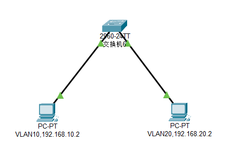
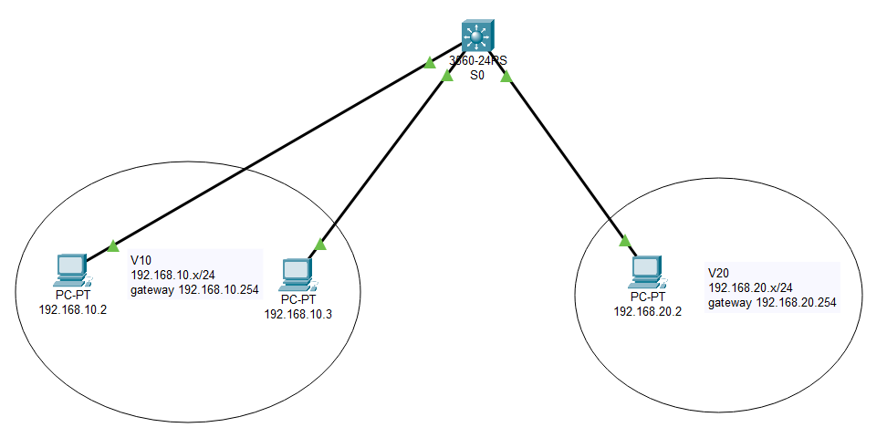
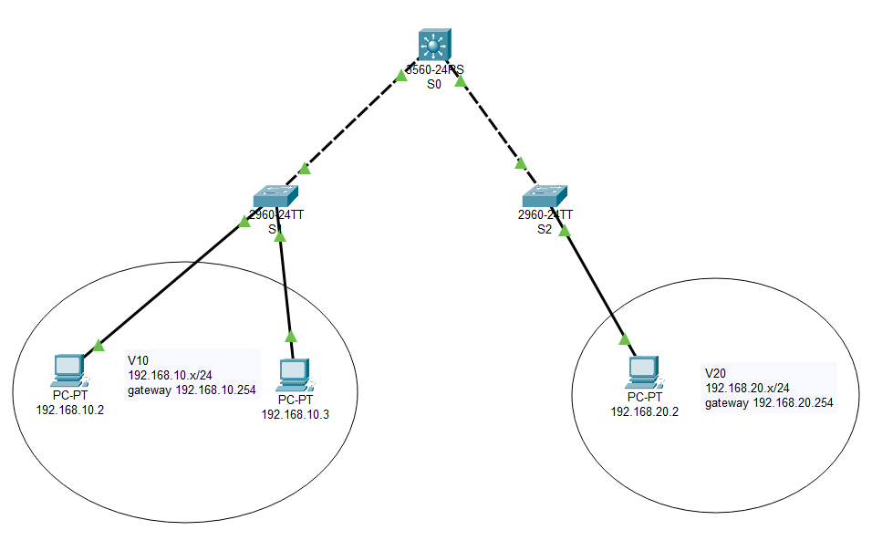
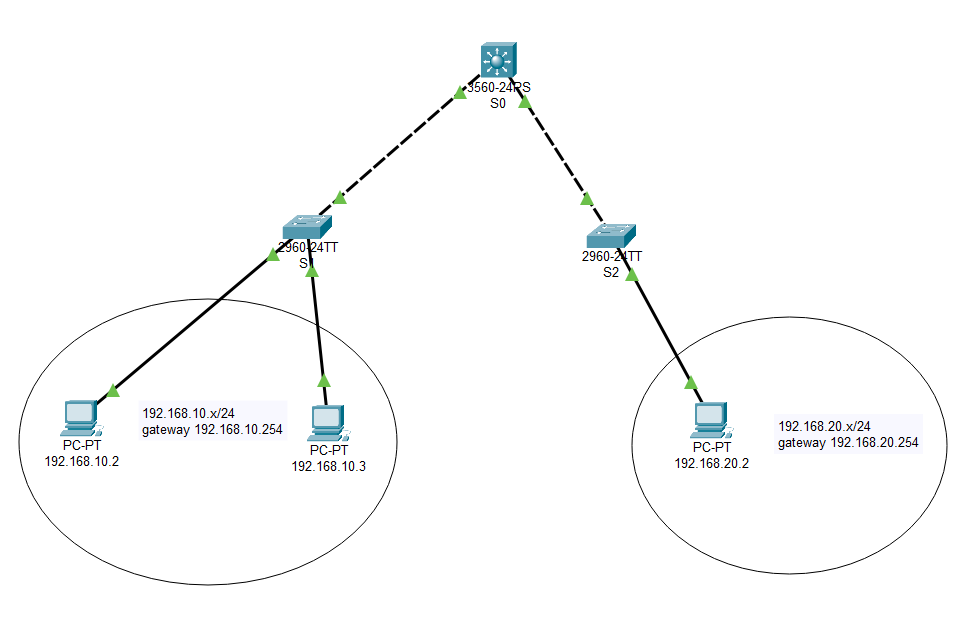

## 思科常用命令

`show`指令不能在全局配置模式下使用

| 命令                                   | 功能                                                     |
| -------------------------------------- | -------------------------------------------------------- |
| show interface                         | 查看所有端口的信息                                       |
| show vlan                              | 查看所有VLAN的信息                                       |
| show vlan brief                        | 查看所有VLAN的简要信息                                   |
| show interface interface-id switchport | 查看指定端口的接入模式                                   |
| show mac-address-table                 | 查看MAC地址表的内容                                      |
| show ip protocols                      | 查看路由协议相关信息                                     |
| show startup-config                    | 查看系统配置                                             |
| show running-config                    | 查看当前的运行配置                                       |
| copy running-config startup-config     | 更新系统配置                                             |
| write                                  | 保存配置                                                 |
| reload                                 | 重启交换机                                               |
| enable                                 | 进入特权模式                                             |
| disable                                | 退出特权模式                                             |
| exit                                   | 退出到上一级配置模式                                     |
| end                                    | 退出到特权模式                                           |
| hostname newname                       | 设置交换机名称(_需要先进入全局配置模式_)                 |
| shutdown                               | 禁用端口                                                 |
| no shutdown                            | 启用端口                                                 |
| configure terminal                     | 进入全局配置模式                                         |
| vlan vlan-id                           | 进入VLAN的配置界面                                       |
| name vlan-name                         | 设置VLAN名称(_需要先进入VLAN配置界面_)                   |
| no vlan vlan-id                        | 删除指定VLAN                                             |
| interface vlan vlan-id                 | 进入指定VLAN的配置模式(_VLAN其实就相当于一个虚拟端口_)   |
| interface interface-id                 | 进入指定端口的配置模式                                   |
| interface range interface-id           | 进入批量配置端口的模式                                   |
| duplex full                            | 设置端口为全双工模式(_需要先进入指定端口配置模式_)       |
| speed xxx                              | 设置端口的速度(_需要先进入指定端口配置模式_)             |
| ip address ip-address subnet-mask      | 设置端口的IP地址和子网掩码(_需要先进入指定端口配置模式_) |
| switchport mode access                 | 设置端口为VLAN接入模式(_需要先进入指定端口配置模式_)     |
| switchport mode trunk                  | 设置端口为中继模式(_需要先进入指定端口配置模式_)         |
| switchport access vlan vlan-id         | 将指定VLAN分配给某个端口(_需要先进入指定端口配置模式_)   |

## 开启telnet

```shell
Switch>
Switch>enable
Switch#configure terminal
Enter configuration commands, one per line.  End with CNTL/Z.
Switch(config)#interface vlan 1              // 进入vlan 1的配置模式
Switch(config-if)#ip address 192.168.0.254 255.255.255.0     // 设置telnet地址,用来远程登录
Switch(config-if)#no shutdown                // 让配置立即生效
Switch(config-if)#
%LINK-5-CHANGED: Interface Vlan1, changed state to up
%LINEPROTO-5-UPDOWN: Line protocol on Interface Vlan1, changed state to up
Switch(config-if)#exit
Switch(config)#
Switch(config)#line vty 0 4                  // 设置远程虚拟终端VTY线路数量
Switch(config-line)#password 123456          // 设置远程登录的密码
Switch(config-line)#login                    // 开启登录时需要输入密码
Switch(config-line)#exit
Switch(config)#
Switch(config)#exit
Switch#
%SYS-5-CONFIG_I: Configured from console by console
Switch#write                                 // 保存配置
Building configuration...
[OK]
```

然后让需要进行远程登录的设备的IP地址和子网掩码与交换机的IP地址在同一网段，打开终端

```shell
telnet 192.168.0.254 // 输入登录密码即可进入交换机
```

## 二层交换机

二层交换机常常作为接入层交换机使用



:::warning 💥正常来说，接入层交换机的上网VLAN是不应该配置IP地址的，IP要从上层路由设备获取。要管理接入层交换机应该用一个单独的VLAN，这里只是为了演示而已
:::

```shell
Switch>
Switch>enable
Switch#configure terminal
Enter configuration commands, one per line.  End with CNTL/Z.
Switch(config)#vlan 10                       // 创建vlan 10并进入配置界面
Switch(config-vlan)#name VLAN10              // 设置vlan名称
Switch(config-vlan)#exit
Switch(config)#vlan 20                       // 创建vlan 20
Switch(config-vlan)#name VLAN20
Switch(config-vlan)#exit
Switch(config)#
Switch(config)#interface vlan 10             // 进入vlan 10的配置模式
Switch(config-if)#
%LINK-5-CHANGED: Interface Vlan10, changed state to up
Switch(config-if)#ip address 192.168.10.254 255.255.255.0     // 给vlan 10设置IP地址
// 如果有开启telnet登录功能的话,终端设备还能够通过这个IP地址进行远程登录
Switch(config-if)#exit
Switch(config)#
Switch(config)#interface vlan 20             // 进入vlan 20的配置模式
Switch(config-if)#
%LINK-5-CHANGED: Interface Vlan20, changed state to up
Switch(config-if)#ip address 192.168.20.254 255.255.255.0     // 给vlan 20设置IP地址
Switch(config-if)#exit
Switch(config)#
Switch(config)#interface fastEthernet 0/1           // 进入端口1的配置模式
Switch(config-if)#switchport access vlan 10         // 把端口1划分给vlan 10
Switch(config-if)#
%LINEPROTO-5-UPDOWN: Line protocol on Interface Vlan1, changed state to down
%LINEPROTO-5-UPDOWN: Line protocol on Interface Vlan10, changed state to up
Switch(config-if)#exit
Switch(config)#
Switch(config)#interface fastEthernet 0/2           // 进入端口2的配置模式
Switch(config-if)#switchport access vlan 20         // 把端口2划分给vlan 20
Switch(config-if)#
%LINEPROTO-5-UPDOWN: Line protocol on Interface Vlan1, changed state to down
%LINEPROTO-5-UPDOWN: Line protocol on Interface Vlan20, changed state to up
Switch(config-if)#end
Switch#
%SYS-5-CONFIG_I: Configured from console by console
Switch#
Switch#write                                        // 保存配置
Building configuration...
[OK]
```

## 三层交换机常见组网

### 方式一

:::tip ⚡实现方式为创建三层交换机的VLAN间路由
:::



- **①创建VLAN**

```shell
Switch>
Switch>enable
Switch#vlan database                         // 进入vlan配置界面
% Warning: It is recommended to configure VLAN from config mode,
  as VLAN database mode is being deprecated. Please consult user
  documentation for configuring VTP/VLAN in config mode.
Switch(vlan)#vlan 10 name V10                // 创建vlan 10
VLAN 10 added:
    Name: V10
Switch(vlan)#vlan 20 name V20                // 创建vlan 20
VLAN 20 added:
    Name: V20
Switch(vlan)#exit
APPLY completed.
Exiting....
```

- **②将交换机的端口划分给VLAN**

```shell
Switch#
Switch#configure terminal
Enter configuration commands, one per line.  End with CNTL/Z.
Switch(config)#interface fastEthernet 0/1          // 进入端口1的配置模式
Switch(config-if)#switchport access vlan 10        // 把端口1划分给vlan 10
Switch(config-if)#exit
Switch(config)#
Switch(config)#interface fastEthernet 0/2          // 进入端口2的配置模式
Switch(config-if)#switchport access vlan 10        // 把端口2划分给vlan 10
Switch(config-if)#exit
Switch(config)#
Switch(config)#interface fastEthernet 0/3          // 进入端口3的配置模式
Switch(config-if)#switchport access vlan 20        // 把端口3划分给vlan 20
Switch(config-if)#exit
Switch(config)#end
```

- **③配置VLAN间的路由**

```shell
Switch#
Switch#configure terminal
Switch(config)#interface vlan 10                    // 进入vlan 10的配置模式
%LINK-5-CHANGED: Interface Vlan10, changed state to up
%LINEPROTO-5-UPDOWN: Line protocol on Interface Vlan10, changed state to up
Switch(config-if)#ip address 192.168.10.254 255.255.255.0     // 给vlan 10设置IP地址
Switch(config-if)#no shutdown
Switch(config-if)#exit
Switch(config)#interface vlan 20                    // 进入vlan 20的配置模式
%LINK-5-CHANGED: Interface Vlan20, changed state to up
%LINEPROTO-5-UPDOWN: Line protocol on Interface Vlan20, changed state to up
Switch(config-if)#ip address 192.168.20.254 255.255.255.0     // 给vlan 20设置IP地址
Switch(config-if)#no shutdown
Switch(config-if)#exit
Switch(config)#ip routing                    // 开启三层交换机的路由功能
Switch(config)#end
Switch#
Switch#write                                 // 保存配置
Building configuration...
[OK]
Switch#show ip route                         // 查看路由表
Codes: C - connected, S - static, I - IGRP, R - RIP, M - mobile, B - BGP
       D - EIGRP, EX - EIGRP external, O - OSPF, IA - OSPF inter area
       N1 - OSPF NSSA external type 1, N2 - OSPF NSSA external type 2
       E1 - OSPF external type 1, E2 - OSPF external type 2, E - EGP
       i - IS-IS, L1 - IS-IS level-1, L2 - IS-IS level-2, ia - IS-IS inter area
       * - candidate default, U - per-user static route, o - ODR
       P - periodic downloaded static route

Gateway of last resort is not set

C    192.168.10.0/24 is directly connected, Vlan10
C    192.168.20.0/24 is directly connected, Vlan20
```

- **④为终端设备分配IP地址和配置网关**

---

### 方式二

:::tip ⚡实现方式为创建三层交换机的VLAN间路由
:::



- **①先在二层交换机中创建VLAN，并将上行端口改为trunk模式**

```shell
Switch>
Switch>enable
Switch#configure terminal
Enter configuration commands, one per line.  End with CNTL/Z.
Switch(config)#vlan 10                                // 创建vlan 10并进入配置界面
Switch(config-vlan)#name V10                          // 设置vlan名称
Switch(config-vlan)#exit
Switch(config)#
Switch(config)#interface fastEthernet 0/1             // 进入端口1的配置模式
Switch(config-if)#switchport access vlan 10           // 把端口1划分给vlan 10
Switch(config-if)#exit
Switch(config)#
Switch(config)#interface fastEthernet 0/2             // 进入端口2的配置模式
Switch(config-if)#switchport access vlan 10           // 把端口2划分给vlan 10
Switch(config-if)#exit
Switch(config)#
Switch(config)#interface fastEthernet 0/24            // 进入端口24的配置模式
Switch(config-if)#switchport mode trunk               // 把端口24强制改为trunk模式
Switch(config-if)#
%LINEPROTO-5-UPDOWN: Line protocol on Interface FastEthernet0/24, changed state to down
%LINEPROTO-5-UPDOWN: Line protocol on Interface FastEthernet0/24, changed state to up
Switch(config-if)#end
Switch#
%SYS-5-CONFIG_I: Configured from console by console
Switch#write                                          // 保存配置
Building configuration...
[OK]
```

- **②接着在三层交换机中创建和二层一样的VLAN**

```shell
Switch>
Switch>enable
Switch#vlan database                                  // 进入vlan配置界面
% Warning: It is recommended to configure VLAN from config mode,
  as VLAN database mode is being deprecated. Please consult user
  documentation for configuring VTP/VLAN in config mode.
Switch(vlan)#vlan 10 name V10                         // 创建vlan 10
VLAN 10 added:
    Name: V10
Switch(vlan)#vlan 20 name V20                         // 创建vlan 20
VLAN 20 added:
    Name: V20
Switch(vlan)#exit
APPLY completed.
Exiting....
Switch#
```

- **③给三层交换机的VLAN设置IP地址**

```shell
Switch#
Switch#configure terminal
Enter configuration commands, one per line.  End with CNTL/Z.
Switch(config)#interface vlan 10                       // 进入vlan 10的配置模式
Switch(config-if)#
%LINK-5-CHANGED: Interface Vlan10, changed state to up
%LINEPROTO-5-UPDOWN: Line protocol on Interface Vlan10, changed state to up
Switch(config-if)#ip address 192.168.10.254 255.255.255.0         // 给vlan 10设置IP地址
Switch(config-if)#exit
Switch(config)#
Switch(config)#interface vlan 20                       // 进入vlan 20的配置模式
Switch(config-if)#
%LINK-5-CHANGED: Interface Vlan20, changed state to up
%LINEPROTO-5-UPDOWN: Line protocol on Interface Vlan20, changed state to up
Switch(config-if)#ip address 192.168.20.254 255.255.255.0         // 给vlan 20设置IP地址
Switch(config-if)#exit
```

- **④开启三层交换机的路由功能**

```shell
Switch(config)#
Switch(config)#ip routing                              // 开启三层交换机的路由功能
Switch(config)#exit
Switch#
%SYS-5-CONFIG_I: Configured from console by console
Switch#write                                           // 保存配置
Building configuration...
[OK]
Switch#
Switch#show ip route                                   // 查看路由表
Codes: C - connected, S - static, I - IGRP, R - RIP, M - mobile, B - BGP
       D - EIGRP, EX - EIGRP external, O - OSPF, IA - OSPF inter area
       N1 - OSPF NSSA external type 1, N2 - OSPF NSSA external type 2
       E1 - OSPF external type 1, E2 - OSPF external type 2, E - EGP
       i - IS-IS, L1 - IS-IS level-1, L2 - IS-IS level-2, ia - IS-IS inter area
       * - candidate default, U - per-user static route, o - ODR
       P - periodic downloaded static route

Gateway of last resort is not set

C    192.168.10.0/24 is directly connected, Vlan10
C    192.168.20.0/24 is directly connected, Vlan20
```

- **⑤为终端设备分配IP地址和配置网关**

---

### 方式三

:::tip ⚡实现方式为将三层交换机的交换端口改为路由端口，二层交换机作为接入层交换机保持默认就行
:::



- **①配置三层交换机路由端口**

```shell
Switch>
Switch>enable
Switch#configure terminal
Enter configuration commands, one per line.  End with CNTL/Z.
Switch(config)#
Switch(config)#interface fastEthernet 0/1           // 进入端口1的配置模式
Switch(config-if)#no switchport                     // 把端口1改为路由端口
Switch(config-if)#
%LINEPROTO-5-UPDOWN: Line protocol on Interface FastEthernet0/1, changed state to down
%LINEPROTO-5-UPDOWN: Line protocol on Interface FastEthernet0/1, changed state to up
Switch(config-if)#ip address 192.168.10.254 255.255.255.0      // 给端口1设置IP地址
Switch(config-if)#no shutdown
Switch(config-if)#exit
Switch(config)#
Switch(config)#interface fastEthernet 0/2           // 进入端口2的配置模式
Switch(config-if)#no switchport                     // 把端口2改为路由端口
Switch(config-if)#
%LINEPROTO-5-UPDOWN: Line protocol on Interface FastEthernet0/2, changed state to down
%LINEPROTO-5-UPDOWN: Line protocol on Interface FastEthernet0/2, changed state to up
Switch(config-if)#ip address 192.168.20.254 255.255.255.0      // 给端口2设置IP地址
Switch(config-if)#no shutdown
Switch(config-if)#exit
Switch(config)#
Switch(config)#ip routing                           // 开启三层交换机的路由功能
Switch(config)#end
Switch#
Switch#write                                        // 保存配置
Building configuration...
[OK]
```

- **②为终端设备分配IP地址和配置网关**
