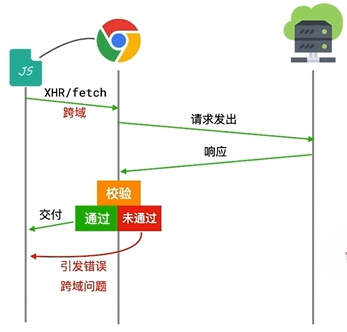
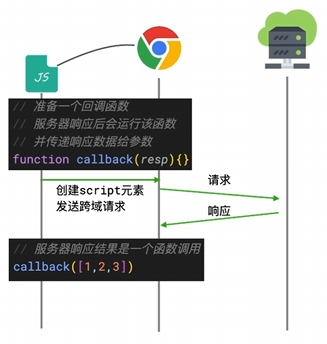
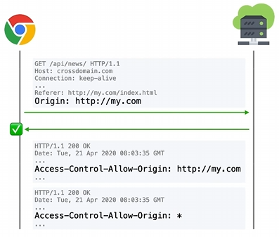
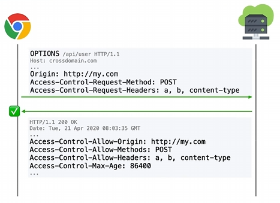

## 浏览器的同源策略

浏览器出于安全考虑，对**同源请求放行**，对**异源请求限制**，这些限制规则统称为「**同源策略**」。

由于这些限制造成的开发问题，我们称之为「**跨域(异源)问题**」

::: tip
所谓**同源**，即「**源**」 = **协议** + **域名** + **端口**
:::

### 同源请求

我们通常是通过`url`去访问一个网站的，此时的这个`url`代表的是「**页面源**」，而这个页面源可能会发出很多的请求，比如请求一个 css 文件、一张图片、一个 js 文件，或者通过`Ajax`去请求一些外部的资源，我们把页面源所请求的资源称之为「**目标源**」。

当页面源和目标源不满足**同源**的条件时，就会产生「**跨域**」，但并不是所有的跨域都会带来问题

### 浏览器如何限制跨域？

对 HTML 标签发出的跨域请求进行轻微限制，对`Ajax`发出的跨域请求进行严格限制



通过上图可以看到，所有的跨域请求其实都是能**正确送达**后端服务器的，服务器在运行正常的情况下也是能把结果响应给浏览器的，只是浏览器会对接收到的响应结果进行一层**校验**，当**校验不通过**的时候，浏览器会引发一个错误，这个错误就是我们通常说的「**跨域问题**」

::: danger 注意
跨域问题只会出现在浏览器端，这是由同源策略所导致的；服务器之间的相互请求并没有浏览器参与其中，而是通过**网络传输协议**(**HTTP 或 TCP 协议**)进行的，因此不存在跨域问题
:::

## 跨域的解决方案

### JSONP

`JSONP`是解决跨域问题的古老方案，同源策略中，对标签的跨域请求限制较小，`JSONP`正是利用了这一点来解决跨域问题的

**优点**

- 它不像`XMLHttpRequest`对象实现的`Ajax`请求那样受到同源策略的限制
- 它的兼容性更好，在更加古老的浏览器中都可以运行，不需要`XMLHttpRequest`或`ActiveX`的支持
- 并且在请求完毕后可以通过调用 callback 的方式回传结果

**缺点**

- 它只支持`GET`请求，不支持`POST`等其它类型的`HTTP`请求
- 它只支持跨域`HTTP`请求这种情况，不能解决不同域的两个页面之间如何进行`JavaScript`调用的问题

::: warning 注意
`JSONP`的方案在现代前端开发中已经很少使用了
:::



::: details JSONP示例
::: code-group
<<< @/demo/jsonp/index.html

<<< @/demo/jsonp/server.js
:::

### iframe

使用`iframe`标签展示异源内容，通过`postMessage`进行跨窗体通信

### CORS

`CORS`(Cross-Origin Resource Sharing)是一套机制，用于浏览器校验跨域请求，它的基本理念是：只要**服务器**明确表示**允许**，则校验**通过**；**服务器**明确表示**拒绝**或**没有表示**，则校验**不通过**

::: tip
`CORS`的设置只能在服务器端进行，也就是说服务器端必须得是友军，否则这个跨域解决方案就行不通
:::

`CORS`将请求分为两类：「**简单请求**」和「**预检请求**」

**简单请求**

- 请求方法为：`HEAD`、`GET`、`POST`
- 请求头字段满足`CORS`的安全规范，详情见[W3C](https://fetch.spec.whatwg.org/#cross-origin-resource-policy-header)，简单概括起来就是：只要不去修改请求头，那就是满足安全规范的
- 请求头的`Content-Type`字段值必须是`text/plain`、`multipart/form-data`和`application/x-www-form-urlencoded`中的一个



在发送请求的时候，浏览器发现跨域了就会在请求头上自动带一个`Origin`字段，其值通常是当前的页面源，表示该请求是从哪个源发出的。

服务器在响应的时候，会在响应头上带一个`Access-Control-Allow-Origin`字段，其值通常是服务器所允许的请求源，浏览器会对`Origin`和`Access-Control-Allow-Origin`中的源进行对比，只要两个源保持一致，那么浏览器就让该请求校验通过

**预检请求**：所有非简单请求



浏览器在发送真实的请求前，会先发送一个`OPTIONS`请求，这个请求就是**预检请求**，预检请求会在请求头自动带上`Origin`、`Access-Control-Request-Method`和`Access-Control-Request-Headers`这三个字段。

其中`Access-Control-Request-Method`表示将要发送的真实请求所使用的请求方法，`Access-Control-Request-Headers`表示将要发送的真实请求改动了哪些请求头

服务器在响应预检请求时，还可以在响应头额外带上一个`Access-Control-Max-Age`字段，用来表示在接下来一段时间内，来自`Origin`的请求都是允许的，不需要再重复发送`OPTIONS`进行询问

如果预检请求通过了浏览器的校验后，就会发送真实请求了。此时，真实请求的执行步骤就和简单请求完全一致了

### Proxy

无论是`JSONP`还是`CORS`，这两种方案都不可避免的要对后端服务器动手，即要求服务器端是友军，否则就无法实施

那么有没有一种方案不需要对后端服务器做任何修改，仅仅在前端技术栈范畴内就能解决跨域问题呢？答案就是`Proxy`

在现代前端开发领域，我们常用构建工具`webpack`内置有一个`nodejs`服务器，平时在开发环境中能够正常访问后端接口其实都是通过这个内置服务器转发请求至目标服务器，得到结果再转发给前端

::: details 方案① 各种前端脚手架，这里以`vue-cli`为例

```js
module.exports = {
  devServer: {
    host: '127.0.0.1',
    port: 8084,
    open: true, // vue项目启动时自动打开浏览器
    proxy: {
      '/api': {
        // '/api'是代理标识，用于告诉node，url前面是/api的就是使用代理的
        target: 'http://xxx.xxx.xx.xx:8080', //目标地址，一般是指后台服务器地址
        changeOrigin: true, //是否跨域
        pathRewrite: {
          // pathRewrite 的作用是把实际Request Url中的'/api'用""代替
          '^/api': '',
        },
      },
    },
  },
}
```

:::

::: details 方案② 通过自建`nodejs`服务器实现代理请求转发，这里以`express`为例

```js
const express = require('express')
const proxy = require('http-proxy-middleware')
const app = express()
app.use(express.static(__dirname + '/'))
app.use(
  '/api',
  proxy({
    target: 'http://localhost:8080',
    changeOrigin: false,
  })
)
module.exports = app
```

:::

::: details 方案③ 通过配置`nginx`实现代理

```ini
server {
  listen    80;
  location / {
    root  /var/www/html;
    index  index.html index.htm;
    try_files $uri $uri/ /index.html;
  }
  location /api {
    proxy_pass  http://127.0.0.1:3000;
    proxy_redirect   off;
    proxy_set_header  Host       $host;
    proxy_set_header  X-Real-IP     $remote_addr;
    proxy_set_header  X-Forwarded-For  $proxy_add_x_forwarded_for;
  }
}
```

:::
