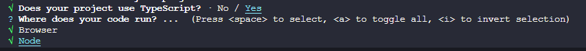

::: tip ✨
搭建一个 Expo + TailwindCSS + TypeScript + ESLint + Prettier 的工程

[本工程的Github地址](https://github.com/welives/expo-starter)
:::

相关文档

- [Expo](https://expo.dev/)
- [ReactNative](https://reactnative.cn/)
- [ReactNavigation](https://reactnavigation.org/)
- [TypeScript](https://www.tslang.cn/)
- [TailwindCSS](https://tailwind.nodejs.cn/)
- [ESLint](https://eslint.nodejs.cn/)
- [Prettier](https://prettier.nodejs.cn/)

## 事前准备

- Windows 或者 Linux
- VSCode：编辑器
- nodejs：项目运行所需要的基础环境
- git：代码版本控制
- AndroidStudio：Android 虚拟机调试 App

## 初始化项目

我初始化项目时用的 Expo SDK 版本是`49`

```sh
pnpm create expo-app -t expo-template-blank-typescript
```

由于使用`pnpm`创建的 Expo 项目缺少了`.npmrc`文件，我们需要在项目根目录手动创建它，填入如下内容

```ini
node-linker=hoisted
```

接着删除`node_modules`目录和`pnpm-lock.yaml`文件，然后重新执行一遍依赖的安装

```sh
rm -rf node_modules
rm pnpm-lock.yaml
pnpm install
```

最后执行`pnpm start`启动项目，不出意外的话就会唤起 Android 虚拟机打开 App 了

这样就创建好一个以 Expo 为脚手架的基础工程了，接下来我们对这个它做亿点点额外的配置

## 配置EditorConfig

新建`.editorconfig`，设置编辑器和 IDE 规范，内容根据自己的喜好或者团队规范

::: code-group

```sh
touch .editorconfig
```

```ini [.editorconfig]
# https://editorconfig.org
root = true

[*]
charset = utf-8
indent_style = space
indent_size = 2
end_of_line = lf
insert_final_newline = true
trim_trailing_whitespace = true

[*.md]
insert_final_newline = false
trim_trailing_whitespace = false
```

:::

## 初始化`ESLint`

```sh
npx eslint --init
```

选第二个


选第一个


选其他，因为等下会安装RN社区的整合插件


选`TypeScript`，然后运行环境按`a`全选



`ESLint`配置文件的的保存格式，选第一个


是否立即安装所需的依赖，选 Yes


这里根据项目构建所使用的包管理器进行选择，因为本项目使用`pnpm`，所以选第三个


新建`.eslintignore`文件，填入自己喜欢的配置

::: code-group

```sh
touch .eslintignore
```

```ini [.eslintignore]
node_modules
android
ios
.expo
.expo-shared
.vscode
.idea
```

:::

### RN社区的ESLint插件

```sh
pnpm add -D @react-native-community/eslint-plugin @react-native-community/eslint-config
```

## 安装`Prettier`

```sh
pnpm add -D prettier eslint-config-prettier eslint-plugin-prettier
```

新建`.prettierrc`和`.prettierignore`文件，填入自己喜欢的配置

::: code-group

```sh
touch .prettierrc
touch .prettierignore
```

```json [.prettierrc]
{
  "$schema": "https://json.schemastore.org/prettierrc",
  "semi": false,
  "tabWidth": 2,
  "printWidth": 120,
  "singleQuote": true,
  "trailingComma": "es5"
}
```

```ini [.prettierignore]
node_modules
android
ios
.expo
.expo-shared
.vscode
.idea
```

:::

### 整合`ESLint`和`Prettier`

修改`.eslintrc.js`

::: details 查看

```js
module.exports = {
  root: true,
  env: {
    browser: true,
    es2021: true,
    node: true,
  },
  parser: '@typescript-eslint/parser',
  parserOptions: {
    ecmaVersion: 'latest',
    sourceType: 'module',
  },
  extends: [
    'eslint:recommended',
    'plugin:@typescript-eslint/recommended',
    '@react-native-community',
    'prettier',
    'plugin:prettier/recommended',
  ],
  plugins: ['@react-native-community', 'prettier'],
  overrides: [
    {
      env: {
        node: true,
      },
      files: ['.eslintrc.{js,cjs}'],
      parserOptions: {
        sourceType: 'script',
      },
    },
  ],
  rules: {
    complexity: ['error', 10],
    'prettier/prettier': 'error',
    'no-console': process.env.NODE_ENV === 'production' ? 'warn' : 'off',
    'no-debugger': process.env.NODE_ENV === 'production' ? 'warn' : 'off',
  },
}
```

:::

## 配置`tsconfig`

```json
{
  "extends": "expo/tsconfig.base",
  "compilerOptions": {
    "strict": true,
    "baseUrl": ".",
    "paths": {
      "~/*": ["src/*"]
    },
    "typeRoots": ["node_modules/@types", "src/@types"]
  },
  "include": ["src"],
  "exclude": [
    "node_modules",
    "android",
    "ios",
    "babel.config.js",
    "metro.config.js",
    ".eslintrc.js"
  ]
}
```

### 开启路径别名

编辑`app.json`，添加如下`experiments`配置项

```json
{
  "expo": {
    // ...
    "experiments": {
      "tsconfigPaths": true
    }
  }
}
```

### 调整目录结构

项目根目录新建`src`文件夹，把`App.tsx`移入其中，新建`index.ts`文件作为应用入口，并填入以下内容

::: code-group

```sh
mkdir src
mv App.tsx src/App.tsx
touch index.ts
```

```ts [index.ts]
import { registerRootComponent } from 'expo'
import App from './src/App'

registerRootComponent(App)
```

```json [package.json]
{
  // ...
  "main": "index.ts" // [!code ++]
}
```

:::

## 环境变量

```sh
pnpm add expo-constants
pnpm add -D cross-env dotenv zod
```

- 根目录新建`.env`或`.env.local`和`env.js`文件

::: details 查看
::: code-group

```ini [.env.local]
# 应用配置
EXPO_PUBLIC_UI_WIDTH=375
EXPO_PUBLIC_UI_HEIGHT=812
EXPO_PUBLIC_API_URL=http://localhost:3000
EXPO_PUBLIC_API_PREFIX=/api
API_KEY=your_api_key

# 构建配置
PACKAGE=com.jandan
BUNDLE_ID=com.jandan
EAS_PROJECT_ID=
EXPO_ACCOUNT_OWNER=jandan
```

```js [env.js]
const fs = require('fs')
const path = require('path')
const { parse } = require('dotenv')
const z = require('zod')
const NODE_ENV = process.env.NODE_ENV ?? 'development'
/**
 * 同步读取文件
 * @param {string} file
 * @returns {fs.Stats | undefined}
 */
function tryStatSync(file) {
  try {
    return fs.statSync(file, { throwIfNoEntry: false })
  } catch {}
}
/**
 * 转成数组
 * @param {string | string[]} target
 * @returns {string[]}
 */
function toArray(target) {
  return Array.isArray(target) ? target : [target]
}
/**
 * 获取env文件列表
 * @param {string} mode
 * @returns {string[]}
 */
function getEnvFilesForMode(mode) {
  return [
    /** default file */ `.env`,
    /** local file */ `.env.local`,
    /** mode file */ `.env.${mode}`,
    /** mode local file */ `.env.${mode}.local`,
  ]
}
/**
 * 一个用于给传入变量加上环境标识的函数
 * @param {string} name
 * @returns {string}
 */
function withEnvSuffix(name) {
  return NODE_ENV === 'production' ? name : `${name}.${NODE_ENV}`
}
/**
 * 加载环境变量
 * @param {string} envDir
 * @param {string | string[]} prefixes
 * @returns {object}
 */
function loadEnv(envDir, prefixes = 'EXPO_PUBLIC_') {
  prefixes = toArray(prefixes)
  const env = {}
  const envFiles = getEnvFilesForMode(NODE_ENV)
  const parsed = Object.fromEntries(
    envFiles.flatMap((file) => {
      const filePath = path.resolve(envDir, file)
      if (!tryStatSync(filePath)?.isFile()) return []
      return Object.entries(parse(fs.readFileSync(filePath)))
    })
  )
  for (const [key, value] of Object.entries(parsed)) {
    if (prefixes.some((prefix) => !key.startsWith(prefix))) {
      env[key] = value
    }
  }
  return env
}
const config = loadEnv(__dirname)
// 定义客户端常量的类型模式
const clientSchema = z.object({
  NODE_ENV: z.enum(['development', 'test', 'production']),
  API_KEY: z.string(),
  MMKV_DEVICE_KEY: z.string(),
  MMKV_USER_ENCRYPT_KEY: z.string(),
})
// 定义构建工具常量的类型模式
const buildSchema = z.object({
  PACKAGE: z.string(),
  BUNDLE_ID: z.string(),
  EAS_PROJECT_ID: z.string(),
  EXPO_ACCOUNT_OWNER: z.string(),
})
/** @type {Record<keyof z.infer<typeof clientSchema>, string | undefined>} */
const _clientEnv = {
  NODE_ENV,
  API_KEY: config.API_KEY,
  MMKV_DEVICE_KEY: config.MMKV_DEVICE_KEY,
  MMKV_USER_ENCRYPT_KEY: config.MMKV_USER_ENCRYPT_KEY,
}
/** @type {Record<keyof z.infer<typeof buildSchema>, string | undefined>} */
const _buildEnv = {
  PACKAGE: withEnvSuffix(config.PACKAGE),
  BUNDLE_ID: withEnvSuffix(config.BUNDLE_ID),
  EAS_PROJECT_ID: config.EAS_PROJECT_ID,
  EXPO_ACCOUNT_OWNER: config.EXPO_ACCOUNT_OWNER,
}
// 合并环境变量
const _env = { ..._clientEnv, ..._buildEnv }
// 合并类型模式
const mergeSchema = buildSchema.merge(clientSchema)
const parsed = mergeSchema.safeParse(_env)
if (parsed.success === false) {
  throw new Error('无效的环境变量')
}

module.exports = {
  withEnvSuffix,
  Env: parsed.data,
  ClientEnv: clientSchema.parse(_clientEnv),
}
```

:::

- 把`app.json`改成`app.config.ts`

::: details 查看

```ts
import { ExpoConfig, ConfigContext } from 'expo/config'
const { name, version } = require('./package.json')
import { Env, ClientEnv } from './env'

export default ({ config }: ConfigContext): ExpoConfig => {
  return {
    ...config,
    name,
    slug: name,
    description: '一个简单的Expo基础项目模板',
    owner: Env.EXPO_ACCOUNT_OWNER,
    version,
    orientation: 'portrait',
    userInterfaceStyle: 'automatic',
    scheme: `com.${name}.linking`,
    assetBundlePatterns: ['**/*'],
    experiments: {
      tsconfigPaths: true,
    },
    icon: './assets/icon.png',
    splash: {
      image: './assets/splash.png',
      resizeMode: 'contain',
      backgroundColor: '#ffffff',
    },
    runtimeVersion: {
      policy: 'appVersion',
    },
    ios: {
      supportsTablet: true,
      bundleIdentifier: Env.BUNDLE_ID,
      entitlements: {
        'com.apple.developer.networking.wifi-info': true,
      },
    },
    android: {
      package: Env.PACKAGE,
      adaptiveIcon: {
        foregroundImage: './assets/adaptive-icon.png',
        backgroundColor: '#ffffff',
      },
    },
    web: {
      favicon: './assets/favicon.png',
    },
    plugins: [
      [
        'app-icon-badge',
        {
          enabled: Env.NODE_ENV !== 'production',
          badges: [
            {
              text: Env.NODE_ENV,
              type: 'banner',
              color: 'white',
            },
            {
              text: version,
              type: 'ribbon',
              color: 'white',
            },
          ],
        },
      ],
    ],
    extra: {
      ...ClientEnv,
      eas: {
        ...(Env.EAS_PROJECT_ID && { projectId: Env.EAS_PROJECT_ID }),
      },
    },
  }
}
```

:::

- 新建`src/@types/global.d.ts`文件，用来声明全局变量、函数、接口和类型等
- 新建`src/core/constants/env.ts`文件，用来导出 Expo 传递进来的环境变量
- 修改`tsconfig.json`，增加一个路径别名`@env`指向`src/core/constants/env.ts`

::: code-group

```ts [global.d.ts]
declare module '@env' {
  interface Env {
    NODE_ENV: 'development' | 'test' | 'production'
    API_KEY: string
    MMKV_DEVICE_KEY: string
    MMKV_USER_ENCRYPT_KEY: string
  }
  export const Env: Env
}
```

```ts [env.ts]
import Constants from 'expo-constants'
const Env = Constants.expoConfig?.extra ?? {}
if (Env.hasOwnProperty('eas')) {
  delete Env.eas
}
export { Env }
```

```json [tsconfig.json]
{
  "compilerOptions": {
    "paths": {
      "@env": ["src/core/constants/env.ts"] // [!code ++]
    }
  }
}
```

:::

## 使用`EAS`构建服务

```sh
pnpm add -D app-icon-badge
npm i -g eas-cli
eas login
eas build:configure
```

## 安全区适配和手势插件

```sh
pnpm add react-native-screens react-native-safe-area-context react-native-gesture-handler
```

修改入口文件`index.ts`和`src/App.tsx`

::: code-group

```ts [index.ts]
import 'react-native-gesture-handler' // [!code ++]
// ...
```

```tsx{10-17} [App.tsx]
import { StatusBar } from 'expo-status-bar'
import { StyleSheet, Text, View } from 'react-native';
import { GestureHandlerRootView } from 'react-native-gesture-handler' // [!code ++]
import { SafeAreaProvider } from 'react-native-safe-area-context' // [!code ++]
import { enableScreens } from 'react-native-screens' // [!code ++]

enableScreens() // [!code ++]
export default function App() {
  return (
    <SafeAreaProvider>
      <GestureHandlerRootView style={{ flex: 1 }}>
        <View style={styles.container}>
          <Text>Open up App.tsx to start working on your app!</Text>
        </View>
        <StatusBar style="auto" />
      </GestureHandlerRootView>
    </SafeAreaProvider>
  )
}
// ...
```

:::

## 安装`TailwindCSS`

::: code-group

```sh
pnpm add -D tailwindcss
npx tailwindcss init
```

```js [tailwind.config.js]
const colors = require('tailwindcss/colors')
delete colors.lightBlue
delete colors.warmGray
delete colors.trueGray
delete colors.coolGray
delete colors.blueGray
/** @type {import('tailwindcss').Config} */
module.exports = {
  content: ['./src/**/*.{js,jsx,ts,tsx}'],
  theme: {
    extend: { colors },
  },
  plugins: [],
}
```

:::

由于 App 端使用的尺寸单位是`dp`，不支持`TailwindCSS`的单位，需要安装一个插件来做转换处理

```sh
pnpm add twrnc
```

新建`src/core/utils/tailwind.ts`文件，修改`src/App.tsx`

::: code-group

```ts [tailwind.ts]
import { create } from 'twrnc'
export default create(require('../../../tailwind.config'))
```

```tsx [App.tsx]
// ...
import { useDeviceContext } from 'twrnc' // [!code ++]
import { tw } from './core/utils' // [!code ++]
export default function App() {
  useDeviceContext(tw) // [!code ++]
  // ...
}
```

:::

## 屏幕适配

新建`src/core/utils/global.ts`，修改`src/@types.global.d.ts`和入口文件`index.ts`

::: code-group

```ts [global.ts]
import { Dimensions, PixelRatio } from 'react-native'

// UI设计稿尺寸,单位px
const designSize = Object.freeze({
  width: parseInt(process.env.EXPO_PUBLIC_UI_WIDTH as string),
  height: parseInt(process.env.EXPO_PUBLIC_UI_HEIGHT as string),
})
// 获取设备屏幕尺寸,单位dp
const { width, height } = Dimensions.get('window')
// 设计稿缩放比
const designScale = Object.freeze({
  w: width / designSize.width,
  h: height / designSize.height,
})
const operation = Object.freeze({
  size: (uiSize: number, based: ScaleBased) => uiSize * designScale[based],
  px2dp: (px: number) => parseFloat(PixelRatio.roundToNearestPixel(px).toFixed(2)),
})

global.dp = function (uiSize: number, based: ScaleBased = 'w') {
  return uiSize > 1 ? operation.px2dp(operation.size(uiSize, based)) : uiSize
}
```

```ts [global.d.ts]
// ...
type Prettify<T> = { [P in keyof T]: T[P] } & {}
type ScaleBased = 'w' | 'h'
/**
 * 获取设计稿中像素值的真实dp
 * @param uiSize 设计稿尺寸
 * @param based 基准比例方案,默认用宽度方案
 * @returns
 */
function dp(uiSize: number, based: ScaleBased = 'w'): number
```

```ts [index.ts]
import './src/core/utils/global' // [!code ++]
// ...
```

:::

## 路由导航

```sh
pnpm add @react-navigation/native @react-navigation/native-stack @react-navigation/bottom-tabs
```

新建`src/pages`目录，用来存放应用的所有页面，接着新建三个页面用来测试，参考如下

- `Onboarding`
  - `index.tsx`
- `Home`
  - `index.tsx`
- `Profile`
  - `index.tsx`

::: details 查看
::: code-group

```tsx [Onboarding]
import { View, Button } from 'react-native'
import { SafeAreaView } from 'react-native-safe-area-context'
import { tw } from '~/core/utils'
import { AppStackScreenProps, AppStacks } from '~/routes/types'

type Props = AppStackScreenProps<AppStacks>
export default ({ navigation }: Props) => {
  return (
    <SafeAreaView style={tw`flex-1 items-center justify-center`}>
      <View>
        <Button title="Go Home" onPress={() => navigation.navigate('BOTTOM_TABS')}></Button>
      </View>
    </SafeAreaView>
  )
}
```

```tsx [Home]
import { View, Button } from 'react-native'
import { SafeAreaView } from 'react-native-safe-area-context'
import { tw } from '~/core/utils'
import { AppStackScreenProps, AppStacks } from '~/routes/types'

type Props = AppStackScreenProps<AppStacks>
export default ({ navigation }: Props) => {
  return (
    <SafeAreaView style={tw`flex-1 items-center justify-center`}>
      <View>
        <Button
          title="Go Profile"
          onPress={() => navigation.navigate('BOTTOM_TABS', { screen: 'PROFILE' })}
        ></Button>
      </View>
    </SafeAreaView>
  )
}
```

```tsx [Profile]
import { View, Text } from 'react-native'
import { SafeAreaView } from 'react-native-safe-area-context'
import { tw } from '~/core/utils'

export default () => {
  return (
    <SafeAreaView style={tw`flex-1 items-center justify-center`}>
      <View>
        <Text>Profile</Text>
      </View>
    </SafeAreaView>
  )
}
```

:::

新建`src/routes`目录，用来管理应用的路由。在`routes`目录下新建`AppNavigator.tsx`、`TabsNavigator.tsx`和`types.ts`

::: details 查看
::: code-group

```ts [types.ts]
import { BottomTabScreenProps } from '@react-navigation/bottom-tabs'
import { CompositeScreenProps, NavigatorScreenParams } from '@react-navigation/native'
import { NativeStackScreenProps } from '@react-navigation/native-stack'

export enum AppStacks {
  ONBOARDING = 'ONBOARDING',
  BOTTOM_TABS = 'BOTTOM_TABS',
}

export enum TabsStacks {
  HOME = 'HOME',
  PROFILE = 'PROFILE',
}

export type AppStackParamList = {
  BOTTOM_TABS: NavigatorScreenParams<TabsStackParamList> | undefined
} & {
  [K in Exclude<keyof typeof AppStacks, 'BOTTOM_TABS'>]: undefined
}
export type AppStackScreenProps<T extends keyof AppStackParamList> = NativeStackScreenProps<
  AppStackParamList,
  T
>

export type TabsStackParamList = {
  [K in keyof typeof TabsStacks]: undefined
}
export type TabsStackScreenProps<T extends keyof TabsStackParamList> = CompositeScreenProps<
  BottomTabScreenProps<TabsStackParamList, T>,
  AppStackScreenProps<keyof typeof AppStacks>
>

export type RootStacks = AppStacks | TabsStacks
export type RootStackParamList = Prettify<AppStackParamList & TabsStackParamList>
export type RootStackScreenProps<T extends keyof RootStackParamList> = CompositeScreenProps<
  NativeStackScreenProps<RootStackParamList, T>,
  BottomTabScreenProps<TabsStackParamList>
>
```

```tsx [AppNavigator.tsx]
import {
  NativeStackNavigationOptions,
  createNativeStackNavigator,
} from '@react-navigation/native-stack'
import { AppStacks, AppStackParamList, AppStackScreenProps } from './types'
import { OnboardingScreen } from '../pages'
import TabsNavigator from './TabsNavigator'

interface AppScreenOptions {
  title: string
  component: React.FC<AppStackScreenProps<AppStacks>>
  options: NativeStackNavigationOptions
}

const AppScreens: Record<AppStacks, AppScreenOptions> = {
  [AppStacks.BOTTOM_TABS]: {
    title: 'BottomTabs',
    component: TabsNavigator,
    options: {
      headerShown: false, // 隐藏tabbar屏幕的导航栏
    },
  },
  [AppStacks.ONBOARDING]: {
    title: 'Onboarding',
    component: OnboardingScreen,
    options: { headerShown: false },
  },
}
const AppStack = createNativeStackNavigator<AppStackParamList>()
export default () => {
  return (
    <AppStack.Navigator
      initialRouteName={AppStacks.ONBOARDING}
      screenOptions={() => {
        return { gestureEnabled: false }
      }}
    >
      {Object.entries(AppScreens).map(([key, value]) => (
        <AppStack.Screen
          key={key}
          name={key as AppStacks}
          component={value.component}
          options={() => {
            return {
              title: value.title,
              headerTitleAlign: 'center',
              ...(value.options || {}),
            }
          }}
        />
      ))}
    </AppStack.Navigator>
  )
}
```

```tsx [TabsNavigator.tsx]
import { createBottomTabNavigator, BottomTabNavigationOptions } from '@react-navigation/bottom-tabs'
import { TabsStacks, TabsStackParamList, TabsStackScreenProps } from './types'
import { HomeScreen, ProfileScreen } from '../pages'

interface TabScreenOptions {
  title: string
  component: React.FC<TabsStackScreenProps<TabsStacks>>
  options: BottomTabNavigationOptions
}

const TabScreens: Record<TabsStacks, TabScreenOptions> = {
  [TabsStacks.HOME]: {
    title: 'Home',
    component: HomeScreen,
    options: {},
  },
  [TabsStacks.PROFILE]: {
    title: 'Profile',
    component: ProfileScreen,
    options: {},
  },
}
const Tabs = createBottomTabNavigator<TabsStackParamList>()
export default () => {
  return (
    <Tabs.Navigator
      initialRouteName={TabsStacks.HOME}
      screenOptions={() => {
        return {
          headerShown: false,
        }
      }}
    >
      {Object.entries(TabScreens).map(([key, value]) => (
        <Tabs.Screen
          key={key}
          name={key as TabsStacks}
          component={value.component}
          options={() => {
            return {
              tabBarLabel: value.title,
              headerTitleAlign: 'center',
              ...(value.options || {}),
            }
          }}
        ></Tabs.Screen>
      ))}
    </Tabs.Navigator>
  )
}
```

:::

## 侧栏组件

[详细文档看这里](https://reactnavigation.org/docs/drawer-layout)

```sh
pnpm add react-native-drawer-layout react-native-reanimated@3.3.0
```

修改`src/pages/Profile/index.tsx`和`babel.config.js`

::: code-group

```tsx{7-25} [Profile]
import { Drawer } from 'react-native-drawer-layout' // [!code ++]
// ...

export default () => {
  const [open, setOpen] = React.useState(false) // [!code ++]
  return (
    <Drawer
      open={open}
      onOpen={() => setOpen(true)}
      onClose={() => setOpen(false)}
      renderDrawerContent={() => {
        return (
          <View style={tw`flex-1 items-center justify-center`}>
            <Text>Drawer content</Text>
          </View>
        )
      }}
    >
      <SafeAreaView style={tw`flex-1 items-center justify-center`}>
        <Button
          onPress={() => setOpen((prevOpen) => !prevOpen)}
          title={`${open ? 'Close' : 'Open'} drawer`}
        />
      </SafeAreaView>
    </Drawer>
  )
}
```

```js [babel.config.js]
module.exports = function (api) {
  api.cache(true)
  return {
    presets: ['babel-preset-expo'],
    plugins: ['react-native-reanimated/plugin'], // [!code ++]
  }
}
```

:::
