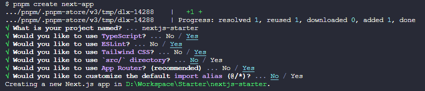
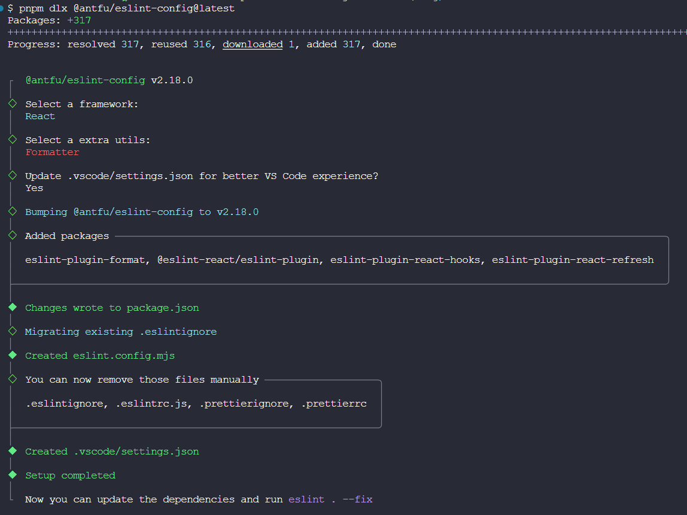
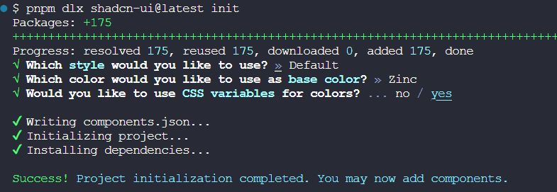

::: tip ✨
搭建一个开箱即用的基于 Next.js + TailwindCSS + Prettier + TypeScript 的工程

[本工程的Github地址](https://github.com/welives/nextjs-starter)

编写此笔记时所使用的`Next.js`版本为`14.2.3`
:::

## 相关文档

- [Next.js](https://www.nextjs.cn/)
- [shadcn](https://www.shadcn.com.cn/)
- [React-Vant](https://react-vant.3lang.dev/)
- [TailwindCSS](https://www.tailwindcss.cn/)
- [TypeScript](https://www.tslang.cn/)
- [ESLint](https://eslint.nodejs.cn/)
- [Prettier](https://prettier.nodejs.cn/)

## 项目初始化

```sh
pnpm create next-app
```



::: tip 💡
通过上述交互式命令的选项，我们创建了一个带有`ESLint`的基于 Next.js 脚手架的 React 项目
:::

### 配置EditorConfig

新建`.editorconfig`，设置编辑器和 IDE 规范，内容根据自己的喜好或者团队规范

```ini
# https://editorconfig.org
root = true

[*]
charset = utf-8
indent_style = space
indent_size = 2
end_of_line = lf
insert_final_newline = true
trim_trailing_whitespace = true

[*.md]
insert_final_newline = false
trim_trailing_whitespace = false
```

### 配置ESLint和Prettier

脚手架预设的`ESLint`还不够完善，这里直接使用[Nuxt团队的Anthony Fu大佬的eslint-config](https://github.com/antfu/eslint-config)进行完善

```sh
pnpm dlx @antfu/eslint-config@latest
```



编辑`eslint.config.mjs`

```js
import antfu from '@antfu/eslint-config'

export default antfu({
  ignores: ['node_modules', '**/node_modules/**', 'dist', '**/dist/**', '.next', '**/.next/**'],
  formatters: true,
  typescript: true,
  react: true,
})
```

编辑`package.json`，添加如下内容

```json
{
  // ...
  "scripts": {
    // ...
    "lint": "eslint .", // [!code ++]
    "lint:fix": "eslint . --fix" // [!code ++]
  }
}
```

由于 **Anthony Fu** 大佬的这套`eslint-config`默认禁用`prettier`，如果你想配合`prettier`一起用的话就安装它(_不用的话就跳过_)，然后在根目录新建`.prettierrc`，填入自己喜欢的配置

::: code-group

```sh [terminal]
pnpm add -D prettier
```

```json [.prettierrc]
{
  "$schema": "https://json.schemastore.org/prettierrc",
  "semi": false,
  "tabWidth": 2,
  "printWidth": 120,
  "singleQuote": true,
  "trailingComma": "es5"
}
```

:::

接着编辑`.vscode/settings.json`，把`prettier`启用即可

```json
{
  "prettier.enable": true // [!code hl]
  // ...
}
```

## 环境变量

关于 Next.js 的环境变量[详细文档看这里](https://www.nextjs.cn/docs/basic-features/environment-variables)

## UI框架

### 使用shadcn

`Shadcn`和`TailwindCSS`默认是绑定在一起的，会自动安装`TailwindCSS`

```sh
pnpm dlx shadcn-ui@latest init
```

根据自己的喜好选择就行



#### 类排序插件

```sh
pnpm add -D prettier prettier-plugin-tailwindcss
```

编辑`.prettierrc`，注册插件

```json
{
  "plugins": ["prettier-plugin-tailwindcss"] // [!code ++]
}
```

#### TailwindCSS debug插件

```sh
pnpm add -D tailwindcss-debug-screens
```

编辑`app/layout.tsx`和`tailwind.config.ts`

::: code-group

```tsx{11} [layout.tsx]
// ...
import { cn } from '@/lib/utils' // [!code ++]

export default function RootLayout({
  children,
}: Readonly<{
  children: React.ReactNode
}>) {
  return (
    <html lang="en">
      <body className={cn('debug-screens', inter.className)}>{children}</body>
    </html>
  )
}
```

```ts{5-8} [tailwind.config.ts]
// ...
const config = {
  // ...
  theme: {
    debugScreens: {
      position: ['bottom', 'right'],
      ignore: ['dark'],
    },
    // ...
  },
  plugins: [
    // 开发模式下加载显示屏幕大小的插件
    process.env.NODE_ENV === 'development' && require('tailwindcss-debug-screens'), // [!code ++]
  ],
}
```

:::

#### 设置字体

编辑`app/layout.tsx`和`tailwind.config.ts`

::: code-group

```tsx{2,11} [layout.tsx]
// ...
const inter = Inter({ subsets: ['latin'], variable: '--font-sans' })

export default function RootLayout({
  children,
}: Readonly<{
  children: React.ReactNode
}>) {
  return (
    <html lang="en">
      <body className={cn('debug-screens min-h-screen bg-background font-sans antialiased', inter.variable)}>
        {children}
      </body>
    </html>
  )
}
```

```ts{8-10} [tailwind.config.ts]
// ...
import { fontFamily } from 'tailwindcss/defaultTheme' // [!code ++]
const config = {
  // ...
  theme: {
    // ...
    extend: {
      fontFamily: {
        sans: ['var(--font-sans)', ...fontFamily.sans],
      },
      // ...
    },
  },
}
```

:::

### 使用Vant

```sh
pnpm add react-vant @react-vant/icons
pnpm add -D next-images next-compose-plugins
```

编辑`next.config.js`

```js
const withPlugins = require('next-compose-plugins')
const withImages = require('next-images')
/** @type {import('next').NextConfig} */
const nextConfig = {
  typescript: {
    ignoreBuildErrors: true,
  },
  transpilePackages: ['react-vant'],
}
module.exports = withPlugins([withImages], nextConfig)
```

#### 移动端适配

```sh
pnpm add -D postcss-px-to-viewport-8-plugin
```

::: warning ⚡ 注意
由于`Vant`使用的设计稿宽度是`375`，而通常情况下，设计师使用的设计稿宽度更多是`750`，那么`Vant`组件在`750`设计稿下会出现样式缩小的问题

解决方案: 当读取的`node_modules`文件是`vant`时，那么就将设计稿宽度变为`375`，读取的文件不是`vant`时，就将设计稿宽度变为`750`
:::

编辑`postcss.config.js`，增加如下`postcss-px-to-viewport-8-plugin`配置项

```js
const path = require('path') // [!code ++]
module.exports = {
  plugins: {
    // [!code focus:8]
    'postcss-px-to-viewport-8-plugin': {
      viewportWidth: (file) => {
        return path.resolve(file).includes(path.join('node_modules', 'react-vant')) ? 375 : 750
      },
      unitPrecision: 6,
      landscapeWidth: 1024,
    },
  },
}
```
