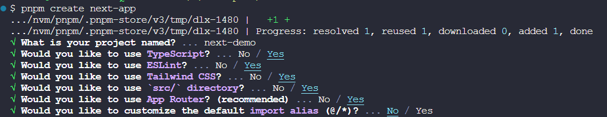

::: tip ✨
搭建一个开箱即用的基于 Next.js + Vant + TailwindCSS + TypeScript 的工程

UI框架以 Vant 为例

[本工程的Github地址](https://github.com/welives/nextjs-starter)
:::

相关文档

- [Next.js](https://www.nextjs.cn/)
- [React-Vant](https://react-vant.3lang.dev/)
- [TailwindCSS](https://tailwind.nodejs.cn/)
- [TypeScript](https://www.tslang.cn/)
- [ESLint](https://eslint.nodejs.cn/)
- [Prettier](https://prettier.nodejs.cn/)

## 事前准备

- Windows 或者 Linux
- VSCode：编辑器
- nodejs：项目运行所需要的基础环境
- git：代码版本控制

## 初始化项目

```sh
pnpm create next-app
```



::: tip
通过上述交互式命令的选项，我们创建了一个带有`ESLint`的基于 Next.js 脚手架的 React 项目
:::

## 配置EditorConfig

新建`.editorconfig`，设置编辑器和 IDE 规范，内容根据自己的喜好或者团队规范

::: code-group

```sh
touch .editorconfig
```

```ini [.editorconfig]
# https://editorconfig.org
root = true

[*]
charset = utf-8
indent_style = space
indent_size = 2
end_of_line = lf
insert_final_newline = true
trim_trailing_whitespace = true

[*.md]
insert_final_newline = false
trim_trailing_whitespace = false
```

:::

## 安装`Prettier`

```sh
pnpm add -D prettier eslint-config-prettier eslint-plugin-prettier
```

新建`.prettierrc`文件，填入自己喜欢的配置

::: code-group

```sh
touch .prettierrc
```

```json [.prettierrc]
{
  "$schema": "https://json.schemastore.org/prettierrc",
  "semi": false,
  "tabWidth": 2,
  "printWidth": 120,
  "singleQuote": true,
  "trailingComma": "es5"
}
```

:::

### `ESLint`和`Prettier`的忽略文件

新建`.eslintignore`和`.prettierignore`文件，填入自己喜欢的配置

::: code-group

```sh
touch .eslintignore
touch .prettierignore
```

```ini [.eslintignore]
.DS_Store
node_modules
dist
.idea
.vscode
.next
```

```ini [.prettierignore]
.DS_Store
node_modules
dist
.idea
.vscode
.next
```

:::

### 在`.eslintrc.js`中集成`prettier`

把默认生成的`.eslintrc.json`改成 JS 文件

```js
module.exports = {
  root: true,
  env: {
    browser: true,
    node: true,
  },
  parserOptions: {
    ecmaVersion: 'latest',
    sourceType: 'module',
  },
  extends: ['next/core-web-vitals', 'prettier', 'plugin:prettier/recommended'],
  plugins: ['prettier'],
  rules: {
    complexity: ['error', 10],
    'prettier/prettier': 'error',
    'no-console': process.env.NODE_ENV === 'production' ? 'warn' : 'off',
    'no-debugger': process.env.NODE_ENV === 'production' ? 'warn' : 'off',
  },
}
```

## 环境变量

关于 Next.js 的环境变量[详细文档看这里](https://www.nextjs.cn/docs/basic-features/environment-variables)

## 使用Vant

```sh
pnpm add react-vant @react-vant/icons
pnpm add -D next-images next-compose-plugins
```

编辑`next.config.js`

```js
const withPlugins = require('next-compose-plugins')
const withImages = require('next-images')
/** @type {import('next').NextConfig} */
const nextConfig = {
  typescript: {
    ignoreBuildErrors: true,
  },
  transpilePackages: ['react-vant'],
}
module.exports = withPlugins([withImages], nextConfig)
```

## 移动端适配

```sh
pnpm add -D postcss-px-to-viewport-8-plugin
```

::: warning ⚡
由于`Vant`使用的设计稿宽度是`375`，而通常情况下，设计师使用的设计稿宽度更多是`750`，那么`Vant`组件在`750`设计稿下会出现样式缩小的问题

解决方案: 当读取的`node_modules`文件是`vant`时，那么就将设计稿宽度变为`375`，读取的文件不是`vant`时，就将设计稿宽度变为`750`
:::

编辑`postcss.config.js`，增加如下`postcss-px-to-viewport-8-plugin`配置项

```js
const path = require('path') // [!code ++]
module.exports = {
  plugins: {
    // [!code focus:8]
    'postcss-px-to-viewport-8-plugin': {
      viewportWidth: (file) => {
        return path.resolve(file).includes(path.join('node_modules', 'react-vant')) ? 375 : 750
      },
      unitPrecision: 6,
      landscapeWidth: 1024,
    },
  },
}
```
