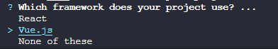
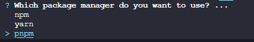
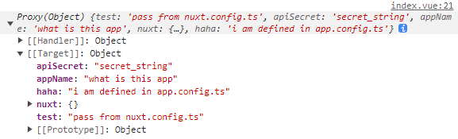
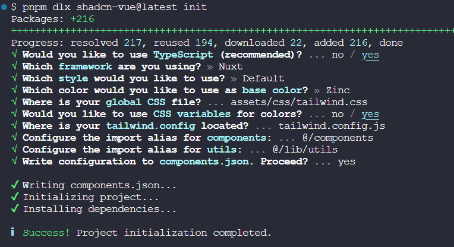

::: tip ✨
搭建一个开箱即用的基于 Nuxt3 + Pinia + TailwindCSS + TypeScript 的工程

[本工程的Github地址](https://github.com/welives/nuxt-starter)

编写此笔记时所使用的`Nuxt`版本为`3.11.2`
:::

## 相关文档

- [Nuxt3](https://nuxt.com.cn/)
- [Pinia](https://pinia.vuejs.org/zh/)
- [pinia-plugin-persistedstate](https://prazdevs.github.io/pinia-plugin-persistedstate/zh/)
- [Shadcn-vue](https://github.com/radix-vue/shadcn-vue)
- [Vant](https://vant-ui.github.io/vant/#/zh-CN)
- [TailwindCSS](https://tailwind.nodejs.cn/)
- [TypeScript](https://www.tslang.cn/)
- [ESLint](https://eslint.nodejs.cn/)
- [Prettier](https://prettier.nodejs.cn/)

## 项目初始化

```sh
pnpm dlx nuxi init
```

::: warning ⚡ 提示

如果安装时报错`Error: Failed to download template from registry: fetch failed`，则给 host 文件添加如下内容

```ini
# Nuxt3
185.199.108.133 raw.githubusercontent.com
185.199.109.133 raw.githubusercontent.com
185.199.110.133 raw.githubusercontent.com
185.199.111.133 raw.githubusercontent.com
```

:::

如果修改 host 还是报错的话，那就去[官方的模板仓库](https://github.com/nuxt/starter) clone 代码，我这里 clone 的是`v3`分支

```sh
git clone -b v3 --single-branch git@github.com:nuxt/starter.git
```

接着安装依赖`pnpm install`

::: tip ⚡ 注意
由于 Nuxt 的官方初始模板缺少了`ESLint`和`Prettier`等配置，所以需要自己手动安装
:::

:::danger 🥧一步到胃
**如果你不想尝试一次手动搭建基础模板的过程，那么也可以直接食用[Nuxt团队的Anthony Fu大佬的模板](https://github.com/antfu-collective/vitesse-nuxt3)**
:::

### 配置EditorConfig

根目录新建`.editorconfig`，填入如下内容

```ini
# https://editorconfig.org
root = true

[*]
charset = utf-8
indent_style = space
indent_size = 2
end_of_line = lf
insert_final_newline = true
trim_trailing_whitespace = true

[*.md]
insert_final_newline = false
trim_trailing_whitespace = false
```

### 安装ESLint和Prettier

::: details ~~这个方案废弃，因为Nuxt官方整了一个ESLint的模块包，看下面~~

- **ESLint**

```sh
npx eslint --init
```

选第二个


选第一个


选 Vue



选`TypeScript`，然后运行环境按`a`全选


`ESLint`配置文件的的保存格式，选第一个


是否立即安装所需的依赖，选 Yes


这里根据项目构建所使用的包管理器进行选择，因为本项目使用`pnpm`，所以选第三个



- **Prettier**

```sh
pnpm add -D prettier eslint-config-prettier eslint-plugin-prettier
```

根目录新建`.prettierrc`文件，填入自己喜欢的配置

```json
{
  "$schema": "https://json.schemastore.org/prettierrc",
  "semi": false,
  "tabWidth": 2,
  "printWidth": 120,
  "singleQuote": true,
  "trailingComma": "all"
}
```

- **ESLint和Prettier的忽略文件**

根目录新建`.eslintignore`和`.prettierignore`文件，填入自己喜欢的配置

```
.DS_Store
node_modules
dist
.idea
.vscode
.nuxt
```

- **在`.eslintrc.js`中集成Prettier**

```js
module.exports = {
  // ...
  extends: [
    // ...
    'prettier', // [!code ++]
    'plugin:prettier/recommended', // [!code ++]
  ],
  parser: 'vue-eslint-parser', // [!code ++]
  plugins: ['@typescript-eslint', 'vue', 'prettier'], // [!code ++]
  rules: {
    complexity: ['error', 10], // [!code ++]
    'prettier/prettier': 'error', // [!code ++]
    'no-console': process.env.NODE_ENV === 'production' ? 'warn' : 'off', // [!code ++]
    'no-debugger': process.env.NODE_ENV === 'production' ? 'warn' : 'off', // [!code ++]
    // ...
  },
}
```

:::

:::: tip ✨Nuxt安装ESLint的新方案，[官方文档看这里](https://eslint.nuxt.com/packages/module)

```sh
pnpm dlx @antfu/eslint-config@latest
pnpm add -D eslint-plugin-format
```

编辑`eslint.config.js`和`nuxt.config.ts`

::: code-group

```js [eslint.config.js]
import antfu from '@antfu/eslint-config'
import withNuxt from './.nuxt/eslint.config.mjs'

export default withNuxt(
  antfu({
    formatters: true,
    typescript: true,
    vue: true,
  })
)
```

```ts{4-8} [nuxt.config.ts]
export default defineNuxtConfig({
  devtools: { enabled: true },
  modules: ['@nuxt/eslint'], // [!code ++]
  eslint: {
    config: {
      standalone: false, // [!code ++]
    },
  },
})
```

:::

Nuxt 官方的这套`eslint-config`是默认禁用`prettier`的，如果你想配合`prettier`一起用的话，就在根目录新建`.prettierrc`，填入自己喜欢的配置

接着编辑`.vscode/settings.json`，把`prettier`启用即可

```json
{
  "prettier.enable": true // [!code hl]
  // ...
}
```

::::

### TypeScript检查

```sh
pnpm add -D typescript vue-tsc
```

编辑`package.json`

```json
{
  "scripts": {
    // ...
    "typecheck": "vue-tsc --noEmit" // [!code ++]
  }
}
```

## 环境变量

关于 Nuxt3 的环境变量详细文档[看这里](https://nuxt.com.cn/docs/getting-started/configuration#%E7%8E%AF%E5%A2%83%E5%8F%98%E9%87%8F%E5%92%8C%E7%A7%81%E6%9C%89%E4%BB%A4%E7%89%8C)

Nuxt 在运行或者打包生产环境时都是使用`dotenv`来加载`.env`文件中的环境变量的

新建`.env`文件，填入项目所需的环境变量。注意，环境变量名必须以`NUXT_`开头，否则不会被识别，例如

```ini
NUXT_APP_NAME=nuxt-starter
NUXT_APP_HOST=localhost
NUXT_APP_PORT=3000
NUXT_API_SECRET=secret_string
```

### 使用

- 在`nuxt.config.ts`中可以通过`runtimeConfig`配置项透传环境变量到应用中

`runtimeConfig`配置项中的`app`和`public`变量被暴露到客户端中，而与它们**平级**的其他变量则只会在服务端可用

```ts{3-11}
export default defineNuxtConfig({
  // ...
  runtimeConfig: {
    apiSecret: process.env.NUXT_API_SECRET,
    app: {
      appName: process.env.NUXT_APP_NAME,
    },
    public: {
      appName: process.env.NUXT_APP_NAME,
    },
  },
})
```

- 在`nuxt.config.ts`中可以通过`appConfig`配置项透传环境变量到应用中

注意，这种方式透传的所有变量都会暴露到客户端中，所以不要把敏感信息放到这里

```ts{3-6}
export default defineNuxtConfig({
  // ...
  appConfig: {
    apiSecret: process.env.NUXT_API_SECRET,
    appName: process.env.NUXT_APP_NAME,
  },
})
```

- 在`app.config.ts`文件中定义全局变量

Nuxt3 会把`nuxt.config.ts`中的`appConfig`配置项合并到`app.config.ts`中，且这里的变量可以在应用的运行生命周期内进行动态更新

::: code-group

```ts{2-4} [app.config.ts]
export default defineAppConfig({
  haha: 'i am defined in app.config.ts',
  apiSecret: undefined,
  appName: 'what is this app',
})
```

```ts{3-7} [nuxt.config.ts]
export default defineNuxtConfig({
  // ...
  appConfig: {
    test: 'pass from nuxt.config.ts',
    apiSecret: process.env.NUXT_API_SECRET,
    appName: process.env.NUXT_APP_NAME,
  },
})
```

:::



::: warning ⚡注意
这个文件有点特别，在这里无法读取到环境变量的值，但可以在这里定义一些有明确初始值的变量。这个文件的作用更像是预先定义一些占位的变量，等待`nuxt.config.ts`中的`appConfig`合并到此，然后在应用运行生命周期内进行修改
:::

## Color-mode

```sh
pnpm add -D @nuxtjs/color-mode
```

编辑`nuxt.config.ts`，添加如下配置

```ts
export default defineNuxtConfig({
  modules: [
    // ...
    '@nuxtjs/color-mode', // [!code ++]
  ],
})
```

## Vueuse

```sh
pnpm add -D @vueuse/nuxt
```

编辑`nuxt.config.ts`，添加如下配置

```ts
export default defineNuxtConfig({
  modules: [
    // ...
    '@vueuse/nuxt', // [!code ++]
  ],
})
```

## PWA

```sh
pnpm add -D @vite-pwa/nuxt
```

编辑`nuxt.config.ts`，添加如下配置

```ts
export default defineNuxtConfig({
  modules: [
    // ...
    '@vite-pwa/nuxt', // [!code ++]
  ],
})
```

## 状态管理

```sh
pnpm add -D pinia @pinia/nuxt
```

编辑`nuxt.config.ts`，在`modules`中增加`@pinia/nuxt`并设置自动导入，指定`stores`目录

```ts
export default defineNuxtConfig({
  modules: [
    // ...
    ['@pinia/nuxt', { autoImports: ['defineStore'] }], // [!code ++]
  ],
  imports: { dirs: ['./stores'] }, // [!code ++]
})
```

### 持久化

```sh
pnpm add -D @pinia-plugin-persistedstate/nuxt
```

编辑`nuxt.config.ts`，添加如下配置

```ts
export default defineNuxtConfig({
  modules: [
    // ...
    '@pinia-plugin-persistedstate/nuxt', // [!code ++]
  ],
})
```

## TailwindCSS

```sh
pnpm add -D @nuxtjs/tailwindcss
```

编辑`nuxt.config.ts`，添加如下配置

```ts
export default defineNuxtConfig({
  modules: [
    // ...
    '@nuxtjs/tailwindcss', // [!code ++]
  ],
})
```

虽然官方文档说这样就行了，`assets/css/tailwind.css`和`tailwind.config.js`这两个文件会在执行`npm run dev`后自动生成到`.nuxt`目录中

但是...在实际使用过程肯定会需要给 TailwindCSS 扩展点内容的，而根据配置文件功能尽量单一的原则，还是建议手动创建这两个文件

- **初始化 TailwindCSS**

```sh
pnpm dlx tailwindcss init
```

在根目录新建`assets/css/tailwind.css`文件，如果缺少相应的文件夹则顺便创建一下，填入如下内容

```css
@tailwind base;
@tailwind components;
@tailwind utilities;
```

编辑`tailwind.config.js`

```js
/** @type {import('tailwindcss').Config} */
export default {
  content: [
    './components/**/*.{vue,jsx,tsx}',
    './layouts/**/*.{vue,jsx,tsx}',
    './pages/**/*.{vue,jsx,tsx}',
    './plugins/**/*.{js,ts}',
    './lib/**/*.{js,ts}',
    './app.{vue,jsx,tsx}',
    './nuxt.config.{js,ts}',
  ],
  corePlugins: {
    preflight: false,
  },
  plugins: [],
}
```

### debug插件

```sh
pnpm add -D tailwindcss-debug-screens
```

编辑`tailwind.config.js`，注册插件

```js{5-8}
/** @type {import('tailwindcss').Config} */
export default {
  // ...
  theme: {
    debugScreens: {
      position: ['bottom', 'right'],
      ignore: ['dark'],
    },
  },

  plugins: [
    process.env.NODE_ENV === 'development' && require('tailwindcss-debug-screens'), // [!code ++]
  ],
}
```

## UI框架

### 使用Shadcn

由于`Shadcn`和`TailwindCSS`是绑定在一起的，所以请务必先安装[TailwindCSS](#tailwindcss)

安装好`TailwindCSS`之后执行如下命令

```sh
pnpm dlx nuxi@latest module add shadcn-nuxt
```

编辑`nuxt.config.ts`，添加如下配置

```ts{6-9}
export default defineNuxtConfig({
  modules: [
    // ...
    'shadcn-nuxt', // [!code ++]
  ],
  shadcn: {
    prefix: '',
    componentDir: './components/ui',
  },
})
```

接着执行命令初始化`Shadcn`

```sh
pnpm dlx shadcn-vue@latest init
```



### 使用Vant

```sh
pnpm add -D vant @vant/nuxt
```

编辑`nuxt.config.ts`，在`modules`中增加`@vant/nuxt`并设置懒加载

```ts
export default defineNuxtConfig({
  modules: [
    // ...
    '@vant/nuxt', // [!code ++]
  ],
  vant: { lazyload: true }, // [!code ++]
})
```

#### 移动端适配 {#mobile-adaptation}

安装所需依赖，此插件的参数配置文档[看这里](https://github.com/lkxian888/postcss-px-to-viewport-8-plugin#readme)

```sh
pnpm add -D postcss-px-to-viewport-8-plugin
```

::: warning ⚡
由于`Vant`使用的设计稿宽度是`375`，而通常情况下，设计师使用的设计稿宽度更多是`750`，那么`Vant`组件在`750`设计稿下会出现样式缩小的问题

解决方案: 当读取的`node_modules`文件是`vant`时，那么就将设计稿宽度变为`375`，读取的文件不是`vant`时，就将设计稿宽度变为`750`
:::

编辑`nuxt.config.ts`文件，增加如下`postcss`配置项

```ts
import path from 'path' // [!code ++]
export default defineNuxtConfig({
  // ... // [!code focus:12]
  postcss: {
    plugins: {
      'postcss-px-to-viewport-8-plugin': {
        viewportWidth: (file: string) => {
          return path.resolve(file).includes(path.join('node_modules', 'vant')) ? 375 : 750
        },
        unitPrecision: 6,
        landscapeWidth: 1024,
      },
    },
  },
})
```

::: tip 🔔
如果通过`exclude: [/node_modules\/vant/i]`直接忽略`Vant`的话，那么`viewportWidth`则可以直接给个固定的值而不是传入函数进行处理
:::
