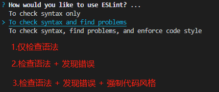

::: tip ✨
搭建一个 Nuxt3 + TailwindCSS + TypeScript + ESLint + Prettier 的工程

UI框架以 Vant 为例

[本工程的Github地址](https://github.com/welives/ts-nuxt-starter)
:::

相关文档

- [Nuxt3](https://nuxt.com.cn/)
- [Vant](https://vant-ui.github.io/vant/#/zh-CN)
- [TypeScript](https://www.tslang.cn/)
- [TailwindCSS](https://tailwind.nodejs.cn/)
- [ESLint](https://eslint.nodejs.cn/)
- [Prettier](https://prettier.nodejs.cn/)

## 事前准备

- Windows 或者 Linux
- VSCode：编辑器
- nodejs：项目运行所需要的基础环境
- git：代码版本控制

## 初始化项目

```sh [pnpm]
pnpm dlx nuxi init
```

::: tip 提示

如果安装时报错`Error: Failed to download template from registry: fetch failed`，则给 host 文件添加如下内容

```ini
# Nuxt3
185.199.108.133 raw.githubusercontent.com
185.199.109.133 raw.githubusercontent.com
185.199.110.133 raw.githubusercontent.com
185.199.111.133 raw.githubusercontent.com
```

:::

如果修改 host 还是报错的话，那就去[官方的模板仓库](https://github.com/nuxt/starter) clone 代码，我这里 clone 的是`v3`分支

```sh
git clone -b v3 --single-branch git@github.com:nuxt/starter.git
```

接着安装依赖`pnpm install`

::: tip 注意
由于 Nuxt 的官方初始模板缺少了`ESLint`和`Prettier`等配置，所以需要自己手动安装
:::

## 配置EditorConfig

新建`.editorconfig`，设置编辑器和 IDE 规范，内容根据自己的喜好或者团队规范

::: code-group

```sh
touch .editorconfig
```

```ini [.editorconfig]
# https://editorconfig.org
root = true

[*]
charset = utf-8
indent_style = space
indent_size = 2
end_of_line = lf
insert_final_newline = true
trim_trailing_whitespace = true

[*.md]
insert_final_newline = false
trim_trailing_whitespace = false
```

:::

## 安装`ESLint`

```sh
npx eslint --init
```

选第二个



选第一个


选 Vue


选`TypeScript`，然后运行环境按`a`全选


`ESLint`配置文件的的保存格式，选第一个


是否立即安装所需的依赖，选 Yes


这里根据项目构建所使用的包管理器进行选择，因为本项目使用`pnpm`，所以选第三个


## 安装`Prettier`

```sh
pnpm add -D prettier eslint-config-prettier eslint-plugin-prettier
```

新建`.prettierrc`文件，填入自己喜欢的配置

::: code-group

```sh
touch .prettierrc
```

```json [.prettierrc]
{
  "$schema": "https://json.schemastore.org/prettierrc",
  "semi": false,
  "tabWidth": 2,
  "printWidth": 120,
  "singleQuote": true,
  "trailingComma": "es5"
}
```

:::

### `ESLint`和`Prettier`的忽略文件

新建`.eslintignore`和`.prettierignore`文件，填入自己喜欢的配置

::: code-group

```sh
touch .eslintignore
touch .prettierignore
```

```ini [.eslintignore]
.DS_Store
node_modules
dist
.idea
.vscode
.nuxt
```

```ini [.prettierignore]
.DS_Store
node_modules
dist
.idea
.vscode
.nuxt
```

:::

### 在`.eslintrc.js`中集成`prettier`

```js
module.exports = {
  // ...
  extends: [
    // ...
    'prettier/@typescript-eslint', // [!code --]
    'prettier', // [!code ++]
    'plugin:prettier/recommended', // [!code ++]
  ],
  plugins: ['@typescript-eslint', 'vue'], // [!code --]
  parser: 'vue-eslint-parser', // [!code ++]
  plugins: ['@typescript-eslint', 'vue', 'prettier'], // [!code ++]
  rules: {
    'prettier/prettier': 'error', // [!code ++]
    'no-console': process.env.NODE_ENV === 'production' ? 'warn' : 'off', // [!code ++]
    'no-debugger': process.env.NODE_ENV === 'production' ? 'warn' : 'off', // [!code ++]
    // ...
  },
}
```

## 安装TailwindCSS

TailwindCSS 已经被 Nuxt 官方集成，所以安装起来非常简单，只需要安装`@nuxtjs/tailwindcss`即可

```sh
pnpm add -D @nuxtjs/tailwindcss
npx tailwindcss init
```

在项目根目录下新建`./assets/css/tailwind.css`文件，如果缺少相应的文件夹则顺便创建一下，填入如下内容

```css
@tailwind base;
@tailwind components;
@tailwind utilities;
```

编辑`tailwind.config.js`，在`content`中增加如下内容

```js
/** @type {import('tailwindcss').Config} */
export default {
  content: [
    './components/**/*.{vue,jsx,tsx}', // [!code ++]
    './layouts/**/*.{vue,jsx,tsx}', // [!code ++]
    './pages/**/*.{vue,jsx,tsx}', // [!code ++]
    './app.{vue,jsx,tsx}', // [!code ++]
    './plugins/**/*.{js,ts}', // [!code ++]
    './nuxt.config.{js,ts}', // [!code ++]
  ],
  // ...
}
```

编辑`nuxt.config.ts`，增加如下配置

```ts
export default defineNuxtConfig({
  // ...
  modules: ['@nuxtjs/tailwindcss'], // [!code ++]
})
```

## 安装`pinia`

pinia 同样也被 Nuxt 官方集成了

```sh
pnpm add pinia @pinia/nuxt
```

编辑`nuxt.config.ts`，在`modules`中增加`@pinia/nuxt`并设置自动导入，指定`stores`目录

```ts
export default defineNuxtConfig({
  // ...
  modules: [['@pinia/nuxt', { autoImports: ['defineStore'] }]], // [!code ++]
  imports: { dirs: ['./stores'] }, // [!code ++]
})
```

## 配置环境变量

关于 Nuxt3 的环境变量详细文档[看这里](https://nuxt.com.cn/docs/getting-started/configuration#%E7%8E%AF%E5%A2%83%E5%8F%98%E9%87%8F%E5%92%8C%E7%A7%81%E6%9C%89%E4%BB%A4%E7%89%8C)

Nuxt 在运行或者打包生产环境时都是使用`dotenv`来加载`.env`文件中的环境变量的

新建`.env`文件，填入项目所需的环境变量。注意，环境变量名必须以`NUXT_`开头，否则不会被识别，例如

```ini
NUXT_APP_NAME=ts-vant-starter
NUXT_APP_HOST=localhost
NUXT_APP_PORT=3000
NUXT_API_SECRET=secret_string
```

### 使用环境变量

- 在`nuxt.config.ts`中通过`runtimeConfig`配置项透传环境变量到应用中

`runtimeConfig`配置项中的`app`和`public`变量被暴露到客户端中，而与它们**平级**的其他变量则只会在服务端可用

```ts
export default defineNuxtConfig({
  // ...
  runtimeConfig: {
    apiSecret: process.env.NUXT_API_SECRET,
    app: {
      appName: process.env.NUXT_APP_NAME,
    },
    public: {
      appName: process.env.NUXT_APP_NAME,
    },
  },
})
```

- 在`nuxt.config.ts`中通过`appConfig`配置项透传环境变量到应用中

注意，这种方式透传的所有变量都会暴露到客户端中，所以不要把敏感信息放到这里

```ts
export default defineNuxtConfig({
  // ...
  appConfig: {
    apiSecret: process.env.NUXT_API_SECRET,
    appName: process.env.NUXT_APP_NAME,
  },
})
```

- 在`app.config.ts`文件中定义全局变量

Nuxt3 会把`nuxt.config.ts`中的`appConfig`配置项合并到`app.config.ts`中，且这里的变量可以在应用的运行生命周期内进行动态更新

::: code-group

```ts [app.config.ts]
export default defineAppConfig({
  haha: 'i am defined in app.config.ts',
  apiSecret: undefined,
  appName: 'what is this app',
})
```

```ts [nuxt.config.ts]
export default defineNuxtConfig({
  // ...
  appConfig: {
    test: 'pass from nuxt.config.ts',
    apiSecret: process.env.NUXT_API_SECRET,
    appName: process.env.NUXT_APP_NAME,
  },
})
```

:::


::: warning 注意
这个文件有点特别，在这里无法读取到环境变量的值，但可以在这里定义一些有明确初始值的变量。这个文件的作用更像是预先定义一些占位的变量，等待`nuxt.config.ts`中的`appConfig`合并到此，然后在应用运行生命周期内进行修改
:::

::: tip 到这里，基于 Nuxt3 的 Vant 基础项目模板就搭建完成了
:::

## 使用Vant作为UI库

Vant 同样也被 Nuxt 官方集成了

```sh
pnpm add -D vant @vant/nuxt
```

编辑`nuxt.config.ts`，在`modules`中增加`@vant/nuxt`并设置懒加载

```ts
export default defineNuxtConfig({
  modules: ['@vant/nuxt'], // [!code ++]
  vant: { lazyload: true }, // [!code ++]
})
```

## 移动端适配 {#mobile-adaptation}

安装所需依赖，此插件的参数配置文档[看这里](https://github.com/lkxian888/postcss-px-to-viewport-8-plugin#readme)

```sh
pnpm add -D postcss-px-to-viewport-8-plugin
```

::: warning ⚡
由于`Vant`使用的设计稿宽度是`375`，而通常情况下，设计师使用的设计稿宽度更多是`750`，那么`Vant`组件在`750`设计稿下会出现样式缩小的问题

解决方案: 当读取的`node_modules`文件是`vant`时，那么就将设计稿宽度变为`375`，读取的文件不是`vant`时，就将设计稿宽度变为`750`
:::

编辑`nuxt.config.ts`文件，增加如下`postcss`配置项

```ts{4-15}
import path from 'path' // [!code ++]
export default defineNuxtConfig({
  // ...
  postcss: {
    plugins: {
      'postcss-px-to-viewport-8-plugin': {
        viewportWidth: (file: string) => {
          return path.resolve(file).includes(path.join('node_modules', 'vant')) ? 375 : 750
        },
        unitPrecision: 6,
        landscapeWidth: 1024
        // exclude: [/node_modules\/vant/i]
      }
    }
  }
})
```

::: tip 🔔
如果通过`exclude: [/node_modules\/vant/i]`直接忽略`Vant`的话，那么`viewportWidth`则可以直接给个固定的值而不是传入函数进行处理
:::
