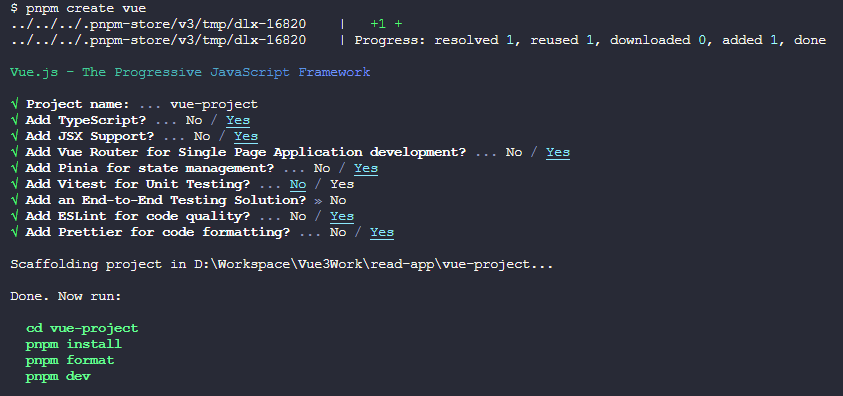
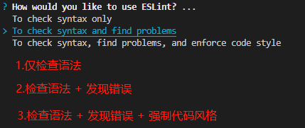
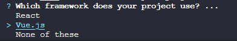
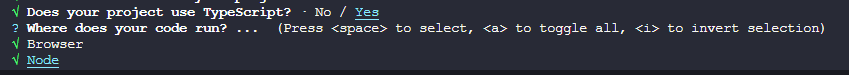
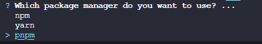

::: tip 目标
搭建一个 Vant + TailwindCSS + TypeScript + ESLint + Prettier 的工程
:::

相关文档

- [Vant](https://vant-ui.github.io/vant/#/zh-CN)
- [TypeScript](https://www.tslang.cn/)
- [Vite](https://cn.vitejs.dev/)
- [Nuxt3](https://nuxt.com.cn/)
- [TailwindCSS](https://tailwind.nodejs.cn/)
- [ESLint](https://eslint.nodejs.cn/)
- [Prettier](https://prettier.nodejs.cn/)

## 事前准备

- Windows 或者 Linux
- VSCode：编辑器
- nodejs：项目运行所需要的基础环境
- git：代码版本控制

## 使用Vite初始化项目

::: code-group

```sh [pnpm]
pnpm create vue
```

```sh [yarn]
yarn create vue
```

:::



然后按照提示操作即可，这样一个基础项目就创建好了

### 初始化`git`

```sh
git init
```

### 配置EditorConfig

新建`.editorconfig`，设置编辑器和 IDE 规范，内容根据自己的喜好或者团队规范

```ini
# https://editorconfig.org
root = true

[*]
charset = utf-8
indent_style = space
indent_size = 2
end_of_line = lf
insert_final_newline = true
trim_trailing_whitespace = true

[*.md]
insert_final_newline = false
trim_trailing_whitespace = false
```

### `EsLint`和`Prettier`的忽略文件

新建`.eslintignore`和`.prettierignore`文件，并写入如下配置，可以根据自己喜好进行调整

::: code-group

```ini [.eslintignore]
.DS_Store
node_modules
dist
.idea
.vscode
.nuxt
```

```ini [.prettierignore]
.DS_Store
node_modules
dist
.idea
.vscode
.nuxt
*.md
*.json
```

:::

### 安装TailwindCSS {#vite-install-tailwindcss}

安装依赖

```sh
pnpm add -D tailwindcss postcss autoprefixer
npx tailwindcss init -p
```

编辑`tailwind.config.js`

```js{2-7,9,11-13}
/** @type {import('tailwindcss').Config} */
const colors = require('tailwindcss/colors')
delete colors.lightBlue
delete colors.warmGray
delete colors.trueGray
delete colors.coolGray
delete colors.blueGray
export default {
  content: ['./index.html', './src/**/*.{vue,js,ts,jsx,tsx}'],
  theme: {
    colors: {
      ...colors
    },
    extend: {}
  },
  plugins: []
}
```

编辑`/src/assets/main.css`，增加如下内容

```css
@tailwind base; // [!code ++]
@tailwind components; // [!code ++]
@tailwind utilities; // [!code ++]
```

### 安装Vant {#vite-install-vant}

```sh
pnpm add vant
```

#### 给Vant配置按需引入

安装依赖

```sh
pnpm add -D @vant/auto-import-resolver unplugin-vue-components
```

修改`vite.config.js`

```js
import { fileURLToPath, URL } from 'node:url'
import { defineConfig } from 'vite'
import vue from '@vitejs/plugin-vue'
import vueJsx from '@vitejs/plugin-vue-jsx'
import Components from 'unplugin-vue-components/vite' // [!code ++]
import { VantResolver } from '@vant/auto-import-resolver' // [!code ++]

// https://vitejs.dev/config/
export default defineConfig({
  plugins: [vue(), vueJsx(), Components({ resolvers: [VantResolver()] })], // [!code hl]
  resolve: {
    alias: {
      '~': fileURLToPath(new URL('./src', import.meta.url))
    }
  }
})
```

这样就完成了 Vant 的按需引入，就可以直接在模板中使用 Vant 组件了，`unplugin-vue-components`会解析模板并自动注册对应的组件，`@vant/auto-import-resolver`会自动引入对应的组件样式

到这里，基于 Vite 的 Vant 基础项目模板就搭建完成了

## 使用Nuxt3初始化项目

::: code-group

```sh [pnpm]
pnpm dlx nuxi init
```

```sh [npx]
npx nuxi init
```

:::

::: tip 提示

如果安装时报错`Error: Failed to download template from registry: fetch failed`，则给 host 文件添加如下内容

```ini
# Nuxt3
185.199.108.133 raw.githubusercontent.com
185.199.109.133 raw.githubusercontent.com
185.199.110.133 raw.githubusercontent.com
185.199.111.133 raw.githubusercontent.com
```

:::

如果修改 host 还是报错的话，那就去[官方的模板仓库](https://github.com/nuxt/starter) clone 代码，我这里 clone 的是`v3`分支

```sh
git clone -b v3 --single-branch git@github.com:nuxt/starter.git
```

接着安装依赖`pnpm install`

::: tip 注意
由于 Nuxt 的官方初始模板缺少了`EsLint`和`Prettier`等配置，所以需要自己手动安装

EditorConfig [参考上面Vite的配置](#配置editorconfig)
:::

### 安装`EsLint`

```sh
npx eslint --init
```

选第二个



选第一个


选 Vue



选`TypeScript`，然后运行环境按`a`全选



`eslint`配置文件的的保存格式，选第一个


是否立即安装所需的依赖，选 Yes


这里根据项目构建所使用的包管理器进行选择，因为本项目使用`pnpm`，所以选第三个



::: tip
`EsLint`和`Prettier`的忽略文件[参考上面Vite的配置](#eslint和prettier的忽略文件)
:::

### 安装`Prettier`

```sh
pnpm add -D prettier eslint-config-prettier eslint-plugin-prettier
```

新建`.prettierrc`文件，并写入如下配置，可以根据自己喜好进行调整

```json
{
  "$schema": "https://json.schemastore.org/prettierrc",
  "semi": false,
  "tabWidth": 2,
  "printWidth": 120,
  "singleQuote": true,
  "trailingComma": "all"
}
```

新建`.prettierignore`文件，并写入如下配置，可以根据自己喜好进行调整

#### 在`.eslintrc.js`中集成`prettier`

```js
module.exports = {
  // ...
  extends: [
    // ...
    'prettier', // [!code ++]
    'prettier/@typescript-eslint' // [!code ++]
  ],
  plugins: ['@typescript-eslint', 'vue', 'prettier'], // [!code hl]
  rules: {
    'prettier/prettier': 'error', // [!code ++]
    'no-console': process.env.NODE_ENV === 'production' ? 'warn' : 'off', // [!code ++]
    'no-debugger': process.env.NODE_ENV === 'production' ? 'warn' : 'off' // [!code ++]
    // ...
  }
}
```

### 安装TailwindCSS {#nuxt-install-tailwindcss}

TailwindCSS 已经被 Nuxt 官方集成，所以安装起来非常简单，只需要安装`@nuxtjs/tailwindcss`即可

```sh
pnpm add -D @nuxtjs/tailwindcss
npx tailwindcss init
```

在项目根目录下新建`./assets/css/tailwind.css`文件，如果缺少相应的文件夹则顺便创建一下，填入如下内容

```css
@tailwind base;
@tailwind components;
@tailwind utilities;
```

编辑`tailwind.config.js`

```js{4-9}
/** @type {import('tailwindcss').Config} */
export default {
  content: [
    './components/**/*.{js,vue,ts}',
    './layouts/**/*.vue',
    './pages/**/*.vue',
    './plugins/**/*.{js,ts}',
    './nuxt.config.{js,ts}',
    './app.vue'
  ],
  theme: {
    extend: {}
  },
  plugins: []
}
```

编辑`nuxt.config.ts`，增加如下配置

```ts
export default defineNuxtConfig({
  // ...
  modules: ['@nuxtjs/tailwindcss'] // [!code ++]
})
```

### 安装Vant {#nuxt-install-vant}

Vant 同样也被 Nuxt 官方集成了

```sh
pnpm add -D vant @vant/nuxt
```

编辑`nuxt.config.ts`，在`modules`中增加`@vant/nuxt`并设置懒加载

```ts
export default defineNuxtConfig({
  // ...
  modules: ['@nuxt/devtools', '@nuxtjs/tailwindcss', '@vant/nuxt'], // [!code hl]
  vant: { lazyload: true } // [!code ++]
})
```

到这里，基于 Nuxt3 的 Vant 基础项目模板就搭建完成了
