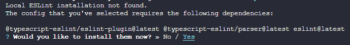
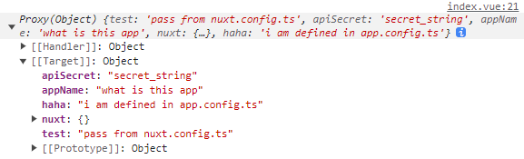

::: tip 目标
搭建一个 Vant + TailwindCSS + TypeScript + ESLint + Prettier 的工程
:::

相关文档

- [Vant](https://vant-ui.github.io/vant/#/zh-CN)
- [TypeScript](https://www.tslang.cn/)
- [Vite](https://cn.vitejs.dev/)
- [Nuxt3](https://nuxt.com.cn/)
- [TailwindCSS](https://tailwind.nodejs.cn/)
- [ESLint](https://eslint.nodejs.cn/)
- [Prettier](https://prettier.nodejs.cn/)

## 事前准备

- Windows 或者 Linux
- VSCode：编辑器
- nodejs：项目运行所需要的基础环境
- git：代码版本控制

## 使用Vite初始化项目

::: code-group

```sh [pnpm]
pnpm create vue
```

```sh [yarn]
yarn create vue
```

:::


然后按照提示操作即可，这样一个基础项目就创建好了。

可以看到，通过上述交互式命令的选项，我们创建了一个带有`vue-router`、`pinia`、`EsLint`和`Prettier`的基于 Vite 脚手架的 Vue 项目

### 初始化`git`

```sh
git init
```

### 配置EditorConfig

新建`.editorconfig`，设置编辑器和 IDE 规范，内容根据自己的喜好或者团队规范

```ini
# https://editorconfig.org
root = true

[*]
charset = utf-8
indent_style = space
indent_size = 2
end_of_line = lf
insert_final_newline = true
trim_trailing_whitespace = true

[*.md]
insert_final_newline = false
trim_trailing_whitespace = false
```

### `EsLint`和`Prettier`的忽略文件

新建`.eslintignore`和`.prettierignore`文件，并写入如下配置，可以根据自己喜好进行调整

::: code-group

```ini [.eslintignore]
.DS_Store
node_modules
dist
.idea
.vscode
.nuxt
```

```ini [.prettierignore]
.DS_Store
node_modules
dist
.idea
.vscode
.nuxt
```

:::

### 安装TailwindCSS {#vite-install-tailwindcss}

安装依赖

```sh
pnpm add -D tailwindcss postcss autoprefixer
npx tailwindcss init -p
```

编辑`tailwind.config.js`

```js{2-7,9,11}
/** @type {import('tailwindcss').Config} */
const colors = require('tailwindcss/colors')
delete colors.lightBlue
delete colors.warmGray
delete colors.trueGray
delete colors.coolGray
delete colors.blueGray
export default {
  content: ['./index.html', './src/**/*.{vue,js,ts,jsx,tsx}'],
  theme: {
    colors: { ...colors },
    extend: {}
  },
  // ...
}
```

编辑`/src/assets/main.css`，增加如下内容

```css
@tailwind base; // [!code ++]
@tailwind components; // [!code ++]
@tailwind utilities; // [!code ++]
```

### 安装Vant {#vite-install-vant}

```sh
pnpm add vant
```

#### 给Vant配置按需引入

安装依赖

```sh
pnpm add -D @vant/auto-import-resolver unplugin-vue-components
```

编辑`vite.config.js`，在`plugins`中增加`Components({ resolvers: [VantResolver()] })`

```js
// ...
import Components from 'unplugin-vue-components/vite' // [!code ++]
import { VantResolver } from '@vant/auto-import-resolver' // [!code ++]

export default defineConfig(({ mode }) => {
  return {
    // ..
    plugins: [vue(), vueJsx(), Components({ resolvers: [VantResolver()] })], // [!code hl]
  }
})
```

这样就完成了 Vant 的按需引入，就可以直接在模板中使用 Vant 组件了，`unplugin-vue-components`会解析模板并自动注册对应的组件，`@vant/auto-import-resolver`会自动引入对应的组件样式

### 配置环境变量 {#vite-env}

关于 Vite 的环境变量详细文档[看这里](https://cn.vitejs.dev/guide/env-and-mode.html#env-files)

新建`.env.local`文件，填入项目所需的环境变量。注意，环境变量名必须以`VITE_`开头，否则不会被识别，例如

```ini
VITE_APP_NAME=ts-vant-starter
VITE_APP_HOST=localhost
VITE_APP_PORT=5173
VITE_API_SECRET=secret_string
```

编辑`env.d.ts`，给自定义的环境变量添加类型

```ts
/// <reference types="vite/client" />

interface ImportMetaEnv {
  readonly VITE_APP_NAME: string
  readonly VITE_APP_HOST: string
  readonly VITE_APP_PORT: string
  readonly VITE_API_SECRET: string
  // 更多环境变量...
}

interface ImportMeta {
  readonly env: ImportMetaEnv
}
```

#### 使用环境变量 {#vite-use-env}

vite 脚手架规定了`src`目录下的文件属于浏览器环境，而`vite.config.ts`文件属于 Node 环境，所以在使用上有点区别

- 在`src`目录下的文件中，通过`import.meta.env`读取环境变量
- 在`vite.config.ts`文件中，通过`loadEnv`方法读取环境变量

```ts
// ...
import { defineConfig, loadEnv } from 'vite' // [!code hl]
export default defineConfig(({ mode }) => {
  const env = loadEnv(mode, process.cwd()) // [!code ++]
  // ...
})
```

::: tip 到这里，基于 Vite 的 Vant 基础项目模板就搭建完成了
:::

## 使用Nuxt3初始化项目

::: code-group

```sh [pnpm]
pnpm dlx nuxi init
```

```sh [npx]
npx nuxi init
```

:::

::: tip 提示

如果安装时报错`Error: Failed to download template from registry: fetch failed`，则给 host 文件添加如下内容

```ini
# Nuxt3
185.199.108.133 raw.githubusercontent.com
185.199.109.133 raw.githubusercontent.com
185.199.110.133 raw.githubusercontent.com
185.199.111.133 raw.githubusercontent.com
```

:::

如果修改 host 还是报错的话，那就去[官方的模板仓库](https://github.com/nuxt/starter) clone 代码，我这里 clone 的是`v3`分支

```sh
git clone -b v3 --single-branch git@github.com:nuxt/starter.git
```

接着安装依赖`pnpm install`

::: tip 注意
由于 Nuxt 的官方初始模板缺少了`EsLint`和`Prettier`等配置，所以需要自己手动安装

EditorConfig [参考上面Vite的配置](#配置editorconfig)
:::

### 安装`EsLint`

```sh
npx eslint --init
```

选第二个


选第一个


选 Vue


选`TypeScript`，然后运行环境按`a`全选


`eslint`配置文件的的保存格式，选第一个


是否立即安装所需的依赖，选 Yes



这里根据项目构建所使用的包管理器进行选择，因为本项目使用`pnpm`，所以选第三个


::: tip
`EsLint`和`Prettier`的忽略文件[参考上面Vite的配置](#eslint和prettier的忽略文件)
:::

### 安装`Prettier`

```sh
pnpm add -D prettier eslint-config-prettier eslint-plugin-prettier
```

新建`.prettierrc`文件，并写入如下配置，可以根据自己喜好进行调整

```json
{
  "$schema": "https://json.schemastore.org/prettierrc",
  "semi": false,
  "tabWidth": 2,
  "printWidth": 120,
  "singleQuote": true,
  "trailingComma": "es5"
}
```

新建`.prettierignore`文件，并写入如下配置，可以根据自己喜好进行调整

#### 在`.eslintrc.js`中集成`prettier`

```js
module.exports = {
  // ...
  extends: [
    // ...
    'prettier', // [!code ++]
    'prettier/@typescript-eslint', // [!code ++]
  ],
  plugins: ['@typescript-eslint', 'vue', 'prettier'], // [!code hl]
  rules: {
    'prettier/prettier': 'error', // [!code ++]
    'no-console': process.env.NODE_ENV === 'production' ? 'warn' : 'off', // [!code ++]
    'no-debugger': process.env.NODE_ENV === 'production' ? 'warn' : 'off', // [!code ++]
    // ...
  },
}
```

### 安装TailwindCSS {#nuxt-install-tailwindcss}

TailwindCSS 已经被 Nuxt 官方集成，所以安装起来非常简单，只需要安装`@nuxtjs/tailwindcss`即可

```sh
pnpm add -D @nuxtjs/tailwindcss
npx tailwindcss init
```

在项目根目录下新建`./assets/css/tailwind.css`文件，如果缺少相应的文件夹则顺便创建一下，填入如下内容

```css
@tailwind base;
@tailwind components;
@tailwind utilities;
```

编辑`tailwind.config.js`，在`content`中增加如下内容

```js{4-9}
/** @type {import('tailwindcss').Config} */
export default {
  content: [
    './components/**/*.{js,vue,ts}',
    './layouts/**/*.vue',
    './pages/**/*.vue',
    './plugins/**/*.{js,ts}',
    './nuxt.config.{js,ts}',
    './app.vue'
  ],
  // ...
}
```

编辑`nuxt.config.ts`，增加如下配置

```ts
export default defineNuxtConfig({
  // ...
  modules: ['@nuxtjs/tailwindcss'], // [!code ++]
})
```

### 安装`pinia`

pinia 同样也被 Nuxt 官方集成了

```sh
pnpm add pinia @pinia/nuxt
```

编辑`nuxt.config.ts`，在`modules`中增加`@pinia/nuxt`并设置自动导入，指定`stores`目录

```ts
export default defineNuxtConfig({
  // ...
  modules: [
    // ...
    ['@pinia/nuxt', { autoImports: ['defineStore'] }], // [!code ++]
  ],
  imports: { dirs: ['./stores'] }, // [!code ++]
})
```

### 安装Vant {#nuxt-install-vant}

Vant 同样也被 Nuxt 官方集成了

```sh
pnpm add -D vant @vant/nuxt
```

编辑`nuxt.config.ts`，在`modules`中增加`@vant/nuxt`并设置懒加载

```ts
export default defineNuxtConfig({
  // ...
  modules: ['@nuxt/devtools', '@nuxtjs/tailwindcss', '@vant/nuxt'], // [!code hl]
  vant: { lazyload: true }, // [!code ++]
})
```

### 配置环境变量 {#nuxt-env}

关于 Nuxt3 的环境变量详细文档[看这里](https://nuxt.com.cn/docs/getting-started/configuration#%E7%8E%AF%E5%A2%83%E5%8F%98%E9%87%8F%E5%92%8C%E7%A7%81%E6%9C%89%E4%BB%A4%E7%89%8C)

Nuxt 在运行或者打包生产环境时都是使用`dotenv`来加载`.env`文件中的环境变量的

新建`.env`文件，填入项目所需的环境变量。注意，环境变量名必须以`NUXT_`开头，否则不会被识别，例如

```ini
NUXT_APP_NAME=ts-vant-starter
NUXT_APP_HOST=localhost
NUXT_APP_PORT=3000
NUXT_API_SECRET=secret_string
```

#### 使用环境变量 {#nuxt-use-env}

- 在`nuxt.config.ts`中通过`runtimeConfig`配置项透传环境变量到应用中

`runtimeConfig`配置项中的`app`和`public`变量被暴露到客户端中，而与它们**平级**的其他变量则只会在服务端可用

```ts
export default defineNuxtConfig({
  // ...
  runtimeConfig: {
    apiSecret: process.env.NUXT_API_SECRET,
    app: {
      appName: process.env.NUXT_APP_NAME,
    },
    public: {
      appName: process.env.NUXT_APP_NAME,
    },
  },
})
```

- 在`nuxt.config.ts`中通过`appConfig`配置项透传环境变量到应用中

注意，这种方式透传的所有变量都会暴露到客户端中，所以不要把敏感信息放到这里

```ts
export default defineNuxtConfig({
  // ...
  appConfig: {
    apiSecret: process.env.NUXT_API_SECRET,
    appName: process.env.NUXT_APP_NAME,
  },
})
```

- 在`app.config.ts`文件中定义全局变量

Nuxt3 会把`nuxt.config.ts`中的`appConfig`配置项合并到`app.config.ts`中，且这里的变量可以在应用的运行生命周期内进行动态更新

::: code-group

```ts [app.config.ts]
export default defineAppConfig({
  haha: 'i am defined in app.config.ts',
  apiSecret: undefined,
  appName: 'what is this app',
})
```

```ts [nuxt.config.ts]
export default defineNuxtConfig({
  // ...
  appConfig: {
    test: 'pass from nuxt.config.ts',
    apiSecret: process.env.NUXT_API_SECRET,
    appName: process.env.NUXT_APP_NAME,
  },
})
```

:::



::: warning 注意
这个文件有点特别，在这里无法读取到环境变量的值，但可以在这里定义一些有明确初始值的变量。这个文件的作用更像是预先定义一些占位的变量，等待`nuxt.config.ts`中的`appConfig`合并到此，然后在应用运行生命周期内进行修改
:::

::: tip 到这里，基于 Nuxt3 的 Vant 基础项目模板就搭建完成了
:::

## 移动端适配 {#mobile-adaptation}

安装所需依赖，此插件的参数配置文档[看这里](https://github.com/lkxian888/postcss-px-to-viewport-8-plugin#readme)

```sh
pnpm add -D postcss-px-to-viewport-8-plugin
```

由于`Vant`使用的设计稿宽度是`375`，而通常情况下，设计师使用的设计稿宽度更多是`750`，那么`Vant`组件在`750`设计稿下会出现样式缩小的问题

解决方案: 当读取的`node_modules`文件是`vant`时，那么就将设计稿宽度变为`375`，读取的文件不是`vant`时，就将设计稿宽度变为`750`

### 在 Vite 中使用

- 方式一：编辑`postcss.config.js`，增加如下`postcss-px-to-viewport-8-plugin`配置项

```js
import path from 'path' // [!code ++]

export default {
  plugins: {
    // ...
    'postcss-px-to-viewport-8-plugin': {
      viewportWidth: (file) => {
        return path.resolve(file).includes(path.join('node_modules', 'vant')) ? 375 : 750
      },
      unitPrecision: 6,
      landscapeWidth: 1024,
      // exclude: [/node_modules\/vant/i]
    },
  },
}
```

- 方式二：编辑`vite.config.ts`，增加如下`css`配置项

```ts{8-21}
// ...
import path from 'path' // [!code ++]
import postcsspxtoviewport8plugin from 'postcss-px-to-viewport-8-plugin' // [!code ++]

export default defineConfig(({ mode }) => {
  return {
    // ...
    css: {
      postcss: {
        plugins: [
          postcsspxtoviewport8plugin({
            viewportWidth: (file) => {
              return path.resolve(file).includes(path.join('node_modules', 'vant')) ? 375 : 750
            },
            unitPrecision: 6,
            landscapeWidth: 1024
            // exclude: [/node_modules\/vant/i]
          })
        ]
      }
    }
  }
})
```

### 在 Nuxt3 中使用

编辑`nuxt.config.ts`文件，增加如下`postcss`配置项

```ts{4-15}
import path from 'path' // [!code ++]
export default defineNuxtConfig({
  // ...
  postcss: {
    plugins: {
      'postcss-px-to-viewport-8-plugin': {
        viewportWidth: (file: string) => {
          return path.resolve(file).includes(path.join('node_modules', 'vant')) ? 375 : 750
        },
        unitPrecision: 6,
        landscapeWidth: 1024
        // exclude: [/node_modules\/vant/i]
      }
    }
  }
})
```

::: tip 提示
如果通过`exclude: [/node_modules\/vant/i]`直接忽略`Vant`的话，那么`viewportWidth`则可以直接给个固定的值而不是传入函数进行处理
:::
