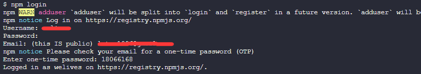

::: tip ⚡ 记一次开发 VitePress 代码演示功能插件的经历

此插件项目是一个使用 pnpm + workspace + changesets 构建的单仓库多项目的 monorepo 工程

涉及到的技术有 Vite 虚拟模块、手动管理 HMR 热更新、`markdown-it`自定义渲染 和 `unified`+`remark` 解析 markdown

**实现原理：利用 Vite 插件的`transform`钩子读取 markdown 内容，使用 `unified`+`remark` 解析出自定义 markdown 容器中的代码块，然后将代码块转换为虚拟模块，最后是使用`markdown-it`对虚拟模块进行自定义渲染**

[项目地址](https://github.com/welives/vitepress-code-preview)
:::

## 相关文档

- [pnpm](https://pnpm.io/zh/)
- [changesets](https://github.com/changesets/changesets)
- [Vite](https://cn.vitejs.dev/)
- [VitePress](https://vitepress.dev/)
- [Vue](https://cn.vuejs.org/guide/introduction.html)
- [markdown-it](https://github.com/markdown-it/markdown-it)
- [markdown-it-container](https://github.com/markdown-it/markdown-it-container)
- [unified](https://github.com/unifiedjs/unified)
- [remark](https://remark.js.org/)
  - [remark-parse](https://github.com/remarkjs/remark/tree/main/packages/remark-parse)
  - [remark-stringify](https://github.com/remarkjs/remark/tree/main/packages/remark-stringify)
  - [remark-frontmatter](https://github.com/remarkjs/remark-frontmatter)
- [floating-ui](https://github.com/floating-ui/floating-ui)

## Rollup钩子生命周期

由于 Vite 的插件钩子函数扩展自 Rollup，所以在开始构建项目前，先来看一看 Rollup 的钩子生命周期

- `async`：钩子还可以返回解析为相同类型值的 Promise； 否则，该钩子标记为 `sync`
- `first`：如果多个插件实现此钩子，则钩子将按顺序运行，直到钩子返回 `null` 或 `undefined` 以外的值
- `sequential`：如果多个插件实现了此钩子，则所有插件都将按照指定的插件顺序运行。如果某个钩子是 `async`，则此类后续钩子将等待，直到当前钩子被解析
- `parallel`：如果多个插件实现了此钩子，则所有插件都将按照指定的插件顺序运行。 如果一个钩子是 `async`，则后续的此类钩子将并行运行，而不等待当前的钩子


## 项目初始化

::: code-group

```sh [init]
# 创建项目的根目录
mkdir code-preview && cd code-preview
git init
touch .gitignore
touch .editorconfig
# 示例项目的目录
mkdir docs
# 插件项目目录
mkdir packages/plugin -p
# 演示代码运行所需的容器组件项目
mkdir packages/container

```

```txt [.gitignore]
dist
node_modules
docs/.vitepress/cache
docs/.vitepress/dist
.DS_Store

# Logs
logs
*.log
npm-debug.log*
yarn-debug.log*
yarn-error.log*

# Windows shortcuts
*.lnk
```

```ini [.editorconfig]
# http://editorconfig.org
root = true

[*]
indent_style = space
indent_size = 2
end_of_line = lf
charset = utf-8
trim_trailing_whitespace = true
insert_final_newline = true

[*.md]
trim_trailing_whitespace = false

[Makefile]
indent_style = tab
```

:::

### pnpm初始化

```sh
pnpm init
# 声明工作空间
touch pnpm-workspace.yaml
```

编辑`pnpm-workspace.yaml`，把上面创建的几个目录添加进去

```yaml
packages:
  - 'docs'
  - 'packages/*'
```

接着再编辑`package.json`，把主项目的名称改为`vitepress-code-preview`，以及添加如下内容

```json
{
  "name": "vitepress-code-preview",
  // ...
  "workspaces": ["docs", "packages/*"],
  "scripts": {
    // 表示此项目只允许使用 pnpm
    "preinstall": "npx only-allow pnpm"
  },
  // 包管理器的版本根据自己的情况修改
  "packageManager": "pnpm@8.10.0",
  "engines": {
    "node": ">= 16"
  }
}
```

### TS环境初始化

因为当前已经转变为`workspace`工作空间，所以在主项目下安装依赖时需要加一个`-w`参数

::: code-group

```sh
pnpm add -wD typescript @types/node
npx tsc --init
```

```json [tsconfig.json]
{
  "compilerOptions": {
    "module": "esnext",
    "target": "esnext",
    "jsx": "preserve",
    "moduleResolution": "node",
    "strict": true,
    "sourceMap": true,
    "allowJs": true,
    "declaration": true,
    "skipLibCheck": true,
    "resolveJsonModule": true,
    "noUnusedLocals": true,
    "strictNullChecks": true,
    "esModuleInterop": true,
    "forceConsistentCasingInFileNames": true
  },
  "exclude": ["dist", "node_modules"]
}
```

:::

### ESLint初始化

由于 ESLint 的问题，无法传递`-w`参数给 pnpm 会导致初始化时依赖安装失败，所以改成手动安装相关依赖。当然你也可以先进行 ESLint 的初始化，然后再将项目改为`workspace`工作空间。

```sh
npx eslint --init
pnpm add -wD eslint @typescript-eslint/parser @typescript-eslint/eslint-plugin eslint-plugin-vue
```

### Prettier初始化

::: code-group

```sh
pnpm add -wD prettier eslint-config-prettier eslint-plugin-prettier
touch .prettierrc
```

```json [.prettierrc]
{
  "$schema": "https://json.schemastore.org/prettierrc",
  "semi": false,
  "tabWidth": 2,
  "singleQuote": true,
  "printWidth": 100,
  "trailingComma": "es5"
}
```

:::

#### 整合ESLint和Prettier

::: details 查看

```js
module.exports = {
  root: true,
  env: {
    browser: true,
    es2021: true,
    node: true,
  },
  extends: [
    'eslint:recommended',
    'plugin:@typescript-eslint/recommended',
    'plugin:vue/vue3-essential',
    'prettier',
    'prettier/@typescript-eslint',
  ],
  overrides: [
    {
      env: {
        node: true,
      },
      files: ['.eslintrc.{js,cjs}'],
      parserOptions: {
        sourceType: 'script',
      },
    },
  ],
  parserOptions: {
    ecmaVersion: 'latest',
    parser: '@typescript-eslint/parser',
    sourceType: 'module',
  },
  plugins: ['@typescript-eslint', 'vue'],
  rules: {
    complexity: ['error', 10],
    'prettier/prettier': 'error',
    'no-console': process.env.NODE_ENV === 'production' ? 'warn' : 'off',
    'no-debugger': process.env.NODE_ENV === 'production' ? 'warn' : 'off',
  },
}
```

:::

## docs示例项目配置

进入`docs`目录，在里面也进行 pnpm 的初始化，然后把`docs`下的`package.json`的`name`字段值设置为`code-preview-example`，表示此子项目的名称叫做`code-preview-example`

::: code-group

```sh
cd docs
pnpm init
```

```json [package.json]
{
  "name": "code-preview-example",
  // ...
  "type": "module",
  "peerDependencies": {
    "vue": "^3.3.0"
  },
  "packageManager": "pnpm@8.10.0",
  "engines": {
    "node": ">= 16"
  }
}
```

:::

接着再开始安装 VitePress

::: tip ⚡ 提示
给子项目安装依赖时，需要使用`--filter`参数，参数的后面可以指定子项目的目录，也可以指定子项目的名称(就是`package.json`的`name`字段值)，或者也可以直接进入子项目的目录内执行安装
:::

```sh
pnpm add -D vitepress --filter ./docs
pnpm vitepress init
```


### TS配置

新建`docs/tsconfig.json`，填入如下配置

```json
{
  "extends": "../tsconfig.json",
  "compilerOptions": {
    "paths": {
      "~/*": ["./.vitepress/*"]
    }
  },
  "include": ["**/*"],
  "exclude": ["node_modules", "dist", ".vitepress/cache"]
}
```

### 安装VIte

```sh
pnpm add -D vite @vitejs/plugin-vue-jsx --filter ./docs
```

新建`docs/vite.config.ts`

```ts
import { defineConfig } from 'vite'
import vueJsx from '@vitejs/plugin-vue-jsx'

export default defineConfig({
  plugins: [vueJsx()],
})
```

然后执行`pnpm docs:dev`试试，不出意外的话，应该可以看到 VitePress 启动成功了

我们继续配置其他子项目

## container项目配置

进入`packages/container`目录，新建`tsconfig.json`，填入如下配置

```json
{
  "extends": "../../tsconfig.json",
  "include": ["**/*.vue", "**/*.ts", "**/*.d.ts"]
}
```

同样的，这里也要进行 `pnpm` 的初始化，但这回是使用 `npm`(_因为`pnpm`目前不支持`--scope`参数_)，并且加上`--scope`参数表明这是一个带命名空间的包

```sh
npm init --scope=@vitepress-code-preview
```

接着再手动修改一下`package.json`

```json
{
  "name": "@vitepress-code-preview/container",
  // ...
  "type": "module",
  "peerDependencies": {
    "vue": "^3.3.0"
  },
  "packageManager": "pnpm@8.10.0",
  "engines": {
    "node": ">= 16"
  }
}
```

## plugin项目配置

同样的，进入`packages/plugin`目录，新建`tsconfig.json`，填入如下配置

```json
{
  "extends": "../../tsconfig.json",
  "include": ["**/*.ts", "**/*.d.ts"]
}
```

接着使用 npm 初始化一下，并加上`--scope`参数

```sh
npm init --scope=@vitepress-code-preview
```

老样子，手动修改一下`package.json`

```json
{
  "name": "@vitepress-code-preview/plugin",
  // ...
  "type": "module",
  "packageManager": "pnpm@8.10.0",
  "engines": {
    "node": ">= 16"
  }
}
```

::: danger ⚡ 到这里，项目的所有基础配置就完成了，接下来开始插件逻辑的开发讲解
:::

## container项目开发

先来把示例代码运行所需的容器组件给开发了，就和平时开发先做好静态页面差不多

安装一下基础依赖

```sh
pnpm add vue --filter ./packages/container
pnpm add -D vite vitepress @vitejs/plugin-vue-jsx @vitejs/plugin-vue --filter ./packages/container
```

### 样式

新建`packages/container/style/index.css`，把需要用到的 VitePress 的 css 变量包装一下，不合适的情况再自己新增

::: details 查看

```css
:root {
  --preview-white: var(--vp-c-white);
  --preview-black: var(--vp-c-black);
  --preview-bg: var(--vp-c-bg);
  --preview-green-3: var(--vp-c-green-3);
  --preview-soft: var(--vp-c-bg-soft);
  --preview-mute: var(--vp-c-bg-mute);
  --preview-border: rgb(240, 240, 240);
  --preview-divider: var(--vp-c-divider);
  --preview-text-1: var(--vp-c-text-1);
  --preview-text-2: var(--vp-c-text-2);
  --preview-text-3: var(--vp-c-text-3);
  --preview-text-4: var(--vp-c-text-4);
  --preview-code-block-bg: #343030;
  --preview-primary-color: var(--vp-c-brand);
}

.dark:root {
  --preview-white: var(--vp-c-white);
  --preview-black: var(--vp-c-black);
  --preview-bg: var(--vp-c-bg);
  --preview-green-3: var(--vp-c-green-3);
  --preview-soft: var(--vp-c-bg-soft);
  --preview-mute: var(--vp-c-bg-mute);
  --preview-border: rgb(240, 240, 240, 0.1);
  --preview-divider: var(--vp-c-divider);
  --preview-text-1: var(--vp-c-text-1);
  --preview-text-2: var(--vp-c-text-2);
  --preview-text-3: var(--vp-c-text-3);
  --preview-text-4: var(--vp-c-text-4);
  --preview-code-block-bg: #282626;
  --preview-primary-color: var(--vp-c-brand);
}
```

:::

### 悬浮提示组件

此组件的作用是：当鼠标悬浮在容器组件的一些操作按钮上时会出现气泡提示框，它使用到社区一个有名的包：`@floating-ui` 的 Vue 版本，所以先安装一下

```sh
pnpm add @floating-ui/vue --filter ./packages/container
```

新建`packages/container/components/Tooltip.vue`，具体代码如下

::: details 查看

```vue
<template>
  <div :class="$style['example-tooltip']">
    <div ref="reference" v-on="componentProps">
      <slot />
    </div>
    <div ref="floating" v-show="showFloating" :class="[$style['example-tooltip-content']]">
      {{ content }}
    </div>
  </div>
</template>

<script setup lang="ts">
import { ref, defineProps } from 'vue'
import {
  offset,
  flip,
  shift,
  computePosition,
  Placement,
  ReferenceElement,
  FloatingElement,
} from '@floating-ui/vue'
defineOptions({
  name: 'Tooltip',
})
const props = defineProps<{ placement: Placement; content: string }>()
const reference = ref<ReferenceElement>()
const floating = ref<FloatingElement>()
const showFloating = ref(false)

const update = () => {
  computePosition(reference.value!, floating.value!, {
    placement: props.placement,
    middleware: [offset(10), flip(), shift()],
  }).then(({ x, y }) => {
    Object.assign(floating.value!.style, {
      left: 0,
      top: 0,
      transform: `translate(${x}px, ${y}px)`,
      willChange: 'transform',
      pointerEvents: 'none',
    })
  })
}
const showTooltip = () => {
  showFloating.value = true
  update()
}
const hideTooltip = () => {
  showFloating.value = false
}
const componentProps = {
  mouseenter: showTooltip,
  mouseleave: hideTooltip,
  focus: showTooltip,
  blur: hideTooltip,
}
</script>

<style module>
.example-tooltip {
  position: relative;
}

.example-tooltip-content {
  position: absolute;
  top: 0;
  left: 0;
  z-index: 1;
  width: max-content;
  min-width: 10px;
  padding: 5px 10px;
  font-size: 12px;
  line-height: 20px;
  border-radius: 4px;
  word-wrap: break-word;
  inset: 0 auto auto 0;
  color: var(--preview-white);
  background: #303133;
  border: 1px solid var(--preview-border);
}

.dark .example-tooltip-content {
  color: var(--preview-black);
  background: #e5eaf3;
  border: 1px solid var(--preview-border);
}
</style>
```

:::

### 手风琴组件

此组件是用来折叠隐藏示例组件的源码，需要查看的时候点击按钮将其展开，实现逻辑是我从 `Element-Plus` 那里扒出来的

这个手风琴组件还用到一个 `hooks`，作用是生成 BEM 格式的 css 类名

- 新建`packages/container/hooks/useNamespace.ts`
- 新建`packages/container/components/CollapseTransition.vue`
- 新建`packages/container/style/transition.css`
- 记得在`packages/container/style/index.css`中导入`transition.css`

::: details 查看
::: code-group

<<< ./assets/useNamespace.ts

```vue [CollapseTransition.vue]
<template>
  <Transition :name="ns.b()" v-on="on">
    <slot />
  </Transition>
</template>
<script lang="ts" setup>
// 从element-plus 抄来的, https://github.com/element-plus/element-plus/blob/dev/packages/components/collapse-transition/src/collapse-transition.vue
import type { RendererElement } from 'vue'
import { useNamespace } from '../hooks/useNamespace'
defineOptions({
  name: 'CollapseTransition',
})
const ns = useNamespace('collapse-transition')

const reset = (el: RendererElement) => {
  el.style.maxHeight = ''
  el.style.overflow = el.dataset.oldOverflow
  el.style.paddingTop = el.dataset.oldPaddingTop
  el.style.paddingBottom = el.dataset.oldPaddingBottom
}

const on = {
  beforeEnter(el: RendererElement) {
    if (!el.dataset) el.dataset = {}

    el.dataset.oldPaddingTop = el.style.paddingTop
    el.dataset.oldPaddingBottom = el.style.paddingBottom

    el.style.maxHeight = 0
    el.style.paddingTop = 0
    el.style.paddingBottom = 0
  },

  enter(el: RendererElement) {
    el.dataset.oldOverflow = el.style.overflow
    if (el.scrollHeight !== 0) {
      el.style.maxHeight = `${el.scrollHeight}px`
    } else {
      el.style.maxHeight = 0
    }
    el.style.paddingTop = el.dataset.oldPaddingTop
    el.style.paddingBottom = el.dataset.oldPaddingBottom
    el.style.overflow = 'hidden'
  },

  afterEnter(el: RendererElement) {
    el.style.maxHeight = ''
    el.style.overflow = el.dataset.oldOverflow
  },

  enterCancelled(el: RendererElement) {
    reset(el)
  },

  beforeLeave(el: RendererElement) {
    if (!el.dataset) el.dataset = {}
    el.dataset.oldPaddingTop = el.style.paddingTop
    el.dataset.oldPaddingBottom = el.style.paddingBottom
    el.dataset.oldOverflow = el.style.overflow

    el.style.maxHeight = `${el.scrollHeight}px`
    el.style.overflow = 'hidden'
  },

  leave(el: RendererElement) {
    if (el.scrollHeight !== 0) {
      el.style.maxHeight = 0
      el.style.paddingTop = 0
      el.style.paddingBottom = 0
    }
  },

  afterLeave(el: RendererElement) {
    reset(el)
  },

  leaveCancelled(el: RendererElement) {
    reset(el)
  },
}
</script>
```

<<< ./assets/transition.css

```css [index.css]
@import './transition.css';
// ...
```

:::

### 容器组件本体

新建`packages/container/components/DemoPreview.vue`

简单说明一下

- 默认插槽是用来装载使用虚拟模块包装处理后的示例代码
- `highlight`具名插槽是用来装载经过`markdown-it`高亮处理后的源码

::: details 查看

```vue
<template>
  <ClientOnly>
    <section :class="[$style.example]">
      <div :class="$style['example-showcase']">
        <slot />
      </div>
      <div :class="$style['example-divider--horizontal']"></div>
      <div :class="$style['example-actions']">
        <Tooltip placement="top" :content="locale['edit-in-playground']">
          <Playground v-if="lang === 'vue'" style="cursor: pointer" :code="decodedSource" />
        </Tooltip>
        <div :class="$style['example-actions--right']">
          <Tooltip placement="top" :content="locale['copy-code']">
            <Copy style="cursor: pointer" @click="copyCode" />
          </Tooltip>
          <Tooltip placement="top" :content="locale['view-source']">
            <Code style="cursor: pointer" @click="toggleExpanded" />
          </Tooltip>
        </div>
        <span v-show="copyTip" :class="$style['example-actions-tip']">{{
          locale['copy-success']
        }}</span>
      </div>
      <CollapseTransition>
        <div v-show="isExpanded" :class="$style['example-source-wrapper']">
          <template v-if="isFile">
            <div :class="`example-source language-${lang}`">
              <span class="lang">{{ lang }}</span>
              <div v-html="decodedHlSource"></div>
            </div>
          </template>
          <slot v-else name="highlight" />
        </div>
      </CollapseTransition>
      <Transition name="el-fade-in-linear">
        <div v-show="isExpanded" :class="$style['example-control']" @click="toggleExpanded">
          <span :class="$style['control-icon']"></span>
          <span :class="$style['control-text']">{{ locale['hide-source'] }}</span>
        </div>
      </Transition>
    </section>
  </ClientOnly>
</template>

<script setup lang="ts">
import { ref, defineProps, computed } from 'vue'
import CollapseTransition from './CollapseTransition.vue'
import Tooltip from './Tooltip.vue'
import Playground from './icons/SfcPlayground.vue'
import Copy from './icons/Copy.vue'
import Code from './icons/Code.vue'
import { useCopyCode } from '../hooks/useCopyCode'
import '../style/index.css'

interface DemoProps {
  lang: string // 源码类型
  source: string // 转码后的源码内容
  isFile: boolean // 是否为引入文件的模式
  hlSource?: string // 转码后的markdown高亮源码
}

defineOptions({
  name: 'DemoPreview',
})
const props = withDefaults(defineProps<DemoProps>(), {
  lang: 'vue',
  isFile: false,
  hlSource: '',
})
const locale = computed(() => {
  return {
    'view-source': '查看源代码',
    'hide-source': '隐藏源代码',
    'edit-in-playground': '在 Playground 中编辑',
    'copy-code': '复制代码',
    'copy-success': '复制成功',
  }
})
const decodedSource = computed(() => decodeURIComponent(props.source))
const decodedHlSource = computed(() => decodeURIComponent(props.hlSource))
const isExpanded = ref(false)
const toggleExpanded = () => {
  isExpanded.value = !isExpanded.value
}
const { copyTip, copyCode } = useCopyCode(decodedSource.value)
</script>

<style module>
:global(.vp-doc .example-source[class*='language-']) {
  margin: 0;
  border-radius: 0;
}
:global(.example-source[class*='language-'] code) {
  padding: 0 1rem;
}
.example {
  border: 1px solid var(--preview-border);
  border-radius: 1px;
  margin: 20px 0 50px;
}
.example-showcase {
  padding: 1rem;
  color: var(--preview-text-1);
  background-color: var(--preview-bg);
}

.example-divider--horizontal {
  display: block;
  height: 1px;
  width: 100%;
}
.example-actions {
  position: relative;
  display: flex;
  height: 40px;
  padding: 0 8px;
  align-items: center;
  justify-content: space-between;
  border-top: 1px dashed var(--preview-divider);
}

.example-actions--right {
  display: flex;
  align-items: center;
  gap: 15px;
}

.example-source-wrapper {
  overflow: hidden;
  border-top: 1px dashed var(--preview-divider);
  transition: 0.3s;
}
.example-control {
  display: flex;
  align-items: center;
  justify-content: center;
  border-top: 1px solid var(--preview-border);
  height: 44px;
  box-sizing: border-box;
  background-color: var(--preview-bg);
  color: var(--preview-text-2);
  cursor: pointer;
  position: sticky;
  left: 0;
  right: 0;
  bottom: 0;
  z-index: 10;
}

.example-control .control-text {
  margin-left: 10px;
  font-size: 14px;
}

.control-icon {
  content: '';
  width: 0;
  height: 0;
  border-right: 6px solid transparent;
  border-left: 6px solid transparent;
  border-bottom: 6px solid var(--preview-text-3);
}

.example-control:hover .control-icon {
  border-bottom-color: var(--preview-primary-color);
}

.example-control:hover {
  color: var(--preview-primary-color);
}

.example-actions-tip {
  position: absolute;
  left: 50%;
  transform: translate(-50%);
  font-size: 14px;
  color: var(--preview-green-3);
}
</style>
```

:::

#### 图标组件

其中`SfcPlayground.vue`图标是用来把源码发送到 Vue 官方的`演练场`进行演示的

::: code-group

```vue [Code.vue]
<template>
  <svg
    t="1596458647160"
    class="icon"
    viewBox="0 0 1024 1024"
    version="1.1"
    xmlns="http://www.w3.org/2000/svg"
    p-id="2840"
    xmlns:xlink="http://www.w3.org/1999/xlink"
    width="18"
    height="18"
  >
    <path
      d="M311.1 739c-6.1 0-12.2-2.3-16.8-7L69.7 507.4l224.6-224.6c9.3-9.3 24.3-9.3 33.6 0s9.3 24.3 0 33.6l-191 191 191 191c9.3 9.3 9.3 24.3 0 33.6-4.6 4.7-10.7 7-16.8 7zM711.5 739c-6.1 0-12.2-2.3-16.8-7-9.3-9.3-9.3-24.3 0-33.6l191-191-191-191c-9.3-9.3-9.3-24.3 0-33.6s24.3-9.3 33.6 0L953 507.4 728.3 732c-4.6 4.7-10.7 7-16.8 7zM418.5 814.7c-2.4 0-4.8-0.4-7.2-1.1-12.5-4-19.4-17.3-15.5-29.8l179.6-567.1c4-12.5 17.3-19.4 29.8-15.5 12.5 4 19.4 17.3 15.5 29.8L441.1 798.1a23.73 23.73 0 0 1-22.6 16.6z"
      fill="#666"
      p-id="2841"
    ></path>
  </svg>
</template>
```

```vue [Copy.vue]
<template>
  <svg
    t="1596458734865"
    class="icon"
    viewBox="0 0 1024 1024"
    version="1.1"
    xmlns="http://www.w3.org/2000/svg"
    p-id="4898"
    xmlns:xlink="http://www.w3.org/1999/xlink"
    width="14"
    height="14"
  >
    <path
      d="M68.608 962.56V206.848h740.864V962.56H68.608zM746.496 271.36H131.584v629.248h614.912V271.36zM131.584 262.144"
      p-id="4899"
      fill="#666"
    ></path>
    <path
      d="M219.136 65.024v116.224h62.976V129.536h614.912v629.248h-60.416v61.952h123.392V65.024z"
      p-id="4900"
      fill="#666"
    ></path>
  </svg>
</template>
```

```vue [SfcPlayground.vue]
<script lang="ts" setup>
import { computed } from 'vue'

const props = defineProps<{ code: string }>()
const sfcBaseUrl = 'https://play.vuejs.org/'
const sfcPlaygroundUrl = computed(() => {
  const sfcJson = { 'App.vue': props.code }
  return `${sfcBaseUrl}#${btoa(unescape(encodeURIComponent(JSON.stringify(sfcJson))))}`
})
</script>

<template>
  <a :href="sfcPlaygroundUrl" target="_blank">
    <svg
      version="1.1"
      id="Layer_1"
      xmlns="http://www.w3.org/2000/svg"
      xmlns:xlink="http://www.w3.org/1999/xlink"
      widht="16"
      height="16"
      viewBox="0 0 1024 1024"
      xml:space="preserve"
    >
      <g>
        <path
          d="M1004.57 319.408l-468-312c-15.974-9.83-33.022-9.92-49.142 0l-468 312C7.428 327.406 0 341.694 0 355.978v311.998c0 14.286 7.428 28.572 19.43 36.572l468 312.044c15.974 9.83 33.022 9.92 49.142 0l468-312.044c12-7.998 19.43-22.286 19.43-36.572V355.978c-0.002-14.284-7.43-28.572-19.432-36.57zM556 126.262l344.572 229.716-153.714 102.858L556 331.406V126.262z m-88 0v205.144l-190.858 127.43-153.714-102.858L468 126.262zM88 438.264l110.286 73.714L88 585.692v-147.428z m380 459.43L123.428 667.978l153.714-102.858L468 692.55v205.144z m44-281.716l-155.43-104 155.43-104 155.43 104-155.43 104z m44 281.716V692.55l190.858-127.43 153.714 102.858L556 897.694z m380-312.002l-110.286-73.714L936 438.264v147.428z"
          p-id="2793"
          fill="#555"
        />
      </g>
    </svg>
  </a>
</template>
```

:::

### 导出container项目

新建`packages/container/index.ts`

```ts
export * from './hooks'
export { default } from './components/DemoPreview.vue'
```

## plugin项目开发

安装相关依赖

```sh
pnpm add markdown-it markdown-it-container hash-sum --filter ./packages/plugin
pnpm add unified remark-parse remark-stringify remark-frontmatter --filter ./packages/plugin
pnpm add -D @types/markdown-it @types/markdown-it-container @types/hash-sum --filter ./packages/plugin
pnpm add -D vite @types/unist --filter ./packages/plugin
```

### markdown插件

我们先只考虑在 markdown 的自定义容器中内嵌代码块的情况

新建`packages/plugin/index.ts`，然后编辑`docs/.vitepress/config.ts`把这个`demoPreviewPlugin`函数在 VitePress 的配置中注册一下

代码先暂时这样写，后续会补全逻辑，我们先来看看`markdown-it`中的`tokens`流是个什么东西

::: details 查看
::: code-group

```ts [index.ts]
import type MarkdownIt from 'markdown-it'
import container from 'markdown-it-container'

/**
 * markdown 插件的配置参数
 */
interface PreviewPluginOptions {
  /** docs文档路径 */
  docRoot: string
  /** 自定义容器组件名 */
  componentName?: string
}

/**
 * markdown插件,用来解析demo代码
 * @param md
 * @param options
 */
export function demoPreviewPlugin(md: MarkdownIt, options: PreviewPluginOptions = { docRoot: '' }) {
  options.componentName = options.componentName || 'DemoPreview'
  md.use(createDemoContainer, options)
}

/**
 * 自定义容器，也就是用:::demo  ::: 包裹起来的部分
 * @param md
 * @param options
 */
function createDemoContainer(md: MarkdownIt, options: PreviewPluginOptions) {
  const { componentName = 'DemoPreview', docRoot } = options
  md.use(container, 'demo', {
    validate(params: string) {
      return !!params.trim().match(/^demo\s*(.*)$/)
    },
    render(tokens: MarkdownIt.Token[], idx: number) {
      console.log('createDemoContainer =>', tokens) // [!code focus]
      const token = tokens[idx]
      // 开始标签的 nesting 为 1，结束标签的 nesting 为 -1
      if (token.nesting === 1 && token.type === 'container_demo_open') {
        const lang = tokens[idx + 1].info
        const source = tokens[idx + 1].type === 'fence' ? tokens[idx + 1].content : ''
        // 这个componentName表示之后注册组件时所使用的组件名
        return `<${componentName} lang="${lang}" source="${encodeURIComponent(source)}">`
      }
      // 结束标签
      return `</${componentName}>`
    },
  })
}
```

```ts [config.ts]
import { fileURLToPath, URL } from 'node:url' // [!code ++]
import { demoPreviewPlugin } from '../../packages/plugin' // [!code ++]

export default defineConfig({
  // ...
  markdown: {
    config: (md) => {
      const docRoot = fileURLToPath(new URL('../', import.meta.url)) // [!code ++]
      md.use(demoPreviewPlugin, { docRoot }) // [!code ++]
    },
  },
})
```

:::

编辑`docs`示例项目的`markdown-examples.md`文件，把原本的内容清空掉，填入以下内容，然后启动示例项目

````md
:::demo

```vue
<template>
  <div>{{ title }}</div>
</template>
<script setup>
import { ref, defineComponent } from 'vue'
const title = ref('this is basic demo')
</script>
```

:::
````

可以看到终端输出了以下内容

通过观察发现，`tokens`流是个对象数组，对象中的`type`值为`container_demo_open`且`nesting`为`1`时代表我们的自定义容器的开始标签；`type`值为`fence`的时候就是容器内部的代码块


新建`docs/examples/Input.vue`，在里面随便写点vue的代码

再编辑一下`markdown-examples.md`文件，添加如下内容，这表示在自定义容器中引入文件

```md
:::demo src=examples/Input.vue
:::
```

观察一下终端的输出可以看到，这次输出的`tokens`中没有`type`值为`fence`的节点数据了


了解以上这些规律后，我们就可以来补全`markdown`插件的代码了

编辑`packages/plugin/index.ts`

::: details 查看

````ts
import fs from 'node:fs'
import path from 'node:path'
import type MarkdownIt from 'markdown-it'
import container from 'markdown-it-container'
/**
 * markdown插件,用来解析demo代码
 * @param md
 * @param options
 */
export function demoPreviewPlugin(md: MarkdownIt, options: PreviewPluginOptions = { docRoot: '' }) {
  options.componentName = options.componentName || 'DemoPreview'
  md.use(createDemoContainer, options)
  md.use(renderDemoCode)
}

/**
 * 自定义容器，也就是用:::demo  ::: 包裹起来的部分
 * @param md
 * @param options
 */
function createDemoContainer(md: MarkdownIt, options: PreviewPluginOptions) {
  const { componentName = 'DemoPreview', docRoot } = options
  md.use(container, 'demo', {
    validate(params: string) {
      return !!params.trim().match(/^demo\s*(.*)$/)
    },
    render(tokens: MarkdownIt.Token[], idx: number) {
      const token = tokens[idx]
      // 开始标签的 nesting 为 1，结束标签的 nesting 为 -1
      if (token.nesting === 1 && token.type === 'container_demo_open') {
        const m = token.info.trim().match(/^demo\s*(src=.*)?$/)
        const sourceFile = m && m.length > 1 ? m[1]?.split('=')[1].trim() : ''
        let source = ''
        let lang = ''
        if (sourceFile) {
          lang = path.extname(sourceFile).slice(1)
          source = fs.readFileSync(path.resolve(docRoot, sourceFile), 'utf-8')
          if (!source) throw new Error(`Incorrect source file: ${sourceFile}`)
        } else {
          lang = tokens[idx + 1].info
          source = tokens[idx + 1].type === 'fence' ? tokens[idx + 1].content : ''
        }
        // 这个componentName表示之后注册组件时所使用的组件名
        return `<${componentName} :isFile="${!!sourceFile}" hlSource="${encodeURIComponent(
          md.options.highlight?.(source, lang, '') ?? ''
        )}" lang="${lang}" source="${encodeURIComponent(source)}">`
      }
      // 结束标签
      return `</${componentName}>`
    },
  })
}

/**
 * 解析渲染自定义容器内部的代码块
 * @param md
 */
function renderDemoCode(md: MarkdownIt) {
  // 这个 fence 就类似 ```vue ... ``` 代码块中的那个vue标识
  const defaultRender = md.renderer.rules.fence!
  md.renderer.rules.fence = (...args) => {
    const [tokens, idx] = args
    const token = tokens[idx]
    // 判断该 fence 是否在 ::: demo 内
    const prevToken = tokens[idx - 1]
    const isInDemoContainer =
      prevToken && prevToken.nesting === 1 && prevToken.info.trim().match(/^demo\s*(.*)$/)
    const lang = token.info.trim()
    // 如果在demo内的话就进行自定义渲染
    if (isInDemoContainer) {
      return `
        <template #highlight>
          <div v-pre class="example-source language-${lang}" >
            <span class="lang">${lang}</span>
            ${md.options.highlight?.(token.content, lang, '')}
          </div>
        </template>`
    }
    return defaultRender?.(...args)
  }
}
````

:::

### Vite插件

首先编写的是`configResolved`和`transform`这两个钩子函数。`configResolved`用来收集需要用到的 Vite 配置，而`transform`则是用来解析 markdown 文件，提取出自定义 markdown 容器中的代码块，并将其转换为虚拟 Vue 组件模块。

编辑`packages/plugin/index.ts`，增加如下`viteDemoPreviewPlugin`函数

接着再编辑`docs/vite.config.ts`把这个`viteDemoPreviewPlugin`函数在 Vite 配置中注册一下

代码先暂时这样写，我们来看看`transform`钩子的两个参数具体是个什么东西

::: code-group

```ts [index.ts]
import type { Plugin } from 'vite' // [!code ++]
/**
 * vite插件, 用来转换markdown中的demo代码
 */
export function viteDemoPreviewPlugin(): Plugin {
  // 用来收集已挂载的vite插件,因为在HMR那里需要手动更新
  let vitePlugin: any
  const options = {
    mode: 'vitepress',
    root: '',
  }
  return {
    name: 'vite-plugin-code-preview',
    enforce: 'pre',
    async configResolved(config) {
      const isVitepress = config.plugins.find((p) => p.name === 'vitepress')
      vitePlugin = config.plugins.find((p) => p.name === 'vite:vue')
      options.mode = isVitepress ? 'vitepress' : 'vite'
      options.root = path.resolve(config.root) // 提前抹平系统差异
    },
    // 把markdown中的demo代码块转换成组件 // [!code focus:7]
    async transform(code, id) {
      if (!id.endsWith('.md')) return
      console.log('transform.id =>', id) // [!code hl]
      console.log('transform.code =>', code) // [!code hl]
      return code
    },
  }
}
```

```ts [vite.config.ts]
import { viteDemoPreviewPlugin } from '../packages/plugin' // [!code ++]

export default defineConfig({
  plugins: [vueJsx(), viteDemoPreviewPlugin()], // [!code ++]
})
```

:::

编辑一下`markdown-examples.md`文件，再次添加如下内容

```md
<script setup>
  console.log('setup in markdown')
</script>
```

启动`docs`示例项目，可以看到终端输出了以下内容

::: tip 其中`id`就是 markdown 文件的路径，`code`就是 markdown 文件的内容
:::


知道了这些信息后，我们就可以开始着手编写解析 markdown 文件内容的逻辑了

#### 解析markdown

新建`packages/plugin/remark.ts`编写如下的`markdownToComponent`函数，接着编辑`packages/plugin/index.ts`，在`transform`钩子中调用`markdownToComponent`函数

代码先暂时这样，我们先来看看`remark`会把 markdown 文件内容解析成什么样
::: code-group

```ts [remark.ts]
import { unified } from 'unified'
import remarkParse from 'remark-parse'
import remarkFrontmatter from 'remark-frontmatter'
import remarkStringify from 'remark-stringify'

/**
 * 把markdown中的demo代码转换为组件
 * @param code markdown的原始内容
 * @param id 模块id
 * @param root docs文档根目录
 */
export async function markdownToComponent(code: string, id: string, root: string) {
  // 解析markdown文件
  const parsed = await unified()
    .use(remarkParse) // 实例化parser, 用于生成 mdast
    .use(remarkFrontmatter) // 处理markdown的元信息
    .use(remarkStringify) // 实例化compiler, 用于将经过人为处理后的 mdast 输出为 markdown
    .process(code) // 执行解析
  console.log('markdownToComponent =>', parsed) // [!code focus]
}
```

```ts [index.ts]
import { markdownToComponent } from './remark' // [!code ++]
export function viteDemoPreviewPlugin(): Plugin {
  // ...
  return {
    // ...
    async transform(code, id) {
      if (!id.endsWith('.md')) return
      await markdownToComponent(code, path.resolve(id), options.root) // [!code ++]
      return code
    },
  }
}
```

:::

可以看到，`remark`解析后的结果是一个虚拟文件对象，它是从`mdast`抽象语法树转换得来，里面包含了 markdown 文件中的所有内容，包括元信息、代码块


那么，如何从`mdast`抽象语法树中获取成我们想要的代码并转换成组件呢？答案就是`remark`的插件机制

我们可以自定义一个插件方法供`remark`的`use`管道进行调用，然后在这自定义的插件方法中提取出我们想要的 markdown 内容，然后转换成 Vue 组件

好，我们这就来试一试，把`markdownToComponent`函数改造一下，看看这次在终端中输出什么

```ts
import type { Node } from 'unist' // [!code ++]
interface ExtraNode extends Node {
  children?: Array<ExtraNode>
  [key: string]: any
}
export async function markdownToComponent(code: string, id: string, root: string) {
  // 解析markdown文件
  const parsed = await unified()
    .use(remarkParse) // 实例化parser, 用于生成 mdast
    .use(remarkFrontmatter) // 处理markdown的元信息
    .use(() => (tree: ExtraNode) => {
      console.log('markdownToComponent =>', tree) // [!code focus]
    })
    .use(remarkStringify) // 实例化compiler, 用于将经过人为处理后的 mdast 输出为 markdown
    .process(code) // 执行解析
}
```

可以看到，这次输出的是`mdast`抽象语法树结构的数据了


我们再改造一下自定义的`remark`插件方法，对`mdast`抽象语法树进行遍历一下

```ts
const parsed = await unified()
  .use(remarkParse) // 实例化parser, 用于生成 mdast
  .use(remarkFrontmatter) // 处理markdown的元信息
  .use(() => (tree: ExtraNode) => {
    tree.children?.forEach((node, index) => {
      console.log('markdownToComponent =>', node)
    })
  })
  .use(remarkStringify) // 实例化compiler, 用于将经过人为处理后的 mdast 输出为 markdown
  .process(code) // 执行解析
```

可以看到，这次输出的内容就完整了，观察一下找出规律，大致可以得出

- 每个节点如果存在`children`字段并且其下标`0`的元素中的`value`字段以`:::demo`开头的话就是我们的自定义容器的起始标签
- 起始标签的下一个节点就是代码块的内容，其中`lang`表示代码块的语言类型，`value`就是代码内容
- 如果是引入文件的情况，`:::demo`后面会带有`src=xxx`之类的内容，可以使用正则表达式提取出来
- 如果 markdown 中直接插入 html 标签的话，节点数据中的`type`值为`html`，而`value`就是这个标签对的内容(含标签)


得到以上规律后，我们来补全一下`markdownToComponent`函数的逻辑

::: details 查看

```ts
import os from 'os'
import fs from 'fs'
import path from 'path'
import { unified } from 'unified'
import remarkParse from 'remark-parse'
import remarkFrontmatter from 'remark-frontmatter'
import remarkStringify from 'remark-stringify'
import type { Node } from 'unist'
import hash from 'hash-sum'

interface ExtraNode extends Node {
  children?: Array<ExtraNode>
  [key: string]: any
}
// 因为一个markdown文件就相当于一个SFC组件,所以只能存在一个setup,这个正则就是用来尝试找出是否已有setup
const ScriptSetupRegex = /^<script\s(.*\s)?setup(\s.*)?>([\s\S]*)<\/script>$/

/**
 * 将markdown文件和哈希值组合成虚拟模块名
 * @param id 模块id
 * @param key 代码块哈希值
 * @param lang 代码块所属语言
 */
const combineVirtualModule = (id: string, key: string, lang: string) =>
  `virtual:${path.basename(id)}.${key}.${lang}`

/**
 * 把markdown中的demo代码转换为组件
 * @param code markdown的原始内容
 * @param id 模块id
 * @param root docs文档根目录
 */
export async function markdownToComponent(code: string, id: string, root: string) {
  // 用来收集markdown中的demo代码块
  const _blocks: { lang: string; code: string; key: string }[] = []
  // 解析markdown文件
  const parsed = await unified()
    .use(remarkParse) // 实例化parser, 用于生成 mdast
    .use(remarkFrontmatter) // 处理markdown的元信息
    .use(() => (tree: ExtraNode) => {
      let seed = 0
      const scriptSetup = { index: -1, content: '' }
      tree.children?.forEach((node, index) => {
        try {
          // 判断是否已经存在 script setup 标签, 注释的忽略不处理
          if (node.type === 'html') {
            const m = node.value.trim().match(ScriptSetupRegex)
            if (!m) return false
            scriptSetup.index = index
            scriptSetup.content = m[3] ?? ''
          }
          if (!node.children || !node.children[0].value) return false
          // 判断demo容器是否为内联代码块的模式
          const hasDemo = node.children[0].value.trim().match(/demo\s*(.*)$/)
          const nextNodeIsCode = hasDemo && tree.children![index + 1].type === 'code'
          // 下一个节点如果是内联代码块的话
          if (nextNodeIsCode) {
            const hashKey = hash(`${id}-demo-${seed}`)
            _blocks.push({
              lang: tree.children![index + 1].lang,
              code: tree.children![index + 1].value,
              key: hashKey, // 每个代码块的唯一key
            })
            node.children[0].value += ` Virtual-${hashKey}`
            seed++
          }
          // 判断demo容器是否为引入文件的模式
          const hasSrc = node.children[0].value.trim().match(/^:::demo\s*(src=.*)\s*:::$/)
          if (hasSrc) {
            const markdownId = path.relative(root, id)
            const sourceFile = hasSrc && hasSrc.length > 1 ? hasSrc[1]?.split('=')[1].trim() : ''
            // 记录当前markdown使用了哪些组件
            handleCacheFile(markdownId, path.join(sourceFile))
            const lang = path.extname(sourceFile).slice(1)
            const source = fs.readFileSync(path.resolve(root, sourceFile), 'utf-8')
            const hashKey = hash(`${id}-demo-${seed}`)
            _blocks.push({
              lang,
              code: source,
              key: hashKey,
            })
            node.children[0].value = `:::demo src=${sourceFile} Virtual-${hashKey}${os.EOL}:::`
            seed++
          }
        } catch (error) {
          console.error('parse markdown error in function transformCodeToComponent')
          return false
        }
      })
      if (_blocks.length === 0) return

      const virtualModules = _blocks
        .map((b) => {
          const moduleName = combineVirtualModule(id, b.key, b.lang)
          return `import Virtual${b.key} from '${moduleName}'`
        })
        .join(os.EOL)
      // 如果之前已经有一个 setup 的话,那就把虚拟模块塞进去
      if (scriptSetup.index !== -1) {
        const node = tree.children![scriptSetup.index]
        node.value = node.value.replace(ScriptSetupRegex, (m: string, ...args: string[]) => {
          return `<script ${args[0] ?? ''} setup ${args[1] ?? ''}>${os.EOL}${virtualModules}${
            os.EOL
          }${args[2] ?? ''}</script>`
        })
      } else {
        // 如果没有setup的话,就新增一个用来将虚拟模块追加到markdown
        tree.children?.push({
          type: 'html',
          value: `<script setup>${os.EOL}${virtualModules}${os.EOL}</script>`,
        })
      }
    })
    .use(remarkStringify) // 实例化compiler, 用于将经过人为处理后的 mdast 输出为 markdown
    .process(code) // 执行解析

  const blocks = _blocks.map((b) => {
    const moduleName = combineVirtualModule(id, b.key, b.lang)
    cacheCode.set(b.key, b.code)
    return { ...b, id: moduleName }
  })
  return { parsedCode: String(parsed), blocks }
}

/**
 * 将markdown文件和所引用的组件关系缓存起来
 * @param mdId markdown 文件
 * @param file 组件
 */
function handleCacheFile(mdId: string, file: string) {
  const prev: string[] = cacheFile.get(mdId) ?? []
  const files = Array.from(new Set([...prev.filter(Boolean), file]))
  cacheFile.set(mdId, files)
}

export const cacheCode = new Map<string, string>()
export const cacheFile = new Map<string, string[]>()
```

:::

::: tip ⚡ 简单解释一下

- `ScriptSetupRegex`这个正则表达式是用来匹配 markdown 文件中是否已经存在一个带`setup`的`<script>`标签；如果存在，就把虚拟模块塞进这个标签中，否则就创建一个`<script setup>`标签。之所以这么做是因为 Vue 规定了每个 SFC 组件只能存在一个`<script setup>`标签，而 VitePress 会把 markdown 文件解析成一个 SFC 组件
- `_blocks`数组是用来收集自定义 markdown 容器中的代码块内容，在`remark`解析完毕后对收集到的代码块进行遍历，并使用`cacheCode`这个`Map`对象将其缓存下来，同时将其转为虚拟模块
- `hash-sum`这个包的作用是根据指定的参数生成哈希值，以保证每次遍历 markdown 文件时的哈希值不会改变
- `Virtual-${hashKey}`追加到`:::demo`的后面是为了给 markdown 渲染时用的，它在渲染成`VNode`时表示虚拟组件的插入点
- 当使用引入文件的模式时，`cacheFile`这个`Map`对象是用来保存每个 markdown 文件所引用到的文件，手动管理 HMR 更新时需要用到


:::

#### resolveId和load钩子

`markdownToComponent`函数的逻辑完成后，我们修改一下`transform`钩子，拿到它的返回值

```ts
export function viteDemoPreviewPlugin(): Plugin {
  // ...
  return {
    // ...
    async transform(code, id) {
      if (!id.endsWith('.md')) return
      const { parsedCode } = await markdownToComponent(code, path.resolve(id), options.root)
      return { code: parsedCode, map: null }
    },
  }
}
```

这时，示例项目应该会出现类似下面这样的错误


不要慌，这是因为之前的 markdown 插件中的`createDemoContainer`函数中的正则表达式还没有处理`Virtual-${hashKey}`的情况，也就是上文提到的 markdown 渲染成`VNode`时虚拟组件的插入点

现在来补一下

```ts
function createDemoContainer(md: MarkdownIt, options: PreviewPluginOptions) {
  md.use(container, 'demo', {
    // ...
    render(tokens: MarkdownIt.Token[], idx: number) {
      const token = tokens[idx]
      if (token.nesting === 1 && token.type === 'container_demo_open') {
        const m = tokens[idx].info.trim().match(/^demo\s*(src=.*\s)?(Virtual-([a-zA-Z0-9]+))?$/) // [!code ++]
        const virtualId = m && m.length > 2 ? m[2] : '' // [!code ++]
        // ...
        return `<${componentName} :isFile="${!!sourceFile}" hlSource="${encodeURIComponent(
          md.options.highlight?.(source, lang, '') ?? ''
        )}" lang="${lang}" source="${encodeURIComponent(source)}">
        <${virtualId?.replace('-', '')} />` // [!code ++]
      }
      // 结束标签
      return `</${componentName}>`
    },
  })
}
```

上面的操作完成后重新启动`docs`示例项目，这时又出现新的报错，它的意思是虚拟模块的路径在文件系统中找不到，所以报错

这是因为 Vite 插件`viteDemoPreviewPlugin`中缺少了`resolveId`和`load`钩子函数，其中`resolveId`用来识别指定的虚拟模块，`load`用来加载被识别到的指定虚拟模块


编辑`viteDemoPreviewPlugin`函数，补上这两个钩子

```ts
import { cacheCode, markdownToComponent } from './remark' // [!code ++]
export function viteDemoPreviewPlugin(): Plugin {
  // ...
  // 用来匹配虚拟模块
  const virtualModRegex = /^virtual:.*\.md\.([a-zA-Z0-9]+)\.(vue|jsx|tsx)$/ // [!code ++]
  return {
    // ...
    // 解析虚拟模块ID,如果请求的模块ID与预期的虚拟模块ID匹配,则返回该ID,否则返回undefined
    resolveId(id) {
      if (virtualModRegex.test(id)) return id
    },
    // 加载虚拟模块的内容,如果请求的模块ID与预期的虚拟模块ID匹配,则生成模块内容并返回,否则返回undefined
    load(id) {
      const m = id.trim().match(virtualModRegex)
      if (m) {
        const key = m.length > 1 ? m[1] : ''
        // 返回虚拟模块的源码
        return cacheCode.get(key)
      }
    },
  }
}
```

这回好了，没有报错，但是页面没有显示`demo`内嵌代码模式的示例，咋回事？


因为我们还没在 VitePress 中注册之前编写好的`container`容器组件

新建`docs/.vitepress/theme/index.ts`，添加如下代码

```ts
import type { Theme } from 'vitepress'
import DefaultTheme from 'vitepress/theme'
import DemoPreview, { useComponents } from '../../../packages/container'

export default {
  ...DefaultTheme,
  enhanceApp(ctx) {
    const { app } = ctx
    useComponents(app, DemoPreview)
  },
} satisfies Theme
```

刷新页面，这回可以看到示例项目已经正确的渲染出来了


但是此时修改示例代码还不会触发重新渲染，而修改 markdown 文件虽然会触发 Vite 默认的 `HMR`，但不会重新加载虚拟模块。这是因为之前加载虚拟模块的代码是发生在`load`钩子中的，而此钩子在编译阶段成功加载到数据后就不会重复加载了，所以此时虚拟模块的代码还是旧的

#### handleHotUpdate钩子

修改`viteDemoPreviewPlugin`函数，给它增加`handleHotUpdate`钩子，自己维护指定虚拟模块的 `HMR` 行为

::: details 查看

```ts
import { cacheCode, cacheFile, markdownToComponent } from './remark' // [!code ++]
export function viteDemoPreviewPlugin(): Plugin {
  // ...
  return {
    // ...
    // 自定义HMR更新
    async handleHotUpdate(ctx) {
      const { file, server, read } = ctx
      const manualUpdateRegex = /\.(md|vue|jsx|tsx)$/
      if (!manualUpdateRegex.test(file)) return
      // 正向更新,通过markdown文件更新内部代码块
      if (file.endsWith('.md')) {
        const content = await read()
        const { parsedCode, blocks } = await markdownToComponent(
          content,
          path.resolve(file),
          options.root
        )
        for (const b of blocks) {
          const virtualModule = server.moduleGraph.getModuleById(b.id)
          if (virtualModule) {
            await server.reloadModule(virtualModule) // [!code focus]
          }
        }
        return vitePlugin.handleHotUpdate({
          ...ctx,
          read: () => parsedCode,
        })
      } else {
        // 反向更新,通过被引用的组件来更新markdown
        const fileName = path.relative(options.root, file)
        for (const [key, value] of cacheFile.entries()) {
          if (value.includes(fileName)) {
            const markdownPath = path.resolve(options.root, key) // 组合完整的markdown文件路径
            const content = fs.readFileSync(markdownPath, 'utf-8')
            const { parsedCode, blocks } = await markdownToComponent(
              content,
              markdownPath,
              options.root
            )
            for (const b of blocks) {
              const virtualModule = server.moduleGraph.getModuleById(b.id)
              if (virtualModule) {
                await server.reloadModule(virtualModule) // [!code focus]
              }
            }
            return vitePlugin.handleHotUpdate({
              ...ctx,
              read: () => parsedCode,
            })
          }
        }
      }
    },
  }
}
```

:::

现在，我们修改 markdown 中的示例代码，可以发现已经会触发重新渲染了

::: danger ⚡ 到这里，子项目的开发工作已经完成，接下来进入打包配置环节
:::

## container项目打包

先安装一个依赖，用来给组件生成`d.ts`文件

```sh
pnpm add vite-plugin-dts -D --filter ./packages/container
```

接着新建`packages/container/vite.config.ts`，填入如下配置

```ts
import { resolve } from 'path'
import { defineConfig } from 'vite'
import vue from '@vitejs/plugin-vue'
import dts from 'vite-plugin-dts'
export default defineConfig({
  build: {
    minify: false,
    lib: {
      entry: resolve(__dirname, './index.ts'),
      name: 'preview-container',
      fileName: 'index',
    },
    rollupOptions: {
      external: ['vue', 'vite', 'vitepress'],
      output: {
        globals: {
          vue: 'Vue',
        },
      },
    },
  },
  plugins: [vue(), dts({ insertTypesEntry: true })],
})
```

然后编辑`packages/container/package.json`，添加打包脚本、文件导出配置以及作者信息之类的，比如

```json
{
  "name": "@vitepress-code-preview/container",
  "version": "1.0.0",
  "description": "preview component of code and component in vitepress",
  "keywords": ["Vite", "VitePress", "Vue", "plugin", "demo", "preview", "JSX", "TSX"],
  "author": "welives",
  "license": "MIT",
  "type": "module",
  "main": "./dist/index.umd.cjs",
  "module": "./dist/index.js",
  "types": "./dist/index.d.ts",
  "exports": {
    ".": {
      "import": "./dist/index.js",
      "require": "./dist/index.umd.cjs"
    },
    "./dist/style.css": "./dist/style.css"
  },
  // 这个 files 是告诉 npm 要上传的文件有哪些
  "files": ["dist", "README.md", "CHANGELOG.md", "package.json", "LICENSE"],
  "scripts": {
    "dev": "vite build --watch",
    "build": "vite build"
  },
  "homepage": "https://github.com/welives/vitepress-code-preview",
  "repository": {
    "type": "git",
    "url": "git@github.com:welives/vitepress-code-preview.git"
  }
  // ...
}
```

执行`container`项目的打包脚本`pnpm build`，不出意外的话应该是打包成功的

## plugin项目打包

我们使用 Rollup 来打包这个 `plugin` 项目，安装一下依赖

```sh
pnpm add rollup rollup-plugin-ts -D --filter ./packages/plugin
```

新建`packages/plugin/rollup.config.mjs`，填入如下配置

```ts
import ts from 'rollup-plugin-ts'
export default {
  input: 'index.ts',
  output: [
    {
      file: 'dist/index.cjs',
      format: 'cjs',
    },
    {
      file: 'dist/index.js',
      format: 'es',
    },
  ],
  plugins: [ts()],
  watch: { exclude: 'node_modules/**' },
  external: ['vite', 'vitepress'],
}
```

编辑`packages/plugin/package.json`，和`container`项目的差不多，比如

```json
{
  "name": "@vitepress-code-preview/plugin",
  "version": "1.0.0",
  "description": "preview component of code and component in vitepress",
  "keywords": ["Vite", "VitePress", "Vue", "plugin", "demo", "preview", "JSX", "TSX"],
  "author": "welives",
  "license": "MIT",
  "type": "module",
  "main": "./dist/index.cjs",
  "module": "./dist/index.js",
  "types": "./dist/index.d.ts",
  "exports": {
    ".": {
      "import": "./dist/index.js",
      "require": "./dist/index.cjs"
    }
  },
  "files": ["dist", "README.md", "CHANGELOG.md", "package.json", "LICENSE"],
  "scripts": {
    "dev": "rollup -c --watch",
    "build": "rollup -c"
  },
  "homepage": "https://github.com/welives/vitepress-code-preview",
  "repository": {
    "type": "git",
    "url": "git@github.com:welives/vitepress-code-preview.git"
  }
}
```

执行`plugin`项目的打包脚本`pnpm build`，不出意外的话应该是打包成功的

## 测试构建产物

编辑`docs/package.json`，在生产依赖`dependencies`添加如下内容，然后执行一下`pnpm install`，否则`docs`项目中的`node_modules`就拿不到构建产物

```json
{
  "dependencies": {
    "@vitepress-code-preview/container": "workspace:*",
    "@vitepress-code-preview/plugin": "workspace:*"
  }
}
```

接着编辑`docs/vite.config.ts`、`docs/.vitepress/config.ts`和`docs/.vitepress/theme/index.ts`，把之前开发时用的相对路径改成子项目的包名

::: code-group

```ts [vite.config.ts]
import { viteDemoPreviewPlugin } from '@vitepress-code-preview/plugin' // [!code ++]
```

```ts [config.ts]
import { demoPreviewPlugin } from '@vitepress-code-preview/plugin' // [!code ++]
```

```ts [index.ts]
import DemoPreview, { useComponents } from '@vitepress-code-preview/container' // [!code ++]
import '@vitepress-code-preview/container/dist/style.css' // [!code ++]
```

:::

执行`docs`项目的`pnpm docs:dev`启动开发环境进行测试，没问题的话再执行`pnpm docs:build`打包。打包完成后执行`pnpm docs:preview`进行预览

预览也没问题的话，就编辑主项目的`package.json`，添加一些脚本命令，便于直接在主项目调用子项目的脚本

```json
{
  "scripts": {
    "docs:dev": "pnpm --filter=code-preview-example docs:dev",
    "docs:preview": "pnpm --filter=code-preview-example docs:preview",
    "docs:build": "pnpm --filter=code-preview-example docs:build",
    "build": "pnpm container:build && pnpm plugin:build",
    "container:dev": "pnpm --filter=@vitepress-code-preview/container dev",
    "container:build": "pnpm --filter=@vitepress-code-preview/container build",
    "plugin:dev": "pnpm --filter=@vitepress-code-preview/plugin dev",
    "plugin:build": "pnpm --filter=@vitepress-code-preview/plugin build"
  }
}
```

## 发布前准备

准备要发布了，完善一下主项目的`package.json`，把作者信息、仓库地址、关键字之类的填上

```json
{
  "name": "vitepress-code-preview",
  "version": "1.0.0",
  "description": "preview component of code and component in vitepress",
  "keywords": ["Vite", "VitePress", "Vue", "JSX", "TSX", "demo", "preview"],
  "author": "welives",
  "license": "MIT",
  "homepage": "https://github.com/welives/vitepress-code-preview",
  "repository": {
    "type": "git",
    "url": "git@github.com:welives/vitepress-code-preview.git"
  }
  // ...
}
```

### README拷贝脚本

`README` 使用文档的编写直接略过

安装 `esno` ，用来直接执行 TS 脚本文件

```sh
pnpm add esno -wD
```

编辑主项目的`package.json`，添加一个`copy`脚本命令

```json
{
  "scripts": {
    // ...
    "copy": "esno ./scripts/copy.ts"
  }
}
```

在主项目中新建`scripts/copy.ts`，填入如下内容，作用是把主项目的 `README.md` 拷贝到要发布 npm 的子项目中

```ts
import { copyFileSync } from 'fs'
import { resolve } from 'path'

const getFileAbsolutePath = (path: string) => resolve(__dirname, path)

const copyFile = (copyPath: string, targetPath: string) => copyFileSync(copyPath, targetPath)

export const copyReadmeFile = (targetPaths: string[]) => {
  const README_PATH = getFileAbsolutePath('../README.md')
  targetPaths.forEach((target: string) => {
    copyFile(README_PATH, getFileAbsolutePath(target))
  })
}
// 复制README.md文件至所有packages包中
copyReadmeFile(['../packages/container/README.md', '../packages/plugin/README.md'])
```

编辑主项目的`tsconfig.json`，增加如下`include`字段

```json
{
  "include": ["scripts"]
}
```

### 管理版本及更新日志

我这里使用的是 `@changesets/cli` 这个包来进行管理

```sh
pnpm add -wD @changesets/cli @changesets/changelog-github
pnpm changeset init
```

编辑`.changeset/config.json`

```json
{
  "$schema": "https://unpkg.com/@changesets/config@3.0.0/schema.json",
  "changelog": "@changesets/cli/changelog",
  "commit": false,
  "fixed": [],
  "linked": [["@vitepress-code-preview/container", "@vitepress-code-preview/plugin"]], // [!code ++]
  "access": "public", // [!code ++]
  "baseBranch": "main",
  "updateInternalDependencies": "patch",
  "ignore": [],
  "___experimentalUnsafeOptions_WILL_CHANGE_IN_PATCH": {
    "onlyUpdatePeerDependentsWhenOutOfRange": true // [!code ++]
  }
}
```

编辑主项目的`package.json`，添加如下脚本命令

```json
{
  "scripts": {
    // ...
    "changeset": "changeset",
    "changeset-version": "changeset version"
  }
}
```

执行`pnpm changeset`，构建日志信息

- 首先是让你选择要哪些项目需要生成更新信息


- 这一步是让你选择哪些项目需要进行`major`级别(_就是主版本号更新_)的更新，如果不需要则按回车跳过


- 这一步是让你选择哪些项目需要进行`minor`级别(_就是次版本号更新_)的更新，如果不需要则按回车跳过


- 如果前两个选择都跳过了，那么直接就是`patch`级别(_就是补丁版本号更新_)的更新了，会让你输入更新信息


- 最后一步是让你确认操作是否没问题，没问题的话按回车同意会生成更新文件等待应用


执行`pnpm changeset-version` 应用更新信息

## 在终端登录npm账号

如果还没有 npm 账号的话，[先去注册一个](https://www.npmjs.com/)

如果当前不是使用官方源的话，需要先切到官方源 `npm config set registry https://registry.npmjs.org`

在终端中进入到你要发布的项目目录，执行如下命令

```sh
npm login
```



::: warning ⚡ 提示


如果提示你打开浏览器进行操作的话，那么需要对 nodejs 进行降级处理，这里以降级到`16.19.0`版本为例。

因为我是用`nvm`管理的 nodejs 版本，所以降级命令如下：

```sh
nvm install 16.19.0
nvm use 16.19.0
```

:::

### 发布到npm

发布前记得要先打包

如果要发布的包没带有命名空间(_就是包名以@开头的_)的话，那么直接执行 `pnpm publish` 即可

如果带有命名空间的话，那么需要执行 `pnpm publish --access public`，前提必须要有权限或命名空间真实存在，否则会报错

如果不存在命名空间，你可以自己创建一个。去 npm 官网登录你的账号，在个人设置页可以找到创建入口


创建完毕后执行 `pnpm publish --access public`

## 示例项目部署到Github Pages

编辑`docs/.vitepress/config.ts`，修改`base`的值为你的 Github 仓库名称，比如我这里是`/vitepress-code-preview`

```ts
// ...
export default defineConfig({
  base: '/vitepress-code-preview', // [!code ++]
  // ...
})
```

主项目新建`.github/workflows/deploy-docs.yml`，填入如下内容

然后推送`main`分支代码 Github 仓库后会自动执行部署

::: details 查看

```yml
# 工作流名称
name: Build and Deploy Example

# 用于描述工作流的何时触发
on:
  workflow_dispatch: {}
  push:
    branches: [main]
  pull_request:
    branches:
      - main

# 设置GITHUB_TOKEN的权限
permissions:
  contents: read
  pages: write
  id-token: write

# Allow only one concurrent deployment, skipping runs queued between the run in-progress and latest queued.
# However, do NOT cancel in-progress runs as we want to allow these production deployments to complete.
concurrency:
  group: pages
  cancel-in-progress: false

# 工作流里的任务
jobs:
  # 构建
  build:
    # 指定该任务运行的系统，目前可选的有 ubuntu、windows、和 macOS
    runs-on: ubuntu-latest
    # 任务里的运行步骤
    steps:
      # 代码检出
      - name: Checkout
        uses: actions/checkout@v4
        with:
          fetch-depth: 0
      # 安装 Node.js
      - name: Install Node.js
        uses: actions/setup-node@v4
        with:
          node-version: 16
      # 配置 github pages
      - name: Setup Pages
        uses: actions/configure-pages@v3
      # 安装 pnpm
      - name: Install pnpm
        uses: pnpm/action-setup@v2
        with:
          version: 8
          run_install: false
      # 设置 pnpm 缓存目录
      - name: Get pnpm store directory
        shell: bash
        run: |
          echo "STORE_PATH=$(pnpm store path --silent)" >> $GITHUB_ENV
      - uses: actions/cache@v3
        name: Setup pnpm cache
        with:
          path: ${{ env.STORE_PATH }}
          key: ${{ runner.os }}-pnpm-store-${{ hashFiles('**/pnpm-lock.yaml') }}
          restore-keys: |
            ${{ runner.os }}-pnpm-store-
      # 安装依赖
      - name: Install dependencies
        run: pnpm install --no-frozen-lockfile
      # 插件打包
      - name: Build plugin
        run: pnpm build
      # 示例项目打包
      - name: Build with VitePress
        run: |
          pnpm docs:build
          touch docs/.vitepress/dist/.nojekyll
      # 上传到 Github Pages 部署环境
      - name: Upload artifact
        uses: actions/upload-pages-artifact@v2
        with:
          path: docs/.vitepress/dist
  # 部署到GitHubPages
  deploy:
    environment:
      name: github-pages
      url: ${{ steps.deployment.outputs.page_url }}
    needs: build
    runs-on: ubuntu-latest
    steps:
      # 部署 GitHub Pages
      - name: Deploy to GitHub Pages
        id: deployment
        uses: actions/deploy-pages@v2
```

:::

## 🎉 完结撒花


到这里，此笔记就全部结束了，感谢大家的阅读，希望对大家有所帮助。
