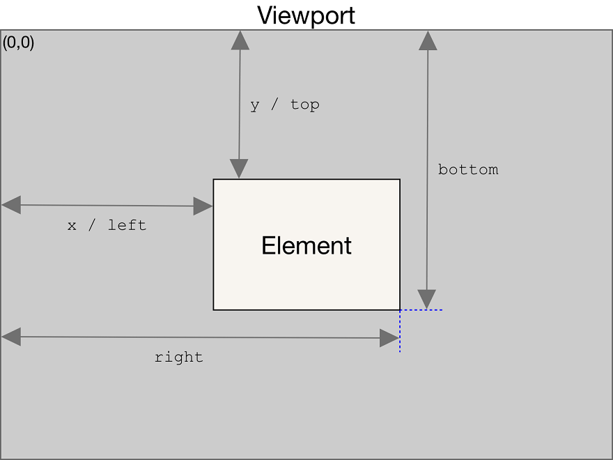

## 需求背景

在前端项目中，当页面有很多图片的时候，图片加载就需要一定的时间，这样是很耗费服务器性能的，不仅影响渲染速度还会浪费带宽，为了解决这个问题，提高用户体验，所以就出现了懒加载这种方式来减轻服务器的压力，即`优先加载可视区域的内容`，其他部分的内容等进入了可视区域再进行加载，从而提高性能

## 思路

我们知道图片都是根据`src`属性进行加载的，所以我们可以在图片没有进入可视区域前，先不给`src`赋值(_或者可以先给一个很小的占位图的地址_)，等到图片进入可视区域再给`src`赋值。图片的真实地址可以先存储在`img`标签的自定义属性`data-src`中。了解了实现思路，那继续最关键的一步，那就是如何计算图片是否进入了可视区域呢？看具体实现吧

## 具体实现

这里的例子以 Vue 实现为例，React 中的实现方式大差不差

### `img`标签的`loading`属性设为`lazy`

| 值    | 描述                   |
| ----- | ---------------------- |
| eager | 默认值，立即加载图片   |
| lazy  | 图片进入可视区域后加载 |

```html

```

### [getBoundingClientRect](https://developer.mozilla.org/zh-CN/docs/Web/API/Element/getBoundingClientRect)

`Element.getBoundingClientRect()`方法返回一个 DOMRect 对象，其提供了元素的大小及其相对于视口的位置



::: details 查看

```js
<script>
export default {
  data() {
    return {
      flag: true
    }
  },
  created() {
    this.throttle(this.lazyLoad, 3000)() //首次进入加载
  },
  mounted() {
    window.addEventListener('scroll', () => {
      this.throttle(that.lazyLoad, 2000)()
    })
  },
  methods: {
    // 节流优化
    throttle(fn, delay) {
      return () => {
        if (!this.flag) return
        this.flag = false // 没执行过就一直是false，会直接return
        setTimeout(() => {
          fn.apply(this, arguments)
          this.flag = true // setTimeout执行完毕后再把标记设置为true(关键)表示可以执行下一次循环了。当定时器没有执行的时候标记永远是false，在开头被return掉
        }, delay)
      }
    },
    // 懒加载函数
    lazyLoad() {
      let images = document.querySelectorAll('img') //不是数组，htmlCollection遍历时要注意
      //加定时器的目的是为了让images能够遍历到
      setTimeout(() => {
        for (let i = 0; i < images.length; i++) {
          //getBoundingClientRect().top 元素的上边相对浏览器视窗的位置如果小于可视窗口的高度
          if (images[i].getBoundingClientRect().top < window.innerHeight) {
            images[i].src = images[i].dataset.src
          }
        }
      }, 300)
    }
  }
}
</script>
```

:::

### [offsetTop](https://developer.mozilla.org/zh-CN/docs/Web/API/HTMLElement/offsetTop)

`HTMLElement.offsetTop`为只读属性，它返回当前元素相对于其`offsetParent`元素的顶部内边距的距离


::: details 查看

```js
<script>
export default {
  data() {
    return {
      flag: true
    }
  },
  created() {
    this.throttle(this.lazyLoad, 3000)() //首次进入加载
  },
  mounted() {
    window.addEventListener('scroll', () => {
      this.throttle(that.lazyLoad, 2000)()
    })
  },
  methods: {
    // 节流优化
    throttle(fn, delay) {
      return () => {
        if (!this.flag) return
        this.flag = false // 没执行过就一直是false，会直接return
        setTimeout(() => {
          fn.apply(this, arguments)
          this.flag = true // setTimeout执行完毕后再把标记设置为true(关键)表示可以执行下一次循环了。当定时器没有执行的时候标记永远是false，在开头被return掉
        }, delay)
      }
    },
    // 懒加载函数
    lazyLoad() {
      let images = document.querySelectorAll('img') //不是数组，htmlCollection遍历时要注意
      //加定时器的目的是为了让images能够遍历到
      setTimeout(() => {
        for (let i = 0; i < images.length; i++) {
          // 判断元素是否进入可视区内
          if (images[i].offsetTop - window.scrollY <= window.innerHeight) {
            images[i].src = images[i].dataset.src
          }
        }
      }, 300)
    }
  }
}
</script>
```

:::

### [IntersectionObserver](https://developer.mozilla.org/zh-CN/docs/Web/API/IntersectionObserver)

`IntersectionObserver`即重叠观察者，从这个命名就可以看出它用于判断两个元素是否重叠，因为不用进行事件的监听，性能方面相比`getBoundingClientRect`会好很多

```js
<script>
export default {
  mounted() {
    this.intersectionObserver()
  },
  methods: {
    intersectionObserver() {
      let images = document.querySelectorAll('img')
      const observer = new IntersectionObserver((imgs) => {
        // imgs: 目标元素集合
        imgs.forEach((img) => {
          // img.isIntersecting代表目标元素可见，可见的时候给src赋值
          if (img.isIntersecting) {
            const item = img.target
            item.src = item.dataset.src
            observer.unobserve(item)
          }
        })
      })
      //定时器和Array.from的目的是让images可遍历
      setTimeout(() => {
        Array.from(images).forEach((item) => {
          observer.observe(item)
        })
      }, 300)
    }
  }
}
</script>
```

### `vue-lazyload`插件

- 安装插件 `npm i vue-lazyload -D`
- 在`main.js`文件中引入并使用

```js
import VueLazyload from 'vue-lazyload'
Vue.use(VueLazyload)
```

- 修改图片显示方式为懒加载即可（将`:src="xxx"`属性直接改为`v-lazy="xxx"`）
