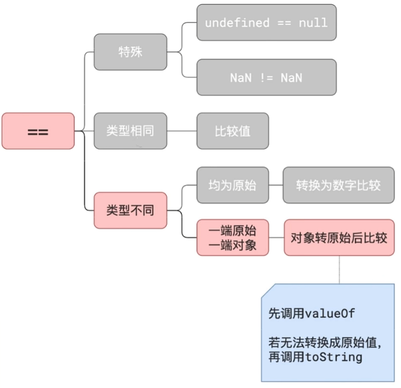

## 在 VSCode 中给获取到的`canvas`对象增加代码提示

```js
// 在获取 canvas 对象的前一行，加上下面这行注释，即可获得代码提示
/** @type {HTMLCanvasElement} */
const cvs = document.querySelector('canvas')
```

## `canvas`清晰度问题

::: tip
原始尺寸 = 样式尺寸 \* 缩放倍率 ， 只要能保持这个等式成立，图片就不会模糊
:::

<iframe height="300" style="width: 100%;" scrolling="no" title="解决canvas清晰度问题" src="https://codepen.io/welives/embed/dywVbzq?default-tab=js%2Cresult" frameborder="no" loading="lazy" allowtransparency="true" allowfullscreen="true">
  See the Pen <a href="https://codepen.io/welives/pen/dywVbzq">
  解决canvas清晰度问题</a> by Jandan (<a href="https://codepen.io/welives">@welives</a>)
  on <a href="https://codepen.io">CodePen</a>.
</iframe>

## `eval`的替代方案

### 将字符串解析为表达式并计算结果

```js
// 注意return后面要留有一个空格
const result = new Function('return ' + 'Math.random() > 0.5 ? 1 : 0')()
console.log(result)
```

### 将字符串解析为`JS`代码并执行

```js
new Function('console.log(Math.random())')()
```

### 动态加载并执行`JS`代码

```js
const script = document.createElement('script')
script.textContent = 'console.log(Math.random())'
document.head.appendChild(script)
```

## 编程语言对小数运算不精确的问题根源

`0.3 - 0.2 === 0.1`的判断结果为`false`，出现这个问题的原因是小数运算的精度丢失。至于为什么会精度丢失，那就要来了解小数转换二进制的过程了

::: tip
小数转换二进制口诀：「**乘 2 取整，顺序排列**」
:::

::: details 示例1

```js
0.125       =>      01

0.125 * 2 = 0.5     0
0.5 * 2 = 1.0       1
0.0                 结束
```

:::

::: details 示例2

```js
0.2       =>        00110011...

0.2 * 2 = 0.4       0
0.4 * 2 = 0.8       0
0.8 * 2 = 1.6       1
0.6 * 2 = 1.2       1
0.2 * 2 = 0.4       0
...                 无限循环
```

:::

## 异或运算求数组中只出现一次的元素

`^`：按位异或，相同取`0`，不相同取`1`

::: tip 异或运算有以下特点

1. 满足交换律：`a^b^c = c^a^b`
2. 两个相同的数字异或运算一定等于零：`a^a === 0`
3. 零和任意数字进行异或运算一定等于它自身：`0^a === a`

通过这三个特点，就有以下思路：`a^b^c^a^c`转换为`a^a^c^c^b`转换为`0^0^b`转换为`0^b`最后得到`b`

:::

```js
const arr = [1, 1, 2, 3, 4, 2, 5, 6, 4, 5, 7, 6]
arr.reduce((a, b) => a ^ b, 0) // 得到 4
```

## 普通函数转成柯里化

```js
function createCurry(fn, args) {
  args = args || []
  const length = fn.length
  return function () {
    const newArgs = args.concat(Array.prototype.slice.call(arguments))
    if (newArgs.length < length) {
      return curry.call(this, fn, newArgs)
    } else {
      return fn.apply(this, newArgs)
    }
  }
}
```

## 对象的键值只能是`String`和`Symbol`类型

来看一道阿里的技术面试题，此题考察的主要是`xx.toString()`：

```js
const a = {},
  b = { key: 'b' },
  c = { key: 'c' }
a[b] = 123 // 等价于 a['[object Object]'] = 123
a[c] = 456 // 等价于 a['[object Object]'] = 456
console.log(a[b]) // 输出 456
```

## JS 中的`==`隐式转换规则



::: code-group

```js [question]
const a = ?; // ? 位置要怎么写才能输出 true
console.log(a == 1 && a == 2 && a == 3);
```

```js [answer]
const a = {
  n: 1,
  valueOf: function () {
    return this.n++
  },
}
```

:::

## 请求队列

```js
const handleQueue = (
  maxNum = 6 // 最大并发数
) => {
  const requestQueue = () => {
    const queue = [] // 请求队列
    let current = 0 // 当前请求了多少条

    const dequeue = () => {
      while (current < maxNum && queue.length) {
        current++
        const currentPromise = queue.shift() // 出列
        currentPromise().finally(() => {
          current--
          dequeue()
        })
      }
    }
    return (promise) => {
      queue.push(promise) // 入列
      dequeue()
    }
  }
  return requestQueue()
}

// 使用示例
for (let i = 0; i < 20; i++) {
  handleQueue()(() => Promise.resolve(i).then((res) => console.log(res)))
}
```

## 计算超出隐藏的单行文本实际宽度

```js
function getStyles(elem, prop) {
  if (window.getComputedStyle) {
    if (prop) {
      return window.getComputedStyle(elem, null)[prop]
    } else {
      return window.getComputedStyle(elem, null)
    }
  } else {
    if (prop) {
      return elem.currentStyle[prop]
    } else {
      return elem.currentStyle
    }
  }
}
function showRealProp(elem, ...prop) {
  if (!elem) throw new Error('dom 节点不能为空')
  // 如果属性值为空 则退出
  if (prop.length === 0) return
  // 真正的width
  let realProp = {}
  // 克隆dom
  const cpNode = elem.cloneNode(true)
  // 重置style样式
  cpNode.setAttribute(
    'style',
    'display: inline-block;height: 0;visibility: hidden;font-size: 14px;font-family: Helvetica, "Microsoft Yahei"'
  )
  // 将dom添加到body后面，如果不添加 下面无法计算盒子的宽度
  document.body.appendChild(cpNode)
  prop.forEach((item) => {
    if (!item) return
    // 获取真正属性的styles值
    realProp[item] = getStyles(cpNode)[item]
  })
  // 计算完成后移除该dom节点
  document.body.removeChild(cpNode)
  return realProp
}

// 使用示例
const elem = document.getElementById('test')
showRealProp(elem, ...['width', 'min-width'])
```

## 计算localStorage的已使用的容量

```js
/** @description 计算字符串的字节数 */
function calculateUtf8ByteSize(str) {
  // 非字符串 不作计算
  if (typeof str !== 'string') 0
  // 定义变量，用于累加字节数
  let byteCount = 0
  // 遍历字符串中的每个字符
  for (let i = 0, len = str.length; i < len; i++) {
    // 获取当前字符的Unicode码
    const charCode = str.charCodeAt(i)
    // 根据字符的Unicode码，计算其占用的字节数
    if (charCode <= 0x007f) {
      byteCount += 1 // 在000000-00007F之间的字符(如字母)，占用1个字节
    } else if (charCode <= 0x07ff) {
      byteCount += 2 // 在000080-0007FF之间的字符(如中文)，占用2个字节
    } else if (charCode <= 0xffff) {
      byteCount += 3 // 000800-00FFFF之间的字符(如中文)，占用3个字节
    } else if (charCode <= 0x10ffff) {
      byteCount += 4 // 010000-10FFFF之间的字符(如表情)，占用4个字节
    } else {
      console.log('该字符超出Unicode编码范围')
    }
  }
  return byteCount
}
/** @description 计算localStorage已使用的容量 */
const computedUsed = () => {
  let cacheLen = 0
  // 遍历所有key
  for (const key in localStorage) {
    // 拿到非原型key
    if (Object.hasOwnProperty.call(localStorage, key)) {
      // 累加缓存的字符串长度
      cacheLen += localStorage.getItem(key)
    }
  }
  // 计算缓存字符串所占字节数,并转换为KB
  return (calculateUtf8ByteSize(cacheLen) / 1024).toFixed(2)
}
```
