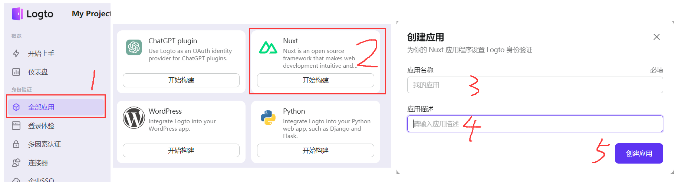
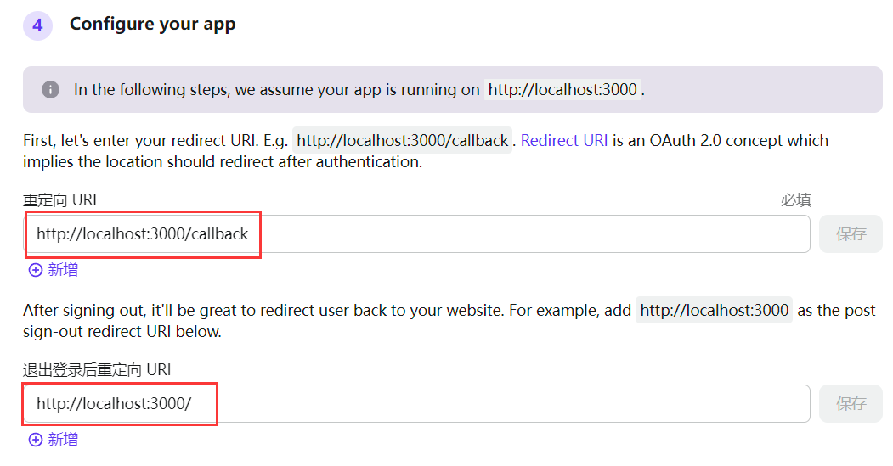
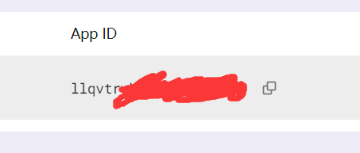
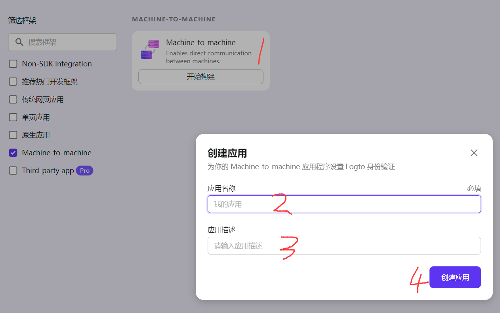
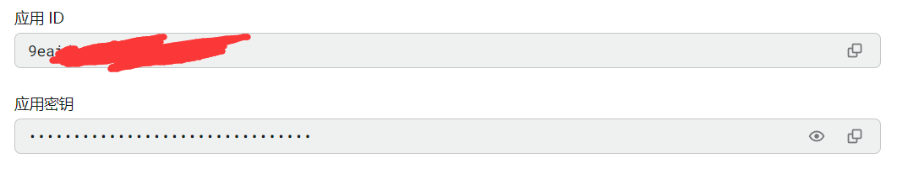

## 项目初始化

::: code-group

```sh [terminal]
corepack enable
# 创建项目的根目录
mkdir capsule && cd capsule
git init
touch .gitignore
touch .editorconfig
# 应用目录
mkdir apps
# 包目录
mkdir packages
```

```ini [.editorconfig]
root = true

[*]
indent_style = space
indent_size = 2
end_of_line = lf
charset = utf-8
trim_trailing_whitespace = true
max_line_length = 120
```

:::

### pnpm初始化

```sh [terminal]
pnpm init
touch pnpm-workspace.yaml
```

编辑`pnpm-workspace.yaml`定义工作空间，把上面创建的`apps`和`packages`目录添加进去

```yaml
packages:
  - 'apps/*'
  - 'packages/*'
```

接着再编辑`package.json`，把主项目的名称改为`capsule-english`，并根据情况补充如下内容

```json
{
  "name": "capsule-english",
  "private": true,
  // 工作空间
  "workspaces": ["apps/*", "packages/*"],
  "scripts": {
    // 表示此项目只允许使用 pnpm
    "preinstall": "npx only-allow pnpm"
  },
  // 包管理器的版本根据自己的情况修改
  "packageManager": "pnpm@9.1.0",
  "engines": {
    "node": ">= 20"
  }
}
```

### TS环境初始化

因为当前已经转变为`workspace`工作空间，所以在主项目下安装依赖时需要加一个`-w`参数

::: code-group

```sh [terminal]
pnpm add -wD typescript @types/node
npx tsc --init
```

```json [tsconfig.json]
{
  "compilerOptions": {
    "baseUrl": ".",
    "module": "ESNext",
    "target": "ESNext",
    "jsx": "preserve",
    "moduleResolution": "Node",
    "strict": true,
    "noEmit": true,
    "sourceMap": true,
    "declaration": true,
    "skipLibCheck": true,
    "resolveJsonModule": true,
    "noUnusedLocals": true,
    "noImplicitAny": true,
    "strictNullChecks": true,
    "esModuleInterop": true,
    "isolatedModules": true,
    "allowJs": true,
    "types": ["node"]
  },
  "exclude": ["**/node_modules/**", "**/dist/**"]
}
```

:::

### ESLint配置

这里直接使用[Nuxt团队的Anthony Fu大佬的eslint-config](https://github.com/antfu/eslint-config)

```sh
pnpm dlx @antfu/eslint-config@latest
```


编辑`eslint.config.js`和`package.json`

::: code-group

```js [eslint.config.js]
import antfu from '@antfu/eslint-config'

export default antfu({
  formatters: true,
  vue: true,
  typescript: true,
})
```

```json [package.json]
{
  "scripts": {
    "eslint": "eslint .", // [!code ++]
    "eslint:fix": "eslint . --fix" // [!code ++]
  }
}
```

:::

### 代码风格

```sh
pnpm add -wD prettier
```

新建`.prettierrc`和`.prettierignore`，填入自己喜欢的配置

:::code-group

```json [.prettierrc]
{
  "semi": false,
  "tabWidth": 2,
  "printWidth": 120,
  "singleQuote": true,
  "trailingComma": "es5",
  "plugins": []
}
```

```[.prettierignore]
node_modules
.nuxt
.output
dist
*-lock.*
*.log
```

:::

## 工程管理

### git提交检查

```sh
pnpm add -wD simple-git-hooks lint-staged tsx
```

初始化`simple-git-hooks`

```sh
git config core.hooksPath .git/hooks
rm -rf .git/hooks
```

新建`.lintstagedrc.mjs`和`scripts/verify-commit.ts`文件，用来编写`git`提交检查的逻辑

::: code-group

```js [.lintstagedrc.mjs]
export default {
  '*.{js,jsx,ts,tsx,mjs,cjs,mts,cts,mtsx,ctsx}': ['prettier --write'],
  '*.{vue,html}': ['prettier --write'],
  '*.{json,md,mdx,yaml}': ['prettier --write'],
  '*.{css,less,sass,scss}': ['prettier --write'],
}
```

```ts [verify-commit.ts]
import { readFileSync } from 'node:fs'
import path from 'node:path'
import pico from 'picocolors'

const msgPath = path.resolve('.git/COMMIT_EDITMSG')
const msg = readFileSync(msgPath, 'utf-8').trim()

const commitRE =
  /^(revert: )?(feat|fix|docs|dx|style|refactor|perf|test|workflow|build|ci|chore|types|wip|release)(\(.+\))?: .{1,50}/

if (!commitRE.test(msg)) {
  console.log()
  console.error(
    `  ${pico.white(pico.bgRed(' ERROR '))} ${pico.red(`invalid commit message format.`)}\n\n` +
      pico.red(
        `  Proper commit message format is required for automated changelog generation. Examples:\n\n`
      ) +
      `    ${pico.green(`feat(api): add 'comments' option`)}\n` +
      `    ${pico.green(`fix(client): handle events on blur (close #28)`)}\n\n` +
      pico.red(
        `We refer to the vue3 scheme.\n` +
          `See https://github.com/vuejs/core/blob/main/.github/commit-convention.md for more details.\n`
      )
  )
  process.exit(1)
}
```

:::

接着编辑`package.json`，添加如下脚本命令

```json
  "scripts": {
    "prepare": "simple-git-hooks", // [!code ++]
    "format": "prettier --write --cache .", // [!code ++]
    "format-check": "prettier --check --cache .", // [!code ++]
  },
  "simple-git-hooks": {
    "pre-commit": "npx lint-staged", // [!code ++]
    "commit-msg": "npx tsx scripts/verify-commit.ts" // [!code ++]
  },
```

### 版本日志

```sh
pnpm add -wD @changesets/cli @changesets/changelog-github
pnpm changeset init
```

编辑`.changeset/config.json`

```json
{
  // ..
  "access": "public", // [!code ++]
  "___experimentalUnsafeOptions_WILL_CHANGE_IN_PATCH": {
    "onlyUpdatePeerDependentsWhenOutOfRange": true // [!code ++]
  }
}
```

编辑`package.json`，添加如下脚本命令

```json
{
  "scripts": {
    "changeset": "changeset", // [!code ++]
    "changeset-version": "changeset version" // [!code ++]
  }
}
```

生成日志的步骤参考[我的"代码演示插件实战"笔记](../code-preview-plugin.md#管理版本及更新日志)，这里就不再重复记录了

## 安装应用

我这里的前端项目选择`Nuxt3`，后端项目选择`Nestjs`

### Nuxt3

进入`apps`目录，创建前端项目

```sh
cd apps
pnpm dlx nuxi init client
```

然后编辑`client`应用的`package.json`的`name`字段值为`client`，表示前端项目的名称，以后给子项目安装依赖的时候会用到

### Nestjs

进入`apps`目录，创建后端项目

如果之前没有安装过`Nestjs`的官方脚手架的话就先安装一下，然后通过命令`nest new`创建项目

```sh
npm i -g @nestjs/cli
nest new server
```

然后编辑`server`应用的`package.json`的`name`字段值为`server`


## 配置Nuxt3

安装一些好用的`Nuxt3`模块

```sh
pnpm add -D -F client @vueuse/nuxt @vite-pwa/nuxt @pinia/nuxt @pinia-plugin-persistedstate/nuxt @nuxtjs/i18n @nuxtjs/tailwindcss
```

其他有用的包和插件

```sh
# 安装到主项目
pnpm add -wD prettier-plugin-tailwindcss postcss
# 安装到Nuxt3开发依赖
pnpm add -D -F client daisyui vue-tsc clsx tailwind-merge tailwindcss-debug-screens
pnpm add -D -F client @iconify/tailwind @iconify-json/logos
# 安装到生产依赖
pnpm add -F client axios dayjs
```

:::tip ✨提示
这里的`-F`是`--filter`的缩写，它们都是`pnpm`的参数，表示把依赖安装到`client`项目下，一般用在主项目根目录下。如果直接进入到`client`项目目录进行安装的话就不需要`-F`参数了
:::

编辑`apps/client/nuxt.config.ts`，添加如下配置，注册刚才安装的`Nuxt3`模块

```ts
export default defineNuxtConfig({
  modules: [
    '@vueuse/nuxt', // [!code ++]
    '@pinia/nuxt', // [!code ++]
    '@pinia-plugin-persistedstate/nuxt', // [!code ++]
    '@vite-pwa/nuxt', // [!code ++]
    '@nuxtjs/i18n', // [!code ++]
    '@nuxtjs/tailwindcss', // [!code ++]
  ],
})
```

### 初始化Tailwind

```sh
pnpm dlx tailwindcss init
```

在`client`应用中新建`assets/css/main.css`文件，填入如下内容

```css
@layer base {
  /* 定义滚动条高宽及背景 */
  ::-webkit-scrollbar {
    width: 8px;
    height: 8px;
    background-color: rgba(0, 0, 0, 0.2);
  }
  /* 定义滚动条轨道内阴影+圆角 */
  ::-webkit-scrollbar-track {
    @apply bg-zinc-100;
    -webkit-box-shadow: inset 0 0 6px rgba(0, 0, 0, 0.3);
    border-radius: 10px;
  }
  /* 定义滑块内阴影+圆角 */
  ::-webkit-scrollbar-thumb {
    @apply bg-violet-400;
    border-radius: 10px;
    -webkit-box-shadow: inset 0 0 6px rgba(167, 139, 250, 0.3);
  }
  .bg-light {
    @apply bg-[#ffffff];
  }
  .bg-dark {
    @apply bg-[#222222];
  }
}
```

编辑`apps/client/tailwind.config.js`，添加如下配置

```js
/** @type {import('tailwindcss').Config} */
export default {
  darkMode: 'class',
  content: [
    './components/**/*.{vue,jsx,tsx}',
    './layouts/**/*.{vue,jsx,tsx}',
    './pages/**/*.{vue,jsx,tsx}',
    './store/**/*.{js,ts}',
    './plugins/**/*.{js,ts}',
    './app.{vue,jsx,tsx}',
    './nuxt.config.{js,ts}',
  ],
  theme: {
    debugScreens: {
      position: ['bottom', 'right'],
      ignore: ['dark'],
    },
    extend: {
      keyframes: {
        flashing: {
          '0%, 100%': { opacity: '0.2' },
          '20%': { opacity: '1' },
        },
        'fade-in': {
          from: {
            opacity: '0',
          },
          to: {
            opacity: '1',
          },
        },
      },
      animation: {
        flashing: 'flashing 1.4s infinite linear',
        'fade-in': 'fade-in 0.5s linear forwards',
      },
    },
  },
  corePlugins: {
    /** @see https://www.tailwindcss.cn/docs/preflight 重置浏览器样式 */
    preflight: true,
  },
  plugins: [
    process.env.NODE_ENV === 'development' && require('tailwindcss-debug-screens'),
    // 注册UI组件库插件
    require('daisyui'),
    // 组件svg图标库插件
    require('@iconify/tailwind').addDynamicIconSelectors(),
  ],
}
```

再次编辑`apps/client/nuxt.config.ts`，添加如下配置

```ts
export default defineNuxtConfig({
  // ...
  postcss: {
    plugins: {
      tailwindcss: {}, // [!code ++]
      autoprefixer: {}, // [!code ++]
    },
  },
  css: ['./assets/css/main.css'], // [!code ++]
})
```

### PWA

新建`apps/client/config/pwa.ts`，参考代码如下

:::details 查看

```ts
import process from 'node:process'
import type { ModuleOptions } from '@vite-pwa/nuxt'
import { appDescription, appName } from '../constants/index'

const scope = '/'

export const pwa: ModuleOptions = {
  registerType: 'autoUpdate',
  scope,
  base: scope,
  manifest: {
    id: scope,
    scope,
    name: appName,
    short_name: appName,
    description: appDescription,
    theme_color: '#ffffff',
    icons: [
      {
        src: 'pwa-192x192.png',
        sizes: '192x192',
        type: 'image/png',
      },
      {
        src: 'pwa-512x512.png',
        sizes: '512x512',
        type: 'image/png',
      },
      {
        src: 'maskable-icon.png',
        sizes: '512x512',
        type: 'image/png',
        purpose: 'any maskable',
      },
    ],
  },
  workbox: {
    globPatterns: ['**/*.{js,css,html,txt,png,ico,svg}'],
    navigateFallbackDenylist: [/^\/api\//],
    navigateFallback: '/',
    cleanupOutdatedCaches: true,
    runtimeCaching: [
      {
        urlPattern: /^https:\/\/fonts.googleapis.com\/.*/i,
        handler: 'CacheFirst',
        options: {
          cacheName: 'google-fonts-cache',
          expiration: {
            maxEntries: 10,
            maxAgeSeconds: 60 * 60 * 24 * 365, // <== 365 days
          },
          cacheableResponse: {
            statuses: [0, 200],
          },
        },
      },
      {
        urlPattern: /^https:\/\/fonts.gstatic.com\/.*/i,
        handler: 'CacheFirst',
        options: {
          cacheName: 'gstatic-fonts-cache',
          expiration: {
            maxEntries: 10,
            maxAgeSeconds: 60 * 60 * 24 * 365, // <== 365 days
          },
          cacheableResponse: {
            statuses: [0, 200],
          },
        },
      },
    ],
  },
  registerWebManifestInRouteRules: true,
  writePlugin: true,
  devOptions: {
    enabled: process.env.VITE_PLUGIN_PWA === 'true',
    navigateFallback: scope,
  },
}
```

:::

编辑`nuxt.config.ts`，注册 PWA

```ts
import { pwa } from './config/pwa'
export default defineNuxtConfig({
  // ...
  pwa, // [!code ++]
})
```

编辑根组件`app.vue`

```vue
<template>
  <VitePwaManifest /> // [!code ++]
  <div class="debug-screens">
    <NuxtWelcome />
  </div>
</template>
```

编辑`client`应用的`package.json`，添加如下一条指令

```json
{
  "scripts": {
    // ...
    "dev:pwa": "VITE_PLUGIN_PWA=true nuxt dev" // [!code ++]
  }
}
```

### 环境变量

新建`apps/client/.env`文件，内容参考如下

```ini
NUXT_PORT=3000
```

由于`Nuxt3`和`Nestjs`的默认开发端口都是`3000`，我这里把前端`client`项目的端口设置为`3000`，后端`server`项目端口定为`4000`，这样就不会冲突了

### 使用[Logto](https://logto.io/)

#### Logto前端应用



配置`Logto URI`



把你的 Logto 应用的`AppID`保存到环境变量文件中



安装依赖

```sh
pnpm add -F client @logto/nuxt
```

编辑`nuxt.config.ts`，注册 Logto

```ts
export default defineNuxtConfig({
  modules: [
    // ...
    '@logto/nuxt', // [!code ++]
  ],
})
```

#### Logto后端应用

和创建前端应用差不多，找`MACHINE-TO-MACHINE`开始构建



把后端应用的AppID和密钥保存到`server`项目的环境变量文件中



#### Logto管理员


给admin角色分配刚刚创建 Logto 后端应用


### 目录结构

```
├── assets                    静态资源
├── components                公共组件
├── composables               放置自动导入方法
├── config                    配置文件
├── constants                 常量配置
├── layouts                   布局组件
├── libs                      公共方法及工具方法
├── middleware                路由中间件
├── pages                     页面
├── plugins                   插件
├── public
├── server
│   ├── api                   服务端API
│   └── middleware            服务端中间件
├── store                     状态管理
├── app.vue                   根组件
├── nuxt.config.ts            Nuxt3配置文件
├── tailwindcss.config.ts     tailwind配置文件
├── .env                      环境变量文件
```

## 配置Nestjs

把`server`项目改为`Monorepo`模式，因为之后要使用微服务功能，而且也要把一些通用的功能抽离出来

进入`apps/server`目录，执行如下命令，创建接口网关应用

```sh
nest g app http-gateway
```

执行这个命令之后，原先的单应用和新创建的`http-gateway`应用会被收录到`server/apps`目录下，接着把旧的那个单应用给删了，只保留`http-gateway`应用作为默认应用

接着再编辑`nest-cli.json`，变成下面这样

```json
{
  "$schema": "https://json.schemastore.org/nest-cli",
  "collection": "@nestjs/schematics",
  "sourceRoot": "apps/http-gateway/src",
  "compilerOptions": {
    "deleteOutDir": true,
    "webpack": true,
    "tsConfigPath": "apps/http-gateway/tsconfig.app.json"
  },
  "monorepo": true,
  "root": "apps/http-gateway",
  "projects": {
    "http-gateway": {
      "type": "application",
      "root": "apps/http-gateway",
      "entryFile": "main",
      "sourceRoot": "apps/http-gateway/src",
      "compilerOptions": {
        "tsConfigPath": "apps/http-gateway/tsconfig.app.json"
      }
    }
  }
}
```

编辑`package.json`

```json
{
  // ...
  "scripts": {
    // ...
    "start:prod": "node dist/apps/http-gateway/main",
    "test:e2e": "jest --config ./apps/http-gateway/test/jest-e2e.json"
  }
}
```

删掉`http-gateway`应用的默认模块

```sh
rm -rf apps/http-gateway/src/http-gateway.*
```

接着给`http-gateway`应用创建一个`app`模块，`-p`参数不给值的话就表示创建到默认应用下，`--no-spec`参数表示不生成测试文件

```sh
nest g module -p --no-spec
```

```ts
import { Module } from '@nestjs/common'

@Module({
  imports: [],
})
export class AppModule {}
```

编辑`http-gateway`服务的`main.ts`

```ts
import { NestFactory } from '@nestjs/core'
import { AppModule } from './app/app.module' // [!code ++]

async function bootstrap() {
  const app = await NestFactory.create(AppModule)
  await app.listen(3000)
}
bootstrap()
```

### 移除ESLint

由于我们已经在主项目中配置了全局的`ESLint`和`Prettier`，所以子项目中就不需要了，删掉相关的文件和依赖

```sh
pnpm rm -F server eslint eslint-config-prettier eslint-plugin-prettier prettier @typescript-eslint/parser @typescript-eslint/eslint-plugin
```

### 公共模块

由于项目规划是微服务架构，那么就需要把一些通用的功能抽离成公共模块，供多个 Nest 服务使用，不这么做的话需在每个服务中重复配置

#### 配置管理模块

```sh
pnpm add -F server @nestjs/config joi
# 创建config模块
nest g library config --no-spec
# 删除自动生成的无用文件
rm libs/config/src/config.service.*
```

在`server`项目中新建`.env`文件，填入自己的环境变量

编辑`server`项目的`libs/config/src/config.module.ts`，参考代码如下

```ts
import { Module } from '@nestjs/common'
import { ConfigModule as NestConfigModule, ConfigService } from '@nestjs/config'
import * as Joi from 'joi'

const envFilePath =
  process.env.NODE_ENV === 'production'
    ? ['.env.production.local', '.env.production']
    : [`.env.${process.env.NODE_ENV}.local`, '.env.local', '.env']

@Module({
  imports: [
    NestConfigModule.forRoot({
      envFilePath,
      validationSchema: Joi.object({
        NODE_ENV: Joi.string().valid('development', 'test', 'production').default('development'),
        HTTP_GATEWAY_PORT: Joi.number().default(4000),
        HTTP_GATEWAY_HOST: Joi.string().default('127.0.0.1'),
        JWT_ACCESS_SECRET: Joi.string().required(),
        JWT_REFRESH_SECRET: Joi.string().required(),
        JWT_ACCESS_EXPIRY: Joi.string().default('60s'),
        JWT_REFRESH_EXPIRY: Joi.string().default('7d'),
        REDIS_PORT: Joi.number().default(6379),
        REDIS_HOST: Joi.string().default('127.0.0.1'),
        REDIS_USER: Joi.string().default('root'),
        REDIS_PWD: Joi.string().required(),
        DATABASE_DSN: Joi.string().required(),
        DATABASE_HOST: Joi.string().required(),
        DATABASE_PORT: Joi.string().required(),
        DATABASE_USER: Joi.string().required(),
        DATABASE_PWD: Joi.string().required(),
        DATABASE_DBNAME: Joi.string().required(),
      }),
    }),
  ],
  providers: [ConfigService],
  exports: [ConfigService],
})
export class ConfigModule {}
```

在`http-gateway`应用的`app`模块中注册我们的公共`config`模块

```ts
import { Module } from '@nestjs/common'
import { ConfigModule } from '@libs/config' // [!code ++]

@Module({
  imports: [ConfigModule], // [!code ++]
})
export class AppModule {}
```

#### 日志模块

在我的[另一篇Nestjs笔记](../../nodejs/nestjs/create.md#日志)中用的日志插件是`winston`，但这次我改用`pino`，因为设置起来更简单

```sh
pnpm add -F server nestjs-pino pino-http pino-pretty
# 创建logger模块
nest g library logger --no-spec
# 删除自动生成的无用文件
rm libs/logger/src/logger.service.*
```

编辑`server`项目的`libs/logger/src/logger.module.ts`，参考代码如下

```ts
import { Module } from '@nestjs/common'
import { LoggerModule as PinoLoggerModule } from 'nestjs-pino'

@Module({
  imports: [
    PinoLoggerModule.forRoot({
      pinoHttp: {
        transport: {
          target: 'pino-pretty',
          options: {
            singleLine: true,
          },
        },
      },
    }),
  ],
})
export class LoggerModule {}
```

在`http-gateway`应用的`app`模块中注册我们的公共`logger`模块，接着编辑`http-gateway`应用的`main.ts`，使用`nestjs-pino`提供的`Logger`服务

```ts
import { NestFactory } from '@nestjs/core'
import { AppModule } from './app/app.module'
import { Logger } from 'nestjs-pino' // [!code ++]

async function bootstrap() {
  const app = await NestFactory.create(AppModule, {
    bufferLogs: true, // [!code ++]
  })
  app.useLogger(app.get(Logger)) // [!code ++]
  await app.listen(3000)
}
bootstrap()
```

#### Redis模块

```sh
pnpm add -F server ioredis @liaoliaots/nestjs-redis
# 创建redis模块
nest g library redis --no-spec
# 删除自动生成的无用文件
rm libs/redis/src/redis.service.*
```

编辑`server`项目的`libs/redis/src/redis.module.ts`，参考代码如下

```js
import { Module } from '@nestjs/common'
import { RedisModule as NestRedisModule } from '@liaoliaots/nestjs-redis'
import { ConfigService } from '@nestjs/config'
import { ConfigModule } from '@libs/config'

@Module({
  imports: [
    NestRedisModule.forRootAsync({
      imports: [ConfigModule],
      inject: [ConfigService],
      useFactory: (config: ConfigService) => {
        return {
          config: {
            host: config.get('REDIS_HOST'),
            port: config.get('REDIS_PORT'),
            username: config.get('REDIS_USER'),
            password: config.get('REDIS_PWD'),
          },
        }
      },
    }),
  ],
})
export class RedisModule {}
```

#### common模块

```sh
# 创建common模块
nest g library common --no-spec
# 删除自动生成的无用文件
rm libs/common/src/common.*
```

- 类型接口

```sh
nest g interface user-request interfaces -p common --flat
```

```ts
import { Request } from 'express'
export interface UserRequest extends Request {
  user: {
    userId: number | string
    [key: string]: any
  }
}
```

- 装饰器

```sh
nest g decorator user-info decorators -p common --flat --no-spec
nest g decorator open-api decorators -p common --flat --no-spec
```

:::code-group

```ts [user-info]
import { ExecutionContext, createParamDecorator } from '@nestjs/common'
import { UserRequest } from '../interfaces/user-request.interface'
/** 获取请求中携带的用户信息 */
export const UserInfo = createParamDecorator((key: string, ctx: ExecutionContext) => {
  const request = ctx.switchToHttp().getRequest<UserRequest>()
  const user = request.user
  return key ? user && user[key] : user
})
```

```ts [open-api]
import { SetMetadata } from '@nestjs/common'
/** 公共接口装饰器 */
export const OpenApi = (flag: boolean) => SetMetadata('open-api', flag)
```

:::

- 守卫

```sh
nest g guard auth guards -p common --flat --no-spec
```

### 创建认证应用

```sh
# 安装微服务所需的依赖
pnpm add -F server @nestjs/microservices @grpc/grpc-js @grpc/proto-loader
# 创建应用
nest g app grpc-auth --no-spec
# 删除默认模块
rm -rf apps/grpc-auth/src/grpc-auth.*
# 创建app模块
nest g module app -p grpc-auth --no-spec
# 创建auth模块
nest g module auth -p grpc-auth --no-spec
```

在`server`项目中新建`proto/auth.proto`文件，用来定义微服务的功能

```proto
syntax = "proto3";

package auth;

service AuthService {
  rpc createToken (payload) returns (resultData) {}
}

message payload {
  string userId = 1;
}

message resultData {
  string token = 1;
}
```

编辑`grpc-auth`应用`auth`模块的`auth.controller.ts`，填入用于测试`gRPC`微服务的示例代码

```ts
import { Controller } from '@nestjs/common'
import { AuthService } from './auth.service'
import { GrpcMethod } from '@nestjs/microservices'

@Controller()
export class AuthController {
  constructor(private readonly authService: AuthService) {}

  @GrpcMethod('AuthService', 'createToken')
  public async createToken(data: { userId: string }) {
    return { token: Math.random().toString(36) }
  }
}
```

编辑`grpc-auth`应用的入口文件`main.ts`，改为微服务模式

```ts{10-18}
import path from 'path'
import { NestFactory } from '@nestjs/core'
import { AppModule } from './app/app.module'
import { Logger } from 'nestjs-pino'
import { MicroserviceOptions, Transport } from '@nestjs/microservices'
import { ConfigService } from '@nestjs/config'

async function bootstrap() {
  const config = new ConfigService()
  const app = await NestFactory.createMicroservice<MicroserviceOptions>(AppModule, {
    transport: Transport.GRPC,
    options: {
      url: `${config.get('GRPC_AUTH_HOST')}:${config.get('GRPC_AUTH_PORT')}`,
      package: 'auth',
      protoPath: path.resolve(process.cwd(), 'proto/auth.proto'),
    },
    bufferLogs: true,
  })
  app.useLogger(app.get(Logger))
  await app.listen()
}
bootstrap()
```

编辑`http-gateway`应用的`app.module.ts`，订阅微服务

```ts{11-26}
import path from 'path'
import { Module } from '@nestjs/common'
import { ConfigModule } from '@libs/config'
import { LoggerModule } from '@libs/logger'
import { ConfigService } from '@nestjs/config'
import { ClientProxyFactory, Transport } from '@nestjs/microservices'
import { AppController } from './app.controller'

@Module({
  imports: [ConfigModule, LoggerModule],
  providers: [
    {
      provide: 'GRPC_AUTH_SERVICE',
      inject: [ConfigService],
      useFactory: (config: ConfigService) => {
        return ClientProxyFactory.create({
          transport: Transport.GRPC,
          options: {
            url: `${config.get('GRPC_AUTH_HOST')}:${config.get('GRPC_AUTH_PORT')}`,
            package: 'auth',
            protoPath: path.resolve(process.cwd(), 'proto/auth.proto'),
          },
        })
      },
    },
  ],
  controllers: [AppController],
})
export class AppModule {}
```

编辑`http-gateway`应用的`app.controller.ts`，调用测试用的微服务功能

```ts
import { Controller, Get, OnModuleInit, Inject, Query } from '@nestjs/common'
import { ClientGrpc } from '@nestjs/microservices'

interface AuthService {
  createToken(data: { userId: string }): Promise<any>
}

@Controller()
export class AppController implements OnModuleInit {
  private authService: AuthService
  constructor(@Inject('GRPC_AUTH_SERVICE') private readonly client: ClientGrpc) {}

  onModuleInit() {
    this.authService = this.client.getService<AuthService>('AuthService')
  }

  @Get('/auth')
  public async createToken(@Query() query) {
    const token = await this.authService.createToken({ userId: query.id })
    return token
  }
}
```

使用任意接口测试工具请求`http://localhost:3000/auth`
