## 项目初始化

::: code-group

```sh [terminal]
corepack enable
# 创建项目的根目录
mkdir capsule && cd capsule
git init
touch .gitignore
touch .editorconfig
# 应用目录
mkdir apps
# 包目录
mkdir packages
```

```ini [.editorconfig]
root = true

[*]
indent_style = space
indent_size = 2
end_of_line = lf
charset = utf-8
trim_trailing_whitespace = true
max_line_length = 120
```

:::

### pnpm初始化

```sh [terminal]
pnpm init
touch pnpm-workspace.yaml
```

编辑`pnpm-workspace.yaml`定义工作空间，把上面创建的`apps`和`packages`目录添加进去

```yaml
packages:
  - 'apps/*'
  - 'packages/*'
```

接着再编辑`package.json`，把主项目的名称改为`capsule-english`，并根据情况补充如下内容

```json
{
  "name": "capsule-english",
  "private": true,
  // 工作空间
  "workspaces": ["apps/*", "packages/*"],
  "scripts": {
    // 表示此项目只允许使用 pnpm
    "preinstall": "npx only-allow pnpm"
  },
  // 包管理器的版本根据自己的情况修改
  "packageManager": "pnpm@9.1.0",
  "engines": {
    "node": ">= 20"
  }
}
```

### TS环境初始化

因为当前已经转变为`workspace`工作空间，所以在主项目下安装依赖时需要加一个`-w`参数

::: code-group

```sh [terminal]
pnpm add -wD typescript @types/node
npx tsc --init
```

```json [tsconfig.json]
{
  "compilerOptions": {
    "baseUrl": ".",
    "module": "ESNext",
    "target": "ESNext",
    "moduleResolution": "Node",
    "allowJs": true,
    "sourceMap": true,
    "strict": true, // 启用所有严格类型检查选项
    "noEmit": true, // 不生成输出文件
    "declaration": true, // 生成相应的 '.d.ts' 文件
    "isolatedModules": true, // 将每个文件做为单独的模块
    "resolveJsonModule": true, // 允许加载 JSON 文件
    "skipLibCheck": true, // 跳过.d.ts类型声明文件的类型检查
    "noUnusedLocals": true, // 有未使用的变量时，抛出错误
    "noImplicitAny": true, // 在表达式和声明上有隐含的 any类型时报错
    "strictNullChecks": false, // 启用严格的 null 检查
    "esModuleInterop": true, // 用来兼容commonjs的
    "emitDecoratorMetadata": true, // 为装饰器提供元数据的支持
    "experimentalDecorators": true, // 启用装饰器
    "types": ["node"]
  },
  "exclude": ["**/node_modules/**", "**/dist/**"]
}
```

:::

### ESLint配置

这里直接使用[Nuxt团队的Anthony Fu大佬的eslint-config](https://github.com/antfu/eslint-config)

```sh
pnpm dlx @antfu/eslint-config@latest
```

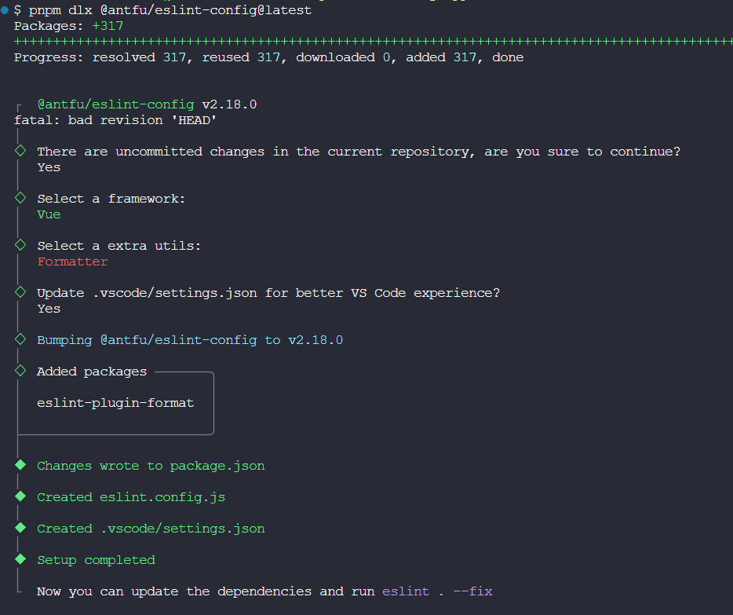

编辑`eslint.config.js`和`package.json`

::: code-group

```js [eslint.config.js]
import antfu from '@antfu/eslint-config'

export default antfu({
  formatters: true,
  vue: true,
  typescript: true,
})
```

```json [package.json]
{
  "scripts": {
    "eslint": "eslint .", // [!code ++]
    "eslint:fix": "eslint . --fix" // [!code ++]
  }
}
```

:::

### 代码风格

```sh
pnpm add -wD prettier
```

新建`.prettierrc`和`.prettierignore`，填入自己喜欢的配置

:::code-group

```json [.prettierrc]
{
  "semi": false,
  "tabWidth": 2,
  "printWidth": 120,
  "singleQuote": true,
  "trailingComma": "es5",
  "plugins": []
}
```

```[.prettierignore]
node_modules
.nuxt
.output
dist
*-lock.*
*.log
```

:::

## 工程管理

### git提交检查

```sh
pnpm add -wD simple-git-hooks lint-staged tsx dotenv
```

初始化`simple-git-hooks`

```sh
git config core.hooksPath .git/hooks
rm -rf .git/hooks
```

新建`.lintstagedrc.mjs`和`scripts/verify-commit.ts`文件，用来编写`git`提交检查的逻辑

::: code-group

```js [.lintstagedrc.mjs]
export default {
  '*.{js,jsx,ts,tsx,mjs,cjs,mts,cts,mtsx,ctsx}': ['prettier --write'],
  '*.{vue,html}': ['prettier --write'],
  '*.{json,md,mdx,yaml}': ['prettier --write'],
  '*.{css,less,sass,scss}': ['prettier --write'],
}
```

```ts [verify-commit.ts]
import { readFileSync } from 'node:fs'
import path from 'node:path'
import pico from 'picocolors'

const msgPath = path.resolve('.git/COMMIT_EDITMSG')
const msg = readFileSync(msgPath, 'utf-8').trim()

const commitRE =
  /^(revert: )?(feat|fix|docs|dx|style|refactor|perf|test|workflow|build|ci|chore|types|wip|release)(\(.+\))?: .{1,50}/

if (!commitRE.test(msg)) {
  console.log()
  console.error(
    `  ${pico.white(pico.bgRed(' ERROR '))} ${pico.red(`invalid commit message format.`)}\n\n` +
      pico.red(
        `  Proper commit message format is required for automated changelog generation. Examples:\n\n`
      ) +
      `    ${pico.green(`feat(api): add 'comments' option`)}\n` +
      `    ${pico.green(`fix(client): handle events on blur (close #28)`)}\n\n` +
      pico.red(
        `We refer to the vue3 scheme.\n` +
          `See https://github.com/vuejs/core/blob/main/.github/commit-convention.md for more details.\n`
      )
  )
  process.exit(1)
}
```

:::

接着编辑`package.json`，添加如下脚本命令

```json
  "scripts": {
    "format": "prettier --write --cache .", // [!code ++]
    "format-check": "prettier --check --cache .", // [!code ++]
  },
  "simple-git-hooks": {
    "pre-commit": "npx lint-staged", // [!code ++]
    "commit-msg": "npx tsx scripts/verify-commit.ts" // [!code ++]
  },
```

### 版本日志

```sh
pnpm add -wD @changesets/cli @changesets/changelog-github
pnpm changeset init
```

编辑`.changeset/config.json`

```json
{
  // ..
  "access": "public", // [!code ++]
  "___experimentalUnsafeOptions_WILL_CHANGE_IN_PATCH": {
    "onlyUpdatePeerDependentsWhenOutOfRange": true // [!code ++]
  }
}
```

编辑`package.json`，添加如下脚本命令

```json
{
  "scripts": {
    "changeset": "changeset", // [!code ++]
    "changeset-version": "changeset version" // [!code ++]
  }
}
```

生成日志的步骤参考[我的"代码演示插件实战"笔记](../code-preview-plugin.md#管理版本及更新日志)，这里就不再重复记录了

## 安装应用

我这里的前端项目选择`Nuxt3`，后端项目选择`Nestjs`

### Nuxt3

进入`apps`目录，创建前端项目

```sh
cd apps
pnpm dlx nuxi init client
```

然后编辑`client`项目的`package.json`的`name`字段值为`client`，表示前端项目的名称，以后给子项目安装依赖的时候会用到

### Nestjs

进入`apps`目录，创建后端项目

如果之前没有安装过`Nestjs`的官方脚手架的话就先安装一下，然后通过命令`nest new`创建项目，加上`-g`参数表示不生成`git`存储库

```sh
npm i -g @nestjs/cli
nest new server -g
```

然后编辑`server`项目的`package.json`的`name`字段值为`server`

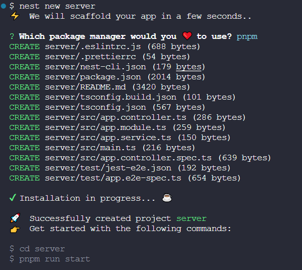

## 环境变量

在主项目根目录新建`.env`文件，用来统一管理所有子项目的环境变量

## 使用[Logto](https://logto.io/)

由于登录鉴权是每个项目都要开发一次的重复性同质化工作，为了省事我直接接入 Logto 来实现这部分功能

### Logto本地部署

[官方文档看这里](https://docs.logto.io/docs/tutorials/get-started/#local)

把 Logto 的配置填入环境变量中，用于下面的`docker-compose`配置。Logto 官方的 Docker 镜像所支持的环境变量名[参考官方文档](https://docs.logto.io/docs/references/core/configuration/#variables)

```yml
version: '3.9'

services:
  # logto管理端本地部署
  logto:
    depends_on:
      logto_postgres:
        condition: service_healthy
    image: svhd/logto:${TAG-latest}
    restart: always
    # 启动脚本
    entrypoint: ['sh', '-c', 'npm run cli db seed -- --swe && npm start']
    # 端口映射
    ports:
      - 5001:5001
      - 5002:5002
    environment:
      TRUST_PROXY_HEADER: 1
      DB_URL: ${LOGTO_DB_DSN}
      # Mandatory for GitPod to map host env to the container, thus GitPod can dynamically configure the public URL of Logto;
      # Or, you can leverage it for local testing.
      PORT: ${LOGTO_PORT}
      ADMIN_PORT: ${LOGTO_ADMIN_PORT}
      ENDPOINT:
      ADMIN_ENDPOINT:
  # logto的官方镜像强制绑定要使用这个 postgres 服务名的数据服务,否则就无法初始化数据
  logto_postgres:
    image: postgres:14-alpine
    restart: always
    # 环境变量
    environment:
      POSTGRES_USER: ${LOGTO_POSTGRES_USER}
      POSTGRES_PASSWORD: ${LOGTO_POSTGRES_PASSWORD}
      POSTGRES_DB: ${LOGTO_POSTGRES_DB}
    ports:
      - 5435:5432
    # 数据卷映射
    volumes:
      - '.volumes/logto_db:/var/lib/postgresql/data'
    healthcheck:
      test: ['CMD-SHELL', 'pg_isready']
      interval: 10s
      timeout: 5s
      retries: 5
```

执行`docker compose up --build -d`构建服务，接着访问`http://localhost:5002/`，注册一个本地的管理员账号

:::tip 注意
Logto 本地部署的默认管理端口是`3002`，我这里给改成`5002`了
:::


本地 Logto 的管理员创建完毕后，下面开始创建应用

### 创建API资源

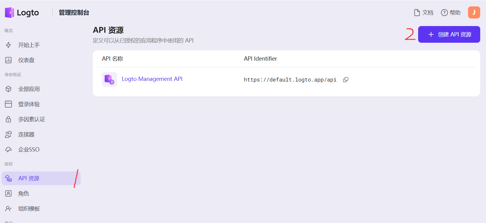

Logto 目前支持的API资源类型有`Node.js`、`Python`和`Java`，根据自己项目的实际情况选择API资源，因为我是`Node.js`全栈，所以这里就选择的`Express`

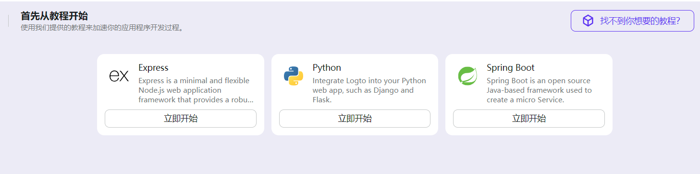

因为我在部署Logto本地服务时，把`PORT`设置为`5001`了，所以这里就是`http://localhost:5001/`，如果用默认部署的话则是`http://localhost:3001/`

记得要把`http://localhost:5001/`也保存到环境变量中

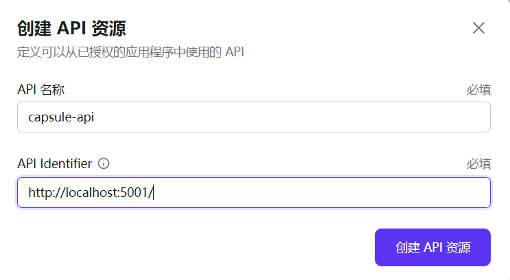

至此，API 资源部分配置完成 🎉

### 创建Logto前端应用

我这里以 Nuxt3 为例

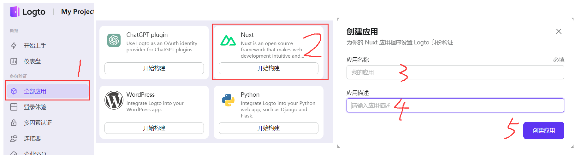

配置`Logto URI`

- **重定向URI**：就是 Logto 校验成功或失败后跳转回我们Web应用的地址，默认为`http://localhost:3000/callback`
- **退出登录后重定向URI**：如字面意思，退出后跳转到指定的地址，我这里就简单的跳到首页就行

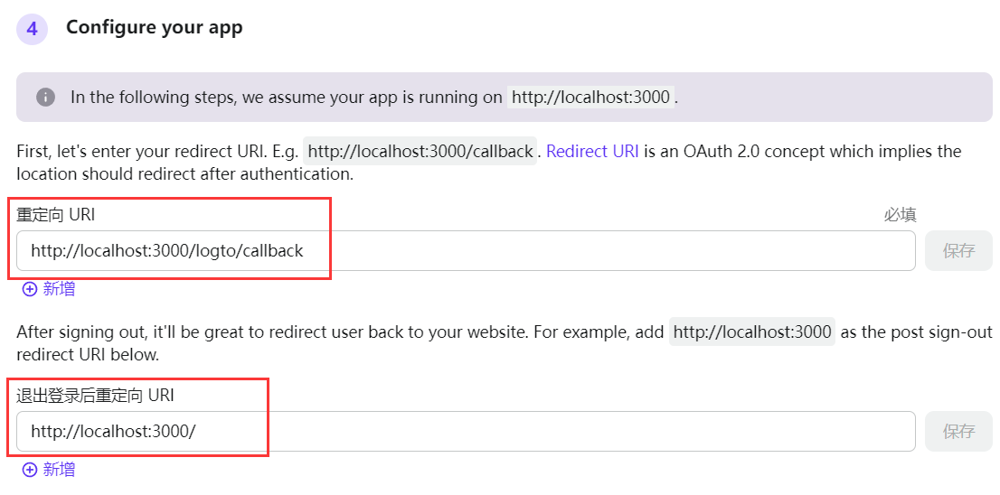

把你的 Logto 前端应用中的一些重要信息保存到环境变量中

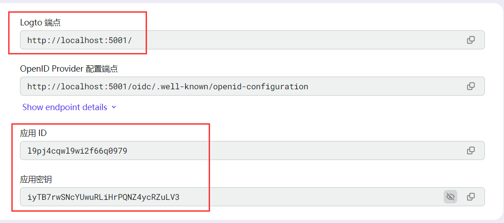

前端部分要用到的 Logto 环境变量如下

```ini
LOGTO_ENDPOINT=http://localhost:5001/
NUXT_LOGTO_APP_ID=l9pj4cqwl9wi2f66q0979
NUXT_LOGTO_APP_SECRET=iyTB7rwSNcYUwuRLiHrPQNZ4ycRZuLV3
NUXT_LOGTO_COOKIE_ENCRYPTION_KEY=wlstRAtXj9GX80MJyY4QXmaUjlX7HP8T
NUXT_LOGTO_PATHNAMES_SIGN_IN=/logto/sign-in
NUXT_LOGTO_PATHNAMES_SIGN_OUT=/logto/sign-out
NUXT_LOGTO_PATHNAMES_CALLBACK=/logto/callback
```

编辑`nuxt.config.ts`，填入到`runtimeConfig`配置项中

```ts
export default defineNuxtConfig({
  runtimeConfig: {
    logto: {
      endpoint: config.LOGTO_ENDPOINT,
      appId: config.NUXT_LOGTO_APP_ID,
      appSecret: config.NUXT_LOGTO_APP_SECRET,
      cookieEncryptionKey: config.NUXT_LOGTO_COOKIE_ENCRYPTION_KEY,
      pathnames: {
        signIn: config.NUXT_LOGTO_PATHNAMES_SIGN_IN,
        signOut: config.NUXT_LOGTO_PATHNAMES_SIGN_OUT,
        callback: config.NUXT_LOGTO_PATHNAMES_CALLBACK,
      }
    },
  },
}
```

至此，Logto 前端应用配置完成 🎉

### 创建Logto后端应用

和创建前端应用差不多，找`MACHINE-TO-MACHINE`开始构建

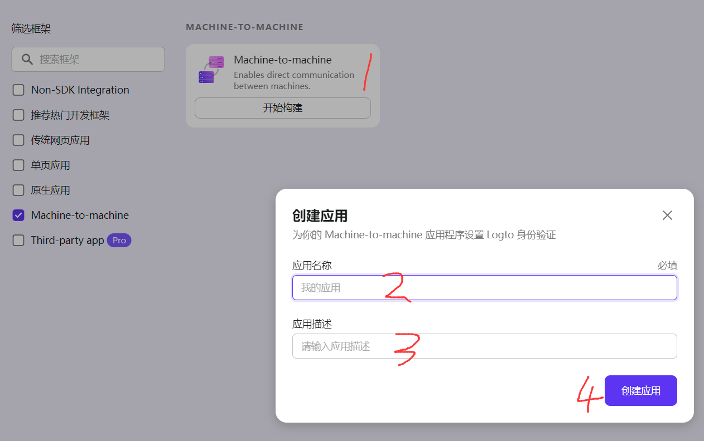

把后端应用的`AppID`和密钥保存到环境变量中

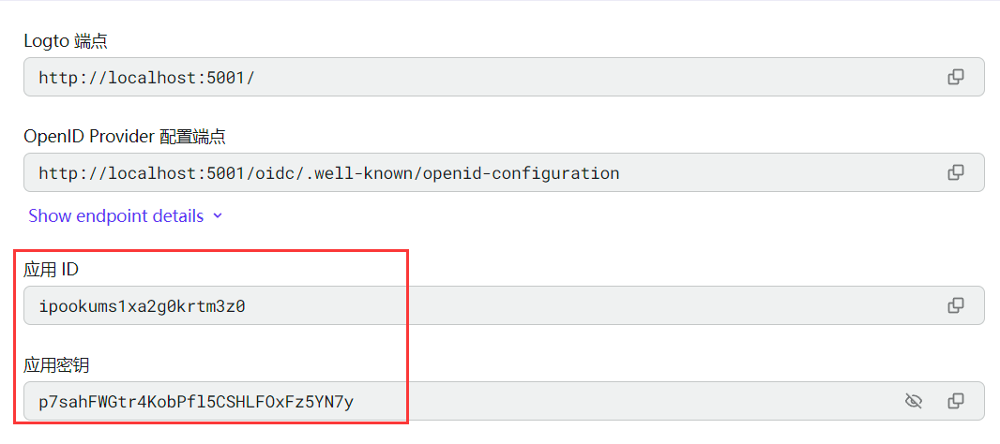

### Logto角色分配

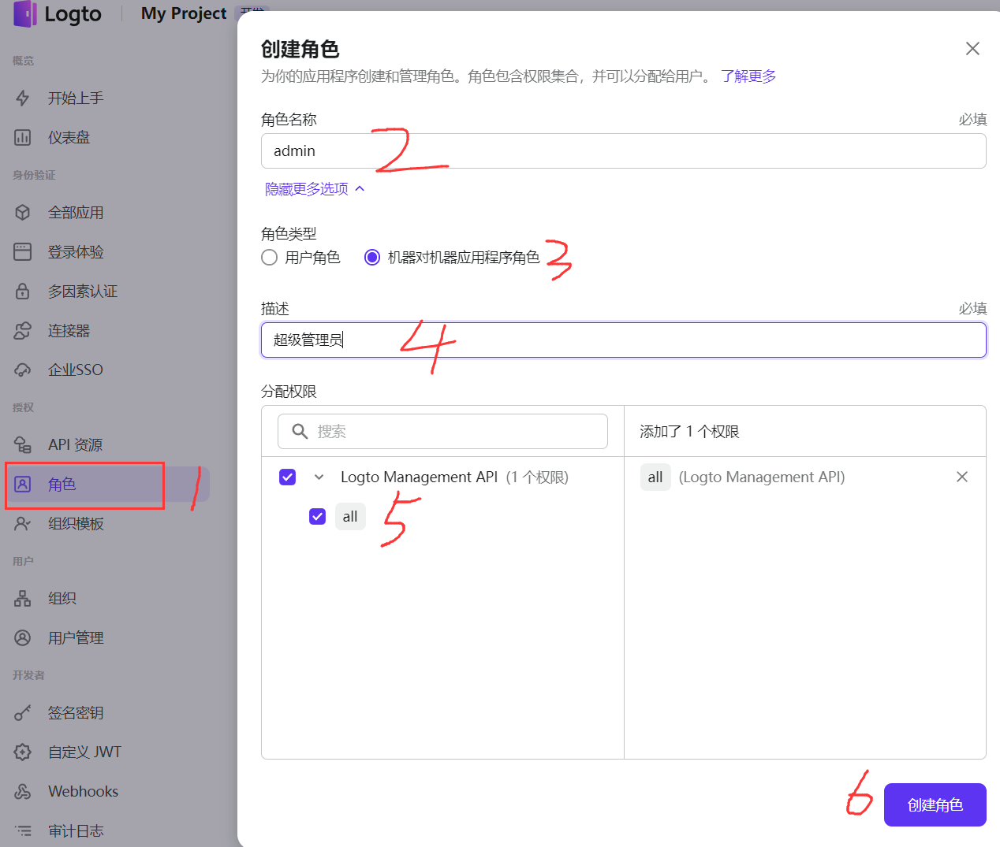

给admin角色分配刚刚创建 Logto 后端应用

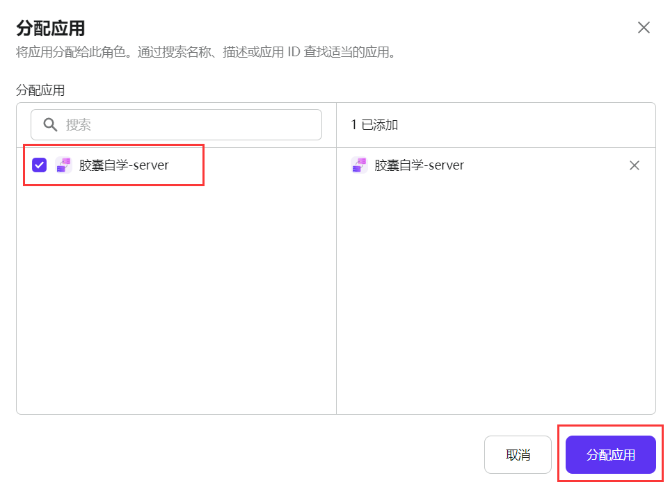

### 创建连接器

这里以 Github OAuth 为例

打开你的 Github 个人设置页面，在左侧栏底部找到`<> Developer settings`，点击它

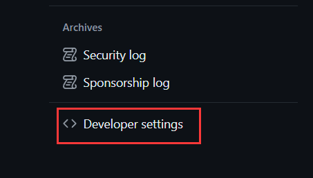

接着新建一个`OAuth App`

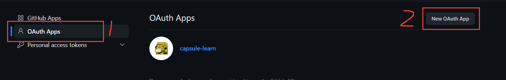

:::tip 🎉好了，到这里工程的基础就搭建完成了。下一篇是[Nuxt3的配置](./part-two.md)
:::
