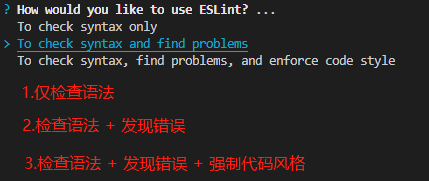
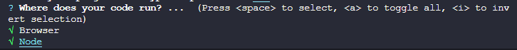
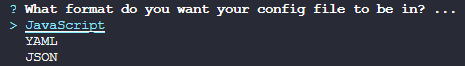
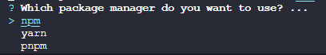

::: tip ✨
搭建一个 Koa2 + TypeORM + TypeScript + Webpack + PM2 + ESLint + Prettier 的工程

[本工程的Github地址](https://github.com/welives/koa-starter)

编写此笔记时所使用的`Koa2`版本为`2.14.2`
:::

## 相关文档

- [Koa2](https://koa.nodejs.cn/)
- [TypeORM](https://typeorm.nodejs.cn/)
- [Prisma](https://prisma.nodejs.cn/)
- [Mongoose](https://mongoose.nodejs.cn/)
- [PM2](https://pm2.fenxianglu.cn/)
- [TypeScript](https://www.tslang.cn/)
- [ESLint](https://eslint.nodejs.cn/)
- [Prettier](https://prettier.nodejs.cn/)
- [Webpack](https://webpack.docschina.org/)

## 项目初始化

新建文件夹`server`并打开

```sh
mkdir server && cd server
```

### 初始化`git`

```sh
git init
touch .gitignore
```

设置忽略文件，内容根据自己的情况进行调整

::: details 查看

```ini
# compiled output
/dist
/node_modules

# Logs
logs
*.log
npm-debug.log*
pnpm-debug.log*
yarn-debug.log*
yarn-error.log*
lerna-debug.log*

# OS
.DS_Store

# IDEs and editors
/.idea
.project
.vscode
.classpath
.c9/
*.launch
.settings/
*.sublime-workspace
*.code-workspace

# local env files
.env*.local
*.rest
*.http
```

:::

### 配置`EditorConfig`

新建`.editorconfig`，设置编辑器和 IDE 规范，内容根据自己的喜好或者团队规范进行调整

```ini
# https://editorconfig.org
root = true

[*]
charset = utf-8
indent_style = space
indent_size = 2
end_of_line = lf
insert_final_newline = true
trim_trailing_whitespace = true

[*.md]
insert_final_newline = false
trim_trailing_whitespace = false
```

### 初始化npm

```sh
pnpm init -y
```

### 安装`TypeScript`

```sh
pnpm add -D typescript @types/node
```

### 初始化`tsconfig.json`

```sh
npx tsc --init
```

初始化生成的`tsconfig.json`含有许多备注，如果嫌麻烦可以直接使用下面的模板，项目设定根据实际情况填写即可

```json
{
  "compilerOptions": {
    "module": "commonjs",
    "target": "esnext",
    "outDir": "./dist",
    "baseUrl": "./",
    "paths": {
      "~/*": ["./src/*"]
    },
    "moduleResolution": "node",
    "allowSyntheticDefaultImports": true,
    "incremental": true,
    "strictNullChecks": false,
    "strictBindCallApply": false,
    "noFallthroughCasesInSwitch": false,
    "sourceMap": true,
    "strict": true,
    "esModuleInterop": true,
    "skipLibCheck": true,
    "noImplicitAny": false,
    "forceConsistentCasingInFileNames": true,
    "emitDecoratorMetadata": true,
    "experimentalDecorators": true,
    "removeComments": true
  },
  "include": ["src"],
  "exclude": ["node_modules", "dist", "public"]
}
```

### 检验`TypeScript`环境

新建`src/index.ts`

```sh
mkdir src && touch src/index.ts
```

写入如下代码，然后编译`npx tsc`

```ts
console.log('hello world')
```

编译成功的话，项目根目录下会生成`dist`文件夹，里面有`index.js`

试试用`node dist/index.js`运行看看，输出`hello world`的话说明`typescript`环境搭建成功了，之后就可以继续完善工程了

## 代码规范

### 安装`ESLint`

```sh
npx eslint --init
```

选第二个



选第一个


因为不是前端项目，所以选第三个


选`TypeScript`，然后运行环境按`a`全选



`eslint`配置文件的的保存格式，选第一个



是否立即安装所需的依赖，选 Yes


这里根据项目构建所使用的包管理器进行选择，因为本项目使用`pnpm`，所以选第三个



### 安装`Prettier`

```sh
pnpm add -D prettier eslint-config-prettier eslint-plugin-prettier
```

新建`.prettierrc`文件，并写入如下配置，可以根据自己喜好进行调整

```json
{
  "$schema": "https://json.schemastore.org/prettierrc",
  "semi": false,
  "tabWidth": 2,
  "printWidth": 120,
  "singleQuote": true,
  "trailingComma": "es5"
}
```

新建`.eslintignore`和`.prettierignore`文件，并写入如下配置，可以根据自己喜好进行调整

::: code-group

```ini [.eslintignore]
.DS_Store
node_modules
dist
.idea
.vscode
```

```ini [.prettierignore]
.DS_Store
node_modules
dist
.idea
.vscode
```

:::

### 在`.eslintrc.js`中集成`prettier`

```js
module.exports = {
  root: true,
  env: {
    browser: true,
    es2021: true,
    node: true,
  },
  extends: [
    'eslint:recommended',
    'plugin:@typescript-eslint/recommended',
    'prettier',
    'plugin:prettier/recommended',
  ],
  overrides: [
    {
      env: {
        node: true,
      },
      files: ['.eslintrc.{js,cjs}'],
      parserOptions: {
        sourceType: 'script',
      },
    },
  ],
  parser: '@typescript-eslint/parser',
  parserOptions: {
    ecmaVersion: 'latest',
    sourceType: 'module',
  },
  plugins: ['@typescript-eslint', 'prettier'],
  rules: {
    complexity: ['error', 10],
    'prettier/prettier': 'error',
    'no-console': process.env.NODE_ENV === 'production' ? 'warn' : 'off',
    'no-debugger': process.env.NODE_ENV === 'production' ? 'warn' : 'off',
  },
}
```

## 配置执行脚本

此项目的开发环境使用`ts-node`和`nodemon`来运行项目和监听热重载，使用`dotenv`来注入环境变量，生产环境使用`pm2`来部署

### 环境变量

```sh
pnpm add -D dotenv dotenv-expand cross-env
```

根目录下新建`.env`或`.env.local`文件，根据项目需求写入自己的环境变量，如

```ini
NODE_ENV=development
# 应用配置
APP_HOST=localhost
APP_PORT=3000
```

新建`src/env.ts`，用来加载多环境变量配置文件

```ts
import fs from 'node:fs'
import path from 'node:path'
import { parse } from 'dotenv'
import { expand } from 'dotenv-expand'

/** 同步读取文件 */
function tryStatSync(file: string): fs.Stats | undefined {
  try {
    return fs.statSync(file, { throwIfNoEntry: false })
  } catch {}
}
/** 获取env文件列表 */
function getEnvFilesForMode(mode: string): string[] {
  return [
    /** default file */ `.env`,
    /** local file */ `.env.local`,
    /** mode file */ `.env.${mode}`,
    /** mode local file */ `.env.${mode}.local`,
  ]
}

/** 加载环境变量 */
function loadEnv(envDir: string) {
  const envFiles = getEnvFilesForMode(process.env.NODE_ENV ?? 'development')
  const parsed = Object.fromEntries(
    envFiles.flatMap((file) => {
      const filePath = path.join(envDir, file)
      if (!tryStatSync(filePath)?.isFile()) return []
      return Object.entries(parse(fs.readFileSync(filePath)))
    })
  )
  expand({ parsed })
  return parsed
}
loadEnv(path.resolve(__dirname, '../'))
```

修改入口文件`src/index.ts`，在第一行加上

```ts
import './env' // [!code ++]
// ...
```

### 安装`nodemon`

```sh
pnpm add -D nodemon ts-node tsconfig-paths
```

新建`nodemon.json`文件，并写入如下内容

```json
{
  "watch": ["src", ".env", ".env.local"],
  "ext": "ts,tsx",
  "delay": 1000,
  "verbose": true,
  "exec": "ts-node -r tsconfig-paths/register src/index.ts"
}
```

::: tip ⚡

- watch 表示要监听的文件或文件夹
- ext 表示监听的文件类型
- delay 表示延迟时间
- verbose 表示输出详细信息
- exec 表示执行的命令
  - tsconfig-paths 是用来识别`import`的路径别名

:::

### 安装`pm2`

```sh
pnpm add -D pm2 tsc-alias
```

根目录新建`ecosystem.config.js`，并写入如下内容

```js
const { name } = require('./package.json')
const path = require('path')

module.exports = {
  apps: [
    {
      name, // 应用程序名称
      cwd: './dist', // 启动应用程序的目录
      script: path.resolve(__dirname, './dist/index.js'), // 启动脚本路径
      instances: require('os').cpus().length, // 要启动的应用实例数量
      max_memory_restart: '1G', // 超过指定的内存量，应用程序将重新启动
      autorestart: true, // 自动重启
      watch: true, // 启用监视和重启功能
      // 环境变量
      env: {
        NODE_ENV: 'production',
      },
    },
  ],
}
```

### 修改`package.json`

```json
{
  "main": "dist/index.js", // [!code focus]
  // ...
  "scripts": {
    // [!code focus:7]
    "dev": "nodemon",
    "clear": "rm -rf dist/*",
    "build": "cross-env NODE_ENV=production npm run clear && cp .env.production dist/ && tsc && tsc-alias",
    "preview": "cross-env NODE_ENV=production node dist/index.js dotenv_config_path=.env.production",
    "deploy": "pm2 start",
    "deploy:stop": "pm2 stop all"
  }
}
```

::: tip ⚡
`tsc-alias`的作用是解决打包时不能识别路径别名的问题
:::

## 安装`Koa`和相关插件

```sh
pnpm add koa koa-router koa-bodyparser @koa/cors koa-helmet koa-static
pnpm add -D @types/koa @types/koa-router @types/koa-bodyparser @types/koa__cors @types/koa-helmet @types/koa-static

```

### 创建路由

新建`src/routes/index.ts`

```ts
import Router from 'koa-router'

const router = new Router()
router.prefix('/api')
router.get('/test', async (ctx) => {
  ctx.body = {
    code: 'E0000',
    msg: 'ok',
    data: 'test',
  }
})

export default router
```

### 改写入口文件

新建`src/app.ts`，修改入口文件`src/index.ts`

::: code-group

```ts [app.ts]
import path from 'node:path'
import Koa from 'koa'
import cors from '@koa/cors'
import helmet from 'koa-helmet'
import koaStatic from 'koa-static'
import bodyParser from 'koa-bodyparser'
import router from './routes'
const app = new Koa()
app
  .use(helmet())
  .use(cors())
  .use(bodyParser())
  .use(koaStatic(path.resolve(__dirname, '../public')))

app
  .use(router.routes())
  .use(router.allowedMethods())
  .use(async (ctx, next) => {
    ctx.body = 'Hello World'
  })

export default app
```

```ts [index.ts]
import './env'
import app from './app'
const PORT = process.env.APP_PORT || 3000
app.listen(PORT, () => {
  console.info('Server listening on port: ' + PORT)
})
```

:::

### 运行项目

至此，一个极简的`Koa`项目就搭建完成了，执行`pnpm run dev`并访问`http://localhost:3000`，可以看到浏览器显示`Hello World`

使用接口调试工具访问`http://localhost:3000/api/test`，可以看到如下输出

```json
{
  "code": "E0000",
  "msg": "ok",
  "data": "test"
}
```

## 打包

本项目有两种打包方式，默认打包和`Webpack`打包

### 默认打包

默认的打包方式是使用`tsc`进行打包，这种方式会保留代码的目录结构，而且不会压缩代码

执行`pnpm run build`进行默认打包

### `Webpack`打包

`Webpack`打包方式会将所有业务代码压缩到一个`js`文件中

- 安装相关依赖

```sh
pnpm add -D webpack webpack-cli webpack-dev-server webpack-merge webpack-node-externals terser-webpack-plugin ts-loader
```

- 根目录下创建`webpack.config.js`，参考配置如下

::: details 查看

```js
'use strict'
const path = require('path')
const webpack = require('webpack')
const { merge } = require('webpack-merge')
const nodeExternals = require('webpack-node-externals')
const TerserPlugin = require('terser-webpack-plugin')
const isProd = process.env.NODE_ENV === 'production'

const config = {
  context: __dirname, // 指定webpack的工作目录
  target: 'node', // koa项目仅在node环境下运行
  entry: path.resolve(__dirname, 'src/index.ts'), // 打包模块入口文件
  // 打包的输出配置
  output: {
    clean: true, // 每次打包前清理输出文件夹
    filename: 'index.js',
    path: path.resolve(__dirname, 'dist'),
  },
  module: {
    rules: [
      {
        test: /\.(ts|tsx)$/i,
        loader: 'ts-loader',
        include: path.resolve(__dirname, 'src'), // 指定loader要处理的目录
        exclude: ['/node_modules/'], // 排除的目录
      },
    ],
  },
  // 解析规则
  resolve: {
    modules: [path.resolve(__dirname, 'src'), 'node_modules'], // 解析模块时应该搜索的目录
    extensions: ['.tsx', '.ts', '.jsx', '.js'], // 要解析的文件类型
    // 路径别名
    alias: {
      '~': path.resolve(__dirname, 'src'),
    },
  },
  externals: [nodeExternals()], // 打包时忽略node_modules中的第三方依赖
  plugins: [new webpack.ProgressPlugin()],
  node: {
    global: true,
    __filename: true,
    __dirname: true,
  },
}

module.exports = () => {
  return isProd
    ? merge(config, {
        mode: 'production',
        stats: {
          children: false, // 是否添加关于子模块的信息
          warnings: false, // 禁用告警
        },
        // 优化配置
        optimization: {
          // 压缩配置
          minimize: true,
          minimizer: [new TerserPlugin()],
        },
      })
    : merge(config, {
        mode: 'development',
        devtool: 'eval-source-map',
        stats: {
          children: false, // 是否添加关于子模块的信息
          modules: false, // 不显示模块信息
        },
      })
}
```

:::

- 修改`package.json`脚本，执行`pnpm run webpack`进行打包

```json
{
  "scripts": {
    // ..
    "watch": "cross-env NODE_ENV=development webpack --watch --progress", // [!code ++]
    "debug": "nodemon --exec node dist/index.js", // [!code ++]
    "webpack": "cross-env NODE_ENV=production webpack --progress && cp .env.production dist/" // [!code ++]
    // ..
  }
}
```

## 部署

根目录新建`.env.production`文件，填入生产环境所需的环境变量

打包好之后执行`pnpm run preview`来载入生产环境变量进行预览,

也可以直接`pnpm run deploy`使用`PM2`启动

::: tip ⚡
生产环境使用`PM2`启动（生产环境端口默认：8080），可以达到负载均衡
:::

## 扩展完善

### 助手函数

新建`src/utils/utils.ts`，封装一些辅助函数，具体代码参考我的[助手函数封装](../../encapsulation.md#helper)

### 定时任务

```bash
pnpm add cron
pnpm add @types/cron -D
```

新建`src/tasks/index.ts`编写定时任务逻辑，编辑`src/app.ts`注册定时任务

::: code-group

```ts [tasks/index.ts]
import { CronJob } from 'cron'
const cronExp = process.env.CRON_EXP || '* * * * *'

export const cron = new CronJob(cronExp, () => {
  console.log('Executing cron job once every minutes')
})
```

```ts [app.ts]
import { cron } from './tasks' // [!code ++]
// ...
cron.start() // [!code ++]
export default app
```

:::

### 日志

```bash
pnpm add winston
```

新建`src/utils/logger.ts`编写日志核心逻辑，编辑`src/app.ts`加载日志模块

::: code-group

```ts [logger.ts]
import { Context, Next } from 'koa'
import winston from 'winston'

function koaLogging() {
  return async (ctx: Context, next: Next) => {
    const start = Date.now()
    await next()
    const ms = Date.now() - start
    let logLevel = ''
    if (ctx.status >= 500) {
      logLevel = 'error'
    } else if (ctx.status >= 400) {
      logLevel = 'warn'
    } else if (ctx.status >= 100) {
      logLevel = 'info'
    }
    const msg = `${ctx.method} ${ctx.url} ${ctx.status} ${ms}ms`
    logger.log(logLevel, msg)
  }
}

const options: winston.LoggerOptions = {
  level: process.env.LOG_LEVEL,
  transports: [
    new winston.transports.Console({
      format: winston.format.combine(winston.format.colorize(), winston.format.simple()),
    }),
    new winston.transports.File({ level: 'error', dirname: 'logs', filename: 'error.log' }),
  ],
}
export const logger = winston.createLogger(options)
export function setupLogging(app: any) {
  app.use(koaLogging())
}
```

```ts [app.ts]
import { setupLogging } from './utils/logger' // [!code ++]
// ...
const app = new Koa()
setupLogging(app) // [!code ++]
// ...
```

:::

### 异常处理

新建`src/utils/exception.ts`和`src/middlewares/error_handler.ts`，编辑`src/app.ts`应用中间件

::: code-group

```ts [app.ts]
import catchError from './middlewares/error_handler' // [!code ++]
// ...
app.use(catchError) // [!code ++] // 注意一定要放在路由的前面加载
// ...
```

```ts [exception.ts]
import assert from 'assert'
import Utils from './utils'
export interface AppError {
  // http状态码
  status?: number
  // 业务状态
  success?: boolean
  // 业务消息
  msg?: string
  // 业务码
  code?: string
  // 业务数据
  data?: any
}

export const ErrorType = {
  unknowd: { status: 500, msg: '未知错误', code: 'E9999' },
  http: { status: 400, msg: '请求出错', code: 'E0001' },
  success: { status: 200, msg: 'ok', code: 'E0000' },
  failed: { status: 400, msg: 'error', code: 'E0001' },
  unauthorized: { status: 401, msg: '未授权', code: 'E0002' },
  forbidden: { status: 403, msg: '禁止访问', code: 'E0003' },
  not_found: { status: 404, msg: '资源未找到', code: 'E0004' },
  auth_denied: { status: 400, msg: '身份验证失败', code: 'E0005' },
  parameters: { status: 400, msg: '参数错误', code: 'E0006' },
  expired_token: { status: 422, msg: '令牌过期', code: 'E0007' },
  repeat: { status: 400, msg: '字段重复', code: 'E0008' },
  method_not_allowed: { status: 405, msg: '请求方法不允许', code: 'E0009' },
  file_large: { status: 413, msg: '文件体积过大', code: 'E0010' },
  file_too_many: { status: 413, msg: '文件数量过多', code: 'E0011' },
  file_extension: { status: 406, msg: '文件扩展名不符合规范', code: 'E0012' },
  limit: { status: 400, msg: '请求过于频繁，请稍后再试', code: 'E0013' },
}

type ErrorTypes = keyof typeof ErrorType

export class HttpException extends Error {
  public status: number
  public msg: string
  public code: string
  public success: boolean = false
  public data: any = null
  constructor(type: ErrorTypes = 'http', ex?: AppError) {
    super()
    const error = ErrorType[type]
    this.status = error.status
    this.msg = error.msg
    this.code = error.code
    if (ex && ex.status) {
      assert(Utils.isNumber(ex.status))
      this.status = ex.status
    }
    if (ex && ex.msg) {
      this.msg = ex.msg
    }
    if (ex && ex.code) {
      assert(Utils.isString(ex.code))
      this.code = ex.code
    }
  }
}

/** @description 请求成功 */
export class Success extends HttpException {
  constructor(ex?: AppError) {
    super()
    const error = ErrorType.success
    this.success = true
    this.status = error.status
    this.msg = error.msg
    this.code = error.code
    if (ex && ex.status) {
      assert(Utils.isNumber(ex.status))
      this.status = ex.status
    }
    if (ex && ex.msg) {
      this.msg = ex.msg
    }
    if (ex && ex.code) {
      assert(Utils.isString(ex.code))
      this.code = ex.code
    }
    if (ex && ex.data) {
      this.data = ex.data
    }
  }
}

/** @description 请求失败 */
export class Failed extends HttpException {
  constructor(ex?: AppError) {
    super()
    const error = ErrorType.failed
    this.status = error.status
    this.msg = error.msg
    this.code = error.code
    if (ex && ex.status) {
      assert(Utils.isNumber(ex.status))
      this.status = ex.status
    }
    if (ex && ex.msg) {
      this.msg = ex.msg
    }
    if (ex && ex.code) {
      assert(Utils.isString(ex.code))
      this.code = ex.code
    }
  }
}
```

```ts [error_handler.ts]
import { BaseContext, Next } from 'koa'
import { HttpException, AppError } from '../utils/exception'

interface ICatchError extends AppError {
  request?: string
}

/** @description 错误处理中间件 */
export default async (ctx: BaseContext, next: Next) => {
  try {
    await next()
  } catch (error: any) {
    const isHttpException = error instanceof HttpException
    const isDev = process.env.NODE_ENV === 'development'
    // 开发环境时抛出原始错误
    if (isDev && !isHttpException) {
      throw error
    }
    if (isHttpException) {
      const errorObj: ICatchError = {
        success: error.success,
        msg: error.msg,
        code: error.code,
        ...(error.success ? { data: error.data } : {}),
        ...(error.success ? {} : { request: `${ctx.method} ${ctx.path}` }),
      }
      ctx.body = errorObj
      ctx.status = error.status
    } else {
      const errorObj: ICatchError = {
        msg: '服务器错误',
        code: 'E9999',
        request: `${ctx.method} ${ctx.path}`,
      }
      ctx.body = errorObj
      ctx.status = 500
    }
  }
}
```

:::

### swagger

```bash
pnpm add koa-swagger-decorator@next reflect-metadata
```

:::tip
注意: 安装`koa-swagger-decorator`时一定要是`next`版本，因为这个是`v2`版本，完善了`v1`版本中的参数校验功能不足的问题
:::

新建`src/controllers/general.ctrl.ts`

```ts
import { Context } from 'koa'
import { routeConfig } from 'koa-swagger-decorator'
export default class GeneralController {
  @routeConfig({
    method: 'get',
    path: '/',
    summary: '欢迎页',
    tags: ['General'],
  })
  async hello(ctx: Context) {
    ctx.body = 'Hello World!'
  }
}
```

编辑`src/routes/index.ts`路由文件挂载swagger，编辑`src/app.ts`和`src/index.ts`

::: code-group

```ts [routes/index.ts]
import Router from 'koa-router'
import { SwaggerRouter, registry } from 'koa-swagger-decorator'
import GeneralController from '../controllers/general.ctrl'

const unprotectedRouter = new Router()
unprotectedRouter.get('/', new GeneralController().hello)

const protectedRouter = new SwaggerRouter({
  spec: {
    info: {
      title: 'koa-starter',
      description: 'API Doc',
      version: '1.0.0',
    },
  },
})
// 开发环境才挂载swagger
if (process.env.NODE_ENV === 'development') {
  protectedRouter.swagger()
}
// 用来指定token存放的位置和key名
registry.registerComponent('securitySchemes', process.env.API_KEY, {
  type: 'apiKey',
  name: process.env.API_KEY,
  in: 'header',
})
protectedRouter.prefix('/api')

export { unprotectedRouter, protectedRouter }
```

```ts [src/app.ts]
import { unprotectedRouter, protectedRouter } from './routes' // [!code hl]
// ...
app.use(helmet()) // [!code --]
app
  .use(
    helmet.contentSecurityPolicy({
      directives: {
        defaultSrc: ["'self'"],
        scriptSrc: ["'self'", "'unsafe-inline'", 'unpkg.com'], // [!code hl]
      },
    })
  )
  .use(cors())
  .use(bodyParser())
  .use(koaStatic(path.resolve(__dirname, '../public')))

app
  .use(catchError) // 注意一定要放在路由的前面加载
  .use(unprotectedRouter.routes()) // [!code ++]
  .use(unprotectedRouter.allowedMethods()) // [!code ++]
  .use(protectedRouter.routes()) // [!code ++]
  .use(protectedRouter.allowedMethods()) // [!code ++]
// ...
```

```ts [src/index.ts]
import './env'
import 'reflect-metadata' // [!code ++]
import app from './app'
import { logger } from './utils/logger' // [!code ++]
const PORT = process.env.APP_PORT || 3000
app.listen(PORT, () => {
  logger.info(`
------------
Server Started!
App is running in ${app.env} mode
Logging initialized at ${process.env.LOG_LEVEL} level

Http: http://localhost:${PORT}

API Docs: http://localhost:${PORT}/api/swagger-html
API Spec: http://localhost:${PORT}/api/swagger-json
------------
  `)
})
```

:::

### JWT

```bash
pnpm add jsonwebtoken bcryptjs koa-unless
pnpm add @types/jsonwebtoken @types/bcryptjs -D
```

编辑`src/utils/utils.ts`，添加生成token的方法

```ts
import jwt from 'jsonwebtoken' // [!code ++]
// ...
export function genToken(
  payload: any,
  secretType: 'ACCESS' | 'REFRESH' = 'ACCESS',
  expiresIn: string | number | null = process.env.JWT_EXPIRED
) {
  const secret =
    secretType === 'ACCESS' ? process.env.ACCESS_TOKEN_SECRET : process.env.REFRESH_TOKEN_SECRET
  if (expiresIn === null || expiresIn === '') {
    return jwt.sign(payload, secret)
  }
  return jwt.sign(payload, secret, { expiresIn })
}
```

新建`src/controllers/auth.ctrl.ts`，用来写模拟的登录接口

新建`src/validators/auth.ts`，用来编写接口的参数校验规则

:::tip
因为目前还没接入数据库和redis，所以先用模拟的数据来测试
:::

::: code-group

```ts [auth.ctrl.ts]
import { Context } from 'koa'
import { routeConfig, body, ParsedArgs } from 'koa-swagger-decorator'
import bcrypt from 'bcryptjs'
import jwt from 'jsonwebtoken'
import { Success, HttpException } from '../utils/exception'
import { genToken } from '../utils/utils'
import { signInReq, tokenReq, ISignInReq, ITokenReq } from '../validators'

export default class AuthController {
  // 模拟数据
  readonly username = 'admin'
  readonly password = '$2a$10$D46VTSW0Mpe6P96Sa1w8tebfeYfZf1s.97Dz84XFfpcUvjtSCvLMO'
  static refreshTokens = []
  @routeConfig({
    method: 'post',
    path: '/signin',
    summary: '登录接口',
    tags: ['Auth'],
  })
  @body(signInReq)
  async signIn(ctx: Context, args: ParsedArgs<ISignInReq>) {
    // 1.检查用户是否存在
    if (args.body.username !== this.username) {
      throw new HttpException('not_found', { msg: '用户不存在' })
    }
    // 2.校验用户密码
    if (!bcrypt.compareSync(args.body.password, this.password)) {
      throw new HttpException('auth_denied', { msg: '密码错误' })
    }
    // 3.生成token
    const accessToken = genToken({ username: args.body.username })
    const refreshToken = genToken({ username: args.body.username }, 'REFRESH', '1d')
    // 4.将刷新token保存到redis或数据库中
    AuthController.refreshTokens = [refreshToken, ...AuthController.refreshTokens]
    throw new Success({ msg: '登录成功', data: { accessToken, refreshToken } })
  }

  @routeConfig({
    method: 'put',
    path: '/token',
    summary: '刷新token',
    tags: ['Auth'],
  })
  @body(tokenReq)
  async token(ctx: Context, args: ParsedArgs<ITokenReq>) {
    // 1.先检查前端是否有提交token
    if (!args.body.token) {
      throw new HttpException('unauthorized')
    }
    // 2.解析token中的用户信息
    let user: any
    jwt.verify(args.body.token, process.env.REFRESH_TOKEN_SECRET, (err, decode) => {
      if (err) {
        throw new HttpException('forbidden', { msg: '无效令牌，请重新登录' })
      }
      user = decode
    })
    // 3.拿到缓存中的token,检查redis或数据库中是否有此token
    if (!AuthController.refreshTokens.includes(args.body.token)) {
      throw new HttpException('forbidden', { msg: '无效令牌，请重新登录' })
    }
    // 4.生成新的token
    const { iat, exp, ...rest } = user
    const accessToken = genToken(rest)
    const refreshToken = genToken(rest, 'REFRESH', '1d')
    // 5.将新token保存到redis或数据库中
    AuthController.refreshTokens = AuthController.refreshTokens
      .filter((t) => t !== args.body.token)
      .concat([refreshToken])
    throw new Success({ msg: '刷新token成功', data: { accessToken, refreshToken } })
  }

  @routeConfig({
    method: 'delete',
    path: '/logout',
    summary: '退出',
    tags: ['Auth'],
    security: [{ [process.env.API_KEY]: [] }],
  })
  @body(tokenReq)
  async logout(ctx: Context, args: ParsedArgs<ITokenReq>) {
    // 1.先检查前端是否有提交token
    if (!args.body.token) {
      throw new HttpException('unauthorized')
    }
    // 2.解析token中的用户信息
    let user: any
    jwt.verify(args.body.token, process.env.REFRESH_TOKEN_SECRET, (err, decode) => {
      if (err) {
        throw new HttpException('forbidden', { msg: '无效令牌，请重新登录' })
      }
      user = decode
    })
    // 3.拿到缓存中的token,检查redis或数据库中是否有此token
    if (!AuthController.refreshTokens.includes(args.body.token)) {
      throw new HttpException('forbidden', { msg: '无效令牌，请重新登录' })
    }
    // 4.移除redis或数据库中保存的此客户端token
    AuthController.refreshTokens = AuthController.refreshTokens.filter(
      (token) => token !== args.body.token
    )
    throw new Success({ status: 204, msg: '退出成功' })
  }
}
```

```ts [auth.ts]
import { z } from 'koa-swagger-decorator'

const signInReq = z.object({
  username: z
    .string({ required_error: '用户名不能为空' })
    .trim()
    .min(4, '用户名长度不能少于4位')
    .max(20, '用户名长度最多20位'),
  password: z.string({ required_error: '密码不能为空' }).min(6, '密码长度不能少于6位'),
})

const tokenReq = z.object({
  token: z.string({ required_error: 'token不能为空' }).trim(),
})

export { signInReq, tokenReq }
export type ISignInReq = z.infer<typeof signInReq>
export type ITokenReq = z.infer<typeof tokenReq>
```

:::

编辑`src/routes/index.ts`，应用`Auth`路由模块

```ts
import AuthController from '../controllers/auth.ctrl' // [!code ++]
// ...
protectedRouter.prefix('/api')
protectedRouter.applyRoute(AuthController) // [!code ++]
```

新建`src/middlewares/auth.ts`，用于校验token

```ts
import { Context, Next } from 'koa'
import jwt from 'jsonwebtoken'
import { HttpException } from '../utils/exception'
const unless = require('koa-unless')

export default function () {
  const verifyToken = async (ctx: Context, next: Next) => {
    const authzHeader = ctx.request.header.authorization
    const accessToken = authzHeader && authzHeader.split(' ')[1]
    if (!accessToken) {
      throw new HttpException('unauthorized')
    } else {
      jwt.verify(accessToken, process.env.ACCESS_TOKEN_SECRET, (err, decode) => {
        if (err) {
          if (err.name === 'TokenExpiredError') {
            throw new HttpException('expired_token', { msg: '令牌过期' })
          } else if (err.name === 'JsonWebTokenError') {
            throw new HttpException('forbidden', { msg: '无效令牌' })
          }
        }
        ctx.state.user = decode
      })
      return next()
    }
  }
  verifyToken.unless = unless
  return verifyToken
}
```

编辑`src/app.ts`，应用`Auth`中间件

```ts
import verifyToken from './middlewares/auth' // [!code ++]
// ...
app
  .use(catchError) // 注意一定要放在路由的前面加载
  .use(unprotectedRouter.routes())
  .use(unprotectedRouter.allowedMethods())
  .use(
    verifyToken().unless({
      path: [/^\/public/, /^\/favicon.ico/, /^\/api\/swagger-/, /^\/api\/signin/, /^\/api\/token/],
    })
  )
  .use(protectedRouter.routes())
  .use(protectedRouter.allowedMethods())
```

编辑`src/middlewares/error_handler.ts`，适配`swagger`插件内置的参数校验

```ts
import { BaseContext, Next } from 'koa'
import { z } from 'koa-swagger-decorator' // [!code ++]
// ...

/** @description 错误处理中间件 */
export default async (ctx: BaseContext, next: Next) => {
  try {
    await next().catch((error) => {
      if (error instanceof z.ZodError) {
        throw new HttpException('parameters', {
          msg: error.issues.map((issue) => issue.message).join(';'),
        })
      }
      throw error
    })
  } catch (error: any) {
    // ...
    if (!ctx.path.match(/^\/api\/swagger-/) && !ctx.path.match(/^\/favicon.ico/)) {
      if (isHttpException) {
        // ...
      } else {
        // ...
      }
    }
  }
}
```

:::tip 🎉 到这里，扩展部分就结束了，数据库和Redis的集成请看其他篇章
:::
