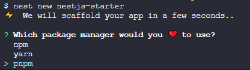
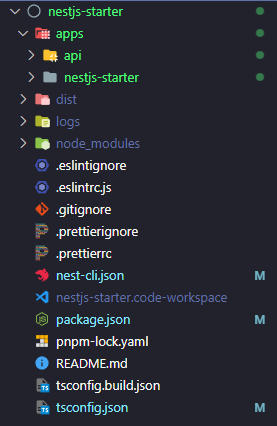
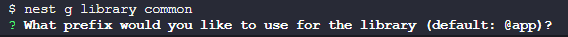
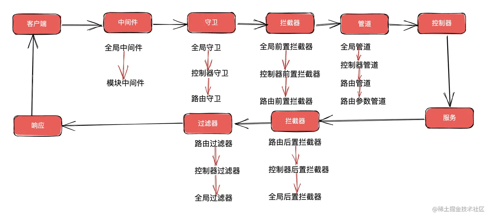

::: tip ✨
搭建一个 NestJS + TypeORM + TypeScript + Webpack + PM2 + ESLint + Prettier 的工程

[本工程的Github地址](https://github.com/welives/nestjs-starter)

编写此笔记时所使用的`NestJS`版本为`10.0.0`
:::

相关文档

- [NestJS](https://docs.nestjs.cn/)
- [TypeORM](https://typeorm.nodejs.cn/)
- [Prisma](https://prisma.nodejs.cn/)
- [Mongoose](https://mongoose.nodejs.cn/)
- [PM2](https://pm2.fenxianglu.cn/)
- [TypeScript](https://www.tslang.cn/)
- [ESLint](https://eslint.nodejs.cn/)
- [Prettier](https://prettier.nodejs.cn/)

## 项目初始化

先全局安装官方的脚手架，然后通过命令`nest new`创建项目

```sh
npm i -g @nestjs/cli
nest new nestjs-starter
```



修改`tsconfig.json`，增加一项`esModuleInterop`

```json
{
  "compilerOptions": {
    // ...
    "esModuleInterop": true // [!code ++]
  }
}
```

通过官方脚手架创建的项目已经帮我们集成好 ESLint 和 Prettier 了，我们只需根据自己的喜好修改配置即可

::: details 查看
::: code-group

```js [.eslintrc.js]
module.exports = {
  parser: '@typescript-eslint/parser',
  parserOptions: {
    project: 'tsconfig.json',
    tsconfigRootDir: __dirname,
    sourceType: 'module',
  },
  plugins: ['@typescript-eslint/eslint-plugin', 'prettier'],
  extends: [
    'eslint:recommended',
    'plugin:@typescript-eslint/recommended',
    'prettier',
    'plugin:prettier/recommended',
  ],
  root: true,
  env: {
    node: true,
    jest: true,
  },
  ignorePatterns: ['.eslintrc.js'],
  rules: {
    'prettier/prettier': 'error',
    complexity: ['error', 10],
    'no-console': process.env.NODE_ENV === 'production' ? 'warn' : 'off',
    'no-debugger': process.env.NODE_ENV === 'production' ? 'warn' : 'off',
    '@typescript-eslint/interface-name-prefix': 'off',
    '@typescript-eslint/explicit-function-return-type': 'off',
    '@typescript-eslint/explicit-module-boundary-types': 'off',
    '@typescript-eslint/no-explicit-any': 'off',
  },
}
```

```json [.prettierrc]
{
  "$schema": "https://json.schemastore.org/prettierrc",
  "semi": false,
  "tabWidth": 2,
  "printWidth": 120,
  "singleQuote": true,
  "trailingComma": "es5"
}
```

:::

## Monorepo

将项目改为`monorepo`模式，[详细的文档看这里](https://docs.nestjs.cn/10/cli?id=%e5%b7%a5%e4%bd%9c%e7%a9%ba%e9%97%b4)

```sh
nest g app api
```

执行这个命令之后，目录结构会变成类似下面这样



原先脚手架创建的标准应用会被收纳到`apps/nestjs-starter`目录下，但我现在要把它移除，改以`apps/api`作为主应用

- 删除`apps/nestjs-starter`目录

```sh
rm -rf apps/nestjs-starter
```

- 修改`nest-cli.json`

```json
{
  "$schema": "https://json.schemastore.org/nest-cli",
  "collection": "@nestjs/schematics",
  "sourceRoot": "apps/api/src", // [!code focus]
  "compilerOptions": {
    "deleteOutDir": true,
    "webpack": true,
    "tsConfigPath": "apps/api/tsconfig.app.json" // [!code focus]
  },
  "monorepo": true,
  "root": "apps/api", // [!code focus]
  "projects": {
    // ... // [!code focus:10]
    "api": {
      "type": "application",
      "root": "apps/api",
      "entryFile": "main",
      "sourceRoot": "apps/api/src",
      "compilerOptions": {
        "tsConfigPath": "apps/api/tsconfig.app.json"
      }
    }
  }
}
```

- 修改`package.json`

```json
{
  // ...
  "scripts": {
    // ...
    "start:prod": "node dist/apps/api/main", // [!code focus]
    "test:e2e": "jest --config ./apps/api/test/jest-e2e.json" // [!code focus]
  }
}
```

## 环境变量

[详细文档看这里](https://docs.nestjs.cn/10/techniques?id=%e9%85%8d%e7%bd%ae)

```sh
pnpm add @nestjs/config joi
pnpm add -D cross-env
```

新建`.env`和`.env.local`环境变量文件，填入自己的环境变量；修改`apps/api/src/app.module.ts`，在`imports`中新增`ConfigModule`配置项

```ts
import { ConfigModule } from '@nestjs/config' // [!code ++]
import Joi from 'joi' // [!code ++]
const envFilePath =
  process.env.NODE_ENV === 'production'
    ? ['.env.production.local', '.env.production']
    : [`.env.${process.env.NODE_ENV}.local`, '.env.local', '.env']
@Module({
  // ...
  imports: [
    ConfigModule.forRoot({
      isGlobal: true,
      envFilePath,
      validationSchema: Joi.object({
        NODE_ENV: Joi.string().valid('development', 'test', 'production').default('development'),
        APP_PORT: Joi.number().default(3000),
        JWT_SECRET: Joi.string().required(),
        JWT_EXPIRES_IN: Joi.string().default('7d'),
      }),
    }),
  ],
})
```

::: tip ⚡ 说明
其中`joi`包可以用来校验环境变量的值和类型，[相关文档看这里](https://joi.dev/)
:::

## 配置PM2

```sh
pnpm add -D pm2
touch ecosystem.config.js
touch .env.production
```

```js
const { name } = require('./package.json')
const path = require('path')

module.exports = {
  apps: [
    {
      name, // 应用程序名称
      cwd: './dist', // 启动应用程序的目录
      script: path.resolve(__dirname, './dist/apps/api/main.js'), // 启动脚本路径
      instances: require('os').cpus().length, // 要启动的应用实例数量
      max_memory_restart: '1G', // 超过指定的内存量，应用程序将重新启动
      autorestart: true, // 自动重启
      watch: true, // 启用监视和重启功能
      // 环境变量
      env: {
        NODE_ENV: 'production',
      },
    },
  ],
}
```

修改`package.json`

```json
{
  // ...
  "scripts": {
    // ...
    "build": "nest build && cp .env.production dist/",
    "start:prod": "cross-env NODE_ENV=production node dist/apps/api/main",
    "deploy": "pm2 start", // [!code ++]
    "deploy:stop": "pm2 stop all" // [!code ++]
  }
}
```

## Redis服务

```sh
pnpm add ioredis @liaoliaots/nestjs-redis
```

::: tip ⚡
`@liaoliaots/nestjs-redis` 这个包的使用文档[看这里](https://github.com/liaoliaots/nestjs-redis/blob/main/docs/latest/redis.md)
:::

修改`apps/api/src/app.module.ts`，在`imports`中新增`RedisModule`配置项

```ts
import { ConfigModule, ConfigService } from '@nestjs/config' // [!code ++]
import { RedisModule } from '@liaoliaots/nestjs-redis' // [!code ++]
@Module({
  imports:[
    // ... // [!code focus:23]
    ConfigModule.forRoot({
      validationSchema: Joi.object({
        // ...
        REDIS_PORT: Joi.number().default(6379),
        REDIS_HOST: Joi.string().default('127.0.0.1'),
        REDIS_USER: Joi.string().default('root'),
        REDIS_PWD: Joi.string().required(),
      }),
    }),
    RedisModule.forRootAsync({
      inject: [ConfigService],
      useFactory: (config: ConfigService) => {
        return {
          config: {
            host: config.get('REDIS_HOST'),
            port: config.get('REDIS_PORT'),
            username: config.get('REDIS_USER'),
            password: config.get('REDIS_PWD'),
          },
        }
      },
    }),
  ]
})
```

## 日志

```sh
pnpm add winston nest-winston winston-daily-rotate-file
```

修改`apps/api/src/app.module.ts`，在`imports`中新增`WinstonModule`配置项

```ts
import winston from 'winston' // [!code ++]
import { WinstonModule } from 'nest-winston' // [!code ++]
import 'winston-daily-rotate-file' // [!code ++]
@Module({
  // ...
  imports: [
    // ... // [!code focus:20]
    WinstonModule.forRoot({
      exitOnError: false, // 出现 uncaughtException 时是否 process.exit
      transports: [
        new winston.transports.DailyRotateFile({
          silent: process.env.NODE_ENV !== 'production',
          dirname: 'logs/api', // 日志保存的目录
          filename: '%DATE%.log', // 日志名称，占位符 %DATE% 取值为 datePattern 值
          datePattern: 'YYYY-MM-DD', // 日志轮换的频率，此处表示每天
          zippedArchive: true, // 是否通过压缩的方式归档被轮换的日志文件
          maxSize: '20m', // 设置日志文件的最大大小，m 表示 mb
          maxFiles: '14d', // 保留日志文件的最大天数，此处表示自动删除超过 14 天的日志文件
          // 记录时添加时间戳信息
          format: winston.format.combine(
            winston.format.timestamp({ format: 'YYYY-MM-DD HH:mm:ss' }),
            winston.format.json()
          ),
        }),
      ],
    }),
  ],
})
```

## 项目公共库

[详细的文档看这里](https://docs.nestjs.cn/10/cli?id=%e5%ba%93-1)

```sh
nest g library common
```

这里提示可以设置自定义的路径别名，我这里设置为`@libs`，不填的话默认是`@app`



执行命令后会在根目录生成一个`libs`文件夹，这里一般用来写项目的公共函数和服务。一个项目可以有多个公共库

### 工具类

新建`libs/common/src/utils/index.ts`

::: details 查看

```ts
import { Request } from 'express'
const singletonEnforcer = Symbol()
class Utils {
  private static _instance: Utils
  constructor(enforcer: any) {
    if (enforcer !== singletonEnforcer) {
      throw new Error('Cannot initialize Utils single instance')
    }
  }
  static get instance() {
    // 如果已经存在实例则直接返回, 否则实例化后返回
    this._instance || (this._instance = new Utils(singletonEnforcer))
    return this._instance
  }
  /** 获取请求信息 */
  getReqForLogger(req: Request): Record<string, any> {
    const { url, headers, method, body, params, query, connection } = req
    const xRealIp = headers['X-Real-IP']
    const xForwardedFor = headers['X-Forwarded-For']
    const { ip: cIp } = req
    const { remoteAddress } = connection || {}
    const ip = xRealIp || xForwardedFor || cIp || remoteAddress
    return {
      url,
      host: headers.host,
      ip,
      method,
      body,
      params,
      query,
    }
  }
}
export default Utils.instance
```

:::

### 自定义异常

新建`libs/common/src/exceptions/api-exception.ts`

```ts
import { HttpException, HttpStatus } from '@nestjs/common'
export class ApiException extends HttpException {
  /**
   * @param msg 业务消息
   * @param code 业务码
   */
  constructor(msg = '', code = 'E0001') {
    super({ code, message: msg, success: false }, HttpStatus.OK)
  }
}
```

### 类型接口

在`common`库中创建一个类型接口，用来描述用户请求的携带数据

```sh
nest g interface user-request interface -p common --flat
```

```ts
import { Request } from '@nestjs/common'
export interface UserRequest extends Request {
  user: {
    id: number | string
    username: string
    role: number
    avatar: string
    [key: string]: any
  }
}
```

### 装饰器

在`common`库中创建用户装饰器和开放接口装饰器

```sh
nest g decorator user decorators -p common --flat --no-spec
nest g decorator public-api decorators -p common --flat --no-spec
```

::: code-group

```ts [user.decorator.ts]
import { createParamDecorator, ExecutionContext } from '@nestjs/common'
/** 获取请求中携带的用户信息 */
export const User = createParamDecorator((data: string, ctx: ExecutionContext) => {
  const request = ctx.switchToHttp().getRequest()
  const user = request.user
  return data ? user && user[data] : user
})
```

```ts [public-api.decorator.ts]
import { SetMetadata } from '@nestjs/common'
export const IS_PUBLIC_API = Symbol('IS_PUBLIC_API')
/** 开放接口装饰器 */
export const PublicApi = () => SetMetadata(IS_PUBLIC_API, true)
```

:::

## 生命周期



## 中间件

`NestJS`中的中间件（`Middleware`）是一种用于处理`HTTP`请求的函数，它可以在请求到达控制器之前或之后执行一些操作。中间件可以用于实现身份验证、日志记录、错误处理等功能。在`NestJS`中，中间件可以是全局的，也可以是局部的

### 全局中间件

在`common`库中创建日志中间件和接口维护中间件

```sh
nest g mi logger middlewares -p common --flat --no-spec
nest g mi maint middlewares -p common --flat --no-spec
```

::: code-group

```ts [logger.middleware.ts]
import { Inject, Injectable, NestMiddleware } from '@nestjs/common'
import { NextFunction, Request, Response } from 'express'
import { WINSTON_MODULE_PROVIDER } from 'nest-winston'
import { Logger } from 'winston'
import Utils from '../utils'

@Injectable()
export class LoggerMiddleware implements NestMiddleware {
  constructor(@Inject(WINSTON_MODULE_PROVIDER) private readonly logger: Logger) {}
  use(req: Request, res: Response, next: NextFunction) {
    this.logger.info('route', { request: Utils.getReqForLogger(req) })
    next()
  }
}
```

```ts [maint.middleware.ts]
import { Injectable, NestMiddleware } from '@nestjs/common'
import { NextFunction, Request, Response } from 'express'
import { InjectRedis } from '@liaoliaots/nestjs-redis'
import Redis from 'ioredis'
import { ApiException } from '../exceptions/api-exception'
interface IMaintenance {
  type: 'ALL' | 'PART' // 维护类型
  message: string // 维护信息
  list?: string[] // type 为 PART 时指定的维护接口
}
const REDIS_MAINT_KEY = '@@REDIS_MAINT_KEY'
@Injectable()
export class MaintMiddleware implements NestMiddleware {
  constructor(@InjectRedis() private readonly redis: Redis) {}
  async use(req: Request, res: Response, next: NextFunction) {
    const { url, method } = req
    const currentApi = `${method.toLowerCase()}:${url}`
    const maintData: IMaintenance | null = JSON.parse(await this.redis.get(REDIS_MAINT_KEY))
    if (maintData) {
      switch (maintData.type) {
        case 'ALL':
          throw new ApiException(maintData.message)
        case 'PART':
          if (maintData?.list.includes(currentApi)) throw new ApiException(maintData.message)
        default:
          break
      }
    }
    next()
  }
}
```

:::

修改`apps/api/src/app.module.ts`，应用全局中间件

```ts
// ...
import { MiddlewareConsumer, Module, NestModule, RequestMethod } from '@nestjs/common' // [!code focus]
import { LoggerMiddleware, MaintMiddleware } from '@libs/common' // [!code focus]
@Module({
  // ...
})
// [!code focus:8]
export class AppModule implements NestModule {
  configure(consumer: MiddlewareConsumer) {
    consumer
      .apply(MaintMiddleware, LoggerMiddleware)
      .exclude({ path: 'swagger/(.*)', method: RequestMethod.ALL })
      .forRoutes({ path: '*', method: RequestMethod.ALL })
  }
}
```

## 守卫

`NestJS`中的守卫（`Guard`）是一种用于保护路由的机制，它可以在请求到达控制器之前或之后执行一些操作。守卫可以用于实现身份验证、权限控制、缓存等功能。在`NestJS`中，守卫可以是全局的，也可以是局部的

### 全局守卫

在`api`应用中创建一个守卫

```sh
nest g guard jwt-auth guards -p api --flat --no-spec
```

```ts
import { CanActivate, ExecutionContext, Injectable } from '@nestjs/common'
import { Reflector } from '@nestjs/core'
import { IS_PUBLIC_API } from '@libs/common'
@Injectable()
export class JwtAuthGuard implements CanActivate {
  constructor(private readonly reflector: Reflector) {}
  async canActivate(context: ExecutionContext): Promise<boolean> {
    // 如果是公共开放接口,则直接放行
    if (this.reflector.get(IS_PUBLIC_API, context.getHandler())) return true
    return true
  }
}
```

修改`apps/api/src/app.module.ts`，应用全局守卫

```ts
// ...
import { APP_GUARD } from '@nestjs/core' // [!code focus]
import { JwtAuthGuard } from './guards/jwt-auth.guard' // [!code focus]
@Module({
  // ...
  providers: [
    // ... // [!code focus:5]
    {
      provide: APP_GUARD,
      useClass: JwtAuthGuard,
    },
  ],
})
```

## 拦截器

`NestJS`中的拦截器（`Interceptor`）是一种用于处理`HTTP`请求和响应的函数，它可以在请求到达控制器之前或之后执行一些操作。拦截器可以用于实现日志记录、错误处理、数据转换等功能。在`NestJS`中，拦截器可以是全局的，也可以是局部的

### 全局拦截器

在`common`库中创建一个拦截器

```sh
nest g interceptor transform interceptors -p common --flat --no-spec
```

```ts
import { CallHandler, ExecutionContext, Inject, Injectable, NestInterceptor } from '@nestjs/common'
import { Observable, map } from 'rxjs'
import { Request } from 'express'
import { WINSTON_MODULE_PROVIDER } from 'nest-winston'
import { Logger } from 'winston'
import Utils from '../utils'

@Injectable()
export class TransformInterceptor implements NestInterceptor {
  constructor(@Inject(WINSTON_MODULE_PROVIDER) private readonly logger: Logger) {}
  intercept(context: ExecutionContext, next: CallHandler): Observable<any> {
    const req = context.switchToHttp().getRequest<Request>()
    const now = Date.now()
    return next.handle().pipe(
      map((data) => {
        console.log(`本次请求处理耗时 ${Date.now() - now}ms`)
        this.logger.info('response', { data, request: Utils.getReqForLogger(req) })
        return { code: '200', message: 'ok', success: true, data }
      })
    )
  }
}
```

修改`apps/api/src/app.module.ts`，应用全局拦截器

```ts
// ...
import { APP_INTERCEPTOR } from '@nestjs/core' // [!code focus]
import { TransformInterceptor } from '@libs/common' // [!code focus]
@Module({
  // ...
  providers: [
    // ... // [!code focus:5]
    {
      provide: APP_INTERCEPTOR,
      useClass: TransformInterceptor,
    },
  ],
})
```

## 过滤器

`NestJS`中的过滤器（`Filter`）是一种用于处理`HTTP`请求和响应的函数，它可以在请求到达控制器之前或之后执行一些操作。过滤器可以用于实现数据转换、错误处理、响应格式化等功能。在`NestJS`中，过滤器可以是全局的，也可以是局部的

### 全局过滤器

在`common`库中创建一个异常过滤器

```sh
nest g filter unify-exception filters -p common --flat --no-spec
```

::: details 查看`unify-exception.filter.ts`

```ts
import {
  ArgumentsHost,
  Catch,
  ExceptionFilter,
  HttpException,
  HttpStatus,
  Inject,
} from '@nestjs/common'
import { Request, Response } from 'express'
import { WINSTON_MODULE_PROVIDER } from 'nest-winston'
import { Logger } from 'winston'
import dayjs from 'dayjs'
import Utils from '../utils'

@Catch()
export class UnifyExceptionFilter implements ExceptionFilter {
  constructor(@Inject(WINSTON_MODULE_PROVIDER) private readonly logger: Logger) {}
  catch(exception: any, host: ArgumentsHost) {
    const ctx = host.switchToHttp()
    const request = ctx.getRequest<Request>()
    const response = ctx.getResponse<Response>()
    const status =
      exception instanceof HttpException ? exception.getStatus() : HttpStatus.INTERNAL_SERVER_ERROR
    const data = {
      success: false,
      code: void 0,
      message: status >= 500 ? exception.message ?? 'Server Error' : 'Client Error',
      url: request.url,
      timestamp: dayjs().format('YYYY-MM-DD HH:mm:ss'),
    }
    if (exception instanceof HttpException) {
      const res: any = exception.getResponse()
      if (Object.prototype.toString.call(res) === '[object Object]') {
        res.message && (data.message = res.message)
        res.code && (data.code = res.code)
      }
    }
    this.logger.error('exception', {
      status,
      request: Utils.getReqForLogger(request),
    })
    response.status(status).json(data)
  }
}
```

:::

修改`apps/api/src/app.module.ts`，应用全局异常过滤器

```ts
// ...
import { APP_FILTER } from '@nestjs/core' // [!code focus]
import { UnifyExceptionFilter } from '@libs/common' // [!code focus]
@Module({
  // ...
  providers: [
    // ... // [!code focus:5]
    {
      provide: APP_FILTER,
      useClass: UnifyExceptionFilter,
    },
  ],
})
```

## 管道

```sh
pnpm add class-validator class-transformer
```

修改`apps/api/src/main.ts`，启用全局管道

```ts
import { ValidationPipe } from '@nestjs/common' // [!code ++]
async function bootstrap() {
  // ...
  app.useGlobalPipes(
    new ValidationPipe({
      whitelist: true, // 白名单模式，建议设置，否则不存在于 dto 对象中的键值也会被使用
      transform: true,
    })
  )
}
```

## Swagger

[详细的文档看这里](https://docs.nestjs.cn/10/openapi)

```sh
pnpm add @nestjs/swagger swagger-ui-express
```

修改`apps/api/src/main.ts`，配置`Swagger`

```ts
import { DocumentBuilder, SwaggerModule } from '@nestjs/swagger' // [!code ++]
async function bootstrap() {
  // ...
  if (process.env.NODE_ENV !== 'production') {
    const options = new DocumentBuilder()
      .setTitle('NestJS-Starter')
      .setDescription('一个NestJS + TypeScript + PM2 + ESLint + Prettier 的基础项目')
      .setVersion('1.0')
      .build()
    const document = SwaggerModule.createDocument(app, options)
    SwaggerModule.setup('swagger', app, document)
  }
}
```

启动项目，然后打开 `http://localhost:3000/swagger` 就能查看接口文档了

## JWT

```sh
pnpm add ms passport passport-jwt passport-local @nestjs/passport @nestjs/jwt
pnpm add -D @types/ms @types/passport-jwt @types/passport-local
```

创建`Auth`模块，并新建`jwt`策略和`local`策略文件

```sh
nest g res auth -p api --no-spec
nest g class jwt.strategy auth -p api --flat --no-spec
nest g class local.strategy auth -p api --flat --no-spec
```

修改`libs/common/src/utils/index.ts`，添加加密用的方法

```ts
import crypto from 'node:crypto' // [!code ++]
class Utils {
  // ... // [!code focus:17]
  /** 生成加密盐 */
  genSalt() {
    return crypto.randomBytes(16).toString('base64')
  }
  /**
   * 密码加密
   * @param password 原密码
   * @param salt 加密盐
   */
  encryptPassword(password: string, salt: string) {
    if (!password || !salt) {
      throw new Error('password or salt is empty')
    }
    const tempSalt = Buffer.from(salt, 'base64')
    return crypto.createHmac('sha256', tempSalt).update(password).digest('hex')
  }
}
```

### 编写`local`策略

::: details 查看`local.strategy.ts`

```ts
import {
  ForbiddenException,
  Injectable,
  NotFoundException,
  UnauthorizedException,
} from '@nestjs/common'
import { PassportStrategy } from '@nestjs/passport'
import { Strategy } from 'passport-local'
import { AuthService } from './auth.service'

@Injectable()
export class LocalStrategy extends PassportStrategy(Strategy) {
  constructor(private readonly authService: AuthService) {
    super()
  }
  /** 校验登录信息, 校验通过后会把返回值挂载到 request.user 上 */
  async validate(username: string, password: string): Promise<any> {
    const res = await this.authService.validateUser({ username, password })
    switch (res.type) {
      case 'NORMAL':
        return res.result
      case 'INCORRECT':
        throw new UnauthorizedException(res.message)
      case 'FORBIDDEN':
        throw new ForbiddenException(res.message)
      default:
        throw new NotFoundException(res.message)
    }
  }
}
```

:::

### 登录验证逻辑

由于目前还没有使用数据库，所以先用假数据模拟

::: details 查看`auth.service.ts`

```ts
import { Injectable } from '@nestjs/common'
import { ConfigService } from '@nestjs/config'
import { JwtService } from '@nestjs/jwt'
import { InjectRedis } from '@liaoliaots/nestjs-redis'
import Redis from 'ioredis'
import ms from 'ms'
import { Utils } from '@libs/common'

interface ValidResult {
  type: 'NO_EXIST' | 'FORBIDDEN' | 'INCORRECT' | 'NORMAL'
  message: string
  result: any
}
enum UserStatus {
  NORMAL = 0, // 正常
  LOCKED = 1, // 锁定
  BANNED = 2, // 封禁
}

@Injectable()
export class AuthService {
  constructor(
    @InjectRedis() private readonly redis: Redis,
    private readonly config: ConfigService,
    private readonly jwtService: JwtService
  ) {}
  /**
   * 校验用户信息
   * @param data
   */
  async validateUser(data: { username: string; password: string }): Promise<ValidResult> {
    // TODO 查询数据库校验登录用户信息
    const faker = {
      id: 1,
      username: 'jandan',
      role: 0,
      avatar: '',
      password: 'ad1b1d9d48755cae4cfc406a888fb097cbf18346abdc85569b971a96b620b528', // 123456
      salt: 'sycLRIsMcYuhh2ijW5gWFg==',
      status: UserStatus.NORMAL,
    }
    if (!faker) {
      return {
        type: 'NO_EXIST',
        message: '用户不存在',
        result: null,
      }
    }
    if (faker.status !== UserStatus.NORMAL) {
      return {
        type: 'FORBIDDEN',
        message: '用户已被锁定',
        result: null,
      }
    }
    const isCorrect = faker.password === Utils.encryptPassword(data.password, faker.salt)
    if (!isCorrect) {
      return {
        type: 'INCORRECT',
        message: '账号或密码错误',
        result: null,
      }
    }
    const { password, salt, ...result } = faker
    return {
      type: 'NORMAL',
      message: 'ok',
      result,
    }
  }
  /**
   * 签发JWT
   * @param user
   */
  async certificate(user: any) {
    const token = this.jwtService.sign(user)
    const expires = parseInt(ms(this.config.get('JWT_EXPIRES_IN')))
    await this.redis.setex(`uid:${user.id}`, expires / 1000, token)
    return token
  }
}
```

:::

### 登录接口

::: details 查看`auth.controller.ts`

```ts
import { Controller, Post, UseGuards, Request } from '@nestjs/common'
import { ApiBody, ApiOperation, ApiTags } from '@nestjs/swagger'
import { AuthGuard } from '@nestjs/passport'
import { PublicApi, UserRequest } from '@libs/common'
import { AuthService } from './auth.service'
import { LoginDTO } from './dto/auth.dto'

@ApiTags('Auth模块')
@Controller('auth')
export class AuthController {
  constructor(private readonly authService: AuthService) {}
  /**
   * 登录接口
   */
  @ApiOperation({ summary: '登录接口' })
  @ApiBody({ type: LoginDTO })
  @PublicApi()
  @UseGuards(AuthGuard('local'))
  @Post('login')
  async login(@Request() request: UserRequest) {
    return { token: await this.authService.certificate(request.user) }
  }
}
```

:::

### 接口入参校验

新建`apps/api/src/auth/dto/auth.dto.ts`

```ts
import { ApiProperty } from '@nestjs/swagger'
import { IsString, IsNotEmpty } from 'class-validator'

export class LoginDTO {
  @ApiProperty({ required: true, type: String, description: '用户名' })
  @IsNotEmpty({ message: '用户名不能为空' })
  @IsString({ message: '用户名只能是 String 类型' })
  readonly username: string

  @ApiProperty({ required: true, type: String, description: '密码' })
  @IsNotEmpty({ message: '密码不能为空' })
  @IsString({ message: '密码只能是 String 类型' })
  readonly password: string
}
```

由于`local`策略属于守卫，它的执行时机早于装饰器(管道)校验，对于这种情况需要把入参校验放到模块中间件去处理

```sh
nest g mi login middlewares -p api --flat --no-spec
```

```ts
import { BadRequestException, Injectable, NestMiddleware } from '@nestjs/common'
import { Request, Response, NextFunction } from 'express'
import { validate } from 'class-validator'
import { LoginDTO } from '../auth/dto/auth.dto'

@Injectable()
export class LoginMiddleware implements NestMiddleware {
  async use(req: Request, res: Response, next: NextFunction) {
    const body = req.body
    if (Object.keys(body).length !== 0) {
      const loginDto = new LoginDTO()
      Object.keys(body).forEach((key) => {
        loginDto[key] = body[key]
      })
      const errors = await validate(loginDto)
      if (errors.length > 0) {
        const msg = Object.values(errors[0].constraints)[0] // 只取第一个错误信息即可
        throw new BadRequestException(msg)
      }
    }
    next()
  }
}
```

### 编写`jwt`策略

::: details 查看`jwt.strategy.ts`

```ts
import { Injectable } from '@nestjs/common'
import { ConfigService } from '@nestjs/config'
import { PassportStrategy } from '@nestjs/passport'
import { ExtractJwt, Strategy } from 'passport-jwt'

@Injectable()
export class JwtStrategy extends PassportStrategy(Strategy) {
  constructor(private readonly config: ConfigService) {
    super({
      jwtFromRequest: ExtractJwt.fromAuthHeaderAsBearerToken(), // 解析header头中的Bearer token
      ignoreExpiration: false,
      secretOrKey: config.get('JWT_SECRET'),
    })
  }

  /** 校验JWT, 校验通过后会把解析出来的 payload 挂载到 request.user 上 */
  async validate(payload: any) {
    const { iat, exp, ...rest } = payload
    return rest
  }
}
```

:::

### 注册到`AuthModule`

::: details 查看`auth.module.ts`

```ts
import { MiddlewareConsumer, Module, NestModule, RequestMethod } from '@nestjs/common'
import { ConfigService } from '@nestjs/config'
import { PassportModule } from '@nestjs/passport'
import { JwtModule } from '@nestjs/jwt'
import { AuthService } from './auth.service'
import { AuthController } from './auth.controller'
import { LocalStrategy } from './local.strategy'
import { JwtStrategy } from './jwt.strategy'
import { LoginMiddleware } from '../middlewares/login.middleware'

@Module({
  imports: [
    PassportModule.register({ defaultStrategy: 'jwt' }),
    JwtModule.registerAsync({
      inject: [ConfigService],
      useFactory: (config: ConfigService) => {
        return {
          secret: config.get('JWT_SECRET'),
          signOptions: { expiresIn: config.get('JWT_EXPIRES_IN') },
        }
      },
    }),
  ],
  controllers: [AuthController],
  providers: [AuthService, LocalStrategy, JwtStrategy],
  exports: [AuthService],
})
export class AuthModule implements NestModule {
  configure(consumer: MiddlewareConsumer) {
    consumer.apply(LoginMiddleware).forRoutes({ path: 'auth/login', method: RequestMethod.POST })
  }
}
```

:::

### 更新全局守卫

::: details 查看`jwt-auth.guard.ts`

```ts
import { ExecutionContext, Injectable, UnauthorizedException } from '@nestjs/common'
import { Reflector } from '@nestjs/core'
import { InjectRedis } from '@liaoliaots/nestjs-redis'
import Redis from 'ioredis'
import { AuthGuard } from '@nestjs/passport'
import { IS_PUBLIC_API, UserRequest } from '@libs/common'

@Injectable()
export class JwtAuthGuard extends AuthGuard('jwt') {
  constructor(
    @InjectRedis() private readonly redis: Redis,
    private readonly reflector: Reflector
  ) {
    super()
  }
  async canActivate(context: ExecutionContext): Promise<boolean> {
    // 如果是公共开放接口,则直接放行
    if (this.reflector.get(IS_PUBLIC_API, context.getHandler())) return true
    await super.canActivate(context) // 执行父类中的JWT校验
    try {
      let token = context.switchToRpc().getData().headers.authorization
      token = token.split(' ')[1]
      const { user } = context.switchToHttp().getRequest<UserRequest>()
      // 去获取缓存里的 token
      const cacheToken = await this.redis.get(`uid:${user.id}`)
      if (!cacheToken) {
        throw new UnauthorizedException('非法请求，请先登录！')
      } else if (cacheToken !== token) {
        throw new UnauthorizedException('您的账号已在其他地方登录，请重新登录！')
      }
      return true
    } catch (error) {
      throw new UnauthorizedException(error.message || '用户信息解析失败，请重新登录！')
    }
  }
}
```

:::

::: tip 🎉
基础的框架封装到这里就结束了
:::
