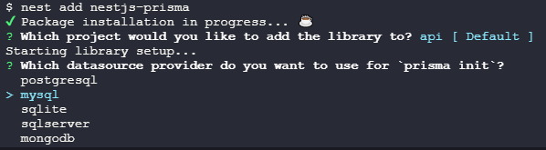

先前我们已经创建好了一个[基础的`NestJS`工程](./create.md)，接下来我们来给它加上数据库功能

本例子将使用`Prisma`连接数据库

## 创建数据库服务

我这里使用的是一个[免费的线上服务](https://methodot.com/)进行临时测试，具体可以根据自己手头上的资源进行选择

创建完毕后将相关配置信息填入环境变量文件

## 集成插件

```sh
nest add nestjs-prisma
pnpm add -D dotenv-cli
```



### 数据库配置

修改`apps/api/src/app.module.ts`，在`imports`中增加`PrismaModule`配置项和相关的环境变量

::: code-group

```ts [mysql]
import { PrismaModule } from 'nestjs-prisma' // [!code ++]
@Module({
  imports: [
    ConfigModule.forRoot({
      validationSchema: Joi.object({
        // ...
        MYSQL_URL: Joi.string().required(),
        MYSQL_HOST: Joi.string().required(),
        MYSQL_PORT: Joi.number().default(3306),
        MYSQL_USER: Joi.string().default('root'),
        MYSQL_PWD: Joi.string().required(),
        MYSQL_DBNAME: Joi.string().required(),
        CHARSET: Joi.string().default('utf8'),
        TIMEZONE: Joi.string().default('Asia/Shanghai'),
      }),
    }),
    PrismaModule.forRootAsync({
      isGlobal: true,
      inject: [ConfigService],
      useFactory: (config: ConfigService) => {
        const NODE_ENV = config.get('NODE_ENV')
        return {
          prismaOptions: {
            log: NODE_ENV === 'production' ? ['error'] : ['info', 'warn', 'error'],
            datasourceUrl: config.get('MYSQL_URL'),
          },
        }
      },
    }),
  ]
})
```

```ts [mongodb]
import { PrismaModule } from 'nestjs-prisma' // [!code ++]
@Module({
  imports: [
    ConfigModule.forRoot({
      validationSchema: Joi.object({
        // ...
        MONGODB_URL: Joi.string().required(),
      }),
    }),
    PrismaModule.forRootAsync({
      isGlobal: true,
      inject: [ConfigService],
      useFactory: (config: ConfigService) => {
        const NODE_ENV = config.get('NODE_ENV')
        return {
          prismaOptions: {
            log: NODE_ENV === 'production' ? ['error'] : ['info', 'warn', 'error'],
            datasourceUrl: config.get('MONGODB_URL'),
          },
        }
      },
    }),
  ]
})
```

:::

## 手动配置

```sh
pnpm add @prisma/client
pnpm add -D prisma dotenv-cli
```

### 初始化Prisma

初始化`Prisma`，执行`npx prisma init`，然后项目根目录会自动生成`prisma/schema.prisma`文件，根据项目情况对其进行修改

::: code-group

```ini [mysql]
generator client {
  provider = "prisma-client-js"
}
// [!code focus:6]
datasource db {
  provider     = "mysql"
  url          = env("MYSQL_URL")
  relationMode = "prisma"
}
```

```ini [mongodb]
generator client {
  provider = "prisma-client-js"
}
// [!code focus:6]
datasource db {
  provider     = "mongodb"
  url          = env("MONGODB_URL")
  relationMode = "prisma"
}
```

:::

::: tip 提示
`MYSQL_URL`是`.env`文件中的数据库环境变量

`relationMode`的作用是定义表的外键关系模式，这里用的是`prisma`模式，即虚拟外键
:::

修改`tsconfig.build.json`，把`prisma`文件夹加入排除项

```json
{
  "extends": "./tsconfig.json",
  "exclude": ["node_modules", "test", "dist", "**/*spec.ts", "prisma"] // [!code hl]
}
```

### Prisma模块

```sh
nest g library prisma --no-spec
```

::: code-group

```ts [prisma.module.ts]
import { Global, Module } from '@nestjs/common'
import { PrismaService } from './prisma.service'

@Global()
@Module({
  providers: [PrismaService],
  exports: [PrismaService],
})
export class PrismaModule {}
```

```ts [prisma.service.ts]
import { INestApplication, Injectable, OnModuleInit } from '@nestjs/common'
import { PrismaClient } from '@prisma/client'

@Injectable()
export class PrismaService extends PrismaClient implements OnModuleInit {
  constructor() {
    super({
      log: process.env.NODE_ENV === 'production' ? ['error'] : ['info', 'warn', 'error'],
    })
  }
  async onModuleInit(): Promise<void> {
    await this.$connect()
  }
}
```

:::

修改`apps/api/src/main.ts`

```ts
// ...
async function bootstrap() {
  // ...
  app.enableShutdownHooks()
}
```

## 更新启动脚本

目前的`Prisma`在`NestJS`中使用时有个大问题，就是项目启动后，会因为`Prisma`读取了`.env`文件而覆盖掉`NestJS`中配置好的环境变量读取规则

因此启动脚本需要使用`dotenv-cli`插件来显式指定要加载的`env`文件，这里以`start:dev`脚本为例

```json
{
  "scripts": {
    // ...
    "start:dev": "dotenv -e .env.local -- nest start --watch"
  }
}
```

## 定义模型

如果数据表之前已经建好，那么执行`npx prisma db pull`会自动根据表生成模型并增量更新`prisma/schema.prisma`文件

::: warning 注意
由于`Prisma`默认只读取`.env`文件中的环境变量，如果有多份环境变量配置的话，需要手动指定`env`文件，例如`npx dotenv -e .env.local -- npx prisma db pull`
:::

如果没有数据表，那么需要手动定义模型，这里以`user`表为例

编辑`prisma/schema.prisma`文件，增加如下内容，然后执行`npx prisma db push`会根据模型信息自动创建表

::: code-group

```ini [mysql]
model user {
  id       Int     @id @default(autoincrement()) @db.UnsignedInt
  username String  @db.VarChar(50)
  password String  @db.VarChar(100)
  role     Int     @default(0) @db.UnsignedTinyInt
  avatar   String? @default("") @db.VarChar(255)
  salt     String  @db.VarChar(50)
  status   Int     @default(0) @db.UnsignedTinyInt
}
```

```ini [mongodb]
model user {
  id       String @id @default(auto()) @map("_id") @db.ObjectId
  avatar   String
  password String
  role     Int
  salt     String
  status   Int
  username String @unique(map: "username_1")
}
```

:::

生成模型实体

```sh
npx prisma generate
```

## CURD

修改`apps/api/src/auth/auth.service.ts`，把之前的模拟数据替换为从数据库查出来的

```ts
// 手动配置时
import { PrismaService } from '@libs/prisma' // [!code ++]
// 使用集成插件时
import { PrismaService } from 'nestjs-prisma' // [!code ++]
enum UserStatus {
  NORMAL = 0,
  LOCKED = 1,
  BANNED = 2,
}
export class AuthService {
  constructor(
    // ...
    private readonly prisma: PrismaService // [!code ++]
  ) {}
  async validateUser(data: { username: string; password: string }): Promise<ValidResult> {
    const user = await this.prisma.user.findFirst({ where: { username: data.username } }) // [!code ++]
    // ...
  }
}
```
