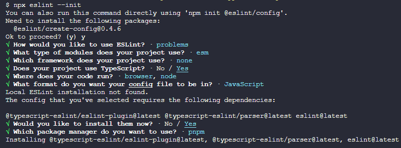
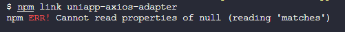
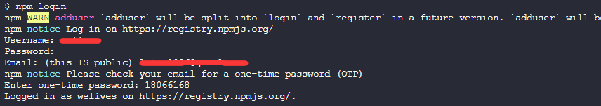
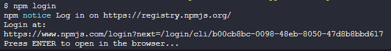

::: tip ✨
制作一个 `npm` 包并发布，这里以我自己写的适用于`uni-app`的`axios`适配器插件为例

这里使用的打包工具是`rollup`

本笔记的着重点是如何将编写的插件打包并发布至`npm`，所以核心逻辑不会详细讲解，而是直接贴出代码

[本工程的Github地址](https://github.com/welives/uniapp-axios-adapter)
:::

## 相关文档

- [npm](https://npm.nodejs.cn/)
- [rollup](https://rollup.nodejs.cn/)
- [uni-app](https://zh.uniapp.dcloud.io/api/request/request.html)
- [axios](https://axios-http.com/zh/)

## 项目初始化

```sh
mkdir uniapp-axios-adapter && cd uniapp-axios-adapter
pnpm init
git init
pnpm add -D typescript
npx tsc --init
mkdir src
touch .npmignore
```

编辑`.npmignore`

```
**/*
!/dist/**
!LICENSE
!README.md
!package.json
```

编辑`tsconfig.json`，最初配置如下，之后随着项目的开发还会有调整

```json
{
  "compilerOptions": {
    "module": "ESNext",
    "target": "esnext",
    "outDir": "./dist",
    "baseUrl": ".",
    "moduleResolution": "node",
    "strict": true,
    "sourceMap": true,
    "declaration": true,
    "esModuleInterop": true,
    "forceConsistentCasingInFileNames": true
  },
  "include": ["src"],
  "exclude": ["node_modules", "dist"]
}
```

为了规范代码的编写，接下来安装`ESLint`和`Prettier`

### 安装ESLint

```sh
npx eslint --init
```



### 安装Prettier

```sh
pnpm add -D prettier eslint-config-prettier eslint-plugin-prettier
touch .prettierrc
```

编辑`.prettierrc`

```json
{
  "$schema": "https://json.schemastore.org/prettierrc",
  "semi": false,
  "tabWidth": 2,
  "printWidth": 120,
  "singleQuote": true,
  "trailingComma": "es5"
}
```

编辑`.eslintrc.js`

```js
module.exports = {
  root: true, // [!code ++]
  env: {
    browser: true,
    es2021: true,
    node: true,
  },
  extends: [
    'eslint:recommended',
    'plugin:@typescript-eslint/recommended',
    'prettier', // [!code ++]
    'plugin:prettier/recommended', // [!code ++]
  ],
  overrides: [
    {
      env: {
        node: true,
      },
      files: ['.eslintrc.{js,cjs}'],
      parserOptions: {
        sourceType: 'script',
      },
    },
  ],
  parser: '@typescript-eslint/parser',
  parserOptions: {
    ecmaVersion: 'latest',
    sourceType: 'module',
  },
  plugins: ['@typescript-eslint', 'prettier'], // [!code ++]
  rules: {
    'prettier/prettier': 'error', // [!code ++]
    complexity: ['error', 10], // [!code ++]
  },
}
```

## 添加依赖

因为此插件的目的是让`axios`能在`uni-app`中正常使用，所有需要以它们作为基础依赖，编辑`package.json`，增加`peerDependencies`字段，并填入相关依赖

```json
{
  // ...
  "peerDependencies": {
    "axios": "*",
    "@dcloudio/types": "*"
  }
}
```

编辑`tsconfig.json`，指定`uni-app`的类型源

```json
{
  "compilerOptions": {
    "types": ["@dcloudio/types"] // [!code ++]
  }
}
```

添加完毕后执行`pnpm install`

## 编写逻辑

新建`src/index.ts`用来编写适配器主要逻辑并作为插件入口，新建`src/utils.ts`用来编写一些工具函数

::: code-group

```ts [index.ts]
import type {
  AxiosRequestConfig,
  AxiosPromise,
  ParamsSerializerOptions,
  AxiosResponse,
} from 'axios'
import { AxiosError } from 'axios'
import utils, { AnyObj } from './utils'

export type HttpTask = UniApp.RequestTask | UniApp.UploadTask | UniApp.DownloadTask | null

export interface UploadData {
  files?: UniApp.UploadFileOptionFiles[]
  fileType?: 'image' | 'video' | 'audio'
  file?: UniApp.ChooseImageSuccessCallbackResultFile | File
  filePath?: string
  name?: string
}
export interface UniAppAxiosAdapterConfig<T = HttpTask> extends AxiosRequestConfig {
  /** @description 扩展的请求方法 */
  extMethod?: 'UPLOAD' | 'DOWNLOAD'
  /** @description 由于使用axios的data字段装载文件时会触发FormData对象, 所以改此字段来装载 uni.uploadFile 所用到的文件参数 */
  uploadData?: UploadData
  /** @description 返回当前请求的 task 和 options，不要在这里修改 options */
  getTask?: (task: T, options: UniAppAxiosAdapterConfig<T>) => void
  /** @description 用来兼容axios中没有而uni-app中才有的字段, 例如 上传API中的formData */
  [key: string]: any
}

function settle(resolve: Function, reject: Function, response: AxiosResponse) {
  const validateStatus = response.config.validateStatus
  if (!response.status || !validateStatus || validateStatus(response.status)) {
    resolve(response)
  } else {
    reject(
      new AxiosError(
        'Request failed with status code ' + response.status,
        [AxiosError.ERR_BAD_REQUEST, AxiosError.ERR_BAD_RESPONSE][
          Math.floor(response.status / 100) - 4
        ],
        response.config,
        response.request,
        response
      )
    )
  }
}

export default (config: UniAppAxiosAdapterConfig): AxiosPromise => {
  if (!uni) {
    throw new Error('这个适配器只能在uni-app环境中使用')
  }
  return new Promise((resolve, reject) => {
    const fullPath = utils.buildURL(
      utils.buildFullPath(config.baseURL ?? '', config.url ?? ''),
      config.params,
      config.paramsSerializer as ParamsSerializerOptions
    )
    const uniConfig = {
      url: fullPath,
      header: config.headers,
      complete: (response: any) => {
        let data
        if (config.extMethod === 'UPLOAD') {
          data = response.data
        } else if (config.extMethod === 'DOWNLOAD') {
          data = {
            tempFilePath: response.tempFilePath,
            // #ifdef MP-ALIPAY
            apFilePath: response.apFilePath,
            // #endif
            // #ifdef MP-WEIXIN || MP-ALIPAY || MP-TOUTIAO || MP-LARK
            filePath: response.filePath,
            // #endif
            // #ifdef MP-QQ
            fileContent: response.fileContent,
            // #endif
          }
        } else {
          data = response.data
        }
        response = {
          data,
          status: response.statusCode,
          statusText: response.errMsg,
          headers: response.header,
          cookies: response.cookies,
          config: config,
          request: null,
        }
        settle(resolve, reject, response)
      },
    }
    let requestTask: HttpTask = null
    if (config.extMethod) {
      if (config.extMethod === 'UPLOAD') {
        const fileConfig: AnyObj = {
          // #ifdef APP-PLUS || H5
          files: config.uploadData?.files,
          // #endif
          // #ifdef MP-ALIPAY
          fileType: config.uploadData?.fileType,
          // #endif
          // #ifdef H5
          file: config.uploadData?.file,
          // #endif
          filePath: config.uploadData?.filePath,
          name: config.uploadData?.name,
        }
        if (Object.keys(fileConfig).filter((k) => fileConfig[k]).length === 0) {
          throw new AxiosError('上传对象不能为空', AxiosError.ERR_BAD_REQUEST)
        }
        const optionalKeys = [
          // #ifdef H5 || APP-PLUS || MP-WEIXIN || MP-ALIPAY || MP-TOUTIAO || MP-KUAISHOU
          'timeout',
          // #endif
          'formData',
        ]
        requestTask = uni.uploadFile({
          ...uniConfig,
          ...utils.mergeKeys(Object.keys(fileConfig), fileConfig),
          ...utils.mergeKeys(optionalKeys, config),
        })
      } else if (config.extMethod === 'DOWNLOAD') {
        const optionalKeys = [
          // #ifdef H5 || APP-PLUS || MP-WEIXIN || MP-ALIPAY || MP-TOUTIAO || MP-KUAISHOU
          'timeout',
          // #endif
          // #ifdef MP
          'filePath',
          // #endif
        ]
        requestTask = uni.downloadFile({
          ...uniConfig,
          ...utils.mergeKeys(optionalKeys, config),
        })
      }
    } else {
      const allowMethod = [
        'GET',
        'POST',
        // #ifdef H5 || APP-PLUS || MP-WEIXIN || MP-BAIDU || MP-TOUTIAO || MP-LARK
        'PUT',
        // #endif
        // #ifdef H5 || APP-PLUS || MP-WEIXIN || MP-BAIDU
        'DELETE',
        'HEAD',
        'OPTIONS',
        // #endif
        // #ifdef H5 || MP-WEIXIN
        'CONNECT',
        'TRACE',
        // #endif
      ]
      const method = (config.method ? config.method.toUpperCase() : 'GET') as Exclude<
        UniApp.RequestOptions['method'],
        undefined
      >
      if (allowMethod.indexOf(method) === -1) {
        throw new AxiosError('不支持的请求方法', AxiosError.ERR_BAD_REQUEST)
      }
      const optionalKeys = [
        'data',
        // #ifdef H5 || APP-PLUS || MP-ALIPAY || MP-WEIXIN
        'timeout',
        // #endif
        'dataType',
        // #ifndef MP-ALIPAY
        'responseType',
        // #endif
        // #ifdef APP-PLUS
        'sslVerify',
        // #endif
        // #ifdef H5
        'withCredentials',
        // #endif
        // #ifdef APP-PLUS
        'firstIpv4',
        // #endif
        // #ifdef MP-WEIXIN
        'enableHttp2',
        'enableQuic',
        // #endif
        // #ifdef MP-TOUTIAO || MP-WEIXIN
        'enableCache',
        // #endif
        // #ifdef MP-WEIXIN
        'enableHttpDNS',
        'httpDNSServiceId',
        'enableChunked',
        'forceCellularNetwork',
        // #endif
        // #ifdef MP-ALIPAY
        'enableCookie',
        // #endif
        // #ifdef MP-BAIDU
        'cloudCache',
        'defer',
        // #endif
      ]
      requestTask = uni.request({
        method,
        ...uniConfig,
        ...utils.mergeKeys(optionalKeys, config),
      })
    }
    if (config.getTask && requestTask) {
      config.getTask(requestTask, Object.freeze(config))
    }
  })
}
```

```ts [utils.ts]
import type { ParamsSerializerOptions } from 'axios'

export interface AnyObj {
  [key: string]: any
}
const kindOf = ((cache) => (thing: any) => {
  const str = toString.call(thing)
  return cache[str] || (cache[str] = str.slice(8, -1).toLowerCase())
})(Object.create(null))
const kindOfTest = (type: string) => {
  type = type.toLowerCase()
  return (thing: any) => kindOf(thing) === type
}
const typeOfTest = (type: string) => (thing: any) => typeof thing === type
function encode(val: string | number | boolean) {
  return encodeURIComponent(val)
    .replace(/%40/gi, '@')
    .replace(/%3A/gi, ':')
    .replace(/%24/g, '$')
    .replace(/%2C/gi, ',')
    .replace(/%20/g, '+')
    .replace(/%5B/gi, '[')
    .replace(/%5D/gi, ']')
}

const singletonEnforcer = Symbol('Utils')
class Utils {
  private static _instance: Utils
  constructor(enforcer: any) {
    if (enforcer !== singletonEnforcer) {
      throw new Error('Cannot initialize single instance')
    }
  }
  static get instance() {
    // 如果已经存在实例则直接返回, 否则实例化后返回
    this._instance || (this._instance = new Utils(singletonEnforcer))
    return this._instance
  }
  /** @description 是否为数组 */
  isArray = Array.isArray
  /** @description 是否为 undefined */
  isUndefined = typeOfTest('undefined')
  /** @description 是否为对象 */
  isObject = (thing: any) => thing !== null && typeof thing === 'object'
  /** @description 是否为函数 */
  isFunction = typeOfTest('function')
  /** @description 是否为数字 */
  isNumber = typeOfTest('number')
  /** @description 是否为布尔值 */
  isBoolean = (thing: any) => thing === true || thing === false
  /** @description 是否为字符串 */
  isString = typeOfTest('string')
  /** @description 是否为 Date 对象 */
  isDate = kindOfTest('Date')
  /** @description 是否为 URLSearchParams 对象 */
  isURLSearchParams = kindOfTest('URLSearchParams')
  /** @description 是否绝对地址 */
  isAbsoluteURL(url: string) {
    return /^([a-z][a-z\d+\-.]*:)?\/\//i.test(url)
  }
  /** @description 迭代数组或对象 */
  forEach(obj: AnyObj | Array<any>, fn: Function) {
    if (obj === null || typeof obj === 'undefined') {
      return
    }
    if (typeof obj !== 'object') {
      obj = [obj]
    }
    if (this.isArray(obj)) {
      for (let i = 0, l = obj.length; i < l; i++) {
        fn.call(null, obj[i], i, obj)
      }
    } else {
      for (const key in obj) {
        if (Object.prototype.hasOwnProperty.call(obj, key)) {
          fn.call(null, obj[key], key, obj)
        }
      }
    }
  }
  /** @description 返回可选值存在的配置 */
  mergeKeys(keys: string[], configObj: AnyObj) {
    let config: AnyObj = {}
    keys.forEach((key) => {
      if (!this.isUndefined(configObj[key])) {
        config[key] = configObj[key]
      }
    })
    return config
  }
  /** @description 把baseURL和relativeURL组合起来 */
  combineURLs(baseURL: string, relativeURL: string) {
    return relativeURL
      ? baseURL.replace(/\/+$/, '') + '/' + relativeURL.replace(/^\/+/, '')
      : baseURL
  }
  /** @description 拼装URL */
  buildFullPath(baseURL: string, requestedURL: string) {
    if (baseURL && !this.isAbsoluteURL(requestedURL)) {
      return this.combineURLs(baseURL, requestedURL)
    }
    return requestedURL
  }
  /** @description 拼装带参数的URL */
  buildURL(url: string, params?: AnyObj, paramsSerializer?: ParamsSerializerOptions) {
    if (!params) return url
    const _encode = (paramsSerializer && paramsSerializer.encode) || encode
    const serializeFn = paramsSerializer && paramsSerializer.serialize
    let serializedParams
    if (serializeFn) {
      serializedParams = serializeFn(params, paramsSerializer)
    } else if (this.isURLSearchParams(params)) {
      serializedParams = params.toString()
    } else {
      const parts: string[] = []
      this.forEach(params, (val: any, key: string) => {
        if (val === null || typeof val === 'undefined') {
          return
        }
        if (this.isArray(val)) {
          key = key + '[]'
        } else {
          val = [val]
        }
        this.forEach(val, (v: any) => {
          if (this.isDate(v)) {
            v = v.toISOString()
          } else if (this.isObject(v)) {
            v = JSON.stringify(v)
          }
          parts.push(_encode.call(null, key, encode) + '=' + _encode.call(null, v, encode))
        })
      })
      serializedParams = parts.join('&')
    }
    if (serializedParams) {
      const hashmarkIndex = url.indexOf('#')
      if (hashmarkIndex !== -1) {
        url = url.slice(0, hashmarkIndex)
      }
      url += (url.indexOf('?') === -1 ? '?' : '&') + serializedParams
    }
    return url
  }
}
export default Utils.instance
```

:::

## 打包

```sh
pnpm add -D rollup rollup-plugin-ts
```

根目录新建`rollup.config.mjs`

```js
import ts from 'rollup-plugin-ts'
export default {
  input: 'src/index.ts',
  output: [
    {
      file: 'dist/cjs/index.js',
      format: 'cjs',
    },
    {
      file: 'dist/esm/index.js',
      format: 'es',
    },
  ],
  external: ['axios', '@dcloudio/types'],
  plugins: [ts()],
}
```

编辑`package.json`

```json
{
  "module": "dist/esm/index.js", // [!code ++]
  "types": "dist/esm/index.d.ts", // [!code ++]
  "main": "dist/cjs/index.js", // [!code ++]
  "scripts": {
    "build": "rollup -c" // [!code ++]
  }
}
```

## 本地测试

先在当前这个插件工程中执行`npm link`，这将会以`package.json`中的`name`字段的值生成一个本地的软链接(可以理解为安装了一个全局包)，我这里是`uniapp-axios-adapter`

接着在需要测试这个插件的项目中执行`npm link uniapp-axios-adapter`，这样就会把此本地包链接到当前项目的`node_modules`中，效果相当于安装了这个包一样，之后就可以在项目中使用这个插件了

::: warning ⚡ 提示


如果出现这个错误，可以尝试如下步骤解决。`lock`文件根据项目所使用的包管理器而变，因为我用的是`pnpm`，所有下面是删除`pnpm-lock.yaml`

```sh
npm cache clear -f
rm -rf node_modules
rm pnpm-lock.yaml
# 换成自己实际要测试的本地包名
npm link uniapp-axios-adapter
```

:::

## 发布到npm

测试没问题之后就可以准备发布了

编辑`package.json`，填写描述信息、作者、开源协议等

```json
{
  "name": "uniapp-axios-adapter",
  "description": "一个适用于uni-app环境的axios适配器",
  "version": "1.0.0",
  "keywords": ["uni-app", "miniprogram", "小程序", "axios", "adapter"],
  "author": "welives",
  "license": "MIT",
  "module": "dist/esm/index.js",
  "types": "dist/esm/index.d.ts",
  "main": "dist/cjs/index.js",
  "scripts": {
    "build": "rollup -c"
  },
  "homepage": "",
  "repository": {
    "type": "git",
    "url": ""
  },
  "devDependencies": {
    "@typescript-eslint/eslint-plugin": "^6.11.0",
    "@typescript-eslint/parser": "^6.11.0",
    "eslint": "^8.54.0",
    "eslint-config-prettier": "^9.0.0",
    "eslint-plugin-prettier": "^5.0.1",
    "prettier": "^3.1.0",
    "rollup": "^4.5.0",
    "rollup-plugin-ts": "^3.4.5",
    "typescript": "^5.2.2"
  },
  "peerDependencies": {
    "@dcloudio/types": "*",
    "axios": "*"
  }
}
```

### 在终端登录NPM账户

```sh
npm login
```



::: warning ⚡ 提示


如果提示你打开浏览器进行操作的话，那么需要对 nodejs 进行降级处理，这里以降级到`16.19.0`版本为例。

因为我是用`nvm`管理的 nodejs 版本，所以降级命令如下：

```sh
nvm install 16.19.0
nvm use 16.19.0
```

:::

### 执行发布

```sh
npm publish
```
