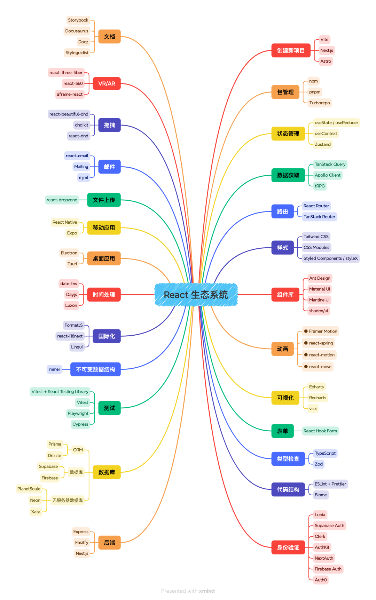
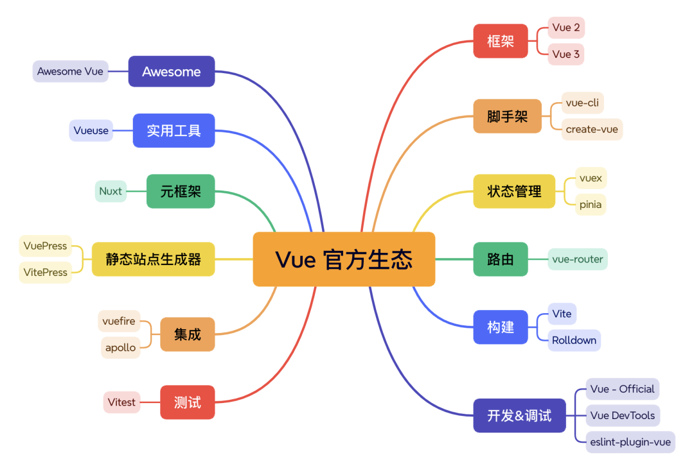

## React系列

- [Next.js](https://github.com/vercel/next.js)，全栈框架，SSR
- TanStack全家桶
  - [TanStack Query](https://github.com/tanstack/query)，请求
  - [TanStack Table](https://github.com/tanstack/table)，表格
  - [TanStack Virtual](https://github.com/tanstack/virtual)，虚拟列表
  - [TanStack Router](https://github.com/TanStack/router)，路由
- [React-RND](https://github.com/bokuweb/react-rnd)，拖拽
- [react-beautiful-dnd](https://github.com/atlassian/react-beautiful-dnd)，上传
- [React-Dropzone](https://github.com/react-dropzone/react-dropzone)，上传
- [React Hook Form](https://github.com/react-hook-form/react-hook-form)，表单处理
- [Redux](https://github.com/reduxjs/redux)，状态管理
- [Mobx](https://github.com/mobxjs/mobx)，状态管理+1
- [Dva](https://github.com/dvajs/dva)，状态管理+2
- [Zustand](https://github.com/pmndrs/zustand)，hooks范式的状态管理，我个人比较喜欢这个
- [React Virtualized](https://github.com/bvaughn/react-virtualized)，虚拟列表
- [Recharts](https://github.com/recharts/recharts)，图表库，数据可视化
- [Framer Motion](https://github.com/framer/motion)，很牛逼的动画库，实现复杂动画就靠它了
- [Styled Components](https://github.com/styled-components/styled-components)，CSS in JS
- [Emotion](https://github.com/emotion-js/emotion)，CSS in JS
- [Ant Design](https://github.com/ant-design/ant-design)，阿里的UI库
- [Ahooks](https://github.com/alibaba/hooks)，阿里的超实用hooks工具库
- [ShadCN](https://github.com/shadcn-ui/ui)，配合 TailwindCSS 的UI库
- [react-i18next](https://github.com/i18next/react-i18next)，国际化
- [React-Intl](https://github.com/formatjs/formatjs)，国际化
- [Taro](https://github.com/nervjs/taro)，国产的基于React的跨平台框架
- [Expo](https://github.com/expo/expo)，ReactNative的脚手架，类似Vite
- [React Navigation](https://github.com/react-navigation/react-navigation)，ReactNative的路由

## Vue系列

- [Nuxt.js](https://nuxt.com/)，全栈框架，SSR
- [Vite](https://github.com/vitejs/vite)，官方脚手架
- [Vue-router](https://github.com/vuejs/router)，Vue官方路由
- [Vuex](https://github.com/vuejs/vuex)，Vue2的状态管理
- [Pinia](https://github.com/vuejs/router)，Vue3的状态管理
- [TanStack Query](https://github.com/tanstack/query)，TanStack Query 同样适用于 Vue
- [Vueuse](https://github.com/vueuse/vueuse)，超实用hooks工具集
- [vue-kinesis](https://github.com/Aminerman/vue-kinesis)，动画库
- [TresJS](https://github.com/tresjs/tres)，3D动画库
- [FormKit](https://github.com/formkit/formkit)，表单处理
- [vue-draggable-plus](https://github.com/Alfred-Skyblue/vue-draggable-plus)，拖拽
- [ShadCN](https://github.com/radix-vue/shadcn-vue)，ShadCN的Vue版本
- [uni-app](https://github.com/dcloudio/uni-app)，基于Vue的国产跨平台框架
- [Element Plus](https://github.com/element-plus/element-plus)，基于Vue3的国产UI库
- [Vant](https://github.com/youzan/vant)，基于Vue的国产移动端UI库

## 其他

- [Electron](https://github.com/electron/electron)，桌面应用
- [Immer](https://github.com/immerjs/immer)，不可变数据结构
- [day.js](https://github.com/iamkun/dayjs)，时间处理
- [echarts](https://github.com/apache/echarts)，图表，数据可视化
- [three.js](https://github.com/mrdoob/three.js)，3D
- [axios](https://github.com/axios/axios)，请求
