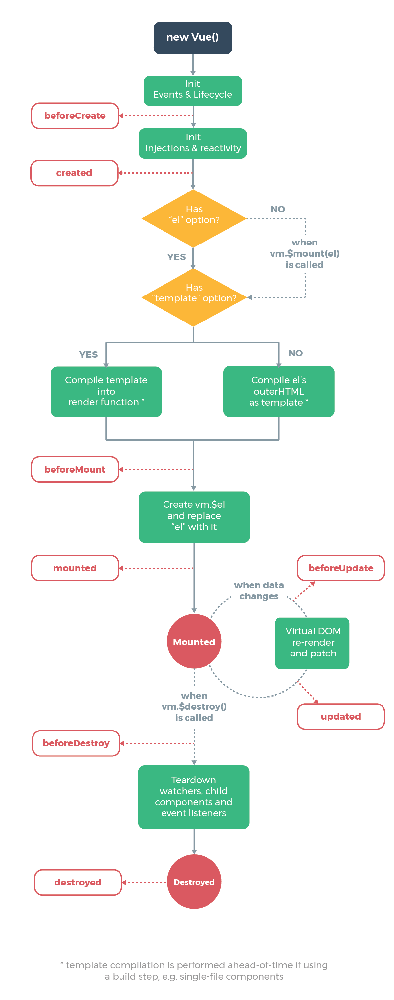

## 生命周期

`Vue`实例有一个完整的生命周期，也就是从开始创建、初始化数据、编译模板、挂载 Dom、渲染 → 更新 → 渲染、销毁等一系列过程，我们称这是 Vue 的生命周期。通俗说就是 Vue 实例从创建到销毁的过程，就是生命周期。

每个`Vue`实例在被创建之前都要经过一系列的初始化过程。例如需要设置数据监听、编译模板、挂载实例到 DOM、在数据变化时更新 DOM 等。同时在这个过程中也会运行一些叫做生命周期钩子的函数，给予用户机会在一些特定的场景下添加他们自己的代码。



在实际项目开发过程中，会非常频繁地和`Vue`组件的生命周期打交道，接下来将从源码的角度来看一下这些生命周期的钩子函数是如何被执行的。

::: tip
源码中最终执行生命周期的函数都是调用`callHook`方法

```ts
export function callHook(vm: Component, hook: string, args?: any[], setContext = true) {
  pushTarget()
  const prev = currentInstance
  setContext && setCurrentInstance(vm)
  const handlers = vm.$options[hook]
  const info = `${hook} hook`
  if (handlers) {
    for (let i = 0, j = handlers.length; i < j; i++) {
      invokeWithErrorHandling(handlers[i], vm, args || null, vm, info)
    }
  }
  if (vm._hasHookEvent) {
    vm.$emit('hook:' + hook)
  }
  setContext && setCurrentInstance(prev)
  popTarget()
}
```

`callHook`函数的逻辑很简单，根据传入的字符串`hook`，去拿到`vm.$options[hook]`对应的回调函数数组，然后遍历执行，执行的时候把`vm`作为函数执行的上下文

:::

## `beforeCreate`和`created`

`beforeCreate`和`created`函数都是在实例化`Vue`的阶段，在`_init`方法中执行的, 也就是初始化实例的时候

```ts
Vue.prototype._init = function (options?: Record<string, any>) {
  // ...
  initLifecycle(vm)
  initEvents(vm)
  initRender(vm)
  callHook(vm, 'beforeCreate', undefined, false /* setContext */)
  initInjections(vm) // resolve injections before data/props
  initState(vm)
  initProvide(vm) // resolve provide after data/props
  callHook(vm, 'created')
  // ...
}
```

可以看到`beforeCreate`和`created`的钩子调用是在`initState`的前后，`initState`的作用是初始化`props`、`data`、`methods`、`watch`、`computed`等属性，之后会详细分析。那么显然`beforeCreate`的钩子函数中就不能获取到`props`、`data`中定义的值，也不能调用`methods`中定义的函数。

## `beforeMount`和`mounted`

顾名思义，`beforeMount`钩子函数发生在`mount`，也就是 DOM 挂载之前，它的调用时机是在`mountComponent`函数中

```ts
export function mountComponent(
  vm: Component,
  el: Element | null | undefined,
  hydrating?: boolean
): Component {
  vm.$el = el
  // ...
  callHook(vm, 'beforeMount')

  let updateComponent
  if (__DEV__ && config.performance && mark) {
    updateComponent = () => {
      const name = vm._name
      const id = vm._uid
      const startTag = `vue-perf-start:${id}`
      const endTag = `vue-perf-end:${id}`

      mark(startTag)
      const vnode = vm._render()
      mark(endTag)
      measure(`vue ${name} render`, startTag, endTag)

      mark(startTag)
      vm._update(vnode, hydrating)
      mark(endTag)
      measure(`vue ${name} patch`, startTag, endTag)
    }
  } else {
    updateComponent = () => {
      vm._update(vm._render(), hydrating)
    }
  }

  const watcherOptions: WatcherOptions = {
    before() {
      if (vm._isMounted && !vm._isDestroyed) {
        callHook(vm, 'beforeUpdate')
      }
    }
  }
  // ...
  new Watcher(vm, updateComponent, noop, watcherOptions, true /* isRenderWatcher */)
  hydrating = false

  const preWatchers = vm._preWatchers
  if (preWatchers) {
    for (let i = 0; i < preWatchers.length; i++) {
      preWatchers[i].run()
    }
  }

  if (vm.$vnode == null) {
    vm._isMounted = true
    callHook(vm, 'mounted')
  }
  return vm
}
```

在执行`vm._render()`函数渲染`VNode`之前，执行了`beforeMount`钩子函数，在执行完`vm._update()`把`VNode`patch 到真实 DOM 后，执行`mounted`钩子。

注意，这里对`mounted`钩子函数执行有一个判断逻辑，`vm.$vnode`如果为`null`，则表明这不是一次组件的初始化过程，而是我们通过外部`new Vue`初始化过程。那么对于组件，它的`mounted`时机在哪儿呢？

组件的`VNode`patch 到 DOM 后，会执行`invokeInsertHook`函数，把`insertedVnodeQueue`里保存的钩子函数依次执行一遍

```ts
function invokeInsertHook(vnode, queue, initial) {
  if (isTrue(initial) && isDef(vnode.parent)) {
    vnode.parent.data.pendingInsert = queue
  } else {
    for (let i = 0; i < queue.length; ++i) {
      queue[i].data.hook.insert(queue[i])
    }
  }
}
```

该函数会执行`insert`这个钩子函数，对于组件而言，`insert`钩子函数的定义在`src/core/vdom/create-component.ts`文件中的`componentVNodeHooks`对象中：

```ts
const componentVNodeHooks = {
  // ...
  insert(vnode: MountedComponentVNode) {
    const { context, componentInstance } = vnode
    if (!componentInstance._isMounted) {
      componentInstance._isMounted = true
      callHook(componentInstance, 'mounted')
    }
    // ...
  }
  // ...
}
```

可以看到，每个子组件都是在这个钩子函数中执行`mounted`钩子函数，并且我们之前分析过，`insertedVnodeQueue`的添加顺序是「**先子后父**」，所以对于同步渲染的子组件而言，`mounted`钩子函数的执行顺序也是「**先子后父**」

## `beforeUpdate`和`updated`

顾名思义，`beforeUpdate`和`updated`的钩子函数执行时机都应该是在数据更新的时候，到目前为止，我们还没有分析`Vue`的数据双向绑定、更新相关，下一章我会详细介绍这个过程

`beforeUpdate`的执行时机是在渲染`Watcher`的`before`函数中，我们刚才提到过：

```ts
export function mountComponent(
  vm: Component,
  el: Element | null | undefined,
  hydrating?: boolean
): Component {
  // ...
  const watcherOptions: WatcherOptions = {
    before() {
      if (vm._isMounted && !vm._isDestroyed) {
        callHook(vm, 'beforeUpdate')
      }
    }
  }
  // ...
  new Watcher(vm, updateComponent, noop, watcherOptions, true /* isRenderWatcher */)
  // ...
}
```

注意这里有个判断，也就是在组件已经`mounted`且没有`destroyed`时，才会去调用这个钩子函数

`update`的执行时机是在`flushSchedulerQueue`函数调用的时候，它的定义在`src/core/observer/scheduler.ts`文件中：

```ts
function flushSchedulerQueue() {
  // ...
  // 获取到 updatedQueue
  callUpdatedHooks(updatedQueue)
  // ...
}

function callUpdatedHooks(queue: Watcher[]) {
  let i = queue.length
  while (i--) {
    const watcher = queue[i]
    const vm = watcher.vm
    if (vm && vm._watcher === watcher && vm._isMounted && !vm._isDestroyed) {
      callHook(vm, 'updated')
    }
  }
}
```

`flushSchedulerQueue`函数我们之后会详细介绍，可以先大概了解一下，`updatedQueue`是更新了的`wathcer`数组，那么在`callUpdatedHooks`函数中，它对这些数组做遍历，只有满足条件时，才会执行`updated`钩子函数。

我们之前提过，在组件`mount`的过程中，会实例化一个渲染的`Watcher`去监听`vm`上的数据变化重新渲染，这段逻辑发生在`mountComponent`函数执行的时候：

```ts
export function mountComponent(
  vm: Component,
  el: Element | null | undefined,
  hydrating?: boolean
): Component {
  // ...
  // 这里是简写
  let updateComponent = () => {
    vm._update(vm._render(), hydrating)
  }
  const watcherOptions: WatcherOptions = {
    before() {
      if (vm._isMounted && !vm._isDestroyed) {
        callHook(vm, 'beforeUpdate')
      }
    }
  }
  // ...
  new Watcher(vm, updateComponent, noop, watcherOptions, true /* isRenderWatcher */)
  // ...
}
```

在`2.7.14`LTS 版本中，在实例化`Watcher`的过程中，在它的构造函数里会判断`isRenderWatcher`，接着把当前`watcher`的实例赋值给`vm._watcher`，定义在`src/core/observer/watcher.ts`文件中：

```ts
export default class Watcher implements DepTarget {
  // ...
  constructor(
    vm: Component | null,
    expOrFn: string | (() => any),
    cb: Function,
    options?: WatcherOptions | null,
    isRenderWatcher?: boolean
  ) {
    recordEffectScope(
      this,
      activeEffectScope && !activeEffectScope._vm ? activeEffectScope : vm ? vm._scope : undefined
    )
    if ((this.vm = vm) && isRenderWatcher) {
      vm._watcher = this
    }
    // ...
  }
}

// src/v3/reactivity/effectScope.ts
export function recordEffectScope(
  effect: Watcher,
  scope: EffectScope | undefined = activeEffectScope
) {
  if (scope && scope.active) {
    scope.effects.push(effect)
  }
}
```

同时，还把当前`wathcer`的实例通过`recordEffectScope`函数收集起来。`vm._watcher`是专门用来监听`vm`上数据变化然后重新渲染的，所以它是一个渲染相关的`watcher`，因此在`callUpdatedHooks`函数中，只有`vm._watcher`的回调执行完毕后，才会执行`updated`钩子函数

## `beforeDestroy`和`destroyed`

顾名思义，`beforeDestroy`和`destroyed`钩子函数的执行时机在组件销毁的阶段，组件的销毁过程之后会详细介绍，最终会调用`$destroy`方法，它的定义在`src/core/instance/lifecycle.ts`文件中：

```ts
Vue.prototype.$destroy = function () {
  const vm: Component = this
  if (vm._isBeingDestroyed) {
    return
  }
  callHook(vm, 'beforeDestroy')
  vm._isBeingDestroyed = true
  // remove self from parent
  const parent = vm.$parent
  if (parent && !parent._isBeingDestroyed && !vm.$options.abstract) {
    remove(parent.$children, vm)
  }
  // teardown scope. this includes both the render watcher and other
  // watchers created
  vm._scope.stop()
  // remove reference from data ob
  // frozen object may not have observer.
  if (vm._data.__ob__) {
    vm._data.__ob__.vmCount--
  }
  // call the last hook...
  vm._isDestroyed = true
  // invoke destroy hooks on current rendered tree
  vm.__patch__(vm._vnode, null)
  // fire destroyed hook
  callHook(vm, 'destroyed')
  // turn off all instance listeners.
  vm.$off()
  // remove __vue__ reference
  if (vm.$el) {
    vm.$el.__vue__ = null
  }
  // release circular reference (#6759)
  if (vm.$vnode) {
    vm.$vnode.parent = null
  }
}
```

`beforeDestroy`钩子函数的执行时机是在`$destroy`函数执行最开始的地方，接着执行了一系列的销毁动作，包括从`parent`的`$children`中删掉自身，删除`watcher`，当前渲染的`VNode`执行销毁钩子函数等，执行完毕后再调用`destroyed`钩子函数。

在`$destroy`的执行过程中，它又会执行`vm.__patch__(vm._vnode, null)`触发它子组件的销毁钩子函数，这样一层层的递归调用，所以`destroyed`钩子函数执行顺序也是「**先子后父**」，和`mounted`过程一样

## 总结

本章主要介绍了`Vue`生命周期中各个钩子函数的执行时机以及顺序，通过分析，我们知道了如在`created`钩子函数中可以访问到数据，在`mounted`钩子函数中可以访问到 DOM，在`destroyed`钩子函数中可以做一些定时器销毁工作，了解它们有利于我们在合适的生命周期去做不同的事情
