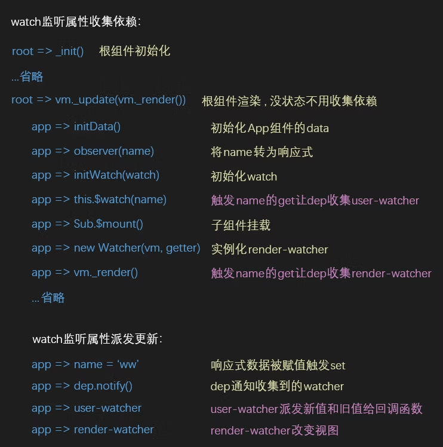
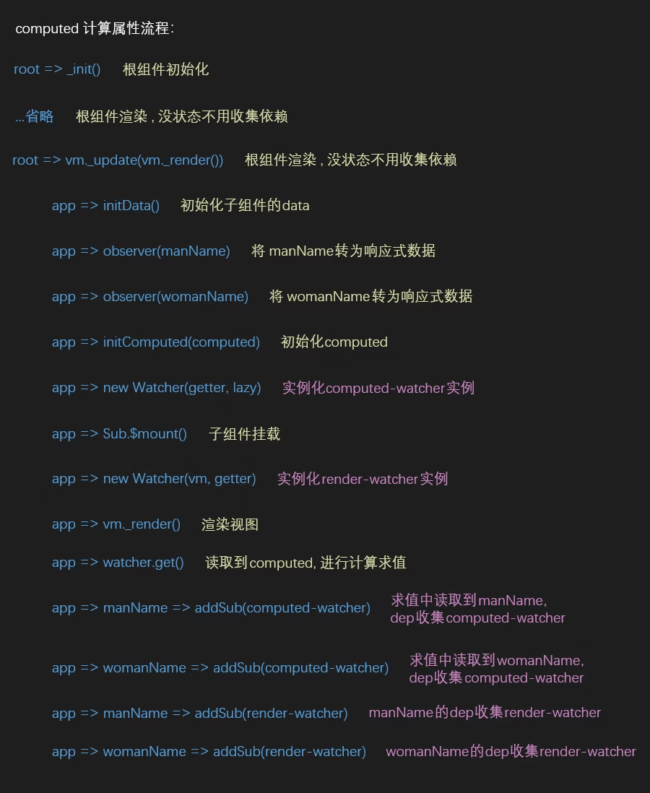

## `Computed`和`Watch`

`Computed`本质是一个具备缓存的`watcher`，依赖的属性发生变化就会更新视图。适用于计算比较消耗性能的计算场景。当表达式过于复杂时，在模板中放入过多逻辑会让模板难以维护，可以将复杂的逻辑放入计算属性中处理

`Watch`没有缓存性，更多的是观察的作用，可以监听某些数据执行回调。当我们需要深度监听对象中的属性时，可以打开`deep：true`选项，这样便会对对象中的每一项进行监听。这样会带来性能问题，优化的话可以使用字符串形式监听，如果没有写到组件中，不要忘记使用`unWatch`手动注销哦

- 功能上：`computed`是计算属性，也就是依赖其它的属性计算所得出最后的值。`watch`是去监听一个值的变化，然后执行相对应的函数
- 使用上：`computed`中的函数不接受参数且必须要用`return`返回；`watch`的回调里面会传入监听属性的新旧值，通过这两个值可以做一些特定的操作，`return`不是必须的
- 性能上：`computed`中的函数所依赖的属性没有发生变化，那么调用当前的函数的时候会从缓存中读取，而`watch`在每次监听的值发生变化的时候都会执行回调
- 场景上
  - computed：当一个属性受多个属性影响的时候，例子：购物车商品结算
  - watch：当一条数据影响多条数据的时候，例子：搜索框

## `Watch`

侦听属性的初始化也是发生在`Vue`的实例初始化阶段的`initState`函数中，在`computed`初始化之后，执行了：

```ts
export function initState(vm: Component) {
  // 省略其他状态初始化
  if (opts.watch && opts.watch !== nativeWatch) {
    // 如果有定义watch属性
    initWatch(vm, opts.watch) // 执行初始化方法
  }
}

function initWatch(vm: Component, watch: Object) {
  // 遍历watch内多个监听属性
  for (const key in watch) {
    const handler = watch[key] // 每一个监听属性的值
    // 如果该项的值为数组
    if (isArray(handler)) {
      for (let i = 0; i < handler.length; i++) {
        createWatcher(vm, key, handler[i]) // 将每一项使用watcher包装
      }
    } else {
      createWatcher(vm, key, handler) // 不是数组直接使用watcher
    }
  }
}

function createWatcher(
  vm: Component,
  expOrFn: string | (() => any),
  handler: any,
  options?: Object
) {
  // 如果是对象，参数移位
  if (isPlainObject(handler)) {
    options = handler
    handler = handler.handler
  }
  // 如果是字符串，表示为方法名
  if (typeof handler === 'string') {
    handler = vm[handler] // 获取methods内的方法
  }
  return vm.$watch(expOrFn, handler, options) // 封装
}
```

这里的逻辑也很简单，首先对`hanlder`的类型做判断，拿到它最终的回调函数，最后调用`vm.$watch(keyOrFn, handler, options)`函数，`$watch`是`Vue`原型上的方法，它是在执行`stateMixin`的时候定义的：

```ts
export function stateMixin(Vue: typeof Component) {
  // 省略其他代码...
  Vue.prototype.$watch = function (
    expOrFn: string | (() => any),
    cb: any,
    options?: Record<string, any>
  ): Function {
    const vm: Component = this
    // 如果cb是对象，则手动创建监听属性时
    if (isPlainObject(cb)) {
      return createWatcher(vm, expOrFn, cb, options)
    }
    options = options || {}
    options.user = true // user-watcher的标志位，传入Watcher类中
    const watcher = new Watcher(vm, expOrFn, cb, options) // 实例化user-watcher
    // 立即执行
    if (options.immediate) {
      const info = `callback for immediate watcher "${watcher.expression}"`
      pushTarget()
      invokeWithErrorHandling(cb, vm, [watcher.value], vm, info) // 以当前值立即执行一次回调函数
      popTarget()
    }
    // 返回一个函数，执行取消监听
    return function unwatchFn() {
      watcher.teardown()
    }
  }
}
```

虽然`watch`内部是使用`this.$watch`，但是我们也是可以手动调用`this.$watch`来创建监听属性的，所以第二个参数`cb`会出现是对象的情况。接下来设置一个标记位`options.user`为`true`，表明这是一个`user-watcher`

### `immediate`属性

再给`watch`设置了`immediate`属性后，会将实例化后得到的值传入回调，并立即执行一次回调函数，这也是`immediate`的实现原理。最后的返回值是一个方法，执行后可以取消对该监听属性的监听。接下来我们看看`user-watcher`是如何定义的：

```ts
export default class Watcher implements DepTarget {
  // ...
  constructor(
    vm: Component | null,
    expOrFn: string | (() => any),
    cb: Function,
    options?: WatcherOptions | null,
    isRenderWatcher?: boolean
  ) {
    // ...
    if (options) {
      this.deep = !!options.deep // 是否深度监听
      this.user = !!options.user // 是否是user-wathcer
      this.lazy = !!options.lazy // 表示是computed
      this.sync = !!options.sync // 是否同步更新
      this.before = options.before
      // ...
    } else {
      this.deep = this.user = this.lazy = this.sync = false
    }
    this.cb = cb // 回调函数
    this.id = ++uid
    this.active = true // 派发更新的标志位
    // ...
    if (isFunction(expOrFn)) {
      // 如果expOrFn是函数
      this.getter = expOrFn
    } else {
      this.getter = parsePath(expOrFn) // 如果是字符串对象路径形式，返回闭包函数
      // ...
    }
    this.value = this.lazy ? undefined : this.get()
  }
}
```

当是`user-watcher`时，`Watcher`内部是以上方式实例化的，通常情况下我们是使用字符串的形式创建监听属性，所以首先来看下`parsePath`方法是干什么的：

```ts
const bailRE = /[^\w.$]/ // 得是对象路径形式，如info.name
export function parsePath(path: string): any {
  // 不匹配对象路径形式，再见
  if (bailRE.test(path)) {
    return
  }
  const segments = path.split('.') // 按照点分割为数组
  // 闭包返回一个函数
  return function (obj) {
    for (let i = 0; i < segments.length; i++) {
      if (!obj) return
      obj = obj[segments[i]] // 依次读取到实例下对象末端的值
    }
    return obj
  }
}
```

`parsePath`方法最终返回一个闭包方法，此时`Watcher`类中的`this.getter`就是一个函数了，再执行`this.get()`方法时会将`this.vm`传入到闭包内，补全`Watcher`其他的逻辑：

```ts
export default class Watcher implements DepTarget {
  // ...
  constructor(
    vm: Component | null,
    expOrFn: string | (() => any),
    cb: Function,
    options?: WatcherOptions | null,
    isRenderWatcher?: boolean
  ) {
    // 省略其他代码...
    if (isFunction(expOrFn)) {
      this.getter = expOrFn
    } else {
      this.getter = parsePath(expOrFn) // 返回的方法
      // ...
    }
    this.value = this.lazy ? undefined : this.get() // 执行get
  }
  get() {
    pushTarget(this) // 将当前user-watcher实例赋值给Dep.target，读取时收集它
    let value
    const vm = this.vm
    try {
      value = this.getter.call(vm, vm) // 将vm实例传给闭包，进行读取操作
    } catch (e: any) {
      if (this.user) {
        handleError(e, vm, `getter for watcher "${this.expression}"`)
      } else {
        throw e
      }
    } finally {
      if (this.deep) {
        // 如果有定义deep属性
        traverse(value) // 进行深度监听
      }
      popTarget()
      this.cleanupDeps()
    }
    // 返回闭包读取到的值，参数immediate使用的就是这里的值
    return value
  }
  // ...
}
```

因为之前初始化已经将状态已经全部都代理到了`this`下，所以当我们读取`data`中的响应式数据时，`get`方法会进行依赖收集，将依赖收集到`dep`属性里，不过收集的是`user-watcher`，`get`方法最后返回闭包读取到的值

当被监听的属性重新赋值时，走的是派发更新流程，我们这里把和`render-watcher`不同之处做单独的说明，派发更新会执行`Watcher`类的`update`方法：

```ts
export default class Watcher implements DepTarget {
  // ...
  // 执行派发更新
  update() {
    if (this.lazy) {
      this.dirty = true
    } else if (this.sync) {
      // 如果有设置sync为true
      this.run() // 不走nextTick队列，直接执行
    } else {
      queueWatcher(this) // 否则加入队列，异步执行run()
    }
  }
  run() {
    if (this.active) {
      const value = this.get() // 重新求值
      if (value !== this.value || isObject(value) || this.deep) {
        const oldValue = this.value // 缓存之前的值
        this.value = value // 新值
        // 如果是user-watcher
        if (this.user) {
          const info = `callback for watcher "${this.expression}"`
          invokeWithErrorHandling(this.cb, this.vm, [value, oldValue], this.vm, info)
        } else {
          this.cb.call(this.vm, value, oldValue) // 在回调内传入新值和旧值
        }
      }
    }
  }
  // ...
}
```

其实这里的`sync`属性已经没在官网做说明了，不过我们看到源码中还是保留了相关代码。接下来我们看到为什么`watch`的回调内可以得到新值和旧值的原理，因为`this.cb.call(this.vm, value, oldValue)`这句代码的原因，内部将新值和旧值传给了回调函数



### `deep`属性

之前的`get`方法内有说明，如果有`deep`属性，则执行`traverse`方法：

```ts
const seenObjects = new Set() // 不重复添加依赖

export function traverse(val: any) {
  _traverse(val, seenObjects)
  seenObjects.clear()
  return val
}

function _traverse(val: any, seen: SimpleSet) {
  let i, keys
  const isA = isArray(val)
  if (
    (!isA && !isObject(val)) ||
    val.__v_skip /* ReactiveFlags.SKIP */ ||
    Object.isFrozen(val) ||
    val instanceof VNode
  ) {
    return
  }
  // 只有object和array才有__ob__属性
  if (val.__ob__) {
    const depId = val.__ob__.dep.id // 手动依赖收集器的id
    if (seen.has(depId)) {
      return
    }
    seen.add(depId) // 没有被收集，添加
  }
  if (isA) {
    // 是数组时
    i = val.length
    while (i--) _traverse(val[i], seen) // 递归触发每一项的get进行依赖收集
  } else if (isRef(val)) {
    // vue2.7.*新增的
    _traverse(val.value, seen) // 递归触发每一项的get进行依赖收集
  } else {
    // 是对象时
    keys = Object.keys(val)
    i = keys.length
    while (i--) _traverse(val[keys[i]], seen) // 递归触发子属性的get进行依赖收集
  }
}
```

看着还挺复杂，简单来说`deep`的实现原理就是递归的触发数组或对象的`get`进行依赖收集，因为只有数组和对象才有`__ob__`属性，将它们的依赖收集到`Observer`类里的`dep`内，完成`deep`深度监听

::: tip `watch`总结
这里说明了为什么`watch`和`this.$watch`的实现是一致的，以及简单解释它的原理就是为需要观察的数据创建并收集`user-watcher`，当数据改变时通知到`user-watcher`将新值和旧值传递给用户自己定义的回调函数。最后分析了定义`watch`时会被使用到的三个参数：`sync`、`immediate`、`deep`。简单说明它们的实现原理就是：`sync`是不将`watcher`加入到`nextTick`队列而同步的更新、`immediate`是立即以得到的值执行一次回调函数、`deep`是递归的对它的子值进行依赖收集
:::

## `Computed`

计算属性不是`API`，但它是`Watcher`类的最后也是最复杂的一种实例化的使用，还是很有必要分析的。(vue 版本 2.6.10)其实主要就是分析计算属性为何可以做到当它的依赖项发生改变时才会进行重新的计算，否则当前数据是被缓存的。计算属性的值可以是对象，这个对象需要传入`get`和`set`方法，这种并不常用，所以这里的分析还是介绍常用的函数形式，它们之间是大同小异的，不过可以减少认知负担，聚焦核心原理实现

计算属性初始化：

```ts
export function initState(vm: Component) {
  // 省略其他状态初始化
  if (opts.computed) initComputed(vm, opts.computed) // 进行初始化
  // ...
}

function initComputed(vm: Component, computed: Object) {
  const watchers = (vm._computedWatchers = Object.create(null)) // 创建一个纯净对象
  // ...
  for (const key in computed) {
    const userDef = computed[key] // computed每项对应的回调函数
    const getter = isFunction(userDef) ? userDef : userDef.get
    // ...
    if (!isSSR) {
      // 实例化computed-watcher
      watchers[key] = new Watcher(vm, getter || noop, noop, computedWatcherOptions)
    }
    if (!(key in vm)) {
      defineComputed(vm, key, userDef)
    } else if (__DEV__) {
      if (key in vm.$data) {
        // key不能和data里的属性重名
        warn(`The computed property "${key}" is already defined in data.`, vm)
      } else if (vm.$options.props && key in vm.$options.props) {
        // key不能和props里的属性重名
        warn(`The computed property "${key}" is already defined as a prop.`, vm)
      } else if (vm.$options.methods && key in vm.$options.methods) {
        // key不能和method里的方法重名
        warn(`The computed property "${key}" is already defined as a method.`, vm)
      }
    }
  }
}
```

将定义的`computed`属性的每一项使用`Watcher`类进行实例化，不过这里是按照`computed-watcher`的形式，来看下如何实例化的：

```ts
export default class Watcher implements DepTarget {
  // ...
  constructor(
    vm: Component | null,
    expOrFn: string | (() => any),
    cb: Function,
    options?: WatcherOptions | null,
    isRenderWatcher?: boolean
  ) {
    // ...
    if ((this.vm = vm) && isRenderWatcher) {
      vm._watcher = this
    }
    if (options) {
      this.lazy = !!options.lazy // 表示是computed
      // ...
    } else {
      this.deep = this.user = this.lazy = this.sync = false
    }
    this.dirty = this.lazy // dirty为标记位，表示是否对computed计算
    // ...
    if (isFunction(expOrFn)) {
      this.getter = expOrFn // computed的回调函数
    } else {
      this.getter = parsePath(expOrFn)
      // ...
    }
    this.value = this.lazy ? undefined : this.get()
  }
}
```

这里就点到为止，实例化已经结束了。并没有和之前的`render-watcher`以及`user-watcher`那样执行`get`方法，这是为什么？

在上面的计算属性初始化函数`initComputed`中调用了另一个函数`defineComputed`，让我们来看看它是做什么的：

```ts
export function defineComputed(
  target: any,
  key: string,
  userDef: Record<string, any> | (() => any)
) {
  const shouldCache = !isServerRendering()
  if (isFunction(userDef)) {
    sharedPropertyDefinition.get = shouldCache
      ? createComputedGetter(key)
      : createGetterInvoker(userDef)
    sharedPropertyDefinition.set = noop
  } else {
    sharedPropertyDefinition.get = userDef.get
      ? shouldCache && userDef.cache !== false
        ? createComputedGetter(key)
        : createGetterInvoker(userDef.get)
      : noop
    sharedPropertyDefinition.set = userDef.set || noop
  }
  // ...
  Object.defineProperty(target, key, sharedPropertyDefinition)
}
```

这个方法的作用就是让`computed`成为一个响应式数据，并定义它的`get`属性，也就是说当页面执行渲染访问到`computed`时，才会触发`get`然后执行`createComputedGetter`方法，所以之前的点到为止再这里会续上，看下`get`方法是怎么定义的：

```ts
// 高阶函数
function createComputedGetter(key) {
  return function computedGetter() {
    // 原来this还可以这样用，得到key对应的computed-watcher
    const watcher = this._computedWatchers && this._computedWatchers[key]
    if (watcher) {
      // 在实例化watcher时为true，表示需要计算
      if (watcher.dirty) {
        watcher.evaluate() // 进行计算属性的求值
      }
      // 当前的watcher，这里是页面渲染触发的这个方法，所以为render-watcher
      if (Dep.target) {
        // ...
        watcher.depend() // 收集当前watcher
      }
      return watcher.value // 返回求到的值或之前缓存的值
    }
  }
}

// -----------------------------

export default class Watcher implements DepTarget {
  // 省略其他代码
  evaluate() {
    this.value = this.get() // 计算属性求值
    this.dirty = false // 表示计算属性已经计算，不需要再计算
  }
  depend() {
    let i = this.deps.length // deps内是计算属性内能访问到的响应式数据的dep的数组集合
    while (i--) {
      this.deps[i].depend() // 让每个dep收集当前的render-watcher
    }
  }
  // 省略其他代码
}
```

这里的变量`watcher`就是之前`computed`对应的`computed-watcher`实例，接下来会执行`Watcher`类专门为计算属性定义的两个方法，在执行`evaluate`方法进行求值的过程中又会触发`computed`内可以访问到的响应式数据的`get`，它们会将当前的`computed-watcher`作为依赖收集到自己的`dep`里，计算完毕之后将`dirty`置为`false`，表示已经计算过了

然后执行`depend`让计算属性内的响应式数据订阅当前的`render-watcher`，所以`computed`内的响应式数据会收集`computed-watcher`和`render-watcher`两个`watcher`，当`computed`内的状态发生变更触发`set`后，首先通知`computed`需要进行重新计算，然后通知到视图执行渲染，再渲染中会访问到`computed`计算后的值，最后渲染到页面

> 计算属性内的值须是响应式数据才能触发重新计算

当`computed`内的响应式数据变更后触发的通知：

```ts
export default class Watcher implements DepTarget {
  // 省略其他代码
  update() {
    // 当computed内的响应式数据触发set后
    if (this.lazy) {
      this.dirty = true // 通知computed需要重新计算了
    } else if (this.sync) {
      this.run()
    } else {
      queueWatcher(this)
    }
  }
  // 省略其他代码
}
```

### 计算属性流程



::: tip `computed`总结
为什么计算属性有缓存功能？因为当计算属性经过计算后，内部的标志位会表明已经计算过了，再次访问时会直接读取计算后的值；为什么计算属性内的响应式数据发生变更后，计算属性会重新计算？因为内部的响应式数据会收集`computed-watcher`，变更后通知计算属性要进行计算，也会通知页面重新渲染，渲染时会读取到重新计算后的值
:::

## 参考

- [搞懂 computed 和 watch 原理，减少使用场景思考时间](https://juejin.cn/post/6844903926819454983)
