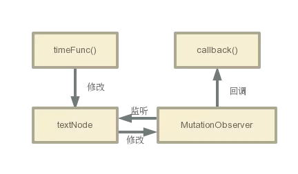

在做项目的时候，我们经常会用到`nextTick`，简单的理解就是它是一个`setTimeout`函数，将函数放到异步后去处理；将它替换成`setTimeout`好像也能跑起来，但它仅仅这么简单吗？那为什么我们不直接用`setTimeout`呢？让我们深入剖析一下

- 先看一个例子

```vue
<template>
  <div>
    <div ref="message">{{ message }}</div>
    <button @click="handleClick">点击</button>
  </div>
</template>
<script>
export default {
    data () {
        return {
            message: 'begin'
        };
    },
    methods () {
        handleClick () {
            this.message = 'end';
            console.log(this.$refs.message.innerText); // 打印“begin”
        }
    }
}
</script>
```

打印出来的结果是`begin`，我们在点击事件里明明将`message`赋值为`end`，而获取真实 DOM 节点的`innerHTML`却没有得到预期中的`begin`，为什么？

同样的情况也发生在给子组件传参上；我们给子组件传参数后，在子组件中调用函数查看参数

- 再看一个例子

```html
<div id="app">
  <div class="msg">
    <form-report ref="child" :name="childName"></form-report>
  </div>
</div>
<script>
  Vue.component('form-report', {
    props: ['name'],
    methods: {
      showName() {
        console.log(this.name)
      }
    },
    template: '<div>{{name}}</div>'
  })
  new Vue({
    el: '#app',
    data: function () {
      return {
        childName: ''
      }
    },
    mounted() {
      this.childName = '我是子组件名字'
      this.$refs.child.showName() // '' 空
    }
  })
</script>
```

虽然页面上展示了子组件的`name`，但是打印出来却是空值

## 异步更新

我们发现上述两个问题的共同点，不管子组件还是父组件，都是在给`data`中赋值后立马去查看数据导致的。由于**查看数据这个动作是同步操作**的，而且都是在赋值之后；因此我们猜测一下，给**数据赋值操作是一个异步操作**，并没有马上执行，Vue 官网对数据操作是这么描述的：

> 可能你还没有注意到，`Vue`在更新 DOM 时是异步执行的。只要侦听到数据变化，`Vue`将开启一个队列，并缓冲在同一事件循环中发生的所有数据变更。如果同一个`watcher`被多次触发，只会被推入到队列中一次。这种在缓冲时去除重复数据对于避免不必要的计算和 DOM 操作是非常重要的。然后，在`下一个的事件循环“tick”`中，`Vue`刷新队列并执行实际(已去重的)工作。`Vue`在内部对异步队列尝试使用原生的 `Promise.then`、`MutationObserver`和`setImmediate`，如果执行环境不支持，则会采用`setTimeout(fn, 0)`代替

也就是说我们在设置`this.msg = 'some thing'`的时候，`Vue`并没有马上去更新 DOM 数据，而是将这个操作放进一个队列中；如果我们重复执行的话，队列还会进行去重操作；等待同一事件循环中的所有数据变化完成之后，会将队列中的事件拿出来处理

这样做主要是为了提升性能，因为如果在主线程中更新 DOM，循环 100 次就要更新 100 次 DOM；**但是如果等事件循环完成之后更新 DOM，只需要更新`1`次**

为了在数据更新操作之后操作 DOM，我们可以在数据变化之后立即使用`Vue.nextTick(callback)`；这样回调函数会在 DOM 更新完成后被调用，就可以拿到最新的 DOM 元素了

```js
// 第一个例子
this.message = '我是测试文字'
this.$nextTick(() => {
  console.log(this.$refs.message.innerText) // 我是测试文字
})

// 第二个例子
this.childName = '我是子组件名字'
this.$nextTick(() => {
  this.$refs.child.showName() // 我是子组件名字
})
```

## nextTick 源码分析

了解了`nextTick`的用法和原理之后，我们就来看一下`Vue`是怎么来实现这波“操作”的

`Vue`把`nextTick`的源码单独抽到一个文件中：`/src/core/util/next-tick.ts`，删掉注释也就大概六七十行的样子，让我们逐段来分析

```ts
import { noop } from 'shared/util'
import { handleError } from './error'
import { isIE, isIOS, isNative } from './env'

export let isUsingMicroTask = false

const callbacks: Array<Function> = [] // 需要执行的回调函数
let pending = false // 是否正在执行回调函数

// 执行所有callback
function flushCallbacks() {
  pending = false
  const copies = callbacks.slice(0)
  callbacks.length = 0
  for (let i = 0; i < copies.length; i++) {
    copies[i]()
  }
}

let timerFunc // 触发执行回调函数

/**
 * 四种尝试得到timerFunc的方法
 * - Promise
 * - MutationObserver
 * - setImmediate
 * - setTimeout
 * 前两个方法都会在microtask中执行，所以优先使用，不支持再使用setImmediate和setTimeout
 */
if (typeof Promise !== 'undefined' && isNative(Promise)) {
  const p = Promise.resolve()
  timerFunc = () => {
    p.then(flushCallbacks)
    if (isIOS) setTimeout(noop)
  }
  isUsingMicroTask = true
} else if (
  !isIE &&
  typeof MutationObserver !== 'undefined' &&
  (isNative(MutationObserver) ||
    // PhantomJS and iOS 7.x
    MutationObserver.toString() === '[object MutationObserverConstructor]')
) {
  let counter = 1
  const observer = new MutationObserver(flushCallbacks)
  const textNode = document.createTextNode(String(counter))
  observer.observe(textNode, {
    characterData: true
  })
  timerFunc = () => {
    counter = (counter + 1) % 2
    textNode.data = String(counter)
  }
  isUsingMicroTask = true
} else if (typeof setImmediate !== 'undefined' && isNative(setImmediate)) {
  timerFunc = () => {
    setImmediate(flushCallbacks)
  }
} else {
  // Fallback to setTimeout.
  timerFunc = () => {
    setTimeout(flushCallbacks, 0)
  }
}

export function nextTick(): Promise<void>
export function nextTick<T>(this: T, cb: (this: T, ...args: any[]) => any): void
export function nextTick<T>(cb: (this: T, ...args: any[]) => any, ctx: T): void
/**
 * 延迟一个任务使其异步执行，在下一个tick时执行，一个立即执行函数，返回一个function
 * 这个函数的作用是在task或者microtask中推入一个timerFunc，在当前调用栈执行完以后以此执行直到执行到timerFunc
 * 目的是延迟到当前调用栈执行完以后执行
 * cb: 回调函数
 * ctx: 上下文
 */
export function nextTick(cb?: (...args: any[]) => any, ctx?: object) {
  let _resolve
  // cb存到callbacks中
  callbacks.push(() => {
    if (cb) {
      try {
        cb.call(ctx)
      } catch (e: any) {
        handleError(e, ctx, 'nextTick')
      }
    } else if (_resolve) {
      _resolve(ctx)
    }
  })
  if (!pending) {
    pending = true
    timerFunc()
  }
  // $flow-disable-line
  if (!cb && typeof Promise !== 'undefined') {
    return new Promise((resolve) => {
      _resolve = resolve
    })
  }
}
```

其中`Promise`和`setTimeout`很好理解，是一个异步任务，会在同步任务以及更新 DOM 的异步任务之后回调具体函数

下面着重介绍一下`MutationObserver`

`MutationObserver`是 HTML5 中的新 API，是个用来监视 DOM 变动的接口。他能监听一个 DOM 对象上发生的子节点删除、属性修改、文本内容修改等等

调用过程很简单，但是有点不太寻常：你需要先给他绑回调：

```js
const observer = new MutationObserver(callback)
```

通过给`MutationObserver`的构造函数传入一个回调，能得到一个`MutationObserver`实例，这个回调就会在`MutationObserver`实例监听到变动时触发

这个时候你只是给`MutationObserver`实例绑定好了回调，他具体监听哪个 DOM、监听节点删除还是监听属性修改，还没有设置。而调用他的`observer`方法就可以完成这一步：

```js
const domTarget = document.xxx
observer.observe(domTarget, {
  characterData: true // 说明监听文本内容的修改。
})
```



在`nextTick`中`MutationObserver`的作用就如上图所示。在监听到 DOM 更新后，调用回调函数

其实使用`MutationObserver`的原因就是`nextTick`想要一个异步 API，用来在当前的同步代码执行完毕后，执行我想执行的异步回调，包括`Promise`和`setTimeout`都是基于这个原因

## 实现一个简易的 nextTick

```js
let callbacks = []
let pending = false

function nextTick(cb) {
  callbacks.push(cb)

  if (!pending) {
    pending = true
    setTimeout(flushCallback, 0)
  }
}

function flushCallback() {
  pending = false
  let copies = callbacks.slice()
  callbacks.length = 0
  for (let i = 0; i < copies.length; i++) {
    copies[i]()
  }
}
```

可以看到，在简易版的`nextTick`中，`nextTick`接收一个回调函数，通过`setTimeout`来异步执行回调函数。通过这种方式，可以实现在下一个`tick`中执行回调函数，即在 UI 重新渲染后执行回调函数

## 总结

到这里，整体`nextTick`的代码都分析完毕了，总结一下它的流程就是：

1. **把回调函数放入`callbacks`等待执行**
2. **将执行函数放到微任务或者宏任务中**
3. **事件循环到了微任务或者宏任务，执行函数依次执行`callbacks`中的回调**
