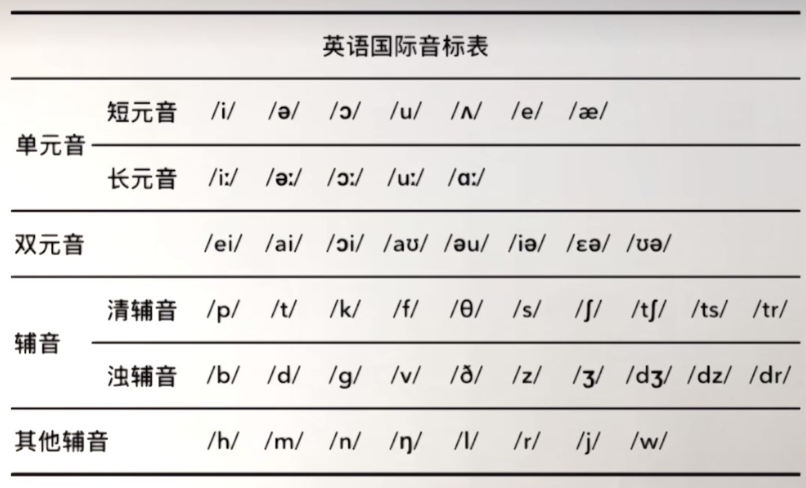

## 音标表

:::tip 💥注意
我这里所记录的英语音标的发音关联是根据我自身情况来的，混杂有英文字母、中文和日文等，所以可能会些许出入，请以标准音标为准。

如果你不会日语的话那就自己找其他类似的发音来平替吧，因为我是06~09年的高中时期就自学了日语的
:::

下面的音标示例单词几乎都是出自新概念英语第一册中的单词，都是很简单的。正确的音标学习方式应该是根据单词的发音来反推单个音标的读法，就跟以前上小学时学汉语拼音一样，先会念某个汉字了再根据这个汉字的读音来关联记忆它的拼音，例如：**`a（啊） o（喔） e（鹅） i（衣） u（乌） ü（鱼）`**

## 单元音

### /i/和/i:/

`/i/`与日语的`いっ`发短促音时相似，或者中文拼音的`i`发音相似

`/i:/`与日语的`いいー`发长音时相似

<table>
  <thead>
    <tr>
      <th></th>
      <th><code>/I/</code>=<code>/i/</code></th>
      <th><code>/i:/</code></th>
    </tr>
  </thead>
  <tbody>
    <tr>
      <td></td>
      <td>短元音</td>
      <td>长元音</td>
    </tr>
    <tr>
      <td>示例单词</td>
      <td>
        

          
M<b>i</b>ss

          
b<b>i</b>g

          
<b>i</b>s

          
<b>i</b>t

          
th<b>i</b>s

        

      </td>
      <td>
        

          
m<b>e</b>

          
pl<b>ea</b>se

          
t<b>ea</b>cher

          
m<b>ee</b>t

          
s<b>ee</b>

        

      </td>
    </tr>
  </tbody>
</table>

### /ə/和/ə:/

`/ə/`与中文拼音的`e`发音相似

`/ə:/`与中文字`尔`的第三声调发音相似

<table>
  <thead>
    <tr>
      <th></th>
      <th><code>/ə/</code></th>
      <th><code>/ɜ:/</code>=<code>/ə:/</code></th>
    </tr>
  </thead>
  <tbody>
    <tr>
      <td></td>
      <td>短元音</td>
      <td>长元音</td>
    </tr>
    <tr>
      <td>示例单词</td>
      <td>
        

          
umbrell<b>a</b>

          
numb<b>e</b>r

          
teach<b>e</b>r

          
daught<b>e</b>r

          
p<b>e</b>rhaps

        

      </td>
      <td>
        

          
s<b>ir</b>

          
sh<b>ir</b>t

          
sk<b>ir</b>t

          
n<b>ur</b>se

          
d<b>ir</b>ty

        

      </td>
    </tr>
  </tbody>
</table>

### /ɔ/和/ɔ:/

`/ɔ/`与日语的`おっ`发短促音时相似，或者中文拼音的`o`发音相似

`/ɔ:/`与日语的`おおー`发长音时相似

<table>
  <thead>
    <tr>
      <th></th>
      <th><code>/ɒ/</code>=<code>/ɔ/</code></th>
      <th><code>/ɔ:/</code></th>
    </tr>
  </thead>
  <tbody>
    <tr>
      <td></td>
      <td>短元音</td>
      <td>长元音</td>
    </tr>
    <tr>
      <td>示例单词</td>
      <td>
        

          
w<b>a</b>tch

          
wh<b>a</b>t

          
j<b>o</b>b

          
d<b>o</b>g

          
<b>o</b>range

        

      </td>
      <td>
        

          
y<b>ou</b>r

          
t<b>a</b>ll

          
sh<b>or</b>t

          
d<b>au</b>ghter

          
keyb<b>oar</b>d

        

      </td>
    </tr>
  </tbody>
</table>

### /u/和/u:/

`/u/`与日语的`うっ`发短促音时相似，或者中文拼音的`u`发音相似

`/u:/`与日语的`ううー`发长音时相似，或者中文字`物`的发音相似

<table>
  <thead>
    <tr>
      <th></th>
      <th><code>/ʊ/</code>=<code>/u/</code></th>
      <th><code>/u:/</code></th>
    </tr>
  </thead>
  <tbody>
    <tr>
      <td></td>
      <td>短元音</td>
      <td>长元音</td>
    </tr>
    <tr>
      <td>示例单词</td>
      <td>
        

          
b<b>oo</b>k

          
g<b>oo</b>d

          
l<b>oo</b>k

          
h<b>oo</b>k

        

      </td>
      <td>
        

          
f<b>oo</b>d

          
sch<b>oo</b>l

          
t<b>oo</b>

          
wh<b>o</b>se

          
bl<b>ue</b>

        

      </td>
    </tr>
  </tbody>
</table>

### /ʌ/和/ɑ:/

`/ʌ/`与日语的`あっ`发短促音时相似，或者中文拼音的`a`发音相似

`/ɑ:/`与日语的`ああー`发长音时相似，或者中文字`啊`的第四声调发音相似

<table>
  <thead>
    <tr>
      <th></th>
      <th><code>/ʌ/</code></th>
      <th><code>/ɑ:/</code></th>
    </tr>
  </thead>
  <tbody>
    <tr>
      <td></td>
      <td>短元音</td>
      <td>长元音</td>
    </tr>
    <tr>
      <td>示例单词</td>
      <td>
        

          
s<b>o</b>n

          
b<b>u</b>t

          
m<b>u</b>ch

          
c<b>o</b>me

          
c<b>o</b>lour

        

      </td>
      <td>
        

          
f<b>a</b>ther

          
p<b>ar</b>don

          
c<b>ar</b>

          
sm<b>ar</b>t

          
c<b>ar</b>pet

        

      </td>
    </tr>
  </tbody>
</table>

### /e/

与日语的`えっ`发短促音时相似

<table>
  <thead>
    <tr>
      <th></th>
      <th><code>/e/</code></th>
    </tr>
  </thead>
  <tbody>
    <tr>
      <td></td>
      <td>短元音</td>
    </tr>
    <tr>
      <td>示例单词</td>
      <td>
        

          
y<b>e</b>s

          
v<b>e</b>ry

          
p<b>e</b>n

          
dr<b>e</b>ss

          
w<b>e</b>ll

        

      </td>
    </tr>
  </tbody>
</table>

### /æ/

与日语`え`的发音相似

<table>
  <thead>
    <tr>
      <th></th>
      <th><code>/æ/</code></th>
    </tr>
  </thead>
  <tbody>
    <tr>
      <td></td>
      <td>短元音</td>
    </tr>
    <tr>
      <td>示例单词</td>
      <td>
        

          
h<b>a</b>nd

          
b<b>a</b>g

          
<b>a</b>m

          
f<b>a</b>t

          
c<b>a</b>tch

        

      </td>
    </tr>
  </tbody>
</table>

## 双元音

### /ei/

与英文字母`A`的发音相似

<table>
  <thead>
    <tr>
      <th></th>
      <th><code>/eI/</code>=<code>/ei/</code></th>
    </tr>
  </thead>
  <tbody>
    <tr>
      <td>示例单词</td>
      <td>
        

          
n<b>a</b>me

          
tod<b>a</b>y

          
l<b>a</b>zy

          
s<b>a</b>me

        

      </td>
    </tr>
  </tbody>
</table>

### /ai/

与中文字`爱`的发音相似

<table>
  <thead>
    <tr>
      <th></th>
      <th><code>/aI/</code>=<code>/ai/</code></th>
    </tr>
  </thead>
  <tbody>
    <tr>
      <td>示例单词</td>
      <td>
        

          
b<b>uy</b>

          
m<b>y</b>

          
f<b>i</b>ve

          
n<b>i</b>ce

          
wh<b>i</b>te

        

      </td>
    </tr>
  </tbody>
</table>

### /ɔi/

与日语`おい`连读时的发音相似

<table>
  <thead>
    <tr>
      <th></th>
      <th><code>/ɔI/</code>=<code>/ɔi/</code></th>
    </tr>
  </thead>
  <tbody>
    <tr>
      <td>示例单词</td>
      <td>
        

          
b<b>oy</b>

          
empl<b>oy</b>ee

          
enj<b>oy</b>

          
ch<b>oi</b>ce

          
n<b>oi</b>se

        

      </td>
    </tr>
  </tbody>
</table>

### /aʊ/

与中文字`澳`的发音相似

<table>
  <thead>
    <tr>
      <th></th>
      <th><code>/aʊ/</code></th>
    </tr>
  </thead>
  <tbody>
    <tr>
      <td>示例单词</td>
      <td>
        

          
h<b>ou</b>se

          
h<b>o</b>w

          
bl<b>ou</b>se

          
cl<b>ou</b>d

          
n<b>o</b>w

        

      </td>
    </tr>
  </tbody>
</table>

### /əʊ/

与中文字`怄`的发音相似

<table>
  <thead>
    <tr>
      <th></th>
      <th><code>/əu/</code>=<code>/əʊ/</code></th>
    </tr>
  </thead>
  <tbody>
    <tr>
      <td>示例单词</td>
      <td>
        

          
c<b>oa</b>t

          
c<b>o</b>ld

          
<b>o</b>ld

          
yell<b>ow</b>

          
<b>o</b>pen

        

      </td>
    </tr>
  </tbody>
</table>

### /ɪə/

与日语假名`い`和中文字`尔`连起来读时的发音相似，即`い尔`

<table>
  <thead>
    <tr>
      <th></th>
      <th><code>/ɪə/</code>=<code>/iə/</code></th>
    </tr>
  </thead>
  <tbody>
    <tr>
      <td>示例单词</td>
      <td>
        

          
h<b>ere</b>

          
<b>ear</b>

          
b<b>eer</b>

          
h<b>ear</b>

          
n<b>ear</b>ly

        

      </td>
    </tr>
  </tbody>
</table>

### /eə/

与日语假名`え`和中文字`尔`连起来读时的发音相似，即`え尔`

<table>
  <thead>
    <tr>
      <th></th>
      <th><code>/eə/</code>=<code>/εə/</code></th>
    </tr>
  </thead>
  <tbody>
    <tr>
      <td>示例单词</td>
      <td>
        

          
h<b>air</b>

          
th<b>ere</b>

          
wh<b>ere</b>

          
ch<b>air</b>

          
c<b>are</b>ful

        

      </td>
    </tr>
  </tbody>
</table>

### /ʊə/

与中文字`乌尔`连读时的发音相似

<table>
  <thead>
    <tr>
      <th></th>
      <th><code>/ʊə/</code></th>
    </tr>
  </thead>
  <tbody>
    <tr>
      <td>示例单词</td>
      <td>
        

          
t<b>ou</b>rist

          
s<b>ure</b>

        

      </td>
    </tr>
  </tbody>
</table>

## 辅音

辅音是为了辅助元音去发音而存在的。清辅音和浊辅音总是成对出现的，在上面的[音标表](#音标表)中，上下互为一对

| 分类   | 辅音音标                                                                                                 |
| ------ | -------------------------------------------------------------------------------------------------------- |
| 爆破音 | [/p/和/b/](#p-和-b)、[/t/和/d/](#t-和-d)、[/k/和/g/](#k-和-g)                                            |
| 摩擦音 | [/f/和/v/](#f-和-v)、[/θ/和/ð/](#θ-和-ð)、[/s/和/z/](#s-和-z)、[/∫/和/ʒ/](#∫-和-ʒ)、[/h/](#h)、[/r/](#r) |
| 破擦音 | [/t∫/和/dʒ/](#t∫-和-dʒ)、`/ts/和/dz/`、`/tr/和/dr`                                                       |
| 鼻音   | [/m/](#m)、[/n/](#n)、[/ŋ/](#ŋ)                                                                          |
| 舌侧音 | [/l/](#l)                                                                                                |
| 半元音 | [/w/](#w) 、[/j/](#j)                                                                                    |

### /p/和/b/

`/p/`与中文拼音`p`的发音相似

`/b/`与中文拼音`b`的发音相似

<table>
  <thead>
    <tr>
      <th></th>
      <th><code>/p/</code></th>
      <th><code>/b/</code></th>
    </tr>
  </thead>
  <tbody>
    <tr>
      <td></td>
      <td>清辅音</td>
      <td>浊辅音</td>
    </tr>
    <tr>
      <td>示例单词</td>
      <td>
        

          
<b>p</b>en

          
u<b>p</b>

          
<b>p</b>lease

        

      </td>
      <td>
        

          
<b>b</b>ag

          
<b>b</b>ook

          
num<b>b</b>er

        

      </td>
    </tr>
  </tbody>
</table>

### /t/和/d/

`/t/`与中文拼音`t`的发音相似

`/d/`与中文拼音`d`的发音相似

<table>
  <thead>
    <tr>
      <th></th>
      <th><code>/t/</code></th>
      <th><code>/d/</code></th>
    </tr>
  </thead>
  <tbody>
    <tr>
      <td></td>
      <td>清辅音</td>
      <td>浊辅音</td>
    </tr>
    <tr>
      <td>示例单词</td>
      <td>
        

          
i<b>t</b>

          
coa<b>t</b>

          
sui<b>t</b>

        

      </td>
      <td>
        

          
han<b>d</b>

          
goo<b>d</b>

          
ol<b>d</b>

        

      </td>
    </tr>
  </tbody>
</table>

### /k/和/g/

`/k/`与中文拼音`k`的发音相似

`/g/`与中文拼音`g`的发音相似

<table>
  <thead>
    <tr>
      <th></th>
      <th><code>/k/</code></th>
      <th><code>/g/</code></th>
    </tr>
  </thead>
  <tbody>
    <tr>
      <td></td>
      <td>清辅音</td>
      <td>浊辅音</td>
    </tr>
    <tr>
      <td>示例单词</td>
      <td>
        

          
boo<b>k</b>

          
<b>c</b>oat

          
<b>c</b>ar

        

      </td>
      <td>
        

          
ba<b>g</b>

          
<b>g</b>ood

          
do<b>g</b>

        

      </td>
    </tr>
  </tbody>
</table>

### /f/和/v/

与中文拼音`f`的发音相似

<table>
  <thead>
    <tr>
      <th></th>
      <th><code>/f/</code></th>
      <th><code>/v/</code></th>
    </tr>
  </thead>
  <tbody>
    <tr>
      <td></td>
      <td>清辅音</td>
      <td>浊辅音</td>
    </tr>
    <tr>
      <td>示例单词</td>
      <td>
        

          
<b>f</b>ive

          
<b>f</b>ine

          
<b>f</b>at

        

      </td>
      <td>
        

          
<b>v</b>ery

          
fi<b>ve</b>

          
o<b>f</b>

        

      </td>
    </tr>
  </tbody>
</table>

### /θ/和/ð/

`/θ/`与咬住舌尖时念中文字`夫`的发音相似

`/ð/`与咬住舌尖时发中文拼音`z`的发音相似

<table>
  <thead>
    <tr>
      <th></th>
      <th><code>/θ/</code></th>
      <th><code>/ð/</code></th>
    </tr>
  </thead>
  <tbody>
    <tr>
      <td></td>
      <td>清辅音</td>
      <td>浊辅音</td>
    </tr>
    <tr>
      <td>示例单词</td>
      <td>
        

          
<b>th</b>ank

          
<b>th</b>in

          
<b>th</b>irsty

        

      </td>
      <td>
        

          
<b>th</b>is

          
<b>th</b>at

          
<b>th</b>ey

        

      </td>
    </tr>
  </tbody>
</table>

### /s/和/z/

`/s/`与中文拼音`s`的发音相似

`/z/`与中文拼音`z`的发音相似

<table>
  <thead>
    <tr>
      <th></th>
      <th><code>/s/</code></th>
      <th><code>/z/</code></th>
    </tr>
  </thead>
  <tbody>
    <tr>
      <td></td>
      <td>清辅音</td>
      <td>浊辅音</td>
    </tr>
    <tr>
      <td>示例单词</td>
      <td>
        

          
dre<b>ss</b>

          
<b>s</b>kirt

          
hou<b>se</b>

        

      </td>
      <td>
        

          
i<b>s</b>

          
plea<b>se</b>

          
Chine<b>se</b>

        

      </td>
    </tr>
  </tbody>
</table>

### /∫/和/ʒ/

`/∫/`与中文字`师`的发音相似

`/ʒ/`与牙齿闭合，舌头虚碰牙齿发中文拼音`r`的发音相似

<table>
  <thead>
    <tr>
      <th></th>
      <th><code>/∫/</code></th>
      <th><code>/ʒ/</code></th>
    </tr>
  </thead>
  <tbody>
    <tr>
      <td></td>
      <td>清辅音</td>
      <td>浊辅音</td>
    </tr>
    <tr>
      <td>示例单词</td>
      <td>
        

          
<b>sh</b>irt

          
<b>sh</b>ort

          
<b>sh</b>ip

        

      </td>
      <td>
        

          
televi<b>si</b>on

          
us<b>u</b>ally

        

      </td>
    </tr>
  </tbody>
</table>

### /t∫/和/dʒ/

`/t∫/`与中文字`曲`的发音相似

`/dʒ/`与中文拼音`zh`的发音相似

<table>
  <thead>
    <tr>
      <th></th>
      <th><code>/t∫/</code></th>
      <th><code>/dʒ/</code></th>
    </tr>
  </thead>
  <tbody>
    <tr>
      <td></td>
      <td>清辅音</td>
      <td>浊辅音</td>
    </tr>
    <tr>
      <td>示例单词</td>
      <td>
        

          
wat<b>ch</b>

          
mu<b>ch</b>

          
cat<b>ch</b>

        

      </td>
      <td>
        

          
<b>j</b>ob

          
<b>j</b>ump

          
bri<b>dge</b>

        

      </td>
    </tr>
  </tbody>
</table>

## 其他辅音

### /h/

与中文拼音`h`的发音相似

<table>
  <thead>
    <tr>
      <th></th>
      <th><code>/h/</code></th>
    </tr>
  </thead>
  <tbody>
    <tr>
      <td>示例单词</td>
      <td>
        

          
<b>h</b>and

          
<b>h</b>ouse

          
<b>h</b>ere

        

      </td>
    </tr>
  </tbody>
</table>

### /r/

与中文拼音`r`的发音相似

<table>
  <thead>
    <tr>
      <th></th>
      <th><code>/r/</code></th>
    </tr>
  </thead>
  <tbody>
    <tr>
      <td>示例单词</td>
      <td>
        

          
so<b>rr</b>y

          
<b>r</b>ight

          
ve<b>r</b>y

        

      </td>
    </tr>
  </tbody>
</table>

### /l/

与中文拼音`l`的发音相似

这个辅音在大多数情况下是不用管它的发音，它的关注点不在于怎么发音，而是舌头的位置。当看到这个音标时，舌头应舔到上牙龈

<table>
  <thead>
    <tr>
      <th></th>
      <th><code>/l/</code></th>
    </tr>
  </thead>
  <tbody>
    <tr>
      <td>示例单词</td>
      <td>
        

          
we<b>ll</b>

          
ta<b>ll</b>

          
b<b>l</b>ue

        

      </td>
    </tr>
  </tbody>
</table>

### /m/

与中文拼音`m`的发音相似

<table>
  <thead>
    <tr>
      <th></th>
      <th><code>/m/</code></th>
    </tr>
  </thead>
  <tbody>
    <tr>
      <td>示例单词</td>
      <td>
        

          
<b>m</b>e

          
<b>m</b>y

          
<b>m</b>iss

        

      </td>
    </tr>
  </tbody>
</table>

### /n/

与中文拼音`n`发前鼻音时的发音相似

<table>
  <thead>
    <tr>
      <th></th>
      <th><code>/n/</code></th>
    </tr>
  </thead>
  <tbody>
    <tr>
      <td>示例单词</td>
      <td>
        

          
pe<b>n</b>

          
so<b>n</b>

          
<b>n</b>ice

        

      </td>
    </tr>
  </tbody>
</table>

### /ŋ/

与中文拼音`n`发后鼻音时的发音相似

<table>
  <thead>
    <tr>
      <th></th>
      <th><code>/ŋ/</code></th>
    </tr>
  </thead>
  <tbody>
    <tr>
      <td>示例单词</td>
      <td>
        

          
tha<b>n</b>ks

          
si<b>n</b>g

          
so<b>n</b>g

        

      </td>
    </tr>
  </tbody>
</table>

### /j/

`/j/`与中文字`也`的发音相似

`the`在元音前读`/ði/`，在辅音前读`/ðə/`，而元辅音的判断不是以第一个字母为准，而是第一个音素，或说发音

例如：the United States的第一个音素是`/j/`，半元音，按辅音读`/ðə/`

<table>
  <thead>
    <tr>
      <th></th>
      <th><code>/j/</code></th>
    </tr>
  </thead>
  <tbody>
    <tr>
      <td>示例单词</td>
      <td>
        

          
<b>y</b>es

          
<b>y</b>ou

          
<b>y</b>et

        

      </td>
    </tr>
  </tbody>
</table>

### /w/

与中文拼音`w`的发音相似

<table>
  <thead>
    <tr>
      <th></th>
      <th><code>/w/</code></th>
    </tr>
  </thead>
  <tbody>
    <tr>
      <td>示例单词</td>
      <td>
        

          
<b>w</b>atch

          
<b>w</b>hat

          
<b>o</b>ne

        

      </td>
    </tr>
  </tbody>
</table>

## 浊化

- `/s/`后面的清辅音要浊化

清辅音跟着一个元音且前面又有一个`s`时，无论这个清辅音是在单词的最前面还是中间，只要是在重读音节或次重读音节里，一般都读成对应浊辅音

例如：discussion(`/k/`浊化成`/g/`)、stand(`/t/`浊化成`/d/`)、expression(`/p/`浊化成`/b/`)

- 美音中，`/t/`在单词的中间被浊化成`/d/`

例如：writer => wrider、letter => ladder

美国人和加拿大人发音为了省事，习惯清音浊化，尤其是`/t/`在单词的中间一定会浊化成`/d/`，但英国人发音不会这样，这也是英音和美音的一大区别。了解这一浊化原则，会给听力带来一些帮助

## 音节

音节是读音的基本单位，任何单词的读音，都是分解为一个个音节进行朗读的。在英语中元音特别响亮，**一个元音可构成一个音节，一个元音和一个或几个辅音音素结合也可以构成一个音节**。

:::tip ⚡提示
一般说来，元音可以构成音节，辅音不响亮，不能构成音节。

但英语辅音字母中有 4 个辅音`/m/`、`/n/`、`/ng/`和`/l/`是响音，它们和辅音音素结合，也可构成音节。它们构成的音节往往出现在词尾，一般是非重读音节
:::

### 音节的划分

下面我会用单引号`'`来给单词划分音节

- 元音是构成音节的主体，辅音是音节的分界线。两辅音之间不管有多少个元音，一般都是一个音节

例如：bed(`/bed/`)、bet(`/bet/`)、seat(`/siːt/`)、beat(`/biːt/`)、beaut(`/bjuːt/`)、beau'ty(`/ˈbjuːti/`)

- 两元音字母之间有一个辅音字母时，辅音字母归后一音节

例如：stu'dent(`/ˈstjuːdnt/`)、la'bour(`/ˈleɪbə(r)/`)、beau'ty(`/ˈbjuːti/`)

- 有两个辅音字母时，一个辅音字母归前一音节，一个归后一音节

例如：let'ter(`/ˈletə(r)/`)、win'ter(`/ˈwɪntə(r)/`)

- 不能拆分的字母组合按字母组合划分音节

例如：fa'ther(`/ˈfɑːðə(r)/`)、tea'cher(`/ˈtiːtʃə(r)/`)

### 开音节

- **以发音的元音字母结尾的音节**

公式：**`辅音`+`一个元音`**

例如：no、she、he、we

- **以r除外的辅音字母加不发音的e结尾的音节**

公式：**`一个元音`+`一个或几个辅音`+`不发音的e`**

例如：name、these、bike、home、excuse、like

### 闭音节

**以一个或几个辅音字母(r w y 除外)结尾而中间只有一个元音字母的音节**

公式：**`元音`+`辅音`** 或 **`元音`+`辅音`+`辅音`**

其中，**重读闭音节是两个辅音中间夹一个元音，在英语重读闭音节中，元音字母不发它本身的字母音**

**重读闭音节三要素：①必须是重读音节；②最后只有一个辅音字母；③元音字母发短元音**
