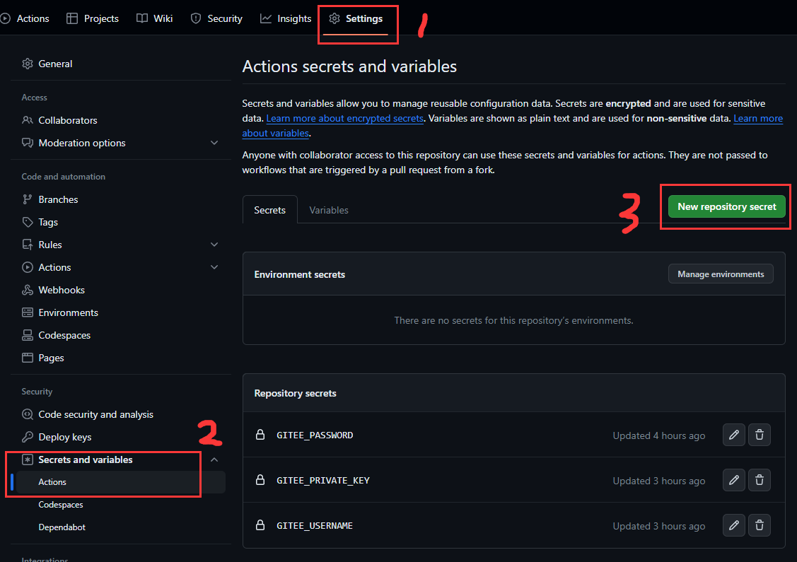

本文将介绍`VitePress`博客的三种部署方案

::: tip ⚡二级路由配置注意
仓库名要和`VitePress`配置中的`base`一致，否则会部署失败，例如我这个项目在 github 的仓库名是`blog`，那么`base`要写成`/blog`

```js
export default defineConfig({
  // ...
  base: '/blog',
  // ...
})
```

:::

## 使用Github Actions自动部署

开始之前，最好先阅读 [GitHub Actions 文档](https://docs.github.com/zh/actions)，主要参考的是 [语法部分](https://docs.github.com/zh/actions/using-workflows/workflow-syntax-for-github-actions)

关于`VitePress`部署方案，具体可以参考官方给出的[示例](https://vitepress.dev/guide/deploy#github-pages)，我这里以本博客为例，简单记录一下

- 在代码仓库页切到`Settings`选项卡，选择左侧菜单的`Pages`项，在页面中`Build and deployment`部分选择`Github Actions`


- 在项目根目录下新建`.github/workflows/deploy.yml`文件，内容如下

```yml
# 工作流名称
name: Deploy blog to Github Pages

# 用于描述工作流的何时触发
on:
  workflow_dispatch: {}
  push:
    branches: [main]

# 设置GITHUB_TOKEN的权限
permissions:
  contents: write
  pages: write
  id-token: write

# Allow only one concurrent deployment, skipping runs queued between the run in-progress and latest queued.
# However, do NOT cancel in-progress runs as we want to allow these production deployments to complete.
concurrency:
  group: pages
  cancel-in-progress: false

# 工作流里的任务
jobs:
  # 构建
  build:
    # 指定该任务运行的系统，目前可选的有 ubuntu、windows、和 macOS
    runs-on: ubuntu-latest
    # 任务里的运行步骤
    steps:
      # 代码检出
      - name: Checkout
        uses: actions/checkout@v4
        with:
          fetch-depth: 0
      # 安装 Node.js
      - name: Install Node.js
        uses: actions/setup-node@v4
        with:
          node-version: 16
      # 配置 github pages
      - name: Setup Pages
        uses: actions/configure-pages@v3
      # 安装 pnpm
      - name: Install pnpm
        uses: pnpm/action-setup@v2
        with:
          version: 8
          run_install: false
      - name: Get pnpm store directory
        shell: bash
        run: |
          echo "STORE_PATH=$(pnpm store path --silent)" >> $GITHUB_ENV
      - uses: actions/cache@v3
        name: Setup pnpm cache
        with:
          path: ${{ env.STORE_PATH }}
          key: ${{ runner.os }}-pnpm-store-${{ hashFiles('**/pnpm-lock.yaml') }}
          restore-keys: |
            ${{ runner.os }}-pnpm-store-
      # 安装依赖
      - name: Install dependencies
        run: pnpm install
      # 打包
      - name: Build with VitePress
        run: |
          pnpm build
          touch docs/.vitepress/dist/.nojekyll
      # 上传到 Github Pages 部署环境
      - name: Upload artifact
        uses: actions/upload-pages-artifact@v2
        with:
          path: docs/.vitepress/dist
  # 部署到GitHubPages
  deploy:
    environment:
      name: github-pages
      url: ${{ steps.deployment.outputs.page_url }}
    needs: build
    runs-on: ubuntu-latest
    steps:
      # 部署 GitHub Pages
      - name: Deploy to GitHub Pages
        id: deployment
        uses: actions/deploy-pages@v2
```

- 当推送`main`分支的代码时，Github 会自动进入 CI/CD 流程，过个几分钟，就可以看到博客已经部署成功了

### 自动同步到Gitee（可选）

在代码仓库页切到`Settings`选项卡，选择左侧菜单的`Secrets and variables`项的`Actions`，点击`New repository secret`按钮设置密钥

- `GITEE_PRIVATE_KEY`是与个人设置页的`SSH keys`相对应的私钥
- `GITEE_USERNAME`和`GITEE_PASSWORD`是登录`Gitee`要用到账号密码



编辑`.github/workflows/deploy.yml`，增加一个新的工作流任务`gitee-sync`，并且在`build`的任务步骤`Upload artifact`之前插入一个创建`gh-pages`分支的步骤，如下所示：

```yml
# 同步 Gitee
jobs:
  build:
    runs-on: ubuntu-latest
    steps:
      # 省略... // [!code focus:8]
      # 创建 gh-pages 分支, Gitee Paegs 部署要用到
      - name: Create gh-pages
        uses: JamesIves/github-pages-deploy-action@v4.4.1
        with:
          folder: docs/.vitepress/dist
          single-commit: true
          clean: true
      - name: Upload artifact
        # 省略...

  # 省略... // [!code focus:22]
  # 同步 Gitee
  gitee-sync:
    needs: build
    runs-on: ubuntu-latest
    steps:
      # 同步代码到 gitee
      - name: Sync to Gitee
        uses: wearerequired/git-mirror-action@v1.2.0
        env:
          SSH_PRIVATE_KEY: ${{ secrets.GITEE_PRIVATE_KEY }}
        with:
          source-repo: git@github.com:welives/blog.git
          destination-repo: git@gitee.com:welives/blog.git
      # 部署 Gitee Pages
      - name: Deploy Gitee Pages
        uses: yanglbme/gitee-pages-action@main
        with:
          gitee-username: ${{ secrets.GITEE_USERNAME }}
          gitee-password: ${{ secrets.GITEE_PASSWORD }}
          gitee-repo: welives/blog
          branch: gh-pages
```

## 使用`deploy.sh`脚本手动部署

- 在项目根目录下新建`deploy.sh`脚本，内容如下

```sh
#!/usr/sh

# 忽略错误
set -e  #有错误抛出错误

# 构建
pnpm build  #然后执行打包命令

# 进入待发布的目录
cd docs/.vitepress/dist  #进到dist目录
touch .nojekyll

# 如果是发布到自定义域名
# echo 'www.example.com' > CNAME

git init  #执行这些git命令
git add -A
git commit -m 'deploy'

# 如果部署到 https://<USERNAME>.github.io
# git push -f git@github.com:welives/welives.github.io.git master

# 如果是部署到 https://<USERNAME>.github.io/<REPO>
git push -f git@github.com:welives/blog.git master:gh-pages  #提交到这个分支

cd -

rm -rf docs/.vitepress/dist  #删除dist文件夹
```

- 修改`package.json`，添加部署脚本

```json
{
  // ...
  "scripts": {
    // ...
    "deploy": "bash deploy.sh"
  }
  // ...
}
```

- 执行`pnpm deploy`，部署到 GitHub Pages

- 在代码仓库页切到`Settings`选项卡，选择左侧菜单的`Pages`项，在页面中`Build and deployment`部分选择`Deploy form a branch`，接着选择`gh-pages`分支，然后点击`Save`按钮保存


## 使用Docker进行本地部署

项目根目录新建`nginx.conf`、`Dockerfile`、`.dockerignore`，具体内容如下

::: code-group

```nginx [nginx.conf]
server {
    listen 80;
    # 设置服务器名称，本地部署时使用localhost
    server_name localhost;
    # 设置网站根目录位置
    root /usr/share/nginx/html;
    # 网站首页
    index index.html index.htm;

    location / {
        # 设置HTTP头部，禁用缓存策略
        add_header Cache-Control no-cache;
        # 尝试访问的文件不存在时，重定向到/index.html，支持SPA应用
        try_files $uri $uri/ /index.html;
    }

    # 因为我的博客站点设置了二级路由地址/blog，所以需要添加这一层的配置
    location ^~ /blog/ {
        # 二级路由文件的存储位置
        alias /usr/share/nginx/html/;
        index index.html index.htm;
        try_files $uri $uri/ /blog/index.html;
    }
}
```

```Dockerfile
# 阶段一：构建应用
#
# 使用官方Node.js 20镜像作为构建环境
FROM node:20 as build-stage
# 设置工作目录为/app
WORKDIR /app
# 复制项目的package.json和package-lock到工作目录
COPY package.json package-lock.* ./
# 安装项目依赖，使用中国镜像加速
RUN npm install -g pnpm --registry=https://registry.npmmirror.com
RUN pnpm install --registry=https://registry.npmmirror.com
# 复制项目所有文件到工作目录
COPY . .
# 构建项目
RUN pnpm run build

# 阶段二：构建Nginx镜像部署阶段一的产物
#
# 使用官方nginx:latest镜像作为构建环境
FROM nginx:latest as deploy-stage
# 删除ngnix的默认页面
RUN rm -rf /usr/share/nginx/html/*
# 删除nginx默认配置
RUN rm /etc/nginx/conf.d/default.conf
# 复制自定义nginx配置到容器中
COPY nginx.conf /etc/nginx/conf.d/default.conf
# 将阶段一构建产物复制到nginx的服务目录
COPY --from=build-stage /app/docs/.vitepress/dist /usr/share/nginx/html
# 暴露80端口
EXPOSE 80
# 将nginx转为前台进程
CMD ["nginx", "-g", "daemon off;"]
```

```ini [.dockerignore]
node_modules
.git
.github
README.md
docs/.vuepress/cache
docs/.vuepress/dist
*.sh
```

:::

**有两点需要说明**

1. 如果你的博客没有设置二级路由地址的话，可以把下面这段`nginx`配置给删了

```nginx
location ^~ /blog/ {
  # 二级路由文件的存储位置
  alias /usr/share/nginx/html/;
  index index.html index.htm;
  try_files $uri $uri/ /blog/index.html;
}
```

2. 如果你的`Vitepress`项目没有使用`docs`目录包裹一层的话，上面`Dockerfile`的复制构建产物到`nginx`的服务目录就变成

```Dockerfile
COPY --from=build-stage /app/.vitepress/dist /usr/share/nginx/html
```

### 构建镜像

这里以构建一个名为`vitepress-app`的镜像为例，在项目根目录执行如下命令

```sh
docker build -t vitepress-app .
```

### 运行容器

用上面构建好的`vitepress-app`镜像运行一个容器

```sh
docker run -d -p 3000:80 --name vitepress-blog vitepress-app
```

这将创建并启动一个名为`vitepress-blog`的容器，将容器的`80`端口映射到宿主机的`3000`端口。启动成功后使用浏览器打开`http://localhost:3000`即可访问你的博客站点

### 停止容器

```sh
docker stop vitepress-blog
```

### 删除容器

```sh
docker rm vitepress-blog
```

### 使用Docker Compose

有了上面的`Dockerfile`之后，还可以使用 Docker Compose 来配置一键部署

在项目根目录新建`docker-compose.yml`，具体内容如下

```yml
version: '3.8'
services:
  web_app: #服务名
    build: # 使用Dockerfile构建镜像
      context: . # 指定 Dockerfile 所在目录
      dockerfile: Dockerfile # 指定 Dockerfile 文件名
    image: vitepress-app #镜像名称
    container_name: vitepress-blog # 容器名称
    restart: always # 自动重启
    ports:
      - 3000:80
```

#### 构建服务并后台运行

```sh
docker compose up --build -d
```

构建成功后使用浏览器打开`http://localhost:3000`即可访问你的博客站点

#### 停止并移除服务

```sh
docker compose down
```
