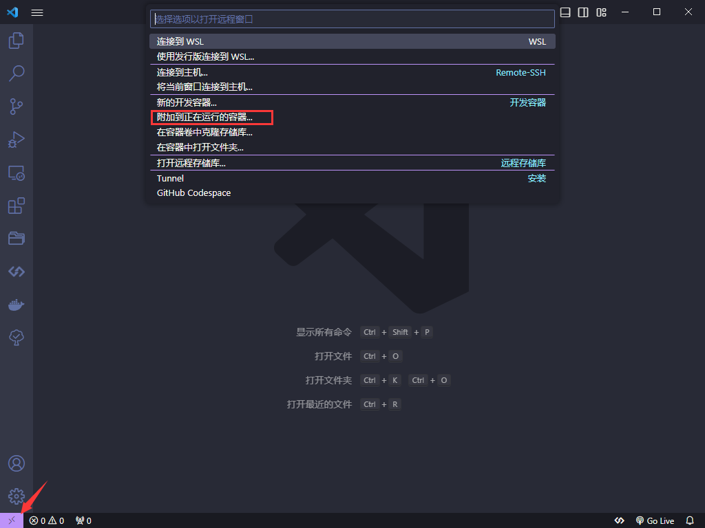

# Docker 搭建远程开发环境

> 如果在 Windows 上还没搭建好基础的 docker 运行环境的话，去这里看：[启用 Windows 的 WSL 功能](/misc/win10-dev-environment.html#enable-wsl)和[安装 Docker](/misc/win10-dev-environment.html#install-docker)

今夕是何年，你还在 Windows 环境上做本地开发？ 以后的趋势是在 docker 上进行远程开发了，因为这样可以统一项目中所有人员的开发环境

在前端开发环境中，我们需要全局安装的软件至少有`node、git、typescript、@vue/cli或者create-react-app`

## 先来个简单的

比如我已经在宿主机的`D:/Workspace/demo`目录下使用`create-react-app`创建了一个干净的项目，这时我想在 docker 容器中开发这个项目

1. 首先执行`docker pull node:lts`下载一个 node 环境镜像
2. 接着使用这个 node 镜像启动一个容器，并且将宿主机的`D:/Workspace/demo`目录映射到容器中的`/app`目录

```sh
docker run -dit -p 3000:3000 -e WATCHPACK_POLLING=true --name react-demo -v D:/Workspace/demo:/app node:lts
```

上面这个命令的参数说明

- `-dit`：后台运行且分配一个命令行交互终端
- `-p`：端口映射
- `-e`：设置环境变量，我这里是让 docker 容器中的项目支持热更新，如果是 React 18 之前的项目则为`-e CHOKIDAR_USEPOLLING=true`
- `--name`：指定容器名称
- `-v`：将宿主机的目录挂载到容器中
- `node`：以 node 镜像为基础启动容器

上面的命令执行成功后，可以在`Docker Desktop`中查看该容器的相关信息，可以看到宿主机的项目目录已经成功挂载到容器中


3. 打开 VSCode 先点击左下角，然后再弹出的对话框中选择`附加到正在运行的容器`，选择对应的容器(我这里是`react-demo`)



4. 在 VSCode 中打开命令行终端，输入`cd /app`进入到容器中的开发目录，执行`npm install`安装依赖，最后`npm run start`就可以愉快的开发了

## 制作项目所需的开发环境镜像

1. 还是在宿主机的`D:/Workspace/demo`目录下，在目录创建一个`Dockerfile`文件，内容如下：

```sh
# 以node镜像作为基础
FROM node:lts
# 设置工作目录
WORKDIR /app
RUN apt-get update -y && \
 apt-get upgrade -y && \
 apt-get install -y \
 curl \
 git && \
 rm -rf /var/lib/apt/lists/*
# 安装一些全局依赖
RUN npm install typescript nodemon ts-node live-server -g --registry=https://registry.npm.taobao.org
```

2. 构建镜像`docker image build -t my-node .`，然后运行容器`docker run -dit -p 5173:5173 --name vue-demo -v "${PWD}":/app my-node /bin/bash`

> 这里的`PWD`表示当前宿主机的终端所处的目录

3. 接着用 VSCode 进入容器开发环境，在`/app`目录下安装 Vue 项目(_宿主机挂载的目录会自动同步文件_)，安装完成后修改一下`vite.config`，添加以下配置

```ts
server: {
  host: '0.0.0.0', // 允许宿主机访问容器内的地址
  hmr: true,
  // 开启热更新
  watch: { usePolling: true }
}
```

4. 最后`npm run dev`就能愉快的在容器中进行开发了

## 真正的远程开发环境

上面两个都是开胃菜，只是在 Windows 中拿 docker 来模拟 Linux 环境而已，接下来通过 SSH 的方式连接远端服务器的 docker 容器

这次我将用一个 ubuntu 镜像作为基础开发环境镜像

1. 首先在远端服务器上`docker pull ubuntu`拉取镜像
2. 然后运行它`docker run -dit -p 2233:22 --name fed ubuntu /bin/bash`
3. 启动成功后进入容器`docker exec -it fed /bin/bash`
4. 先更新一下包管理器`apt-get update`，然后安装一些基础软件`apt-get install -y git vim curl wget xz-utils openssh-server`
5. 输入`passwd`设置 SSH 登录密码
6. 修改 ssh 配置文件`vim /etc/ssh/sshd_config`，将`port`设置为`22`，`PermitRootLogin`改为`yes`
7. 给 ssh 设置开机自启服务`echo "service ssh start" >> ~/.bashrc`，然后重载`source ~/.bashrc`
8. 在`/home/`下面创建`projects`和`packages`目录，分别用来做项目的工作空间和存放软件包
9. 使用`wget`下载 node 并安装到`packages`目录，注意要下载二进制格式的安装包

```sh
# 下载二进制node安装包,根据自己情况选择版本
wget https://nodejs.org/dist/v18.18.0/node-v18.18.0-linux-x64.tar.xz
# 解压
tar -xvf node-v18.18.0-linux-x64.tar.xz -C /home/packages
# 重命名
mv /home/packages/node-v18.18.0-linux-x64 /home/packages/node
# 删除安装包
rm -rf node-v18.18.0-linux-x64.tar.xz
```

10. 配置 node 环境变量

```sh
# 加入系统环境变量
echo "export PATH=$PATH:/home/packages/node/bin" >> ~/.bashrc
# 重载配置
source ~/.bashrc
```

11. 安装一些常用的全局软件包

```sh
npm install yarn typescript nodemon ts-node live-server -g --registry=https://registry.npm.taobao.org
```

12. 打开 VSCode 通过 SSH 连接此`fed`容器，然后根据喜好给容器安装一些常用的 VSCode 插件(_此步可以不做_)

13. 为了复用这个将调整好的`fed`容器，我们需要将它打包成镜像，然后推送到 Docker Hub

```sh
# commit [容器名称] [镜像名称]
docker commit fed fed
# 打tag版本,并加上用户名做命名空间，防止与公共镜像冲突
docker tag fed jandan/fed:1.0
# 推送镜像
docker push jandan/fed:1.0
```

14. 将刚才所有关于`fed`的镜像和容器删除，然后从 Docker Hub 中拉取刚刚推送的镜像`docker pull jandan/fed:1.0`
15. 在远端服务器上规划一个目录用来保存项目代码，比如我的是`/home/projects`
16. 启动容器，并挂载项目目录`docker run -dit -p 2233:22 -p 3100:3100 -v "${PWD}":/home/projects/koa --name koa-dev jandan/fed:1.0 /bin/bash`

::: warning 说明
我这里是在远程容器中进行 koa 的开发，koa 的端口运行在`3100`，如果要查看运行效果的话，访问`<远端服务器ip>:3100`即可
:::
