::: tip ✨
本文将介绍使用`GitHub-Readme-Stats`结合`WakaTime`来美化`Github`个人主页
:::

## 相关文档

- [GitHub-Readme-Stats](https://github.com/anuraghazra/github-readme-stats/tree/master)
- [WakaTime](https://wakatime.com/)

## 创建个人仓库

每个人的`Github`账号下都有一个特殊仓库，就是和你的账号同名的那个仓库，它可以用来展示你的`Github`个人统计信息，你平时看到有些人的`Github`主页很酷炫就是通过这个仓库实现的

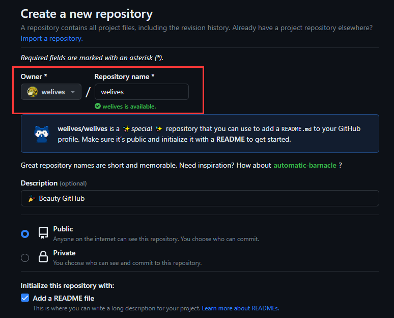

## 注册WakaTime

访问 [WakaTime](https://wakatime.com/) 官网，注册并登录，然后为你常用的 IDE 安装`WakaTime`插件，我这里以 VSCode 为例。

在浏览器中打开`WakaTime`的账户设置页面，找到 `Secret API Key`，然后复制它填入 VSCode 的 `WakaTime`插件

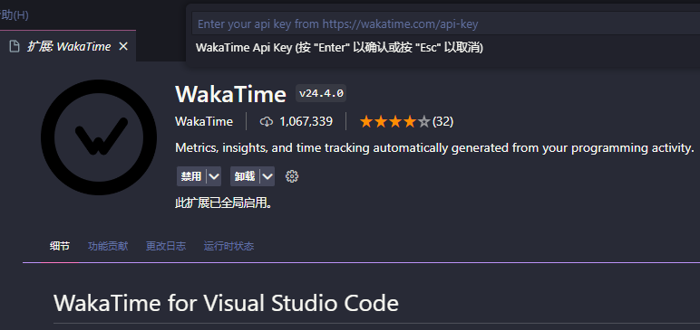

### 个人仓库配置WakaTime API Key

打开你的个人仓库设置页面

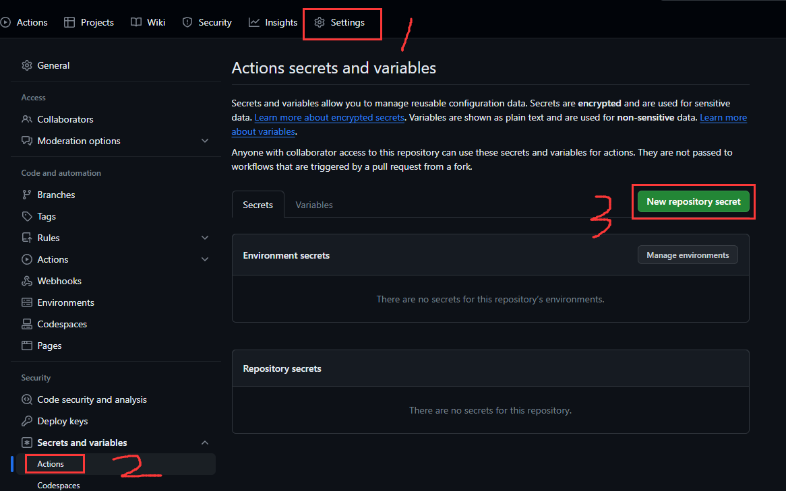

填入你的 WakaTime API Key

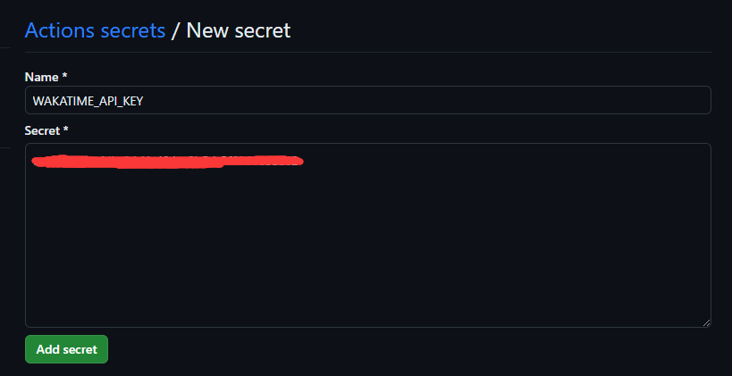

## 生成Github访问令牌

进入你的`Github`个人设置页面，在左侧栏最底部找到`Developer settings`

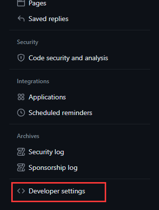

接着选中`Tokens(classic)`

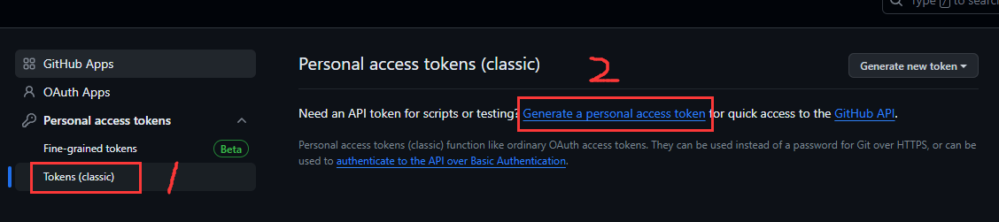

生成一个访问令牌，记得勾选`repo`和`user`权限，并设置令牌过期时间(建议>30天)

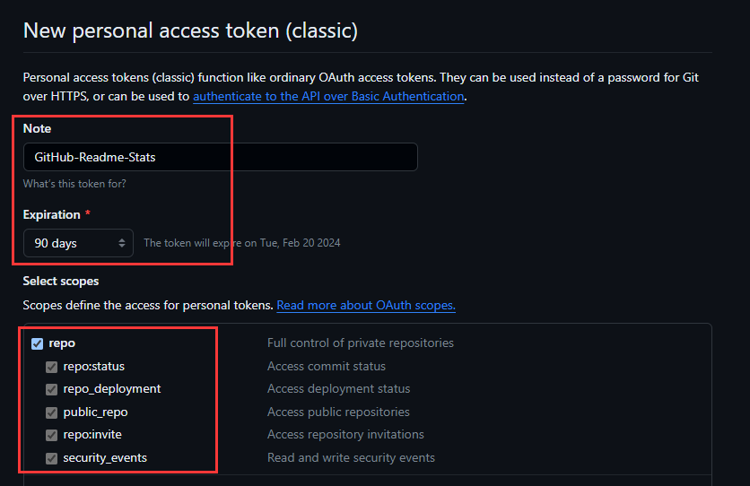

好了，令牌创建成功，把它复制下来备用

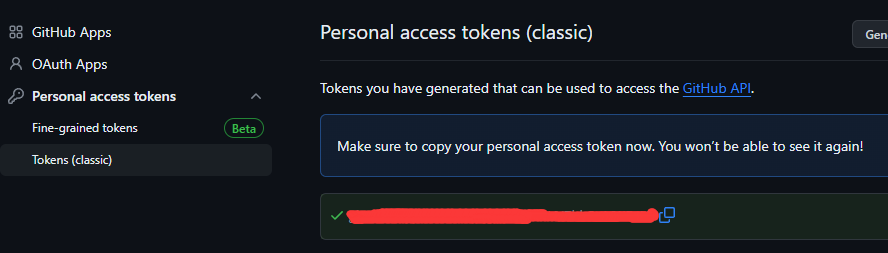

### 使用令牌

打开你的个人仓库，跟上面配置`WakaTime API Key`时同样的地方，再创建一个仓库密钥`GH_ACCESS_TOKEN`，这回填入的是刚才生成的`Github`访问令牌

## 配置工作流

进入个人仓库主页，复制仓库的`git`地址，然后利用 VSCode [远程仓库插件](https://marketplace.visualstudio.com/items?itemName=GitHub.remotehub)直接对仓库文件进行编辑

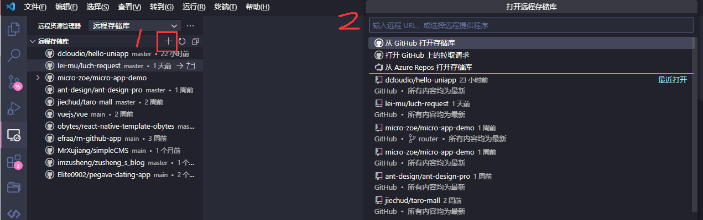

编辑`README.md`，在合适的位置插入以下代码，注意要把`username`替换成你的`Github`用户名

```md
[](https://github.com/anuraghazra/github-readme-stats)

<!--START_SECTION:waka-->
<!--END_SECTION:waka-->
```

根目录新建`.github/workflows/WakaTime.yml`，添加如下代码

```yml
name: Waka Readme

on:
  schedule:
    # Runs at 12am IST
    - cron: '30 18 * * *'
  workflow_dispatch:
jobs:
  update-readme:
    name: Update Readme with Metrics
    runs-on: ubuntu-latest
    steps:
      - uses: anmol098/waka-readme-stats@master
        with:
          WAKATIME_API_KEY: ${{ secrets.WAKATIME_API_KEY }}
          GH_TOKEN: ${{ secrets.GH_ACCESS_TOKEN }}
```

编辑完毕后提交代码

## 执行工作流

打开个人仓库，选中`Actions`，如下图所示按下`Run Workflow`执行工作流

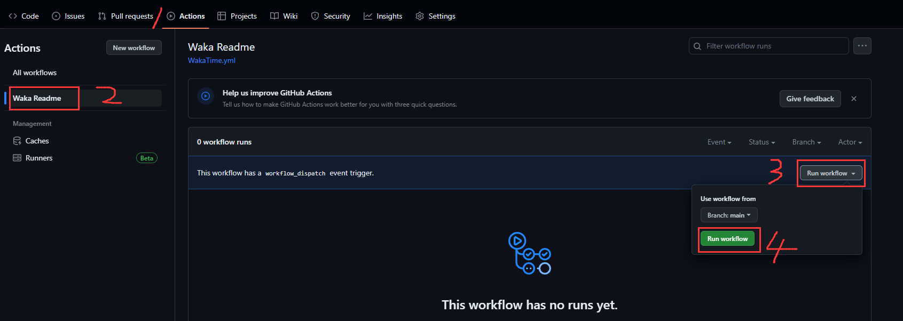

当工作流成功执行完毕后，刷新个人主页，就可以看到酷炫的`Github`个人统计信息了

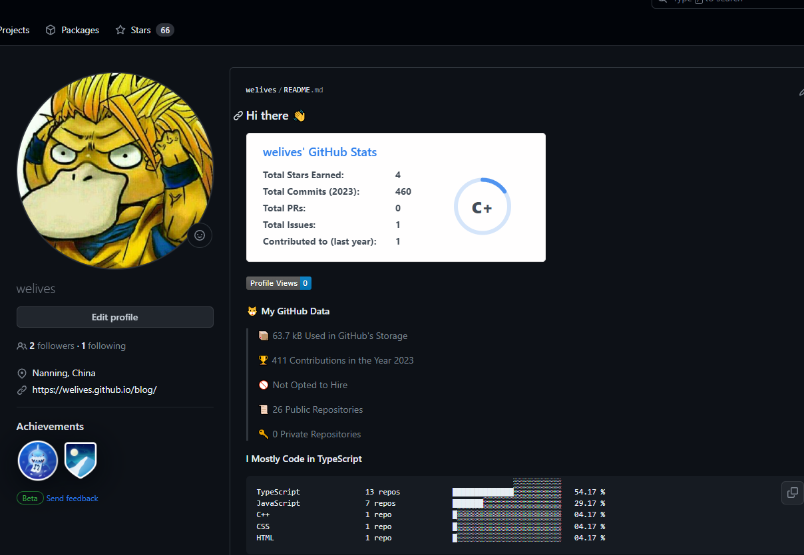
