> 在 Windows 系统中，我平时习惯将开发软件安装在`D:\Develop`目录下

## 可能用到的软件

- [Android Studio](https://developer.android.com/studio)
- [宝塔面板](https://www.bt.cn/new/download.html)
- [Clash](https://github.com/Fndroid/clash_for_windows_pkg)
- [Dart](http://gekorm.com/dart-windows/)
- [fvm](https://fvm.app/)
- [git](https://git-scm.com/downloads)
- [TortoiseGit](https://tortoisegit.org/download/)
- [JDK](https://www.oracle.com/hk/java/technologies/downloads/#java17)
- [Microsoft VS Code](https://code.visualstudio.com/Download)
- [Microsoft Visual Studio](https://visualstudio.microsoft.com/downloads/)
- [nvm](https://github.com/coreybutler/nvm-windows)
- [Notepad++](https://github.com/notepad-plus-plus/notepad-plus-plus)
- Navicat Premium
- [Python](https://www.python.org/downloads/)
- XshellXftpPortable
- [Docker](https://www.docker.com/products/docker-desktop/)
- Windows Terminal
- [GCC](https://github.com/niXman/mingw-builds-binaries)

## 科学上网

这年头当个程序员不会点魔法都没法干活了，我自己用的是`Clash`，Chrome 浏览器插件配合使用的是`Proxy SwitchyOmega`

至于是哪里的魔法学院我就不细说了，我只讲这两个软件如何搭配使用

1. 新建一个情景模式，名字取个自己喜欢的

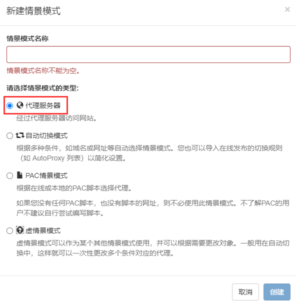

2. 协议选`HTTP`，服务器填`127.0.0.1`，端口`7890`(_因为用的是 Clash_)，然后保存

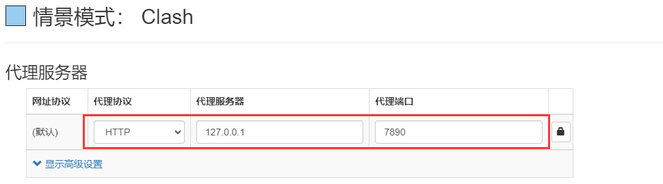

3. 切到自动切换(auto switch)模式，在`2`的位置填入`raw.githubusercontent.com`，模式选刚才创建的，我这里创建的是`Clash`；`3`的位置选刚才创建的模式，`4`的位置填入规则列表的[链接](https://raw.githubusercontent.com/gfwlist/gfwlist/master/gfwlist.txt)，接着点击`5`，最后保存

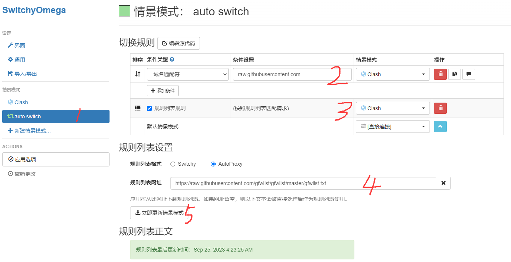

4. 然后`Proxy SwitchyOmega`选择使用自动切换模式

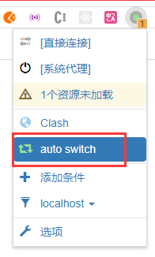

5. 最后 PC 端的 Clash 代理模式选择`Global`(全局)就行了，对于访问网站来说开不开系统代理都无所谓，如果是给 PC 软件使用的话，打开一下系统代理就行

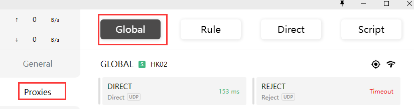

## 启用Windows的WSL功能{#enable-wsl}

::: tip
可以通过在 PowerShell 执行`wsl --install`命令进行 WSL 的初始化安装，默认会安装 Ubuntu 作为 Linux 子系统，此时会自动更新到 WSL2。输入`wsl -l -o`可以查看官方提供的 Linux 发行版列表
:::

**下面讲讲手动设置 WSL2 的方式**

1. 启用 win10 的开发者模式

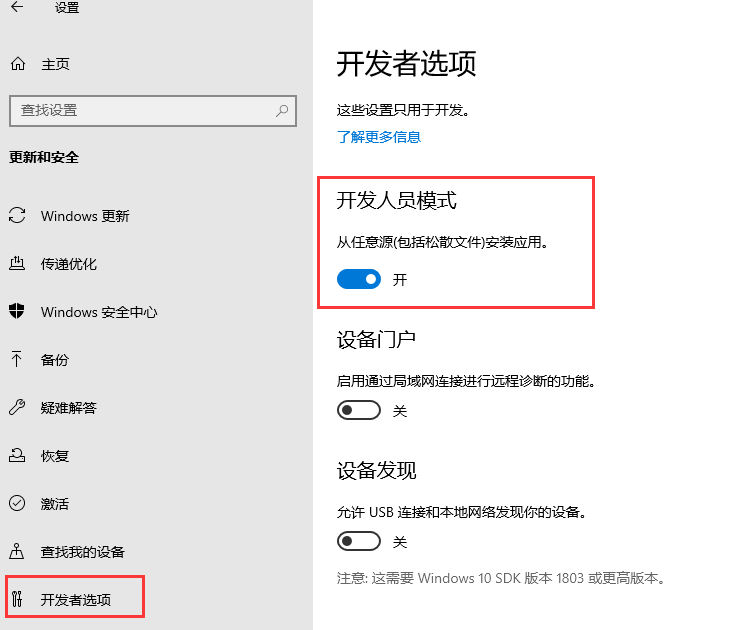

2. 打开控制面板的`Windows功能`，勾选
   - `Hyper-V`
   - `Windows 虚拟机监控程序平台`
   - `适用于 Linux 的 Windows 子系统`
   - `虚拟机平台`

只是简单玩玩 WSL 的话，勾选`适用于 Linux 的 Windows 子系统`就够了，但我这里会后续可能会涉及到`Kali`和`Docker`，所以干脆一次直接安装完。_安装完成后会提示重启一次电脑_

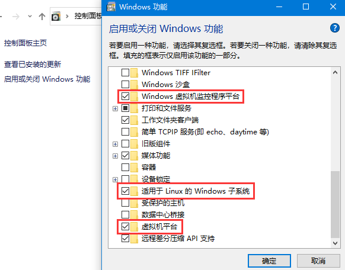

3. 下载[WSL2 Linux](https://wslstorestorage.blob.core.windows.net/wslblob/wsl_update_x64.msi)内核更新包并安装
4. 将 WSL2 设置为默认版本`wsl --set-default-version 2`
5. 在 Win10 应用商店搜索`Ubuntu`，然后安装它，也可以通过命令`wsl --install -d Ubuntu`来安装

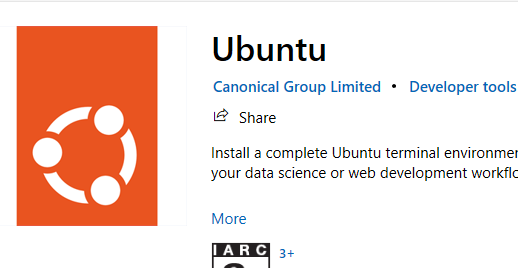

::: tip
如果之前已经安装了 WSL1 版本的子系统，那么在上述第 4 步之后再执行`wsl --set-version Ubuntu 2`命令将子系统更新到 WSL2
:::

安装完成后根据提示设置系统用户名和密码，输入`sudo passwd`来初始化`root`用户的密码，会提示输入当前系统用户的密码，接着才是设置`root`用户的密码，要输入两次。之后如果想切到`root`用户的话就键入`su`

### 安装Windows Terminal

在微软应用商店搜索`Windows Terminal`，然后安装它，用它来配合 WSL 的使用体验我个人是觉得很爽的

### 将 apt 更换为[阿里源](https://developer.aliyun.com/mirror/ubuntu)

切到`root`用户，使用顺手的编辑器修改文件`vim /etc/apt/sources.list`，将所有源链接替换为`https://mirrors.aliyun.com/ubuntu/`

可以使用`vim`的替换命令进行批量修改，例如：`:%s#http://cn.archive.ubuntu.com#https://mirrors.aliyun.com#g`

接着输入`apt-get update`刷新源信息

::: warning 注意
子系统和 win10 是使用的相同网络，端口也都是共用的，避免端口占用冲突
:::

如果要在 Windows 的文件资源管理器中查看 Linux 的文件的话，只需在地址栏中输入`\\wsl$`即可打开 Linux 的文件系统

### WSL端口映射

由于每次重启宿主机后，WSL 的 ip 地址都会发生变化(_稍后讲 WSL 设置静态 IP 的方法_)，所以需要重新映射，在 PowerShell 中执行

```sh
netsh interface portproxy add v4tov4 listenaddress=0.0.0.0 listenport=win10端口 connectaddress=虚拟机的ip connectport=虚拟机的端口
```

检查是否映射成功`netsh interface portproxy show all`

在 Ubuntu 中查看 ip 地址的命令是`ifconfig`，其中`eth0`中的`inet`就是虚拟机的 ip 地址

### WSL设置静态IP

比如，我要给 WSL 设置的静态 IP 为`172.20.19.2`，其网关地址为`172.20.19.1`

首先将 WSL 自动生成`resolv.conf`的机制关闭，执行`sudo vim /etc/wsl.conf`，添加如下内容

```sh
[network]
generateResolvConf = false
```

接着执行`sudo vim /etc/init.d/ip-setup.sh`创建一个脚本，并该脚本添加执行权限`sudo chmod +x /etc/init.d/ip-setup.sh`，其内容如下

```sh
#!/bin/sh

sudo ip addr del $(ip addr show eth0 | grep 'inet\b' | awk '{print $2}' | head -n 1) dev eth0
sudo ip addr add 172.20.19.2/24 broadcast 172.20.19.255 dev eth0
sudo ip route add 0.0.0.0/0 via 172.20.19.1 dev eth0
sudo rm -f /etc/resolv.conf
sudo echo nameserver 8.8.8.8 > /etc/resolv.conf
```

上述命令先删除掉 WSL 已经配置的 IP 地址，然后为其分配`172.20.19.2/24`，最后配置路由并指定 DNS 服务器为`8.8.8.8`

这样配置后 WSL 暂时没能联网，还需要到宿主机执行命令修改虚拟网络适配器

```sh
Get-NetAdapter 'vEthernet (WSL)' | Get-NetIPAddress | Remove-NetIPAddress -Confirm:$False; New-NetIPAddress -IPAddress 172.20.19.1 -PrefixLength 24 -InterfaceAlias 'vEthernet (WSL)'; Get-NetNat | ? Name -Eq WSLNat | Remove-NetNat -Confirm:$False; New-NetNat -Name WSLNat -InternalIPInterfaceAddressPrefix 172.20.19.0/24;
```

上述命令中，首先找到 vEthernet (WSL) 这个网络适配器，然后将其所有已有的 IP 地址删除，然后为其添加`172.20.19.1/24`的 IP 地址。接着是设置 NAT：首先删除名字叫做 WSLNat 的 NAT（因为我们后续创建的 NAT 名字叫做 WSLNat，这些命令每次启动系统后都需要执行，因此可能系统中已经存在名为 WSLNat 的 NAT 了，为了防止冲突，如果存在的话就先删掉），然后创建一个名字叫做 WSLNat 的 NAT，设置内部地址为`172.20.19.0/24`

最后需要将上述两部分指令合并到一个脚本中一起执行

回到宿主机，`Win+R`打开运行，输入`shell:startup`，在启动文件夹中新建脚本`ubuntu_start.bat`，其内容如下

```sh
%1 mshta vbscript:CreateObject("Shell.Application").ShellExecute("cmd.exe","/c %~s0 ::","","runas",1)(window.close)&&exit cd /d "%~dp0"%1 mshta vbscript:CreateObject("Shell.Application").ShellExecute("cmd.exe","/c %~s0 ::","","runas",1)(window.close)&&exit cd /d "%~dp0"
wsl -u root /etc/init.d/ip-setup.sh
powershell -c "Get-NetAdapter 'vEthernet (WSL)' | Get-NetIPAddress | Remove-NetIPAddress -Confirm:$False; New-NetIPAddress -IPAddress 172.20.19.1 -PrefixLength 24 -InterfaceAlias 'vEthernet (WSL)'; Get-NetNat | ? Name -Eq WSLNat | Remove-NetNat -Confirm:$False; New-NetNat -Name WSLNat -InternalIPInterfaceAddressPrefix 172.20.19.0/24;"
wsl -u root /etc/init.d/wsl-init.sh
```

> 第一行的作用是让该脚本获取管理员权限并执行自身，因为其中调用 PowerShell 的部分需要管理员权限。最后一行`wsl -u root /etc/init.d/wsl-init.sh`是额外的启动配置，后面会讲

如果发现 WSL 内无法 ping 通网关地址`172.20.19.1`的话，在宿主机中以管理员权限打开 PowerShell 执行如下命令添加一条防火墙入站规则

```sh
New-NetFirewallRule -DisplayName "WSL" -Direction Inbound  -InterfaceAlias "vEthernet (WSL)"  -Action Allow
```

并且启用这一条规则

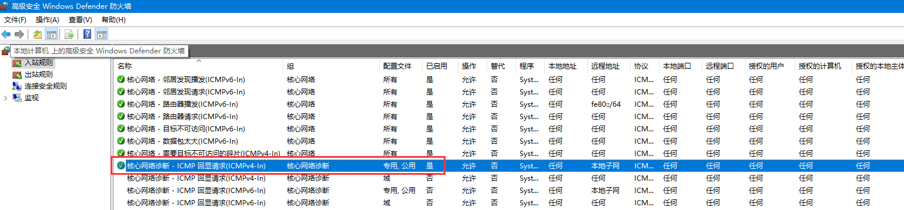

### SSH配置

在新安装的 Ubuntu 中把`openssh-server`给卸载了，因为它预装的可能不完整，需要重新安装一下，切到`root`用户

```sh
apt remove openssh-server
apt install openssh-server
```

接着来修改 ssh 的配置，在终端输入`vim /etc/ssh/sshd_config`，修改或增加以下几个配置项(_根据自己的喜好设置端口_)

```sh
Port 2233
ListenAddress 0.0.0.0
LoginGraceTime 2m
StrictModes yes
PermitRootLogin yes
PasswordAuthentication yes
```

修改完毕后重启 ssh 服务`service ssh --full-restart`

在上面，我已经将 WSL 的 IP 地址修改成`172.20.19.2`(_根据自己的情况填写 WSL 的 ip 地址_)，所以这里要做一下端口映射，回到宿主机执行

```sh
netsh interface portproxy add v4tov4 listenaddress=0.0.0.0 listenport=2233 connectaddress=172.20.19.2 connectport=2233
```

如果遇到端口被防火墙拦截的情况，需在宿主机的 PowerShell 中执行

```sh
netsh advfirewall firewall add rule name=WSL2 dir=in action=allow protocol=TCP localport=2233
```

::: warning 注意
如果在使用`Xshell`连接时提示`找不到匹配的key exchange算法`或`找不到匹配的host key算法`，更新`Xshell`到一个比较新的版本就好了，因为服务端的`openssh-server`加密算法更新了
:::

### WSL设置代理

1. 先在宿主机中查看 vEthernet (WSL)的 ip 地址，我这里的是`172.20.19.1`，然后确保 WSL 子系统和宿主机之间能够双向 ping 通

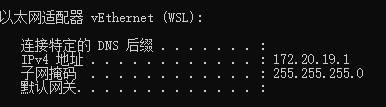

2. 确定魔法工具所使用的代理端口，我这里的是`7890`，并启用局域网代理

3. 设置代理的三种方式
   - 临时设置，这种方式设置的代理仅在当前终端生效，关闭当前终端后就会恢复之前的环境变量。在终端输入
   - 修改`.bashrc`文件，这种方式对当前用户永久生效。在终端输入`vim ~/.bashrc`，然后在文件末尾添加以下两行后保存退出，最后`source .bashrc`重载配置使其生效
   - 修改`/etc/profile`文件，这种方式对所有用户永久生效。在终端输入`vim /etc/profile`，然后在文件末尾添加以下两行后保存退出，最后在终端输入`source /etc/profile`重载配置且重启 WSL 才能使配置生效

```sh
export http_proxy="http://172.20.19.1:7890"
export https_proxy="http://172.20.19.1:7890"
```

### 文件系统

需要注意的是我们现在有了两套系统，两者的文件类型并不一致，跨系统访问和传输文件的话效率会下降很多，最好各存各的，以用户目录为例

- 如果在 Windows 上开发，就将文件放在：`C:\Users\<UserName>\`，也可以放在其他盘符的某个文件夹下统一管理，像我就是`D:\Workspace`
- 如果在 Ubuntu 上开发，就将文件放在：`\\wsl$\ubuntu\home\<UserName>\`

创建工作区的软链接，比如我 Windows 系统中的代码是存放在是`D:/Workspace`，里面有一个前端项目`test`，那么在子系统中的软链接为

```sh
sudo ln -s /home/code/test /mnt/d/Workspace/test
```

::: tip
上面的`/mnt`可以理解成是`Windows`系统，然后`/d`表示 D 盘，后面的文件夹就很好理解了，不再展开说明
:::

## WSL迁出系统盘

由于 WSL 是作为一个 WindowsApp 默认安装在系统盘中的，而系统盘的可用空间会随着使用时间的推移而逐渐变少，所以需要将 WSL 迁出到其他盘，比如我这里将 WSL 迁到了`D`盘

> 变少的快慢因人而异，像我有强迫症，对文件管理有很高的要求，120G 的系统盘用了两年多还剩 40G 左右的空间

**WSL 的迁移大致分为六步**

1. 查看自己的 WSL 和 Linux 发行版本，可以看到我这里的发行版本是`Ubuntu`，后续的操作都将围绕这个发行版本来进行

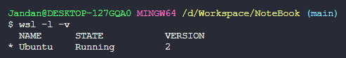

2. 关闭 WSL 服务`wsl --shutdown`
3. 将原位置的 Linux 发行版导出到指定位置，最好要在管理员模式的 PowerShell 执行`wsl --export Ubuntu D:\WSL\Ubuntu.tar`
4. 在导出位置确定有`Ubuntu.tar`备份文件生成之后，执行注销原 WSL 命令`wsl --unregister Ubuntu`
5. 在新的位置导入 Linux 发行版，最好要在管理员模式的 PowerShell 执行`wsl --import Ubuntu D:\WSL\Ubuntu D:\WSL\Ubuntu.tar`
6. 修改用户名为原来的名字，执行`Ubuntu config --default-user jandan`

迁移完成后把之前生成的备份文件`Ubuntu.tar`删除

## 安装Docker{#install-docker}

在 Windows 中使用 Docker 有以下两种方式

### 直接在WSL2里面安装

这种安装方式要求对 docker 非常熟练，因为所有操作全都是执行命令，`docker-compose`需要单独安装

在用户目录下输入`vim install-docker.sh`，编写一个脚本用来把 docker 的下载和安装过程整合在一起，其内容如下

```sh
#!/bin/sh
curl -fsSL get.docker.com -o get-docker.sh
sh get-docker.sh
if [ !$(getent group docker) ];
then
    sudo groupadd docker
else
    echo "docker user group already exists"
fi

sudo gpasswd -a $USER docker
sudo service docker restart

rm -rf get-docker.sh
```

然后执行`sh install-docker.sh`等待 docker 的安装

安装完成后执行`docker version`来检查是否成功，如果发现 Server 没启动的话则执行`sudo service docker start`

默认情况下，docker server 是不跟随 WSL 的启动而启动的，所以需要手动将其加入自启服务，执行`sudo systemctl enable docker`即可

### 在Windows上安装Docker Desktop

这种安装方式使用起来适合 docker 新手，因为有 GUI，而且软件内置有`docker-compose`

先去下载[Docker Desktop](https://www.docker.com/products/docker-desktop/)

由于`Docker Desktop`的安装程序不提供设置安装路径的功能，而且默认是安装到`C:\Program Files\Docker`目录下的，这就很占系统盘的宝贵空间

为了解决这个问题，需要对其默认安装路径做一个软链接处理，先在目标位置创建`Docker`文件夹，然后管理员模式打开 CMD 执行`mklink /j "C:\Program Files\Docker" "D:\Develop\Docker"`

软链接做好后再开始安装，记得勾选使用 WSL2 代替 Hyper-V

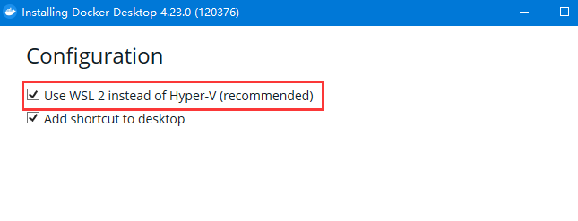

安装完成后进入软件，打开设置界面，修改 docker 数据和镜像的存储路径

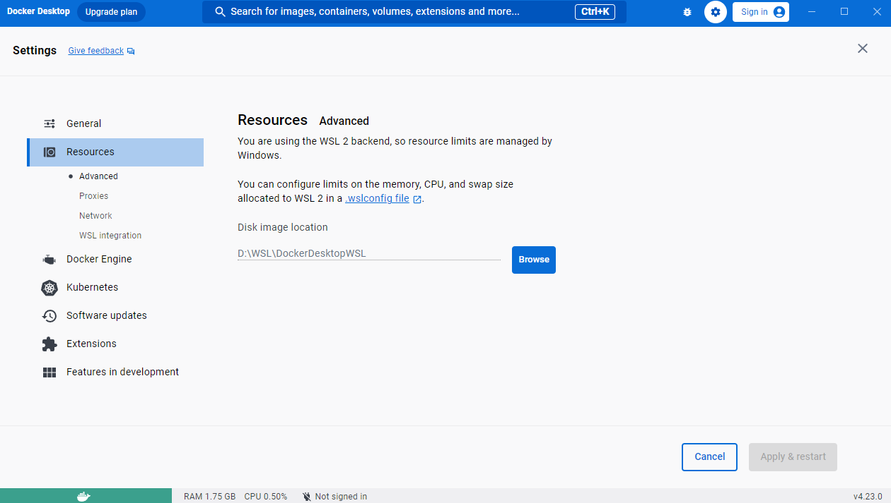

将 Ubuntu 和 docker 关联起来

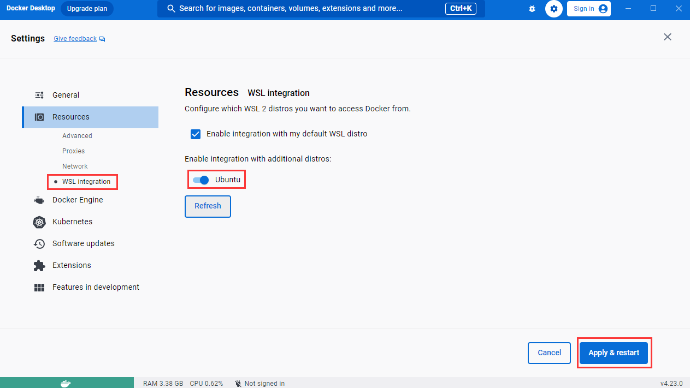

由于众所周知的原因，Docker 官方源 ban 掉国内 ip 了，所以需要更改为国内镜像源

```json
{
  "registry-mirrors": [
    "https://docker.m.daocloud.io",
    "https://dockerproxy.com",
    "https://docker.mirrors.ustc.edu.cn",
    "https://docker.nju.edu.cn"
  ]
}
```

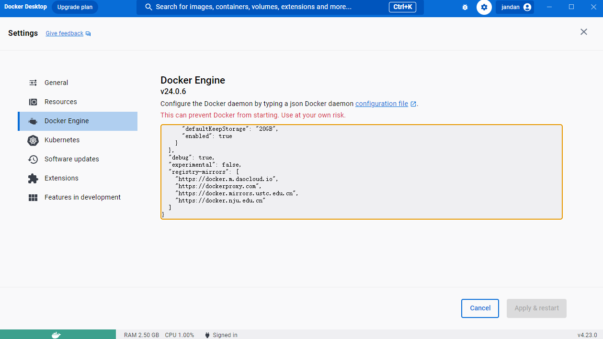

设置完成后打开 WSL，输入`docker ps`，看到如下的输出就表示 Docker 和 WSL 连接成功了


## 在WSL中安装宝塔

上面讲了 Docker 的安装之后，其实宝塔有没有都无所谓了，但它在我还不会玩 Docker 的那段时间还是帮了我不少，姑且还是讲讲吧

切到`root`用户执行命令

```sh
wget -O install.sh https://download.bt.cn/install/install-ubuntu_6.0.sh && sudo bash install.sh ed8484bec
```

安装完成后会在终端输出面板的登录信息，记得保存下来，内网地址的可以替换成`127.0.0.1`也是可以打开面板的，外网地址的那个不用管，反正家庭宽带的公网 IP 也是假的

::: warning
接下来安装运行环境的软件时一定要记得选**编译安装**
:::

### 设置宝塔面板跟随Windows开机自启

1. 在 Ubuntu 中创建一个脚本`sudo vim /etc/init.d/wsl-init.sh`，内容如下

```sh
#!/bin/sh

/etc/init.d/nginx start
/etc/init.d/mysqld start
bt start
```

> 因为 WSL2 中的 Ubuntu 不能自启软件，所以才这么搞; 然后你会发现宝塔自启后，nginx、mysqld 等服务还是不会自启，可以把相应服务的启动指令同样放在这里来解决

2. 给该脚本添加执行权限`sudo chmod +x /etc/init.d/wsl-init.sh`
3. 将该脚本添加到上面的`ubuntu_start.bat`开机脚本中，这样每次 Windows 启动时就会自动执行`wsl-init.sh`脚本了

## git和TortoiseGit的配置

先去下载[git](https://git-scm.com/downloads) 和 [TortoiseGit](https://tortoisegit.org/download/)，具体的安装步骤就不说了，百度一搜各种各样的都有，这里主要讲我对 git 的环境变量配置

安装完成后打开 TortoiseGit 设置，并修改其 SSH 客户端为`D:\Develop\Git\usr\bin\ssh.exe`

给用户变量`Path`增加以下两个值`D:\Develop\Git\cmd`和`D:\Develop\TortoiseGit\bin`

接着给 git 设置用户名和邮箱，具体的邮箱地址我就不放出来了，避免泄漏

```sh
git config --global user.name Jandan
git config --global user.email ***@gmail.com
```

生成公钥，输入指令后无脑按回车就行

```sh
ssh-keygen -m PEM -t ed25519 -C "***@gmail.com"
```

打开 github 网站，进入设置，填入刚才生成的`ssh key`，如果是首次和 github 建立连接，则输入`ssh -T git@github.com`创建连接信息

对于使用 http 方式连接远程仓库的，输入以下指令用来保存账号和密码

```sh
git config credential.helper store
```

## nvm和nodejs的配置

### Ubuntu 中安装 [nvm](https://github.com/nvm-sh/nvm)

1. 命令行中执行`curl -o- https://raw.githubusercontent.com/nvm-sh/nvm/v0.39.5/install.sh | bash`，脚本运行结束后打开一个新的终端窗口，输入`nvm -v`查看是否安装成功
2. 查看所有可用的 node 版本`nvm ls-remote`
3. 安装 LTS 版本的 node，`nvm install --lts`，安装后会自动切到这个版本

### Windows中安装nvm

先去 Github 下载[nvm](https://github.com/coreybutler/nvm-windows)

设置安装目录为`D:\Develop\nvm`

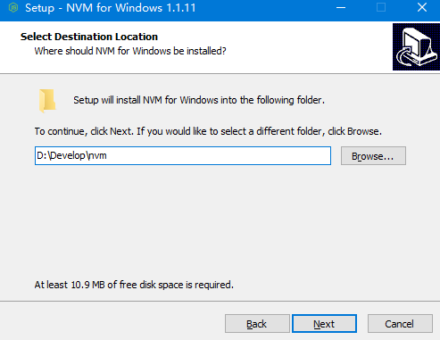

设置 nodejs 软链接指向的目录为`D:\Develop\nvm\nodejs`，之后就无脑下一步


安装完成后会自动生成两个系统环境变量`NVM_HOME`和`NVM_SYMLINK`

- `nvm list available` 查看所有可用的 nodejs 版本
- `nvm ls` 查看当前安装的 nodejs 版本
- `nvm current` 查看当前使用的 nodejs 版本

然后使用 nvm 命令安装所需要的 nodejs 版本，我这里安装的是最新的 LTS 版本

```sh
nvm install 18.17.1
nvm use 18.17.1
```

接着在 nvm 安装目录下新建如下几个文件夹

- `node_global`
  - `node_modules`
- `node_cache`
- `Yarn`
  - `Global`
  - `Cache`
- `pnpm`
  - `.pnpm-store`
  - `cache`
  - `global`
  - `state`

创建好上述几个文件夹后开始接着补环境变量

```sh
Path => %NVM_HOME%\node_global
NODE_PATH => %NVM_HOME%\node_global\node_modules
```

修改 npm 的缓存目录、全局包存放目录和设置淘宝源

```sh
npm config set prefix "D:\Develop\nvm\node_global"
npm config set cache "D:\Develop\nvm\node_cache"
npm config set registry https://registry.npmmirror.com
```

::: tip ⚡ npm 的官方源是 `https://registry.npmjs.org`
:::

#### 安装yarn

```sh
npm i -g yarn
```

修改 yarn 的缓存目录和全局包存放目录

```sh
yarn config set global-folder "D:\Develop\nvm\Yarn\Global"
yarn config set cache-folder "D:\Develop\nvm\Yarn\Cache"
```

#### 安装pnpm

```sh
npm i -g pnpm
```

修改 pnpm 的缓存目录和全局包存放目录

```sh
# 全局仓库路径
pnpm config set store-dir "D:\Develop\nvm\pnpm\.pnpm-store"
# 全局包路径
pnpm config set global-dir "D:\Develop\nvm\pnpm\global"
# 全局缓存路径
pnpm config set cache-dir "D:\Develop\nvm\pnpm\cache"
# pnpm-state.json文件目录
pnpm config set state-dir "D:\Develop\nvm\pnpm\state"
```

我常用的 npm 全局包

- yarn
- pnpm
- ts-node
- whistle
- nodemon
- pm2
- live-server
- prisma
- appium
- appium-doctor
- docsify-cli
- eas-cli
- @vue/cli
- @tarojs/cli
- @nestjs/cli
- @ant-design/pro-cli

> 至此，nvm 和 nodejs 的环境配置结束

## JDK配置

1. 根据所安装的 JDK 版本，新建一个带有大版本号的系统变量，例如`JAVA17_HOME`，变量值填入安装路径`D:\Develop\Java\jdk-17`
2. 再新建一个系统变量`JAVA_HOME`，变量值填入`%JAVA17_HOME%`。如果安装有多个 JDK 版本时，只需要修改`JAVA_HOME`变量的值即可切换全局的 JDK 版本，例如修改为`%JAVA11_HOME%`
3. 给系统变量`Path`添加一个值`%JAVA_HOME%\bin`和`%JAVA_HOME%\jre\bin`
4. 新建一个系统变量`CLASSPATH`，变量值填入`.;%JAVA_HOME%\lib;%JAVA_HOME%\lib\dt.jar;%JAVA_HOME%\lib\tools.jar`

由于在较新的 JDK 版本中已经不再默认提供 JRE，这时需要自己使用命令来编译生成 JRE。使用终端进入 JDK 目录，执行如下命令即可

```sh
bin\jlink.exe --module-path jmods --add-modules java.desktop --output jre
```
:::info ⚡ 在 VSCode 中编写 Java 项目的必备插件
- `Extension Pack for Java`
- `Spring Boot Extension Pack`
- `Java Imports Snippets`
- `XML`
- `XML Tools`
- `YAML`
:::

## AndroidStudio配置

安装 Android Studio 并下载所需要的相关 SDK 后可以选择设置全局环境变量也可以给某个 Flutter 版本设置局部环境变量：

- 全局环境变量
  1. 新建用户变量`ANDROID_HOME`和`ANDROID_SDK_ROOT`，变量值填入`D:\Develop\Android\Sdk`
  2. 新建用户变量`ANDROID_SDK_HOME`，变量值填入`D:\Develop\Android\AVD`，这个是设置虚拟机路径
  3. 给用户变量`Path`添加以下值`%ANDROID_HOME%`、`%ANDROID_SDK_HOME%`、`%ANDROID_HOME%\platform-tools`、`%ANDROID_HOME%\emulator`、`%ANDROID_HOME%\tools`和`%ANDROID_HOME%\tools\bin`
- Flutter 局部环境变量
  1. 给用户变量`Path`添加`%ANDROID_HOME%\platform-tools`
  2. 接着在命令行终端输入`flutter config --android-sdk D:\Develop\Android\Sdk`

由于 gradle 的默认缓存目录是在 C 盘，所以需要更改到其他位置，新建用户变量`GRADLE_USER_HOME`，变量值填入`F:\AndroidStudioCache\.gradle`

::: warning 注意
新安装 Android Studio 时，由于 jre 目录的文件不完整，需要把整个 jre 目录删除，然后在软件根目录下执行命令 mklink /D "jre" "jbr"创建一个软链接即可
:::

一些常用的安卓模拟器命令

- 查看安装有哪些安卓模拟器：`emulator -list-avds`
- 修改安卓模拟器的 dns 网关地址，实现模拟器联网：`emulator -avd 模拟器名 -dns-server 局域网网关`

## Dart、fvm、Flutter的安装配置

先去下载[Dart](http://gekorm.com/dart-windows/)

设置安装目录为`D:\Develop\Dart`


安装完后会自动生成一个系统环境变量`DART_SDK`，然后给用户变量`Path`添加一个值`%DART_SDK%\bin`

下载 fvm

```sh
dart pub global activate fvm
```

再给用户变量`Path`添加一个值`%LOCALAPPDATA%\Pub\Cache\bin`

创建一个系统变量`FVM_CACHE_PATH`，填入值`D:\Develop\fvm`

::: warning 注意
v3版本之前的 fvm 所使用的系统变量名是`FVM_HOME`
:::

然后使用命令修改 fvm 的缓存路径、禁用git缓存

```sh
fvm config --cache-path D:\Develop\fvm
fvm config --no-git-cache false
```

::: warning 注意
注意：由于 fvm 是 bat 脚本，需要在 cmd 或 powershell 中才能执行
:::

查看所有可用的 flutter 版本`fvm releases`

下载安装某个 flutter 版本，这里以 3.13.4 为例：`fvm install 3.13.4`

设置已下载的某个 flutter 版本作为全局，`fvm global 3.13.4`

设置了全局版本之后，会在`D:\Develop\fvm`目录下自动生成一个`default`目录，其将作为软链接指向某个具体的版本

然后给用户变量`Path`添加一个值`%FVM_CACHE_PATH%\default\bin`

最后创建两个用户环境变量`FLUTTER_STORAGE_BASE_URL`和`PUB_HOSTED_URL`

```sh
FLUTTER_STORAGE_BASE_URL => https://storage.flutter-io.cn
PUB_HOSTED_URL => https://pub.flutter-io.cn
```

> 更多 fvm 命令可以查看[官方文档](https://fvm.app/documentation/guides/basic-commands)

::: warning 注意
在运行`flutter doctor`进行环境检查时，如果提示 `HTTP Host Availability`，则按以下处理：

- 打开`flutter\packages\flutter_tools\lib\src\http_host_validator.dart`文件
- 修改`kPubDevHttpHost`的值为`https://pub.flutter-io.cn/`
- 修改`kgCloudHttpHost`的值为`https://storage.flutter-io.cn/`
- 修改`androidRequiredHttpHosts`的值为`https://maven.aliyun.com/repository/google/`
- 删除`flutter/bin/cache`目录
- 重新运行`flutter doctor`

:::

### 常用的源

- 国内 Flutter 社区

```sh
FLUTTER_STORAGE_BASE_URL: https://storage.flutter-io.cn
PUB_HOSTED_URL: https://pub.flutter-io.cn
```

- 上海交通大学

```sh
FLUTTER_STORAGE_BASE_URL: https://mirrors.sjtug.sjtu.edu.cn
PUB_HOSTED_URL: https://dart-pub.mirrors.sjtug.sjtu.edu.cn
```

- 清华大学 TUNA 协会

```sh
FLUTTER_STORAGE_BASE_URL: https://mirrors.tuna.tsinghua.edu.cn/flutter
PUB_HOSTED_URL: https://mirrors.tuna.tsinghua.edu.cn/dart-pub
```

> 至此，Dart、fvm 和 flutter 的环境配置结束

## GCC的配置{#gcc}

- 我这里以最常用的[mingw-w64](https://github.com/niXman/mingw-builds-binaries)为例，直接去这个开源仓库下载自己需要的版本。我是把下载好的压缩文件解压到了 `D:\Develop\mingw64`目录
- 接着配置环境变量，给系统变量`Path`添加一个值`D:\Develop\mingw64\bin`就行
- 然后打开终端输入`gcc --version`，出现类似下面这样的信息就表示成功了
- `make`指令：如果`bin`目录下没有`make.exe`文件的话，那就复制一份`mingw32-make.exe`，然后改名为`make.exe`即可

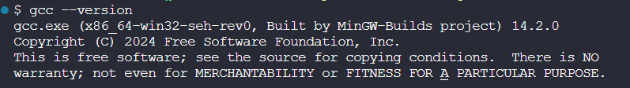
