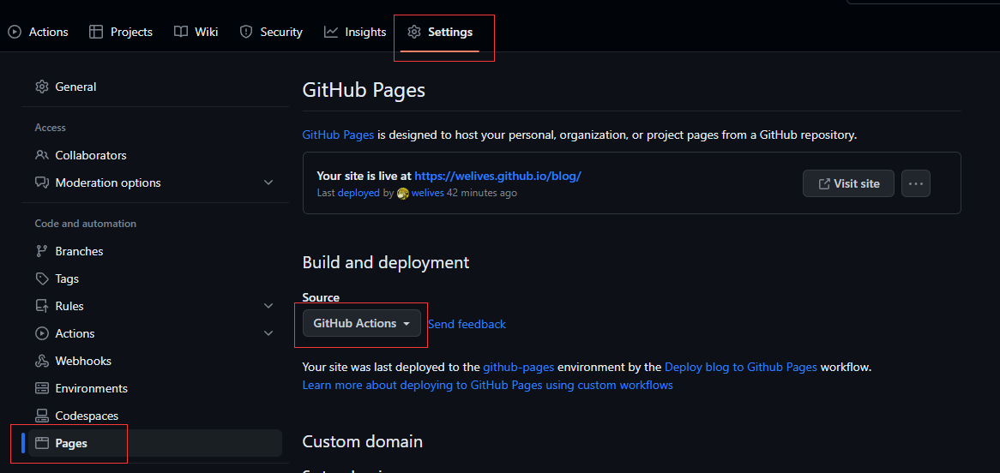
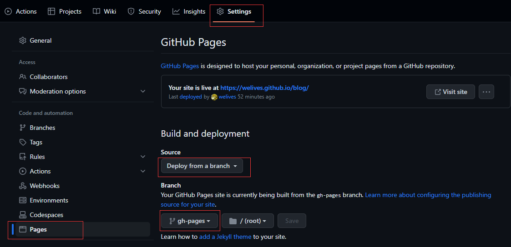

既然选择了用`VitePress`当作博客，那么部署方案肯定不能落下，下面将给出两种方案

::: tip 注意
仓库名要和`VitePress`配置中的`base`一致，否则会部署失败，例如我这个项目在 github 的仓库名是`blog`，那么`base`要写成`/blog`

```js
export default defineConfig({
  // ...
  base: '/blog'
  // ...
})
```

:::

## 使用`Github Actions`自动部署

开始之前，最好先阅读 [GitHub Actions 文档](https://docs.github.com/zh/actions)，主要参考的是 [语法部分](https://docs.github.com/zh/actions/using-workflows/workflow-syntax-for-github-actions)

关于`VitePress`部署方案，具体可以参考官方给出的[示例](https://vitepress.dev/guide/deploy#github-pages)，我这里以本博客为例，简单记录一下

- 在代码仓库页切到`Settings`选项卡，选择左侧菜单的`Pages`项，在页面中`Build and deployment`部分选择`Github Actions`



- 在项目根目录下新建`.github/workflows/deploy.yml`文件，内容如下

::: details 查看

```yml
# 工作流名称
name: Deploy blog to Github Pages

# 用于描述工作流的何时触发
on:
  workflow_dispatch: {}
  push:
    branches: [main]

# 设置GITHUB_TOKEN的权限
permissions:
  contents: read
  pages: write
  id-token: write

# Allow only one concurrent deployment, skipping runs queued between the run in-progress and latest queued.
# However, do NOT cancel in-progress runs as we want to allow these production deployments to complete.
concurrency:
  group: pages
  cancel-in-progress: false

# 工作流里的任务
jobs:
  # 构建
  build:
    # 指定该任务运行的系统，目前可选的有 ubuntu、windows、和 macOS
    runs-on: ubuntu-latest
    # 任务里的运行步骤
    steps:
      # 代码检出
      - name: Checkout
        uses: actions/checkout@v3
        with:
          fetch-depth: 0
      # 指定 node 版本
      - name: Setup Node
        uses: actions/setup-node@v3
        with:
          node-version: 18
          cache: npm
      # 配置 github pages
      - name: Setup Pages
        uses: actions/configure-pages@v3
      # 安装依赖
      - name: Install dependencies
        run: npm ci
      # 打包
      - name: Build with VitePress
        run: |
          npm run build
          touch docs/.vitepress/dist/.nojekyll
      # 上传
      - name: Upload artifact
        uses: actions/upload-pages-artifact@v2
        with:
          path: docs/.vitepress/dist

  # 部署到GitHubPages
  deploy:
    environment:
      name: github-pages
      url: ${{ steps.deployment.outputs.page_url }}
    # 不同任务之间可以通过needs定义依赖关系（执行有先后），例如我们定义deploy需要bulid任务完成后才执行
    needs: build
    runs-on: ubuntu-latest
    name: Deploy
    steps:
      # 执行部署
      - name: Deploy to GitHub Pages
        id: deployment
        uses: actions/deploy-pages@v2
```

:::

- 当推送`main`分支的代码时，Github 会自动进入 CI/CD 流程，过个几分钟，就可以看到博客已经部署成功了

## 使用`deploy.sh`脚本手动部署

- 在项目根目录下新建`deploy.sh`脚本，内容如下

::: details 查看

```sh
#!/usr/sh

# 忽略错误
set -e  #有错误抛出错误

# 构建
npm run build  #然后执行打包命令

# 进入待发布的目录
cd docs/.vitepress/dist  #进到dist目录
touch .nojekyll

# 如果是发布到自定义域名
# echo 'www.example.com' > CNAME

git init  #执行这些git命令
git add -A
git commit -m 'deploy'

# 如果部署到 https://<USERNAME>.github.io
# git push -f git@github.com:welives/welives.github.io.git master

# 如果是部署到 https://<USERNAME>.github.io/<REPO>
git push -f git@github.com:welives/blog.git master:gh-pages  #提交到这个分支

cd -

rm -rf docs/.vitepress/dist  #删除dist文件夹
```

:::

- 修改`package.json`，添加部署脚本

```json
{
  // ...
  "scripts": {
    // ...
    "deploy": "bash deploy.sh"
  }
  // ...
}
```

- 执行`npm run deploy`，部署到 GitHub Pages

- 在代码仓库页切到`Settings`选项卡，选择左侧菜单的`Pages`项，在页面中`Build and deployment`部分选择`Deploy form a branch`，接着选择`gh-pages`分支，然后点击`Save`按钮保存


