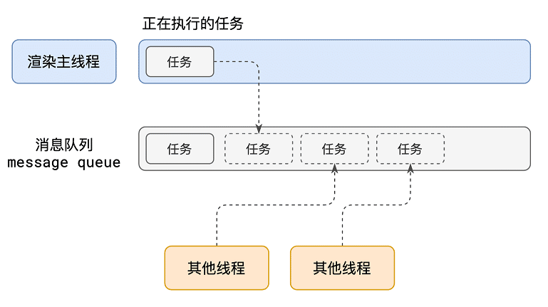
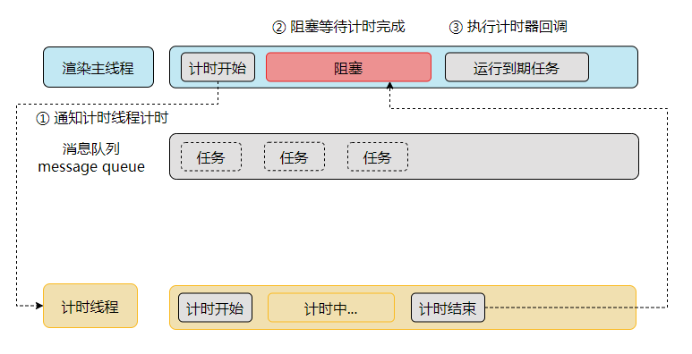
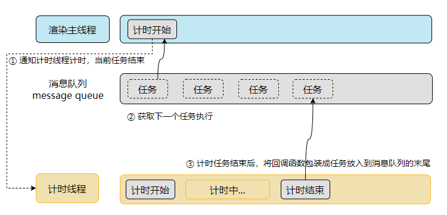

<center><h1>事件循环</h1></center>

## 什么是进程？

程序运行需要有它自己专属的内存空间，可以把这块内存空间简单的理解为进程

每个应用至少要有一个进程，进程与进程之间是相互独立的，即使要通信，也需要双方的同意

## 什么是线程？

有了进程后，就可以运行程序的代码了。打个比喻：运行代码的「**人**」称之为「**线程**」

一个进程至少有一个线程，所以在进程开启后会自动创建一个线程来运行代码，该线程称之为主线程。如果主线程结束了，那么程序也就结束运行了，分配的内存空间也就释放掉了

如果程序需要同时执行多块代码，主线程就会启动更多的线程来执行代码，所以一个进程中可以包含多个线程

## 浏览器有哪些进程和线程？

**浏览器是一个多进程多线程的应用程序**

现代浏览器的内部工作是极其复杂的，堪比操作系统

为了避免相互影响，为了减少连环崩溃的几率，当启动浏览器后，它会自动启动多个进程

?> 在前端开发中，需要重点关注的是「**浏览器进程**」「**网络进程**」「**渲染进程**」

1. 浏览器进程

主要负责界面显示、用户交互、子进程管理等。浏览器进程内部会启动多个线程处理不同的任务。

2. 网络进程

负责加载网络资源。网络进程内部会启动多个线程来处理不同的网络任务。

3. 渲染进程

渲染进程启动后，会开启一个渲染主线程，主线程负责执行 HTML、CSS、JS 代码。默认情况下，浏览器会为每个标签页开启一个新的渲染进程，以保证不同的标签页之间不相互影响。

## 渲染主线程是如何工作的？

渲染主线程是浏览器中最繁忙的线程，需要它处理的任务包括但不限于：

- 解析 HTML
- 解析 CSS
- 计算样式
- 布局
- 处理图层
- 每秒把页面画 60 次
- 执行全局 JS 代码
- 执行事件处理函数
- 执行计时器的回调函数
- ......

要处理这么多的任务，渲染主线程遇到了一个棘手的难题：如何调度任务？

比如：

- 我正在执行一个 JS 函数，执行到一半的时候用户点击了按钮，我该立即去执行点击事件的处理函数吗？
- 我正在执行一个 JS 函数，执行到一半的时候某个计时器到达了时间，我该立即去执行它的回调吗？
- 浏览器进程通知我“用户点击了按钮”，与此同时，某个计时器也到达了时间，我该处理哪一个？
- ......

渲染主线程为了解决这个问题，所采取的方案是：**排队**



1. 在最开始的时候，渲染主线程会进入一个无限循环

```cpp
// 启动渲染主线程
void MessagePumpDefault::Run(Delegate* delegate) {
  AutoReset<bool> auto_reset_keep_running(&keep_running_, true);

  for (;;) {
#if BUILDFLAG(IS_APPLE)
    mac::ScopedNSAutoreleasePool autorelease_pool;
#endif

    // 拿到下一个任务
    Delegate::NextWorkInfo next_work_info = delegate->DoWork();
    bool has_more_immediate_work = next_work_info.is_immediate();
    if (!keep_running_)
      break;

    if (has_more_immediate_work)
      continue;

    has_more_immediate_work = delegate->DoIdleWork();
    if (!keep_running_)
      break;

    if (has_more_immediate_work)
      continue;

    if (next_work_info.delayed_run_time.is_max()) {
      event_.Wait();
    } else {
      event_.TimedWait(next_work_info.remaining_delay());
    }
  }
}
```

2. 每一次循环会检查消息队列中是否有任务存在。如果有，就取出第一个任务执行，执行完一个后进入下一次循环；如果没有，则进入休眠状态
3. 正在执行中的任务或其他所有线程（包括其他进程的线程）可以随时向消息队列添加任务。新任务会加到消息队列的末尾。在添加新任务时，如果主线程是休眠状态，则会将其唤醒以继续循环拿取任务

这样一来，就可以让每个任务有条不紊的、持续的进行下去了。

**整个过程，被称之为事件循环（消息循环）**

## 什么是异步？

代码在执行过程中，会遇到一些无法立即处理的任务，比如：

- 计时完成后需要执行的任务：`setTimeout`、`setInterval`
- 网络通信完成后需要执行的任务：`XHR`、`Fetch`
- 用户操作后需要执行的任务：`addEventListener`

如果让渲染主线程等待这些任务的时机达到，就会导致主线程长期处于「**阻塞**」的状态，从而导致浏览器「**卡死**」



**渲染主线程承担着极其重要的工作，无论如何都不能阻塞！**因此，浏览器选择「**异步**」来解决这个问题



使用异步的方式，**渲染主线程永不阻塞**

### 如何理解 JS 的异步？

**单线程是异步产生的原因，事件循环是异步的实现方式**

!> JS 是一门单线程的语言，这是因为它运行在浏览器的渲染主线程中，而渲染主线程只有一个。<br /> 而渲染主线程承担着诸多的工作，解析 HTML、解析 CSS、执行 JS、渲染页面等等都在其中运行。<br /> 如果使用同步的方式，就极有可能导致主线程产生阻塞，从而导致消息队列中的很多其他任务无法得到执行。<br /> 这样一来，一方面会导致繁忙的主线程白白的消耗时间，另一方面导致页面无法及时更新，给用户造成卡死现象。<br /> 所以浏览器采用异步的方式来避免。具体做法是当某些任务发生时，比如计时器、网络、事件监听，主线程会将任务交给其他线程去处理，自身立即结束该任务的执行，转而去执行后续代码。当其他线程完成时，将事先传递的回调函数包装成任务，加入到消息队列的末尾排队，等待主线程调度执行。<br /> 在这种异步模式下，浏览器永不阻塞，从而最大限度的保证了单线程的流畅运行。

### JS 为何会阻塞渲染？

[JS 阻塞渲染](https://codepen.io/welives/embed/LYMZLmv?default-tab=js%2Cresult ':include :type=iframe width=100% height=300px scrolling=no frameborder=no loading=lazy allowtransparency=true allowfullscreen=true')

### 任务有优先级吗？

任务没有优先级，在消息队列中先进先出

但是**消息队列是有优先级的**

根据 W3C 的最新解释：

- 每个任务都有一个任务类型，同一个类型的任务必须在一个队列，不同类型的任务可以分属不同的队列。<br /> 在一次事件循环中，浏览器可以根据实际情况从不同的队列中取出任务执行。
- [浏览器必须准备好一个微队列，微队列中的任务具有最高优先级](https://html.spec.whatwg.org/multipage/webappapis.html#perform-a-microtask-checkpoint)

?> 在过去，消息队列简单的划分为「**宏队列**」和「**微队列**」

- **宏队列**：用来保存待执行的宏任务(回调)，比如：`setTimeout`回调、`DOM`事件回调、`ajax`回调
- **微队列**：用于存放需要最快执行的任务，比如：`Promise`的`then`回调、`MutationObserver`回调

但随着浏览器的复杂度急剧提升，W3C 不再使用宏队列的说法

!> 目前，在最新的 Chrome 实现中，至少包含了下面的队列：

- **延时队列**：用于存放计时器到达后的回调任务，优先级「**中**」。比如：`setTimeout`回调
- **交互队列**：用于存放用户操作后产生的事件处理任务，优先级「**高**」。比如：`DOM`事件回调
- **微队列**：用于存放需要最快执行的任务，优先级「**最高**」。比如：`Promise`的`then`回调、`MutationObserver`回调

浏览器还有很多其他的队列，但是跟前端开发关系不大，所以不必深究

?> 添加任务到微队列的主要方式是使用`Promise`、`MutationObserver`。比如立即把一个函数添加到微队列`Promise.resolve().then(function(){})`

### 阐述一下 JS 的事件循环

!> 事件循环又叫做消息循环，是浏览器渲染主线程的工作方式。<br /> 由于 JS 代码是运行在渲染主线程当中的，而渲染主线程「**有且只有一个**」，这就会出现同一时间只能执行一段代码的问题，这个就是 JS 单线程的本质原因。<br /> 为了解决这个问题，浏览器采取的方案是「**异步**」，而「**事件循环**」则是异步的实现方式。 <br /> 在 Chrome 的源码中，它会开启一个`for`无限循环，每次循环从消息队列中取出第一个任务执行，而其他线程只需要在合适的时机将任务加入到队列的末尾即可。<br /> 过去曾把消息队列简单分为「**宏队列**」和「**微队列**」，这种说法目前已无法满足复杂的浏览器环境，取而代之的是一种更加灵活多变的处理方式。<br /> 根据 W3C 官方的解释，每个任务有不同的类型，同类型的任务必须在同一个队列，不同的任务可以属于不同的队列。不同的任务队列有不同的优先级，在一次事件循环中，由浏览器自行决定取哪一个队列中的任务。但浏览器必须有一个微队列，**微队列的任务一定具有最高的优先级，必须优先调度执行**。

### JS 中的计时器能做到精确计时吗？为什么？

!> 不能，因为：<br /> 1. 计算机硬件不是原子钟，无法做到精确计时。<br /> 2. 操作系统的计时函数本身就有少量偏差，由于 JS 的计时器最终调用的是操作系统的函数，也就携带了这些偏差。<br /> 3. [按照 W3C 的标准](https://html.spec.whatwg.org/multipage/timers-and-user-prompts.html#timers)，浏览器实现计时器时，如果嵌套层级超过 5 层，则会带有 4 毫秒的最少时间，这样在计时时间少于 4 毫秒时又带来了偏差。<br /> 4. 受事件循环的影响，计时器的回调函数只能在渲染主线程空闲时运行，因此又带来了偏差
