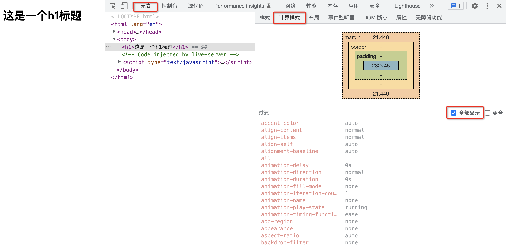
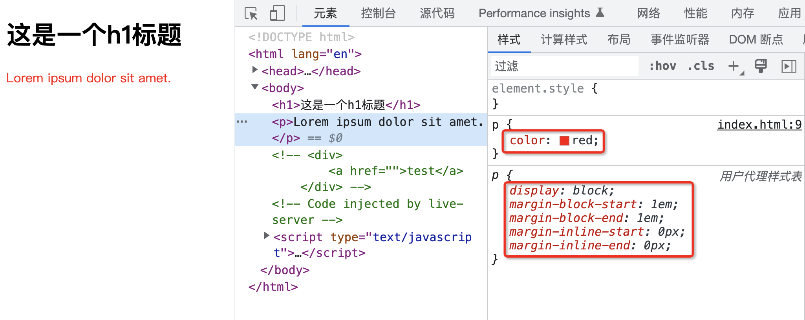
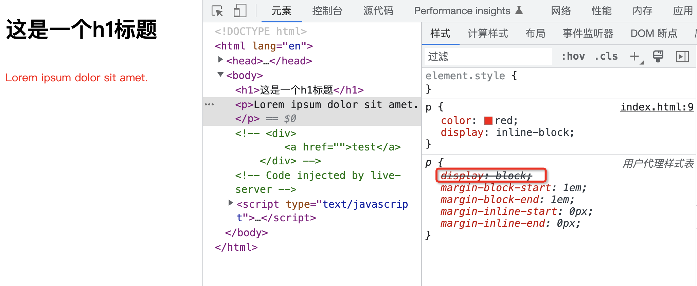
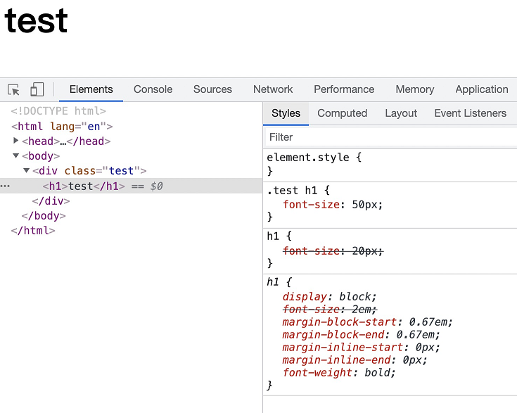
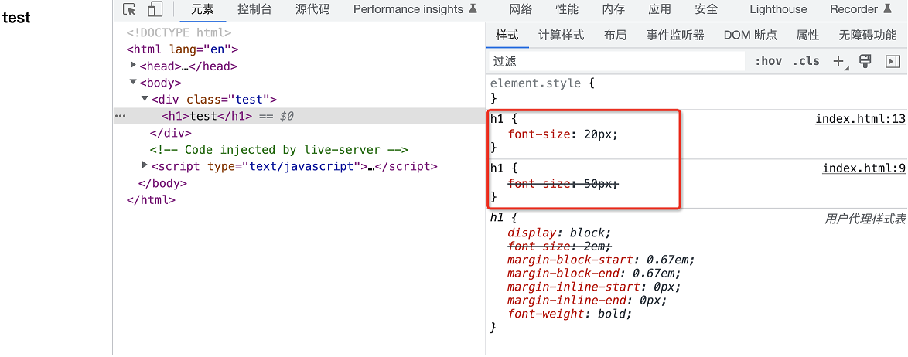
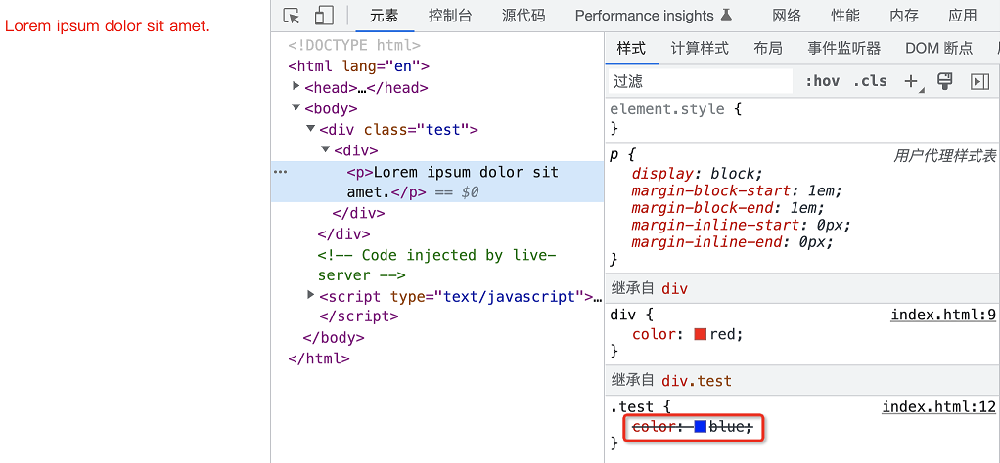
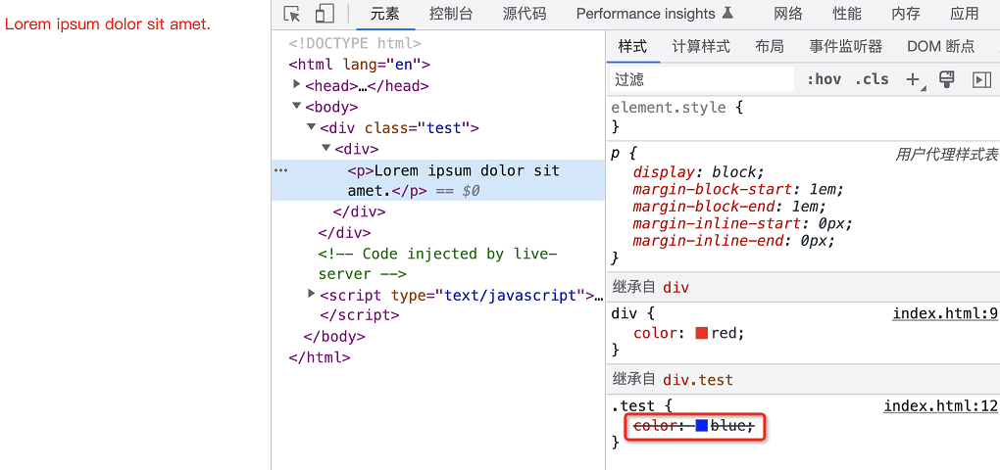
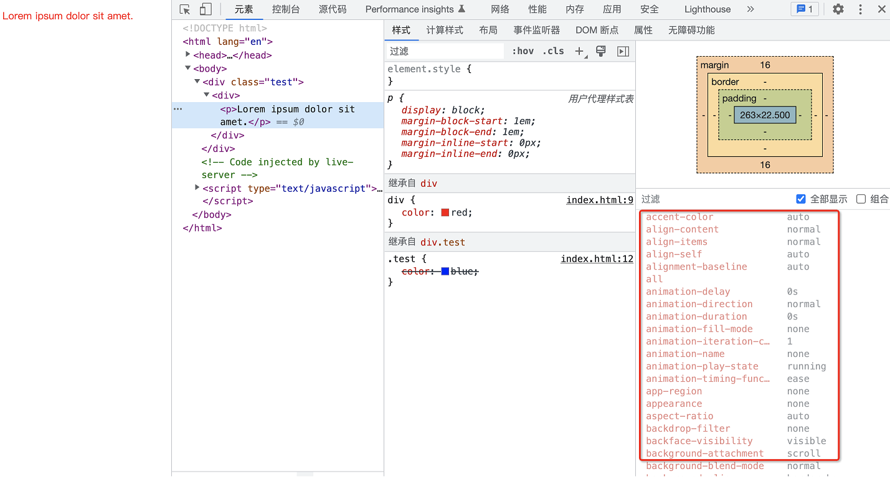
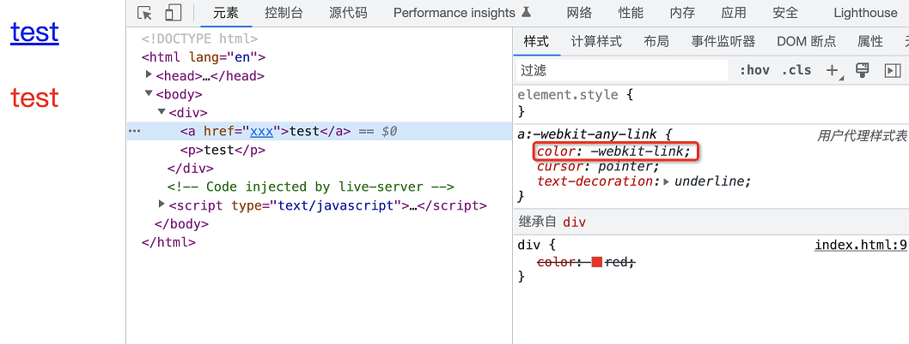

<center><h1>CSS 属性计算过程</h1></center>

## 前言

你是否了解 CSS 的属性计算过程呢？有的同学可能会讲，CSS 属性我倒是知道，例如：

```css
p {
  color: red;
}
```

上面的 CSS 代码中，`p`是元素选择器，`color`就是其中的一个 CSS 属性

但是要说 CSS 属性的计算过程，还真的不是很清楚

没关系，通过此篇文章，能够让你彻底明白什么是 CSS 属性的计算流程

::: tip
首先，不知道你有没有考虑过这样的一个问题，假设在 HTML 中有这么一段代码

```html
<body>
  <h1>这是一个h1标题</h1>
</body>
```

:::

上面的代码也非常简单，就是在`body`中有一个`h1`标题而已，该`h1`标题呈现出来的外观是如下


目前我们没有设置该`h1`的任何样式，但是却能看到该`h1`有一定的默认样式，例如有默认的字体大小、默认的颜色

那么问题来了，我们这个`h1`元素上面除了有默认字体大小、默认颜色等属性以外，究竟还有哪些属性呢？

答案是**该元素上面会有 CSS 所有的属性**。你可以打开浏览器的开发者面板，选择「**元素**」，切换到「**计算样式**」，之后勾选「**全部显示**」，此时你就能看到在此`h1`上面所有 CSS 属性对应的值



换句话说，**我们所书写的任何一个 HTML 元素，实际上都有完整的一整套 CSS 样式**。这一点往往是让初学者比较意外的，因为我们平时在书写 CSS 样式时，往往只会书写必要的部分，例如前面的

```css
p {
  color: red;
}
```

这往往会给我们造成一种错觉，认为该`p`元素上面就只有`color`属性。而真实的情况确是，任何一个 HTML 元素，都有一套完整的 CSS 样式，只不过你没有书写的样式，**大概率可能**会使用其默认值。例如上图中`h1`一个样式都没有设置，全部都用的默认值

但是注意，我这里强调的是「**大概率可能**」，难道还有我们「没有设置值，但是不使用默认值」的情况么？

嗯，确实有的，所以我才强调你要了解「CSS 属性的计算过程」

总的来讲，属性值的计算过程，分为如下这么 **4** 个步骤：

- 确定声明值
- 层叠冲突
- 使用继承
- 使用默认值

## 确定声明值

首先第一步，是确定声明值。所谓声明值就是开发者自己所书写的 CSS 样式，例如前面的：

```css
p {
  color: red;
}
```

这里我们声明了`p`元素为红色，那么就会应用此属性设置

当然，除了「**页面作者样式**」，一般浏览器还会存在「**用户代理样式表**」，简单来讲就是浏览器内置了一套样式表



在上面的示例中，「页面作者样式」中设置了`color`属性，而用户代理样式表（浏览器提供的样式表）中设置了诸如`display`、`margin-block-start`、`margin-block-end`、`margin-inline-start`、`margin-inline-end`等属性对应的值

这些值目前来讲也没有什么冲突，因此最终就会应用这些属性值

## 层叠冲突

在确定声明值时，可能出现一种情况，那就是声明的样式规则发生了冲突

此时会进入解决层叠冲突的流程。而这一步又可以细分为下面这三个步骤：

- 比较源的重要性
- 比较优先级
- 比较次序

### [比较源的重要性](https://developer.mozilla.org/zh-CN/docs/Web/CSS/Cascade)

当不同的 CSS 样式来源拥有相同的声明时，此时就会根据样式表来源的重要性来确定应用哪一条样式规则

那么问题来了，咱们的样式表的源究竟有几种呢？

整体来讲有三种来源：

- 浏览器会有一个基本的样式表来给任何网页设置默认样式。这些样式统称「**用户代理样式表**」
- 网页的作者可以定义文档的样式，这是最常见的样式表，称之为「**页面作者样式**」
- 浏览器的用户，可以使用自定义样式表定制使用体验，称之为「**用户样式**」

对应的重要性顺序依次为：**页面作者样式 > 用户样式 > 用户代理样式**

例如现在有「页面作者样式」和「用户代理样式表」中存在属性的冲突，那么会以「页面作者样式」优先



可以明显的看到，「页面作者样式」和「用户代理样式表」中同时存在的`display`属性的设置，最终「页面作者样式」干掉了「用户代理样式表」中冲突的属性。这就是第一步，根据不同源的重要性来决定应用哪一个源的样式

### [比较优先级](https://developer.mozilla.org/zh-CN/docs/Web/CSS/Specificity)

那么接下来，如果是在在同一个源中有样式声明冲突怎么办呢？此时就会进行样式声明的优先级比较

```css
.test h1 {
  font-size: 50px;
}
h1 {
  font-size: 20px;
}
```

在上面的代码中，同属于「页面作者样式」，源的重要性是相同的，此时会以选择器的权重来比较重要性

很明显，上面的选择器的权重要大于下面的选择器，因此最终标题呈现为`50px`



可以看到，落败的作者样式在`Elements>Styles`中会被划掉

### 比较次序

经历了上面两个步骤，大多数的样式声明能够被确定下来。但是还剩下最后一种情况，那就是样式声明既是同源，权重也相同，此时就会进入第三个步骤，比较样式声明的次序

```css
h1 {
  font-size: 50px;
}
h1 {
  font-size: 20px;
}
```

在上面的代码中，同样都是**页面作者样式，选择器的权重也相同**，此时位于下面的样式声明会层叠掉上面的那一条样式声明，最终会应用`20px`这一条属性值



至此，样式声明中存在冲突的所有情况，就全部被解决了

## 使用继承

层叠冲突这一步完成后，解决了相同元素被声明了多条样式规则究竟应用哪一条样式规则的问题

那么如果没有声明的属性呢？此时就使用默认值么？

No、No、No，别急，此时还有第三个步骤，那就是使用继承而来的值

```html
<div>
  <p>Lorem ipsum dolor sit amet.</p>
</div>
<style>
  div {
    color: red;
  }
</style>
```

在上面的代码中，我们针对`div`设置了`color`属性值为红色，而针对`p`元素我们没有声明任何的属性，但是由于`color`是可以继承的，因此`p`元素从**最近的**`div`身上继承到了`color`属性的值



这里有两个点需要注意一下

首先第一个是我强调了是**最近的**`div`元素，看下面的例子：

```html
<div class="test">
  <div>
    <p>Lorem ipsum dolor sit amet.</p>
  </div>
</div>
<style>
  div {
    color: red;
  }
  .test {
    color: blue;
  }
</style>
```



因为这里并不涉及到选中`p`元素声明`color`值，而是从父元素上面继承到`color`对应的值，因此这里是「**就近原则**」，初学者往往会产生混淆，又去比较权重，但是这里根本不会涉及到权重比较，因为压根儿就没有选中到`p`元素

第二个就是哪些属性能够继承？

关于这一点的话，[可以在 MDN 上面很轻松的查阅到](https://developer.mozilla.org/zh-CN/docs/Web/CSS)

## 使用默认值

好了，目前走到这一步，如果属性值都还不能确定下来，那么就只能是使用默认值了



前面我们也说过，一个 HTML 元素要在浏览器中渲染出来，必须具备所有的 CSS 属性值，但是绝大部分我们是不会去设置的，「用户代理样式表」里面也不会去设置，也无法从继承拿到，因此最终都是用默认值

好了，这就是关于 CSS 属性计算过程的所有知识了

## 一道面试题

`a`标签和`p`标签分别会是什么颜色？

```html
<div>
  <a href="">test</a>
  <p>test</p>
</div>
<style>
  div {
    color: red;
  }
</style>
```



实际上原因很简单，因为`a`元素在「用户代理样式表」中已经设置了`color`属性对应的值，因此会应用此声明值。而`p`元素无论是在「页面作者样式」还是「用户代理样式表」，都没有对此属性进行声明，然而由于`color`属性是可以继承的，因此最终`p`元素的`color`属性值通过继承来自于父元素
