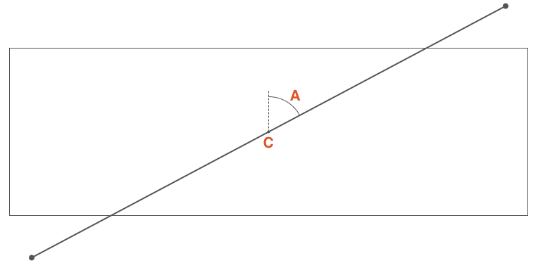
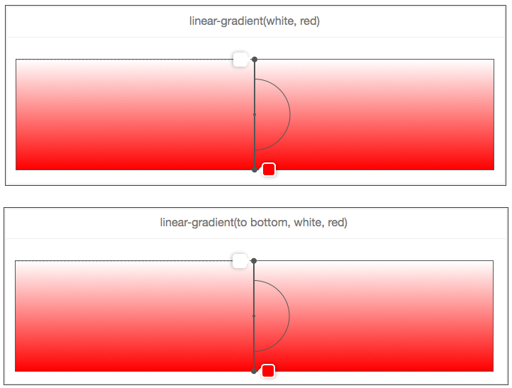
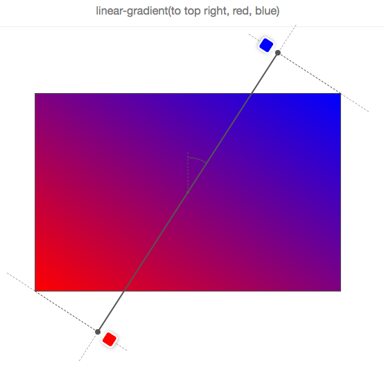
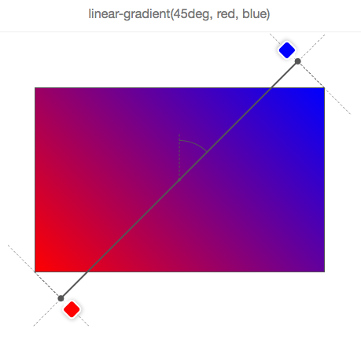
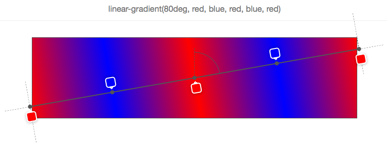
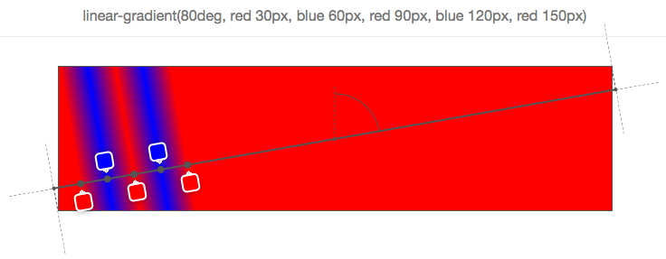
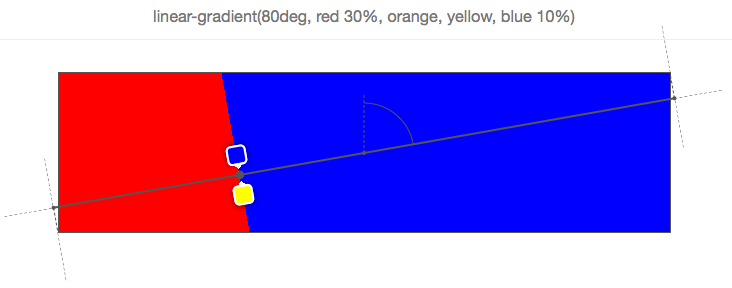

## `linear-gradient`的语法

```css
linear-gradient([<angle> | to <side-or-corner>]? , <color-stop-list>)
```

这个函数（特性）接受的第一个参数是**渐变的角度**，他可以接受一个表示角度的值（可用的单位`deg`、`rad`、`grad`或`turn`）或者是表示方向的关键词（`top`、`right`、`bottom`、`left`、`left top`、`top right`、`bottom right`或者`left bottom`）。第二个参数是接受一系列**颜色节点**（终止点的颜色）

## 渐变容器

一个渐变图像和传统的背景图像不一样，它是没有维度（尺寸限制），它是无限的。那么决定渐变图像可见区域是由渐变容器大小来决定的

通常，如果给一个 DOM 元素的`background-image`使用`linear-gradient`，那么其（渐变）显示区域就是元素的`border-box`区域（如果不了解元素的`border-box`区域，建议先阅读[box-sizing](https://developer.mozilla.org/zh-CN/docs/Web/CSS/box-sizing)相关的文档）。其实也是`background-color`或者说通过`url`引入背景图像的显示区域

然而，如果你通过 CSS 的`background-size`设置一个尺寸，比如说`background-size: 200px 200px`，这个时候渐变容器（渐变尺寸）的大小就是`200px * 200px`。在没有使用`background-position`设置为其他值时，它默认是显示在 DOM 元素的左上角（也就是`background-position: left top`）

## 渐变线

在渐变容器中，穿过**容器中心点**和**颜色停止点**连接在一起的线称为渐变线。下面的[渐变角度](#渐变角度)将会讲解更多细节

## 渐变角度

很明显，使用`linear-gradient`是通过渐变的角度来控制渐变的方向



`C点`渐变容器**中心点**，`∠A`是通过`C点`**垂直线**(图中的虚线)与通过`C点`**渐变线**(图中的实线)的夹角，这个角称为**渐变角度**

::: tip 可以通过下面的两种方式来定义这个角度

- 使用关键词：`to top`、`to bottom`、`to left`、`to right`、`to top right`、`to top left`、`to bottom right`和`to bottom left`
- 使用带单位的数字定义角度，比如`45deg`、`1turn`等

> 如果省略角度值，那默认就是`to bottom`(对应`180deg`或`0.5turn`)

:::



当使用顶角关键词时，需要注意的一点是，它依赖于渐变容器的尺寸。例如`to top right`

如果你想要一个`red`至`blue`的渐变，方向是至元素的`top top right`。逻辑上，`blue`应该在元素的右上角，以及中间的紫色渐变周围应该形成一条直线，从左上角至右下角穿过。如下图所示：



> 所以`to top right`并不意味着渐变线穿过右上角，也就是说渐变角度并不意味着是`45deg`

下面是一个渐变线移动变化的示意图：


## 渐变线长度



如果所示，我们想要一个`red`至`blue`的渐变，渐变的角度是`45deg`，因为渐变容器的比例，渐变线不能通过右上角。但浏览器想要做什么（规范告诉它做什么），能使右上角是`blue`。

如果我们让渐变线的开始和结束都在渐变容器的边缘，那么`blue`将会覆盖渐变容器更大的区域，渐变不会有更多的扩散。

因此，为了做到这一点，渐变线有时不得不延长到渐变容器之外。其实很容器知道它的开始和结束位置。通过最近的角落画一条垂直于渐变线的线，与渐变线交叉的地方，就是渐变的开始和结束位置（[规范中做出了很好的解释](https://drafts.csswg.org/css-images/#linear-gradient-syntax)）

事实上，如果 W 是渐变容器的宽度，H 是渐变容器的高度，A 是渐变角度，那么渐变线的长度可以通过下面的公式计算：`abs(W * sin(A)) + abs(H * cos(A))`

## 渐变色节点

每一个渐变色节点可以这样定义: `<color> [<percentage> | <length>]?`

可以看到，渐变线的位置并不是必须的，例如：



如果没有显式指定颜色在渐变线上的位置，这将交给浏览器来确定颜色在渐变线上的位置。**最简单的情况下只有两个颜色**，**颜色 1**将被放置在渐变线`0%`位置（渐变线开始位置），**颜色 2**将被放置在`100%`位置处（渐变线的结束点）。**如果有三个颜色**，那么**颜色 1**在渐变线的`0%`，**颜色 2**在渐变线的`50%`，**颜色 3**在渐变线的`100%`。

在上面的这个示例中，有五个颜色，那么它们的位置分别在`0%`、`25%`、`50%`、`75%`和`100%`。它们将**沿着渐变线平均分布渐变颜色**

当然，也可以在渐变线上显式自定义渐变颜色在渐变线的位置。每个位置可以用百分比表示（相对于渐变线计算），也可以是任何一个 CSS 长度单位。比如下面这个示例：



::: warning 注意
**渐变色结束点是一个增量值**，排在后面的渐变色结束点必须大于之前的，否则浏览器会自动纠正
:::



如上图：最后一个颜色`blue`是不正确的位置，因此浏览器将会纠正它的位置与之前的位置相同，在这种情况之下并不是与其相邻的颜色`yellow`，也不会是`orange`，它会追溯到第一个颜色`red`位置处。因此，`red`和`blue`都分布在渐变线的`30%`处，因此其中`yellow`和`orange`两颜色都将不可见

## 一个线性渐变的可视化工具

<iframe height="300" style="width: 100%;" scrolling="no" title="CSS linear-gradient overlay" src="https://codepen.io/welives/embed/MWzMNGZ?default-tab=css%2Cresult" frameborder="no" loading="lazy" allowtransparency="true" allowfullscreen="true">
  See the Pen <a href="https://codepen.io/welives/pen/MWzMNGZ">
  CSS linear-gradient overlay</a> by Jandan (<a href="https://codepen.io/welives">@welives</a>)
  on <a href="https://codepen.io">CodePen</a>.
</iframe>

> 参考之《[你真的理解 CSS 的 linear-gradient？](https://www.w3cplus.com/css3/do-you-really-understand-css-linear-gradients.html)》

## 实战：条纹进度条

::: details 思路

1. 把渐变背景分成若干份正方形的切片
2. 接着将每一份切片的背景均匀的分为四份,使用两种颜色互相隔开,因此需要四组渐变色节点
3. 最后把每一份切片拼接成完整的斜向条纹

```css
background-color: var(--main-color);
background-size: 5rem 5rem;
background-image: linear-gradient(
  -45deg,
  transparent 0,
  transparent 25%,
  var(--light-color) 25%,
  var(--light-color) 50%,
  transparent 50%,
  transparent 75%,
  var(--light-color) 75%,
  var(--light-color) 100%
);
/* 或者也可以这样写 */
background-image: repeating-linear-gradient(-45deg, transparent 0 25%, var(--light-color) 25% 50%);
/* 因为上面把切片大小定为5rem,所以动画的位移也要是5rem */
@keyframes stripe-animation {
  0% {
    background-position: 0 0;
  }
  100% {
    background-position: 5rem 0;
  }
}
```

:::

<iframe height="300" style="width: 100%;" scrolling="no" title="条纹进度条" src="https://codepen.io/welives/embed/abQedev?default-tab=css%2Cresult" frameborder="no" loading="lazy" allowtransparency="true" allowfullscreen="true">
  See the Pen <a href="https://codepen.io/welives/pen/abQedev">
  条纹进度条</a> by Jandan (<a href="https://codepen.io/welives">@welives</a>)
  on <a href="https://codepen.io">CodePen</a>.
</iframe>
