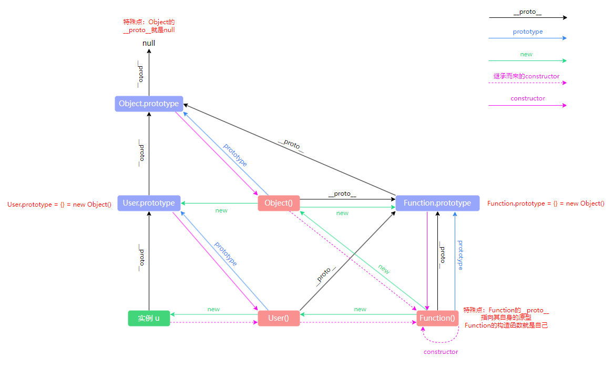

::: tip 总结

- 需要牢记两点

  1. `__proto__`和`constructor`属性是对象所独有的
  2. `prototype`属性是函数所独有的，因为函数也是一种对象，所以函数也拥有`__proto__`和`constructor`属性

- `prototype`属性的作用就是让该函数所实例化的对象们都可以找到公用的属性和方法，即`u.__proto__ === User.prototype`
- `constructor`属性的含义就是指向该对象的构造函数，所有函数(_此时看成对象_)最终的构造函数都指向`Function`
- `__proto__`属性的作用就是：当访问一个对象的属性时，如果该对象内部不存在这个属性，那么就会去它的`__proto__`属性所指向的那个对象(父对象)里找，一直找，直到`__proto__`属性的终点`null`，再往上找就相当于在`null`上取值，会报错。通过`__proto__`属性将对象连接起来的这条链路即所谓的「**原型链**」

:::
