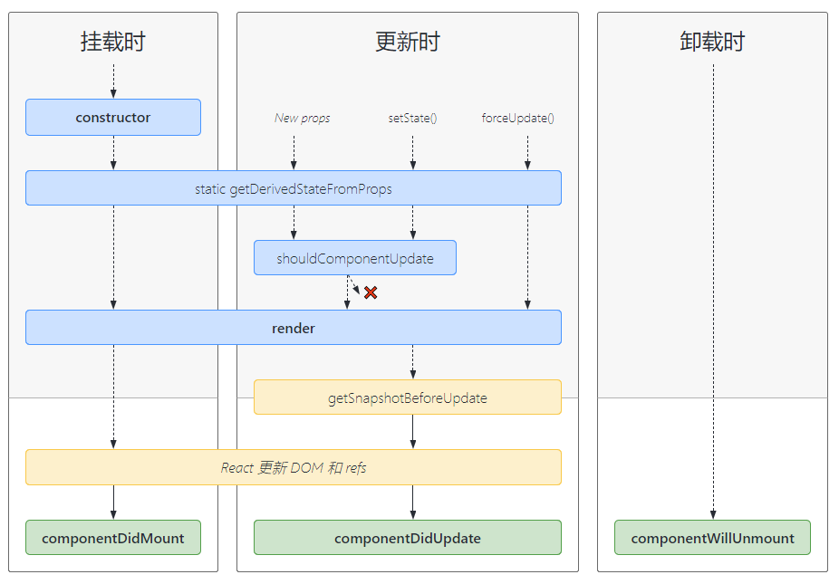
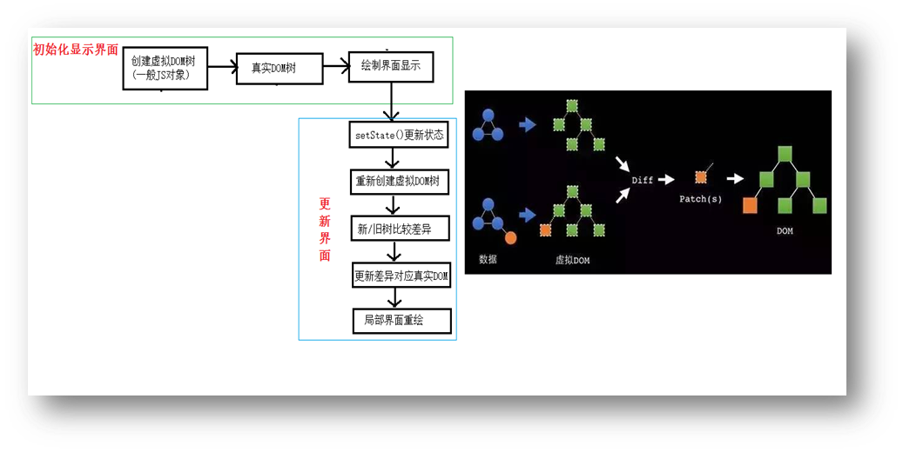

## 组件

组件必须以大写字母开头，React 会将以小写字母开头的组件视为原生 DOM 标签。例如`<Welcome />`

### 函数式组件

适用于业务简单的组件

- 函数式组件中的`this`指向`undefined`，因为 babel 编译后会开启严格模式

```jsx
function App() {
  return <div>Hello World</div>
}
```

### 类组件

适用于业务复杂的组件

- 类式组件必须要继承`React.Component`
- 一定要写`render`函数，且要有返回值
- `render`是放在类的原型对象上，供实例使用
- `render`中的`this`指向类的实例对象，所以需要使用`bind`来绑定`this`

```jsx
class App extends React.Component {
  render() {
    return <div>Hello World</div>
  }
}
```

### 区别

| 区别     | 函数组件                     | 类组件                             |
| -------- | ---------------------------- | ---------------------------------- |
| 语法     | 由函数定义                   | 由类定义，继承自`React.Component`  |
| 状态管理 | 无状态，不能使用`setState()` | 有状态，使用`setState()`初始化状态 |
| 生命周期 | 无                           | 有                                 |
| 调用方式 | 无需实例化                   | 实例化                             |

## 状态`state`

- 在`constructor`中初始化`state`，且要用对象形式初始化`state`，此时不能调用`setState`
- `state`数据不能直接修改，必须要用`setState`来修改
- 自定义的事件回调函数的`this`可以在`constructor`中用`bind`更改指向
- `onClick={this.hello}`是将`this.hello`函数赋值给`onClick`，函数后面不能加括号，否则就是将函数返回值赋值
- 在`render`函数中创建虚拟 DOM 时，直接在标签中绑定事件，且事件写法不同于原生 JS，如原生 JS 中的`onclick`事件，在 React 中要写成`onClick`，其他同理

::: code-group

```jsx [常规]
class App extends React.Component {
  constructor(props) {
    super(props)
    // 定义响应式变量, 这里的state 类似vue中的 data
    this.state = { count: 0 }
  }
  // 这种写法是将方法定义在原型上
  increment() {
    this.setState({ count: this.state.count + 1 })
  }
  // 这种写法是将方法定义在实例上，解决 this 指向的最佳实践
  decrement = () => {
    this.setState((state) => ({ count: state.count - 1 }))
  }
  render() {
    return (
      <div>
        <button onClick={this.increment.bind(this)}>+</button>
        <span>{this.state.count}</span>
        <button onClick={this.decrement}>-</button>
      </div>
    )
  }
}
```

```jsx [简写]
class App extends React.Component {
  // 初始化状态 类里可以直接写赋值语句，相当于追加属性
  state = { count: 0 }
}
```

:::

### `setState`

- 形式一：`setState(updater, [callback])`

第一个参数为带有形参的`updater`函数：`(state) => stateChange`

第二个参数为可选的回调函数，它将在`setState`完成状态的更新后执行。但通常建议使用`componentDidUpdate()`来代替此方式

```js
this.setState((state) => ({ count: state.count + 1 }))
```

- 形式二：`setState(stateChange, [callback])`

第一个参数可以接受对象类型，`stateChange`会将传入的对象浅合并到新的`state`中

```js
this.setState({ count: this.state.count + 1 })
```

### 有状态组件

- 通常来说，类组件就是有状态组件，因为可以定义各种`state`和使用生命周期
- 因为类组件能够维护自身内部的数据(`state`)，所以适合用于逻辑层和数据层

### 无状态组件

- 当一个组件只有一个`render`函数的时候，就可以用无状态组件来定义这个组件。无状态组件其实就是一个函数，它没有`state`、没有生命周期，只接收父组件传递过来`props`作为参数，并返回一段 JSX
- 因为函数的运行速度优于类，所以适合用于表现层

```jsx
function App() {
  return (
    <div>
      <Hello name="jandan" />
    </div>
  )
}
function Hello(props) {
  return (
    <div>
      <p>Hello, My name is {props.name}</p>
    </div>
  )
}
```

## Props

`props`的作用是接收组件外部的数据

`state`和`props`主要的区别在于`props`是只读的，而`state`可以根据与用户交互来改变

### 特点

- `props`可以接收任意类型的数据
- `props`是只读属性，子组件中不能对值进行修改，单向数据流
- 使用类组件时，如果写了构造函数，应该将`props`传递给`super()`,否则无法在构造函数中获取到`props`，其他的地方是可以拿到的

::: code-group

```jsx [父组件]
import React, { Fragment } from 'react'
class App extends React.Component {
  state = { msg: 'greeting' }
  say = () => {
    this.setState({ msg: 'hello' })
  }
  render() {
    return (
      <Fragment>
        <Child msg={this.state.msg} say={this.say}></Child>
      </Fragment>
    )
  }
}
```

```jsx [子组件]
import React from 'react'
class Child extends React.Component {
  render() {
    return (
      <div>
        <button onClick={this.props.say}>sayHello</button>
        <p>{this.props.msg}</p>
      </div>
    )
  }
}
```

:::

### PropTypes

::: code-group

```jsx [类组件外部]
import React from 'react'
import PropTypes from 'prop-types'
class App extends React.Component {}
// 指定props的默认值
App.defaultProps = {
  list: []
}
// 属性限制(类型,是否必传等)
App.propTypes = {
  msg: PropTypes.string.isRequired,
  list: PropTypes.array
}
```

```jsx [类组件内部]
import React from 'react'
import PropTypes from 'prop-types'
class App extends React.Component {
  // 指定props的默认值
  static defaultProps = {
    list: []
  }
  // 属性限制(类型,是否必传等)
  static propTypes = {
    msg: PropTypes.string.isRequired,
    list: PropTypes.array
  }
}
```

```jsx [函数组件]
import PropTypes from 'prop-types'
function App(props) {}
// 指定props的默认值
App.defaultProps = {
  list: []
}
// 属性限制(类型,是否必传等)
App.propTypes = {
  msg: PropTypes.string.isRequired,
  list: PropTypes.array
}
```

:::

## `refs`

`refs`的作用是获取真实 DOM 元素或者 React 组件实例

### 字符串ref

::: warning 注意
这种是 React16.3 之前写法已经被官方标记为过时，不推荐使用
:::

```jsx
class App extends React.Component {
  handleClick = () => {
    console.log(this.refs.linkRef)
  }
  render() {
    return (
      <div>
        <a ref="linkRef" href="https://reactjs.org">
          Learn React
        </a>
        <button onClick={this.handleClick}>Click Me</button>
      </div>
    )
  }
}
```

### 回调ref

::: tip
这种虽然也是 React16.3 之前写法，但目前仍然可以使用
:::

```jsx
class App extends React.Component {
  getLinkRef = (e) => {
    this.linkRef = e
  }
  handleClick = () => {
    console.log(this.linkRef)
  }
  render() {
    return (
      <div>
        <a ref={this.getLinkRef} href="https://reactjs.org">
          Learn React
        </a>
        <button onClick={this.handleClick}>Click Me</button>
      </div>
    )
  }
}
```

### `createRef`

::: tip
这种是 React16.3 之后写法，只能用于类组件
:::

::: code-group

```jsx [父组件]
class App extends React.Component {
  childRef = React.createRef()
  handleClick = () => {
    console.log(this.childRef.current)
  }
  render() {
    return (
      <div>
        <Child ref={this.childRef} />
        <button onClick={this.handleClick}>Click Me</button>
      </div>
    )
  }
}
```

```jsx [子组件]
class Child extends React.Component {
  state = {
    name: 'Child'
  }
  render() {
    return <div>this is {this.state.name}</div>
  }
}
```

:::

### `useRef`

::: tip
这种是 React16.8 之后的`Hooks`写法，只能用于函数式组件
:::

- 默认情况下，不能在函数组件上使用`ref`属性，因为它们没有实例
- 如果要在函数组件中使用`ref`，可以使用`forwardRef`，或者可以将该组件转化为类组件

::: code-group

```jsx [父组件]
function App() {
  const childRef = React.useRef()
  const handleClick = () => {
    console.log(childRef.current)
  }
  return (
    <div>
      <Child ref={childRef} />
      <button onClick={handleClick}>Click Me</button>
    </div>
  )
}
```

```jsx [函数式子组件]
const Child = React.forwardRef((props, ref) => {
  return <div ref={ref}>this is Child</div>
})
```

```jsx [类子组件]
class Child extends React.Component {
  render() {
    return <div>this is Child</div>
  }
}
```

:::

::: tip `createRef`和`useRef`的区别

- `createRef`会在组件每次渲染时都返回一个新的引用，只能在类组件中使用
- `useRef`只会在组件首次渲染时创建，在组件的整个生命周期中都保持相同的引用，只能在函数组件中使用

:::

## 事件

- React 事件的命名采用小驼峰式（camelCase），而不是纯小写
- 使用 JSX 语法时你需要传入一个函数作为事件处理函数，而不是一个字符串
- 不能通过`return false`的方式阻止默认行为。你必须显式的使用`e.preventDefault()`

### 函数组件

::: code-group

```jsx [默认参数]
function App() {
  const handleClick = (e) => {
    e.preventDefault()
  }
  return (
    <div>
      <button onClick={handleClick}>Click Me</button>
    </div>
  )
}
```

```jsx [额外参数]
function App() {
  const handleClick = (msg, e) => {
    e.preventDefault()
    console.log(msg)
  }
  return (
    <div>
      <button onClick={(e) => handleClick('hello', e)}>Click Me</button>
    </div>
  )
}
```

:::

### 类组件

- 方式一

在`render`中使用`bind`更改指向，不推荐，每次渲染都会重新绑定，浪费性能

```jsx
class App extends React.Component {
  state = { msg: 'hello world' }
  handleClick() {
    console.log(this.state.msg)
  }
  render() {
    return (
      <div>
        <button onClick={this.handleClick.bind(this)}>hello</button>
      </div>
    )
  }
}
```

- 方式二

包裹一层箭头函数，不推荐，每次渲染都会重新创建函数，浪费性能

```jsx
class App extends React.Component {
  state = { msg: 'hello world' }
  handleClick() {
    console.log(this.state.msg)
  }
  render() {
    return (
      <div>
        <button onClick={() => this.handleClick()}>hello</button>
      </div>
    )
  }
}
```

- 方式三

高阶函数：直接运行函数并返回一个箭头函数

```jsx
class App extends React.Component {
  state = { msg: 'hello world' }
  handleClick() {
    return () => {
      console.log(this.state.msg)
    }
  }
  render() {
    return (
      <div>
        <button onClick={this.handleClick()}>hello</button>
      </div>
    )
  }
}
```

- 方式四

在构造函数中使用`bind`更改指向，推荐的做法

```jsx
class App extends React.Component {
  constructor(props) {
    super(props)
    this.state = { msg: 'hello world' }
    this.handleClick = this.handleClick.bind(this)
  }
  handleClick() {
    console.log(this.state.msg)
  }
  render() {
    return (
      <div>
        <button onClick={this.handleClick}>hello</button>
      </div>
    )
  }
}
```

- 方式五

定义的时候使用函数表达式的形式，推荐的做法，这种方式是最佳实践

```jsx
class App extends React.Component {
  state = { msg: 'hello world' }
  handleClick = () => {
    console.log(this.state.msg)
  }
  render() {
    return (
      <div>
        <button onClick={this.handleClick}>hello</button>
      </div>
    )
  }
}
```

## [生命周期](https://projects.wojtekmaj.pl/react-lifecycle-methods-diagram/)



::: tip

- 挂载阶段
  - `constructor(props)`：如果不初始化`state`或不进行方法绑定，则不需要为 React 组件实现构造函数
  - `static getDerivedStateFromProps(props, state)`：在调用`render`方法之前调用，并且在初始挂载及后续更新时都会被调用。它应返回一个对象来更新`state`，如果返回`null`则不更新任何内容
  - `render()`：类组件中必须实现的方法。如果`shouldComponentUpdate()`返回`false`，则不会调用`render()`
  - `componentDidMount()`：会在组件挂载后立即调用。依赖于 DOM 节点的初始化应该放在这里。如需通过网络请求获取数据，此处是实例化请求的好地方
  - ~~`UNSAFE_componentWillMount()`~~：即将废弃，不过多介绍
- 更新阶段
  - `static getDerivedStateFromProps(props, state)`：参考挂载阶段
  - `shouldComponentUpdate(nextProps, nextState)`：在这里对组件进行优化，是否需要更新，若返回`false`将不会调用`render()`和`componentDidUpdate()`。首次渲染或使用`forceUpdate()`时不会调用该方法。`PureComponent`会对`props`和`state`进行浅层比较，并减少了跳过必要更新的可能性
  - `render()`：参考挂载阶段
  - `getSnapshotBeforeUpdate(prevProps, prevState)`：如果实现了该生命周期，则它的返回值将作为`componentDidUpdate()`的第三个参数`snapshot`传递，否则此参数为`undefined`
  - `componentDidUpdate(prevProps, prevState, snapshot)`：会在更新后会被立即调用。首次渲染不会执行此方法
  - ~~`UNSAFE_componentWillUpdate()`~~：即将废弃，不过多介绍
  - ~~`UNSAFE_componentWillReceiveProps()`~~：即将废弃，不过多介绍
- 卸载阶段：
  - `componentWillUnmount`：会在组件卸载及销毁之前调用。在此方法中执行必要的清理操作，例如清除`timer`，取消网络请求或清除在`componentDidMount()`中创建的订阅等。这里面不应该调用`setState()`
- 错误处理
  - `static getDerivedStateFromError(error)`：在后代组件抛出错误后被调用。 它将抛出的错误作为参数，并返回一个值以更新`state`
  - `componentDidCatch(error, info)`：在后代组件抛出错误后被调用

:::

## `Diffing`算法

`Diffing`算法对比的最小粒度是标签，且逐层对比



### `key`的作用

- 简单地说：`key`是虚拟 DOM 对象的标识，在更新显示时`key`起着极其重要的作用
- 详细地说：当`state`发生变化时，React 会根据「新的`state`」生成「新的`VNode`」, 随后 React 会对新旧的`VNode`进行`diff`比较，比较规则如下
  - 旧`VNode`中找到了与新`VNode`相同的`key`
    - 若`VNode`中内容没变，直接使用之前的真实 DOM
    - 若`VNode`中内容变了，则生成新的真实 DOM，随后替换掉页面中之前的真实 DOM
  - 旧`VNode`中未找到与新`VNode`相同的`key`
    - 根据数据创建新的真实 DOM，随后渲染到到页面

## `Hooks`

`Hooks`是 React16.8 新增的特性，它用于在函数式组件中使用 React 的状态或生命周期等

::: warning 注意
只能在函数式组件的最顶层使用`Hooks`，不要在循环、条件判断或嵌套函数中调用`Hooks`
:::

| 类组件                  | hooks                   |
| ----------------------- | ----------------------- |
| `constructor`           | `useState`              |
| `shouldComponentUpdate` | `useMemo`               |
| `render`                | 函数组件的返回值        |
| `componentDidMount`     | `useEffect`             |
| `componentDidUpdate`    | `useEffect`             |
| `componentWillUnmount`  | `useEffect`中的`return` |

### `useState`

`useState`相当于类组件的`constructor`，它的作用是在函数式组件中用来声明并初始化`state`

```jsx
function App() {
  const [count, setCount] = useState(0)
  // ...
}
```

### `useEffect`

`useEffect`相当于类组件中的`componentDidMount`和`componentDidUpdate`两个生命周期，通过`return () => {}`的方式解绑生命周期，相当于类组件中的`componentWillUnmount`

```jsx
function App() {
  const [count, setCount] = useState(0)
  useEffect(() => {
    console.log('组件挂载完毕')
    // 通过返回一个匿名函数来模拟componentWillUnmount生命周期
    return () => {
      console.log('组件将要卸载')
    }
    // 第二个参数传入空数组表示这个useEffect只在组件挂载时执行一次
  }, [])
  useEffect(() => {
    console.log('只在首次渲染和count改变时才会触发')
  }, [count])
  // ...
}
```

### `useMemo`和`useCallback`

`useMemo`和`useCallback`都是用来给函数式组件做性能优化的

`useCallback`缓存的是方法的引用，而`useMemo`缓存的则是方法的返回值。使用场景是减少不必要的子组件渲染

