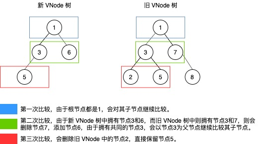
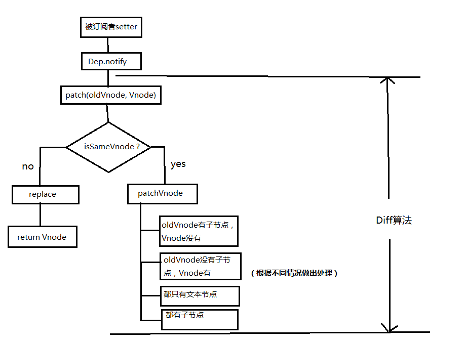
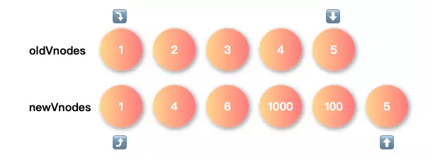
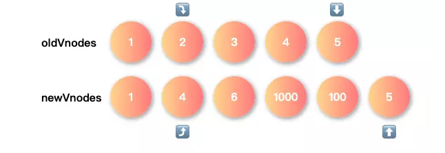
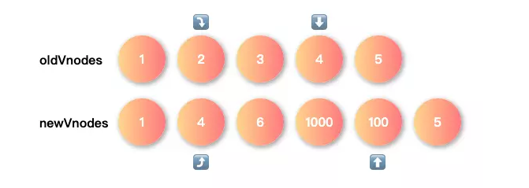
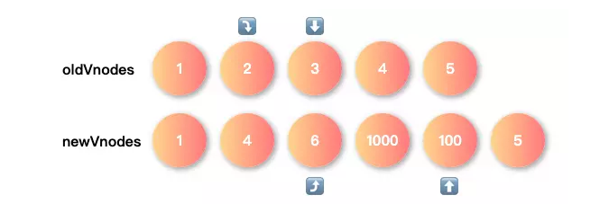
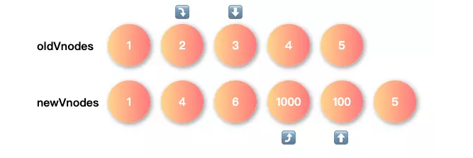
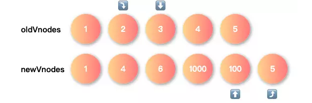

`Diff`算法的核心就是针对具有相同父节点的同层新旧子节点进行比较，而不是使用逐层搜索递归遍历的方式。时间复杂度为`O(n)`

说白点，就是当新旧`VNode`树在同一层具有相同的`VNode`节点时，才会继续对其子节点进行比较。一旦旧`VNode`树同层中的节点在新`VNode`树中不存在或者是多余的，都会在新的`真实DOM`中进行添加或者删除

下面就拿一副图进行解释



从上面的示例图可以看到，`Diff`算法中只会对同一层的元素进行比较，并且必须拥有相同节点元素，才会对其子节点进行比较，其他多余的同层节点都会一律做删除或添加操作

## Diff 流程图

当数据发生改变时，`set`方法会调用`Dep.notify`通知所有订阅者`Watcher`，订阅者就会调用`patch`给真实的 DOM 打补丁，更新相应的视图



## 从源码角度进行探究

我们依然是从`_update`方法入手，看看到底是如何操作的

```ts
Vue.prototype._update = function (vnode: VNode, hydrating?: boolean) {
  const vm: Component = this // 缓存vue实例
  const prevEl = vm.$el // 获取实例中真实DOM元素
  const prevVnode = vm._vnode // 获取旧VNode树
  const restoreActiveInstance = setActiveInstance(vm)
  vm._vnode = vnode // 将新VNode树保存到实例的_vnode上，便于下次更新获取旧VNode树
  // 判断是否有旧VNode树，并进行相应的处理
  if (!prevVnode) {
    // initial render
    // 最开始的一次，即第一次渲染时是没有旧VNode树，直接执行__patch__
    vm.$el = vm.__patch__(vm.$el, vnode, hydrating, false /* removeOnly */)
  } else {
    // updates
    // 新VNode树与旧VNode树进行__patch__
    vm.$el = vm.__patch__(prevVnode, vnode)
  }
  // 省略一系列其它代码
}
```

每一次更新模板时，都会先将渲染好的新`VNode`树保存到实例的`_vnode`属性上，这样做的目的是为了下一次更新时，能获取到旧`VNode`树进行比较

针对是否拥有旧的`VNode`树，使用`__patch__`方法执行相应逻辑，也即执行了`patch`过程

```ts
export const inBrowser = typeof window !== 'undefined' // 浏览器环境
Vue.prototype.__patch__ = inBrowser ? patch : noop // 只有在浏览器环境才能进行patch

export const patch: Function = createPatchFunction({ nodeOps, modules })
```

可以看到，只有在浏览器的环境下才能进行`patch`过程，而实现`patch`的，就是`createPatchFunction`方法，我们接着看下去

```ts
export function createPatchFunction(backend) {
  // ...
  // 省略了很多私有工具方法，下面会拿出一些进行说明
  return function patch(oldVnode, vnode, hydrating, removeOnly) {
    // ...
    if (isUndef(oldVnode)) {
      // 当旧VNode树不存在时，则直接创建一个根元素
      // empty mount (likely as component), create new root element
      isInitialPatch = true
      createElm(vnode, insertedVnodeQueue) // 直接根据新VNode树并生成真实DOM
    } else {
      // 当存在旧VNode树时，则进行相应的比较
      const isRealElement = isDef(oldVnode.nodeType)
      if (!isRealElement && sameVnode(oldVnode, vnode)) {
        // 新旧节点是相同时
        // patch existing root node
        // 当新旧节点相同时则进行patch比较
        patchVnode(oldVnode, vnode, insertedVnodeQueue, null, null, removeOnly)
      } else {
        // 新旧节点不相同时
        // ...
        // replacing existing element
        const oldElm = oldVnode.elm // 获取旧节点元素
        const parentElm = nodeOps.parentNode(oldElm) // 获取旧节点的父节点

        // create new node
        // 由于新旧节点是不同的，因此会根据新节点创建一个新的节点
        createElm(
          vnode,
          insertedVnodeQueue,
          oldElm._leaveCb ? null : parentElm,
          nodeOps.nextSibling(oldElm)
        )
        // ...
        // destroy old node
        if (isDef(parentElm)) {
          // 创建好新节点后，删除旧节点
          removeVnodes([oldVnode], 0, 0)
        } else if (isDef(oldVnode.tag)) {
          // 删除响应节点后，也会调用相应的回调
          invokeDestroyHook(oldVnode)
        }
      }
    }

    invokeInsertHook(vnode, insertedVnodeQueue, isInitialPatch)
    return vnode.elm
  }
}
```

好啦，对于`patch`比较过程，你也应该有了一个大概了解。现在就来简单总结一下上述代码

- 当旧`VNode`树不存在时，直接根据新`VNode`树创建相应的`真实DOM`
- 当旧`VNode`树存在时，则会调用`sameVnode`方法比较当前新旧节点是否相同
  - 当新旧节点是相同时，会调用`patchVnode`方法比较新旧节点（过程就是继续比较其子节点，递归下去～）
  - 当新旧节点是不同时，则会先按照新`VNode`节点创建新的真实 DOM 节点，再根据旧`VNode`节点将相应的真实 DOM 节点进行删除

是不是很简单 🤔...那么问题来了，不是说`patch`过程是使用`Diff`算法进行比较的吗？怎么还看不到，甭急，下面我会讲到哈

在上面的总结中，我们是可以看到两个方法，分别是`sameVnode`方法和`patchVnode`方法。接下来我们就来探讨一下这两个方法

## `sameVnode`

判断两个节点间是否相同

```ts
function sameVnode(a, b) {
  // 判断两个节点间是否相同
  return (
    // 两个节点若相同，首先是唯一标识key必须相同
    a.key === b.key &&
    a.asyncFactory === b.asyncFactory &&
    ((a.tag === b.tag &&
      a.isComment === b.isComment &&
      isDef(a.data) === isDef(b.data) &&
      // 接着就是节点标签名、是否为注释、数据是否为空、input类型都必须相同
      sameInputType(a, b)) ||
      (isTrue(a.isAsyncPlaceholder) && isUndef(b.asyncFactory.error)))
  )
}

function sameInputType(a, b) {
  // 比较两个节点的input类型是否相同
  if (a.tag !== 'input') return true
  let i
  const typeA = isDef((i = a.data)) && isDef((i = i.attrs)) && i.type
  const typeB = isDef((i = b.data)) && isDef((i = i.attrs)) && i.type
  return typeA === typeB || (isTextInputType(typeA) && isTextInputType(typeB))
}
```

比较两个新旧节点间是很简单的，主要是按照下面几个属性进行判断

- `VNode`节点唯一标识`key`
- 是否同为注释`isComment`
- 数据属性是否为空`isDef`
- 是否为相同的`input`类型`sameInputType`

## `patchVnode`

好啦，接着就到我们的主角`patchVnode`方法了，这个才是`Diff`相关方法，我们先来看看源码是如何实现的

```ts
function patchVnode(oldVnode, vnode, insertedVnodeQueue, ownerArray, index, removeOnly?: any) {
  if (oldVnode === vnode) {
    // 当发现两个节点是完全一模一样时，则直接返回
    return
  }
  // ...
  const elm = (vnode.elm = oldVnode.elm)
  // ...
  let i
  const data = vnode.data
  if (isDef(data) && isDef((i = data.hook)) && isDef((i = i.prepatch))) {
    i(oldVnode, vnode) // 根据新VNode更新旧VNode的选项配置、数据属性、propsData等
  }

  const oldCh = oldVnode.children // 获取oldVNode的子节点集合
  const ch = vnode.children // 获取VNode的子节点集合
  // ...
  if (isUndef(vnode.text)) {
    // 当VNode不为文本节点时
    if (isDef(oldCh) && isDef(ch)) {
      // 当oldVNode的子节点和VNode的子节点都不为空时
      if (oldCh !== ch)
        // 当oldVNode的子节点和VNode的子节点不等时，再递归执行updateChildren比较子节点
        updateChildren(elm, oldCh, ch, insertedVnodeQueue, removeOnly)
    } else if (isDef(ch)) {
      // 当只有VNode的子节点存在而oldVNode的子节点不存在时
      // ...
      // 当oldVNode为文本节点时，先置空文本
      if (isDef(oldVnode.text)) nodeOps.setTextContent(elm, '')
      addVnodes(elm, null, ch, 0, ch.length - 1, insertedVnodeQueue) // 根据位置对真实DOM添加新的节点
    } else if (isDef(oldCh)) {
      // 当oldVNode的子节点存在, 而VNode的子节点不存在时
      removeVnodes(oldCh, 0, oldCh.length - 1) // 直接移除所有多余节点
    } else if (isDef(oldVnode.text)) {
      // 当只有oldVNode的子节点存在,并且是文本节点时
      nodeOps.setTextContent(elm, '') // 直接置空文本处理
    }
  } else if (oldVnode.text !== vnode.text) {
    // 当oldVNode文本节点不等于VNode文本节点时
    nodeOps.setTextContent(elm, vnode.text) // 直接将oldVNode节点设置为VNode节点文本内容
  }
  // ...
}
```

`patchVnode`方法做的事情不多，最主要就是按照一下场景做了处理

`diff`过程中又分了好几种情况，`oldCh`为`oldVnode`的子节点，`ch`为`Vnode`的子节点：

- 首先进行文本节点的判断，若`oldVnode.text !== vnode.text`，那么就会直接进行文本节点的替换
- 在`vnode`没有文本节点的情况下，进入子节点的`diff`
- 当`oldCh`和`ch`都存在且不相同的情况下，调用`updateChildren`对子节点进行`diff`
- 若`oldCh`不存在，`ch`存在，首先清空`oldVnode`的文本节点，同时调用`addVnodes`方法将`ch`添加到`elm`真实 DOM 节点当中
- 若`oldCh`存在，`ch`不存在，则删除`elm`真实 DOM 节点下的`oldCh`子节点
- 若`oldVnode`有文本节点，而`vnode`没有，那么就清空这个文本节点

接下来才是最重点呀。。😅 在上面中留下了`updateChildren`方法，那么这个方法又是干啥

不瞒你说，`updateChildren`方法在根据场景`Diff`后，将`oldVNode`树作出相应的改动。在没有看源码之前，我会先阐述一下

`Diff`算法过程中，在将`oldVNode`树改动时，优先考虑相同位置的相同节点，再考虑需要移动的相同节点，最后才考虑创建或删除节点

## `updateChildren`

有了上面的简单理解，我们就来继续探究啦 😄

```ts
function updateChildren(parentElm, oldCh, newCh, insertedVnodeQueue, removeOnly) {
  let oldStartIdx = 0 // 旧节点开始位置
  let newStartIdx = 0 // 新节点开始位置
  let oldEndIdx = oldCh.length - 1 // 旧节点结束位置
  let oldStartVnode = oldCh[0] // 旧节点第一个元素
  let oldEndVnode = oldCh[oldEndIdx] // 旧节点最后一个元素
  let newEndIdx = newCh.length - 1 // 新节点结束位置
  let newStartVnode = newCh[0] // 新节点第一个元素
  let newEndVnode = newCh[newEndIdx] // 新节点最后一个元素
  let oldKeyToIdx, idxInOld, vnodeToMove, refElm
  // ...
  // 同时从新旧子节点集合开始遍历
  while (oldStartIdx <= oldEndIdx && newStartIdx <= newEndIdx) {
    if (isUndef(oldStartVnode)) {
      // 从第一项开始，一直遍历旧节点初始元素直到不为空为止
      oldStartVnode = oldCh[++oldStartIdx] // Vnode has been moved left
    } else if (isUndef(oldEndVnode)) {
      // 从最后一项开始，一直遍历旧节点直到不为空为止
      oldEndVnode = oldCh[--oldEndIdx]
    } else if (sameVnode(oldStartVnode, newStartVnode)) {
      // （相同位置场景）当第一项旧节点和第一项新节点相同时，则继续执行patchVnode递归执行下去
      patchVnode(oldStartVnode, newStartVnode, insertedVnodeQueue, newCh, newStartIdx)
      oldStartVnode = oldCh[++oldStartIdx]
      newStartVnode = newCh[++newStartIdx]
    } else if (sameVnode(oldEndVnode, newEndVnode)) {
      // （相同位置场景）当最后一项旧节点和最后一项新节点相同时，则继续执行patchVnode递归执行下去
      patchVnode(oldEndVnode, newEndVnode, insertedVnodeQueue, newCh, newEndIdx)
      oldEndVnode = oldCh[--oldEndIdx]
      newEndVnode = newCh[--newEndIdx]
    } else if (sameVnode(oldStartVnode, newEndVnode)) {
      // （需要移动场景）当第一项旧节点和最后一项新节点相同时，先执行patchVnode递归执行下去，再执行insertBefore将真实DOM节点插入到相应位置
      patchVnode(oldStartVnode, newEndVnode, insertedVnodeQueue, newCh, newEndIdx)
      canMove &&
        nodeOps.insertBefore(parentElm, oldStartVnode.elm, nodeOps.nextSibling(oldEndVnode.elm))
      oldStartVnode = oldCh[++oldStartIdx]
      newEndVnode = newCh[--newEndIdx]
    } else if (sameVnode(oldEndVnode, newStartVnode)) {
      // （需要移动场景）当最后一项旧节点和第一项新节点相同时，先执行patchVnode递归执行下去，再执行insertBefore将真实DOM节点插入到相应位置
      patchVnode(oldEndVnode, newStartVnode, insertedVnodeQueue, newCh, newStartIdx)
      canMove && nodeOps.insertBefore(parentElm, oldEndVnode.elm, oldStartVnode.elm)
      oldEndVnode = oldCh[--oldEndIdx]
      newStartVnode = newCh[++newStartIdx]
    } else {
      // 比较头尾都无相同元素时，直接判断新节点是否在旧节点结合中，若有则直接移动相应的位置，若无则直接新建一个节点
      if (isUndef(oldKeyToIdx)) oldKeyToIdx = createKeyToOldIdx(oldCh, oldStartIdx, oldEndIdx) // 将旧节点结合创建一个哈希表
      idxInOld = isDef(newStartVnode.key)
        ? oldKeyToIdx[newStartVnode.key]
        : findIdxInOld(newStartVnode, oldCh, oldStartIdx, oldEndIdx) // 根据哈希表，判断新节点是否在哈希表中，并获得对应旧节点的索引位置
      if (isUndef(idxInOld)) {
        // 当新节点不在旧节点集合中时，新建一个真实DOM节点
        createElm(
          newStartVnode,
          insertedVnodeQueue,
          parentElm,
          oldStartVnode.elm,
          false,
          newCh,
          newStartIdx
        )
      } else {
        // 当新节点在旧节点集合中时，则会先判断两个节点是否相同
        vnodeToMove = oldCh[idxInOld] // 根据索引位置获得旧节点
        if (sameVnode(vnodeToMove, newStartVnode)) {
          // 当两个节点是相同时，继续执行patchVnode递归执行下去，再执行insertBefore将真实DOM节点插入到相应位置
          patchVnode(vnodeToMove, newStartVnode, insertedVnodeQueue, newCh, newStartIdx)
          oldCh[idxInOld] = undefined
          canMove && nodeOps.insertBefore(parentElm, vnodeToMove.elm, oldStartVnode.elm)
        } else {
          // 当两个节点不同时，直接新建一个新的DOM节点
          // same key but different element. treat as new element
          createElm(
            newStartVnode,
            insertedVnodeQueue,
            parentElm,
            oldStartVnode.elm,
            false,
            newCh,
            newStartIdx
          )
        }
      }
      newStartVnode = newCh[++newStartIdx]
    }
  }
  // 跳出循环后，若新节点依旧存在，那么就要遍历剩余的新节点并逐个新增到真实DOM中
  if (oldStartIdx > oldEndIdx) {
    refElm = isUndef(newCh[newEndIdx + 1]) ? null : newCh[newEndIdx + 1].elm
    addVnodes(parentElm, refElm, newCh, newStartIdx, newEndIdx, insertedVnodeQueue)
  } else if (newStartIdx > newEndIdx) {
    // 跳出循环后，若旧节点依旧存在，那么就要将真实DOM中对应旧VNode节点进行删除操作
    removeVnodes(oldCh, oldStartIdx, oldEndIdx)
  }
}
```

## 具体的 diff 分析

我们可以假设有旧的`Vnode`数组和新的`Vnode`数组这两个数组，而且有四个变量充当指针分别指到两个数组的头尾

重复下面的对比过程，直到两个数组中任一数组的头指针超过尾指针，循环结束

- **头头对比**: 对比两个数组的头部，如果找到，把新节点`patch`到旧节点，头指针后移
- **尾尾对比**: 对比两个数组的尾部，如果找到，把新节点`patch`到旧节点，尾指针前移
- **旧尾新头对比**: 交叉对比，旧尾新头，如果找到，把新节点`patch`到旧节点，旧尾指针前移，新头指针后移
- **旧头新尾对比**: 交叉对比，旧头新尾，如果找到，把新节点`patch`到旧节点，新尾指针前移，旧头指针后移
- **利用`key`对比**: 用新指针对应节点的`key`去旧数组寻找对应的节点,这里分三种情况
  - 当没有对应的`key`，那么创建新的节点
  - 如果有`key`并且是相同的节点，则把新节点`patch`到旧节点
  - 如果有`key`但是不是相同的节点，则创建新节点

我们假设有新旧两个数组

- 旧数组: `[1, 2, 3, 4, 5]`
- 新数组: `[1, 4, 6, 1000, 100, 5]`



> 首先我们进行头头对比，新旧数组的头部都是`1`，因此将双方的头部指针后移



> 我们继续头头对比，发现`2 !== 4`导致对比失败，我进入尾尾对比，`5 === 5`，那么尾部指针则可前移



现在进入新的循环，头头对比`2 !== 4`，尾尾对比`4 !== 100`，此时进入交叉对比，先进行旧尾新头对比，即`4 === 4`，旧尾前移且新头后移



接着再进入一个新的循环，头头对比`2 !== 6`，尾尾对比`3 !== 100`，交叉对比`2 != 100` `3 != 6`，四种对比方式全部不符合，这个时候需要通过`key`去对比，然后将新头指针后移



继续重复上述对比的循环方式直至任一数组的头指针超过尾指针，循环结束



在上述循环结束后，两个数组中可能存在未遍历完的情况: 循环结束后

- **先对比旧数组的头尾指针，如果旧数组遍历完了（可能新数组没遍历完，有漏添加的问题），添加新数组中漏掉的节点**
- **再对比新数组的头尾指针，如果新数组遍历完了（可能旧数组没遍历完，有漏删除的问题），删除旧数组中漏掉的节点**

## 参考

- [Vue 核心之虚拟 DOM](https://juejin.cn/post/6844903895467032589)
- [解析 vue2.0 的 diff 算法](https://github.com/aooy/blog/issues/2)
- [详解 vue 的 diff 算法](https://juejin.cn/post/6844903607913938951)
- [面试官: 你对虚拟 DOM 原理的理解?](https://juejin.cn/post/6844903902429577229#heading-5)
- [【 Vue 源码分析 】如何在更新 Patch 中进行 Diff.md](https://github.com/Andraw-lin/about-Vue/blob/master/docs/%E3%80%90%20Vue%20%E6%BA%90%E7%A0%81%E5%88%86%E6%9E%90%20%E3%80%91%E5%A6%82%E4%BD%95%E5%9C%A8%E6%9B%B4%E6%96%B0%20Patch%20%E4%B8%AD%E8%BF%9B%E8%A1%8C%20Diff.md)
