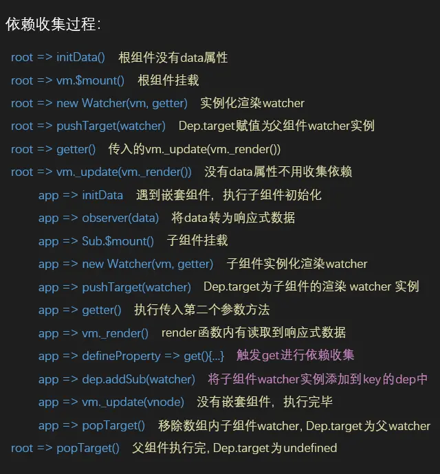

<center><h1>Vue2响应式原理</h1></center>

> 首先要知道 Vue2 是 2013 年基于 ES5 开发出来的，我们常说的重渲染就是重新运行`render`函数
>
> Vue2 的响应式原理是利⽤ ES5 的⼀个 API，`Object.defineProperty`对数据进⾏劫持结合发布订阅模式的⽅式来实现的

## 思路

带入作者的角度思考一下，想要达成响应式的特点应该是：**属性更新，自动调用依赖的函数**进行重新渲染

1. 使用属性描述符`Object.defineProperty`监听属性的赋值
2. 赋值完成后调用依赖该属性的函数，那如何获取依赖的函数呢？看第三点
3. 由于依赖会调用属性的`get`方法，所以可以在`get`方法中「**依赖收集**」
4. 然后在`set`方法中执行这些依赖的函数，称为「**派发更新**」

## 深入了解

### 初始化

先来看看源码中是怎么初始化`data`的，它的定义在`src/core/instance/state.ts`文件中：

```ts
export function initState(vm: Component) {
  const opts = vm.$options
  // ...
  if (opts.data) {
    initData(vm)
  } else {
    const ob = observe((vm._data = {}))
    ob && ob.vmCount++
  }
  // ...
}

function initData(vm: Component) {
  let data: any = vm.$options.data
  data = vm._data = isFunction(data) ? getData(data, vm) : data || {}
  // ...
  const keys = Object.keys(data)
  const props = vm.$options.props
  const methods = vm.$options.methods
  let i = keys.length
  while (i--) {
    const key = keys[i]
    // ...
    proxy(vm, `_data`, key)
  }
  const ob = observe(data) // 响应式处理
  ob && ob.vmCount++
}
```

`data`的初始化主要过程是做两件事：

- 一个是对`data`函数返回的对象进行遍历，通过`proxy`函数把每一个`vm._data.xxx`都代理到`vm.xxx`上
- 另一个是调用`observe`方法观察整个`data`的变化，把`data`也变成响应式，使得可以通过`vm._data.xxx`访问到定义在`data`函数所返回对象中对应的属性

### `observe`

`observe`函数的功能就是用来监测数据的变化，它的定义在`src/core/observer/index.ts`文件中：

```ts
export function observe(
  value: any,
  shallow?: boolean,
  ssrMockReactivity?: boolean
): Observer | void {
  if (value && hasOwn(value, '__ob__') && value.__ob__ instanceof Observer) {
    return value.__ob__
  }
  if (
    shouldObserve &&
    (ssrMockReactivity || !isServerRendering()) &&
    (isArray(value) || isPlainObject(value)) &&
    Object.isExtensible(value) &&
    !value.__v_skip /* ReactiveFlags.SKIP */ &&
    !isRef(value) &&
    !(value instanceof VNode)
  ) {
    return new Observer(value, shallow, ssrMockReactivity)
  }
}
```

可以看到，`observe`函数的最后就是给非`VNode`的对象类型数据添加一个`Observer`，可以把`observe`函数简单理解为`Observer`类的工厂方法，所以还是要看下`Observer`这个类的定义：

```ts
export class Observer {
  dep: Dep
  vmCount: number // number of vms that have this object as root $data

  constructor(
    public value: any,
    public shallow = false,
    public mock = false
  ) {
    // this.value = value
    this.dep = mock ? mockDep : new Dep()
    this.vmCount = 0
    def(value, '__ob__', this)
    if (isArray(value)) {
      if (!mock) {
        if (hasProto) {
          ;(value as any).__proto__ = arrayMethods
        } else {
          for (let i = 0, l = arrayKeys.length; i < l; i++) {
            const key = arrayKeys[i]
            def(value, key, arrayMethods[key])
          }
        }
      }
      if (!shallow) {
        this.observeArray(value)
      }
    } else {
      // 遍历value
      const keys = Object.keys(value)
      for (let i = 0; i < keys.length; i++) {
        const key = keys[i]
        defineReactive(value, key, NO_INITIAL_VALUE, undefined, shallow, mock)
      }
    }
  }
  // ...
}
```

`Observer`类的主要作用是给对象的属性添加`getter`和`setter`，用于**依赖收集**和**派发更新**。它的构造函数逻辑很简单，首先实例化`Dep`对象，这块稍后会介绍，接着通过执行`def`函数把自身实例添加到数据对象`value`的`__ob__`属性上，`def`函数是一个非常简单的`Object.defineProperty`的封装

```ts
export function def(obj: Object, key: string, val: any, enumerable?: boolean) {
  Object.defineProperty(obj, key, {
    value: val,
    enumerable: !!enumerable,
    writable: true,
    configurable: true
  })
}
```

> 这就是我们平时开发中打印`data`中的对象类型数据时，会发现该对象多了一个`__ob__`属性的原因

### `defineReactive`

`defineReactive`的功能就是定义一个响应式对象，给对象动态添加`getter`和`setter`，它的定义在`src/core/observer/index.ts`文件中：

```ts
export function defineReactive(
  obj: object,
  key: string,
  val?: any,
  customSetter?: Function | null,
  shallow?: boolean,
  mock?: boolean
) {
  const dep = new Dep() // 依赖管理器
  // ...
  if ((!getter || setter) && (val === NO_INITIAL_VALUE || arguments.length === 2)) {
    val = obj[key] // 计算出对应key的值
  }

  let childOb = !shallow && observe(val, false, mock) // 递归的转化对象的嵌套属性
  Object.defineProperty(obj, key, {
    enumerable: true,
    configurable: true,
    get: function reactiveGetter() {
      // 依赖收集
    },
    set: function reactiveSetter(newVal) {
      // 派发更新
    }
  })

  return dep
}
```

`defineReactive`函数最开始初始化`Dep`对象的实例，接着拿到`obj`的属性描述符，然后对子对象递归调用`observe`方法，这样就保证了无论`obj`的结构多复杂，它的所有子属性也能变成响应式的对象，这样我们访问或修改`obj`中一个嵌套较深的属性，也能触发`getter`和`setter`。最后利用`Object.defineProperty`去给`obj`的属性`key`添加`getter`和`setter`

## 依赖收集

什么是依赖了？我们先回顾一下`mountComponent`的定义：

```ts
export function mountComponent(
  vm: Component,
  el: Element | null | undefined,
  hydrating?: boolean
): Component {
  // ...
  let updateComponent
  if (__DEV__ && config.performance && mark) {
    updateComponent = () => {
      // ...
      vm._update(vnode, hydrating)
    }
  } else {
    updateComponent = () => {
      vm._update(vm._render(), hydrating)
    }
  }
  // ...
  // render-watcher
  new Watcher(vm, updateComponent, noop, watcherOptions, true /* isRenderWatcher */)
  // ...
}
```

### `Watcher`

首先说明下这个`Watcher`类，它会根据传入的参数不同，可以分别实例化出三种不同的`Watcher`实例，它们分别是`user-watcher`、`computed-watcher`以及`render-watcher`

- `user-watcher`：就是开发者自己定义的监听器
- `computed-watcher`：也就是计算属性
- `render-watcher`：只是用做视图渲染而定义的`Watcher`实例，也就是上面的`mountComponent`函数最后所实例化的`Watcher`类

`user-watcher`和`computed-watcher`请查看[计算属性和监听](vue/计算属性和监听)，本章着重讲解`render-watcher`的情况，它的定义在`src/core/observer/watcher.ts`文件中：

```ts
export default class Watcher implements DepTarget {
  // ...
  constructor(
    vm: Component | null,
    expOrFn: string | (() => any),
    cb: Function,
    options?: WatcherOptions | null,
    isRenderWatcher?: boolean
  ) {
    // ...
    // 是否是render-watcher
    if ((this.vm = vm) && isRenderWatcher) {
      vm._watcher = this // 当前组件下挂载vm._watcher属性
    }
    // ...
    this.before = options.before // render-watcher特有属性
    this.getter = expOrFn // 第二个参数
    // ...
    this.value = this.lazy ? undefined : this.get() // 实例化为user-watcher和render-watcher时就会执行this.get()方法
  }
  get() {
    pushTarget(this) // 添加
    let value
    const vm = this.vm
    try {
      value = this.getter.call(vm, vm) // 执行vm._update(vm._render())
    } catch (e: any) {
      // ...
    } finally {
      // ...
      popTarget() // 移除
      this.cleanupDeps()
    }
    return value
  }
  addDep(dep: Dep) {
    const id = dep.id
    if (!this.newDepIds.has(id)) {
      this.newDepIds.add(id)
      this.newDeps.push(dep)
      if (!this.depIds.has(id)) {
        dep.addSub(this) // 将当前watcher收集到dep实例中
      }
    }
  }
}
```

当执行`new Watcher`的时候内部会挂载一些属性，然后执行`this.get()`这个方法，首先会执行一个全局的方法`pushTarget(this)`，传入当前`watcher`的实例。

我们来看一下`pushTarget`这个函数，它的定义在`src/core/observer/dep.ts`文件中：

```ts
export default class Dep {
  static target?: DepTarget | null
  // ...
}
Dep.target = null
const targetStack: Array<DepTarget | null | undefined> = [] // 组件从父到子对应的watcher实例集合

export function pushTarget(target?: DepTarget | null) {
  targetStack.push(target) // 添加到集合内
  Dep.target = target // 当前的watcher实例
}

export function popTarget() {
  targetStack.pop() // 移除数组最后一项
  Dep.target = targetStack[targetStack.length - 1] // 赋值为数组最后一项
}
```

首先会定义一个`Dep`类的静态属性`Dep.target`为`null`，这是一个全局会用到的属性，保存的是当前组件对应`render-watcher`的实例；`targetStack`内存储的是在执行组件化的过程中每个组件对应的`render-watcher`实例集合，使用的是一个**先进后出**的形式来管理数组的数据，这里可能有点不太好懂，稍后看到流程图自然就明白了；然后将传入的`watcher`实例赋值给全局属性`Dep.target`，再之后的依赖收集过程中就是收集的它

在`watcher`的`get`方法中会执行`getter`这个方法，它是`new Watcher`时传入的第二个参数，这个参数就是之前的`updateComponent`变量，也就是会执行当前组件实例上的`vm._update(vm._render(), hydrating)`将`render`函数转为`VNode`，这个时候如果`render`函数内有使用到`data`中已经转为了响应式的数据，就会触发`get`方法进行依赖的收集，补全之前`defineReactive`依赖收集的逻辑：

```ts
export function defineReactive(
  obj: object,
  key: string,
  val?: any,
  customSetter?: Function | null,
  shallow?: boolean,
  mock?: boolean
) {
  // ..
  Object.defineProperty(obj, key, {
    enumerable: true,
    configurable: true,
    get: function reactiveGetter() {
      const value = getter ? getter.call(obj) : val
      // 之前pushTarget时赋值的当前watcher实例
      if (Dep.target) {
        if (__DEV__) {
          dep.depend({
            target: obj,
            type: TrackOpTypes.GET,
            key
          })
        } else {
          dep.depend() // 收集起来，放入到上面的dep依赖管理器内
        }
        if (childOb) {
          childOb.dep.depend()
          if (isArray(value)) {
            dependArray(value)
          }
        }
      }
      return isRef(value) && !shallow ? value.value : value
    },
    set: function reactiveSetter(newVal) {
      // 派发更新
    }
  })

  return dep
}
```

这个时候我们知道`watcher`是个什么东西了，简单理解就是数据和组件之间一个通信工具的封装，当某个数据被组件读取时，就将依赖数据的组件使用 Dep 这个类给收集起来

### `Dep`

如果响应式变量被其他组件使用到，也会将使用它的组件收集起来，例如作为了`props`传递给了子组件，在`dep`的数组内就会存在多个`render-watcher`。我们来看下`Dep`类这个依赖管理器的定义：

```ts
let uid = 0
export default class Dep {
  static target?: DepTarget | null
  id: number
  subs: Array<DepTarget | null>
  _pending = false

  constructor() {
    this.id = uid++
    this.subs = [] // 对象某个key的依赖集合
  }
  // 添加watcher实例到数组内
  addSub(sub: DepTarget) {
    this.subs.push(sub)
  }
  depend(info?: DebuggerEventExtraInfo) {
    // 已经被赋值为了watcher的实例
    if (Dep.target) {
      Dep.target.addDep(this) // 执行watcher的addDep方法
      if (__DEV__ && info && Dep.target.onTrack) {
        Dep.target.onTrack({
          effect: Dep.target,
          ...info
        })
      }
    }
  }
  // ...
}

// ------------------------------

export default class Watcher implements DepTarget {
  // ...
  // 将当前watcher实例添加到dep内
  addDep(dep: Dep) {
    const id = dep.id
    if (!this.newDepIds.has(id)) {
      this.newDepIds.add(id)
      this.newDeps.push(dep)
      if (!this.depIds.has(id)) {
        dep.addSub(this) // 执行dep的addSub方法
      }
    }
  }
}
```

这个`Dep`类的作用就是管理属性对应的`watcher`，如添加/删除/通知。至此，依赖收集的过程算是完成了，还是以一张图片加深对过程的理解：



## 派发更新

如果只是收集依赖，那其实是没任何意义的，将收集到的依赖在数据发生变化时通知到并引起视图变化，这样才有意义。当我们对响应式数据重新赋值时，就会触发`set`方法进行派发更新，我们再补全那里的逻辑：

```ts
export function defineReactive(
  obj: object,
  key: string,
  val?: any,
  customSetter?: Function | null,
  shallow?: boolean,
  mock?: boolean
) {
  // ..
  Object.defineProperty(obj, key, {
    enumerable: true,
    configurable: true,
    get: function reactiveGetter() {
      // 依赖收集
    },
    set: function reactiveSetter(newVal) {
      const value = getter ? getter.call(obj) : val
      if (!hasChanged(value, newVal)) {
        return
      }
      if (__DEV__ && customSetter) {
        customSetter()
      }
      if (setter) {
        setter.call(obj, newVal)
      } else if (getter) {
        return
      } else if (!shallow && isRef(value) && !isRef(newVal)) {
        value.value = newVal
        return
      } else {
        val = newVal // 赋值
      }
      childOb = !shallow && observe(newVal, false, mock) // 如果新值是对象也递归包装
      if (__DEV__) {
        dep.notify({
          type: TriggerOpTypes.SET,
          target: obj,
          key,
          newValue: newVal,
          oldValue: value
        })
      } else {
        dep.notify() // 通知更新
      }
    }
  })

  return dep
}
```

当赋值触发`set`时，首先会检测新值和旧值是否相同；然后将新值赋值给旧值；如果新值是对象则将它变成响应式的；最后让对应属性的依赖管理器使用`dep.notify`发出更新视图的通知。我们看下它的实现：

```ts
export default class Dep {
  // ...
  notify(info?: DebuggerEventExtraInfo) {
    const subs = this.subs.filter((s) => s) as DepTarget[]
    if (__DEV__ && !config.async) {
      subs.sort((a, b) => a.id - b.id)
    }
    for (let i = 0, l = subs.length; i < l; i++) {
      const sub = subs[i]
      if (__DEV__ && info) {
        sub.onTrigger &&
          sub.onTrigger({
            effect: subs[i],
            ...info
          })
      }
      sub.update() // 挨个触发watcher的update方法
    }
  }
}
```

这里做的事情只有一件，将收集起来的`watcher`挨个遍历触发`update`方法：

```ts
export default class Watcher implements DepTarget {
  // ...
  update() {
    if (this.lazy) {
      this.dirty = true
    } else if (this.sync) {
      this.run()
    } else {
      queueWatcher(this)
    }
  }
}

// -------------------------------------

const queue: Array<Watcher> = []
let has: { [key: number]: true | undefined | null } = {}
export function queueWatcher(watcher: Watcher) {
  const id = watcher.id
  // 如果某个watcher没有被推入队列
  if (has[id] != null) {
    return
  }

  if (watcher === Dep.target && watcher.noRecurse) {
    return
  }

  has[id] = true // 已经推入
  if (!flushing) {
    queue.push(watcher) // 推入到队列
  } else {
    let i = queue.length - 1
    while (i > index && queue[i].id > watcher.id) {
      i--
    }
    queue.splice(i + 1, 0, watcher)
  }
  if (!waiting) {
    waiting = true

    if (__DEV__ && !config.async) {
      flushSchedulerQueue()
      return
    }
    nextTick(flushSchedulerQueue) // 下一个tick更新
  }
}
```

执行`update`方法时将当前`watcher`实例传入到定义的`queueWatcher`方法内，这个方法的作用是把将要执行更新的`watcher`收集到一个队列`queue`之内，保证如果同一个`watcher`内触发了多次更新，只会更新一次对应的`watcher`，我们举一个小示例：

```js
export default {
  data() {
    return {
      // 都被模板引用了
      num: 0,
      name: 'cc',
      sex: 'man'
    }
  },
  methods: {
    changeNum() {
      // 赋值100次
      for (let i = 0; i < 100; i++) {
        this.num++
      }
    },
    changeInfo() {
      // 一次赋值多个属性的值
      this.name = 'ww'
      this.sex = 'woman'
    }
  }
}
```

这里的三个响应式属性它们收集都是同一个`render-watcher`。所以当赋值 100 次的情况出现时，再将当前的`render-watcher`推入到的队列之后，之后赋值触发的`set`队列内并不会添加任何`render-watcher`；当同时赋值多个属性时也是，因为它们收集的都是同一个`render-watcher`，所以推入到队列一次之后就不会添加了

> 知识点：`Vue`还是挺聪明的，通过这个示例能看出来，派发更新通知的粒度是组件级别，至于组件内是哪个属性赋值了，派发更新并不关心，而且怎么高效更新这个视图，那是之后`diff`比对做的事情。

队列有了，执行`nextTick(flushSchedulerQueue)`在下一次`tick`时更新它，这里的`nextTick`就是我们经常使用的`this.$nextTick`方法的原始方法，它们作用一致，实现原理请看[nextTick](vue/nextTick)。我们来看下参数`flushSchedulerQueue`是个啥？

```ts
function flushSchedulerQueue() {
  currentFlushTimestamp = getNow()
  flushing = true
  let watcher, id

  queue.sort(sortCompareFn) // watcher 排序

  // 遍历队列
  for (index = 0; index < queue.length; index++) {
    watcher = queue[index]
    // render-watcher独有属性
    if (watcher.before) {
      watcher.before() // 触发 beforeUpdate 钩子
    }
    id = watcher.id
    has[id] = null
    watcher.run() // 真正的更新方法
    // ...
  }
  // ...
}
```

原来是个函数，在`nextTick`方法的内部会执行第一个参数。首先会将`queue`这个队列进行一次排序，依据是每次`new Watcher`生成的`id`，以从小到大的顺序。

> 知识点：`watcher`的执行顺序是**先父后子**，然后是从`computed-watcher`到`user-watcher`最后`render-watcher`，这从它们的初始化顺序就能看出

然后就是遍历这个队列，因为是`render-watcher`，所以是有`before`属性的，执行传入的`before`方法触发`beforeUpdate`钩子。最后执行`watcher.run()`方法，执行真正的派发更新方法。我们去看下`run`干了啥：

```ts
export default class Watcher implements DepTarget {
  // ...
  run() {
    if (this.active) {
      const value = this.get() // 其实就是重新执行一次get方法
      if (value !== this.value || isObject(value) || this.deep) {
        const oldValue = this.value
        this.value = value
        if (this.user) {
          const info = `callback for watcher "${this.expression}"`
          invokeWithErrorHandling(this.cb, this.vm, [value, oldValue], this.vm, info)
        } else {
          this.cb.call(this.vm, value, oldValue)
        }
      }
    }
  }
}
```

执行`run`其实就是重新执行一次`this.get()`方法，让`vm._update(vm._render())`再走一遍而已。然后生成新旧`VNode`，最后进行`diff`比对以更新视图。

最后我们来说下`Vue`基于`Object.defineProperty`响应式系统的一些不足。比如只能监听到数据的变化，所以有时`data`中要定义一堆的初始值，因为要先加入响应式系统后才能被感知到；还有就是常规 JavaScript 操作对象的方式，并不能监听到增加以及删除。`Vue`为了解决这个问题，提供了两个 API：[$set和$delete](vue/$set和$delete)

## 原理图


通过`Object.defineProperty`遍历对象的每一个属性，把每一个属性变成一个`getter`和`setter`函数，读取属性的时候调用`getter`，给属性赋值的时候就会调用`setter`



当运行`render`函数的时候，发现用到了响应式数据，这时候就会运行`getter`函数，然后`watcher`（发布订阅）就会记录下来。当响应式数据发生变化的时候，就会调用`setter`函数，`watcher`就会再记录下来这次的变化，然后通知`render`函数，数据发生了变化，然后就会重新运行`render`函数，重新生成虚拟 DOM 树
